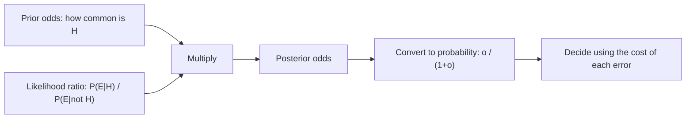

# Bayes' Theorem and Conditional Probability

## TL;DR
Conditioning is restricting the sample space: $P(A\mid B)=P(A\cap B)/P(B)$. Bayes' theorem inverts
the conditioning — it turns $P(\text{evidence}\mid\text{cause})$, which models give you, into
$P(\text{cause}\mid\text{evidence})$, which decisions need. The multiplier is the prior, and the
single most common interview failure is ignoring it (base-rate neglect).

## Intuition
A test that is "99% accurate" for a disease affecting 1 in 10,000 people is still wrong almost every
time it says positive — because there are 10,000 healthy people generating false positives for every
one sick person generating a true positive. The likelihood is a ratio; the prior decides how much
mass that ratio is scaling. Bayes is just bookkeeping on a two-way table.

## The maths

**Definition.** For $P(B) > 0$,

$$
P(A \mid B) = \frac{P(A \cap B)}{P(B)}
$$

**Chain rule.** $P(A_1,\dots,A_n) = \prod_{i=1}^{n} P(A_i \mid A_1,\dots,A_{i-1})$. This is exactly
the factorisation an autoregressive language model learns — see
[[language-modeling-objectives]].

**Law of total probability.** If $\{B_i\}$ partitions the space,
$P(A) = \sum_i P(A\mid B_i)P(B_i)$.

**Bayes' theorem.**

$$
P(H \mid E) = \frac{P(E \mid H)\,P(H)}{P(E)}
= \frac{P(E \mid H)\,P(H)}{\sum_i P(E \mid H_i)P(H_i)}
$$

- $H$ hypothesis, $E$ evidence.
- $P(H)$ **prior**, $P(E\mid H)$ **likelihood**, $P(E)$ **marginal / evidence**,
  $P(H\mid E)$ **posterior**.

The denominator is just a normaliser, so the workhorse form is
$\text{posterior} \propto \text{likelihood} \times \text{prior}$.

**Odds form — the version to use in an interview.** With odds $O(H)=P(H)/P(\lnot H)$,

$$
\underbrace{O(H \mid E)}_{\text{posterior odds}} =
\underbrace{\frac{P(E\mid H)}{P(E\mid \lnot H)}}_{\text{likelihood ratio}} \times
\underbrace{O(H)}_{\text{prior odds}}
$$

No normalising constant, and it composes: independent pieces of evidence multiply their likelihood
ratios. In log space this is additive, which is precisely the linear score inside
[[naive-bayes]] and the logit of [[logistic-regression]].

**Worked screening example.** Prevalence $P(D)=0.001$, sensitivity $P(+\mid D)=0.99$,
specificity $P(-\mid \lnot D)=0.99$ so $P(+\mid \lnot D)=0.01$.

$$
\begin{aligned}
P(+) &= 0.99(0.001) + 0.01(0.999) = 0.00099 + 0.00999 = 0.01098 \\
P(D \mid +) &= \frac{0.00099}{0.01098} \approx 0.090
\end{aligned}
$$

A positive test moves you from 0.1% to 9%. By odds: prior odds $1{:}999$, likelihood ratio
$0.99/0.01 = 99$, posterior odds $99{:}999 \approx 1{:}10.1$.

**Independence vs conditional independence.** $A \perp B$ means $P(A\cap B)=P(A)P(B)$.
$A \perp B \mid C$ means $P(A\cap B\mid C)=P(A\mid C)P(B\mid C)$. Neither implies the other.
Conditioning on a common effect (a *collider*) creates dependence between independent causes —
this is the mechanism behind Berkson's paradox and behind selection bias in observational data;
see [[causal-inference-basics]].

## Diagram



## Code

```python
import numpy as np

def posterior_from_odds(prior, lrs):
    """Sequentially update a prior with a list of independent likelihood ratios."""
    odds = prior / (1 - prior)
    for lr in lrs:
        odds *= lr
    return odds / (1 + odds)

# screening test: sensitivity .99, specificity .99, prevalence .001
lr_pos = 0.99 / 0.01
print(round(posterior_from_odds(0.001, [lr_pos]), 4))          # 0.0902
print(round(posterior_from_odds(0.001, [lr_pos, lr_pos]), 4))  # two tests -> 0.9075

# Monte-Carlo check of the same number
rng = np.random.default_rng(0)
n = 2_000_000
disease = rng.random(n) < 0.001
p_pos = np.where(disease, 0.99, 0.01)
positive = rng.random(n) < p_pos
print("empirical P(D|+) =", round(disease[positive].mean(), 4))

# Collider bias: two independent causes become dependent once you condition on the effect
brains = rng.normal(size=100_000)
beauty = rng.normal(size=100_000)
famous = (brains + beauty) > 2.0          # selection on a common effect
print("corr overall  ", round(np.corrcoef(brains, beauty)[0, 1], 3))
print("corr | famous ", round(np.corrcoef(brains[famous], beauty[famous])[0, 1], 3))
```

The last block is the cleanest 10-line demonstration of why "we only have data on customers who
converted" is a modelling problem, not just a sampling nuisance.

## In practice
- **Use it when:** you have a generative direction (cause → observation) and need the diagnostic
  direction; when you must combine a weak signal with a strong base rate; whenever someone quotes
  a model's precision without telling you the positive rate.
- **Defaults that work:** reason in odds and log-odds, not probabilities. Write the 2×2 table with
  counts out of a concrete population (say 100,000) — it makes base-rate errors impossible.
- **Breaks when:** you assume independence between evidence items that are correlated. Naive Bayes
  does this deliberately and pays for it with badly calibrated posteriors — the ranking survives,
  the probabilities do not; see [[probability-calibration]].
- **Cost / latency:** free. The cost is in estimating the prior honestly.

## Interview angle

**Q. A test is 99% sensitive and 99% specific for a disease with 0.1% prevalence. A patient tests positive. Probability they are sick?**
About 9%. In 100,000 people: 100 sick, of whom 99 test positive; 99,900 healthy, of whom 999 test
positive falsely. $99/(99+999) \approx 9\%$. The prior dominates because false positives are drawn
from a pool 1,000× larger.

**Follow-up.** What single change makes the positive result actually informative? → Raise the prior
by testing only people with symptoms or exposure, or raise specificity. Going from 99% to 99.9%
specificity takes the posterior from 9% to about 50%; specificity matters far more than sensitivity
when the base rate is low.

**Q. Your fraud model has 95% precision in offline evaluation but flags junk in production. What changed?**
Almost always the base rate. Precision is not a property of the model alone —
$\text{precision} = \frac{\text{TPR}\cdot\pi}{\text{TPR}\cdot\pi + \text{FPR}(1-\pi)}$ where $\pi$ is
prevalence. If the offline set was downsampled to 10% fraud and production is 0.1%, precision
collapses by roughly two orders of magnitude while recall and AUC are unchanged. Fix: evaluate on
production prevalence, or reweight, and report PR curves rather than ROC — see
[[roc-auc-and-pr-curves]].

**Q. Monty Hall — and justify it with Bayes, not intuition.**
Switching wins with probability 2/3. Let the car be behind door 1, 2 or 3 with prior 1/3 each; you
pick door 1; the host opens door 3. $P(\text{host opens 3}\mid \text{car}=1)=1/2$ (free choice),
$P(\cdot\mid\text{car}=2)=1$ (forced), $P(\cdot\mid\text{car}=3)=0$. Posteriors are proportional to
$1/6, 1/3, 0$ → 1/3 for your door, 2/3 for door 2. The host's *constraint* is the evidence.

**Q. Difference between independence and conditional independence, with an ML example?**
Independence is unconditional; conditional independence holds only given a third variable. Naive
Bayes assumes features are conditionally independent given the label — words in a spam email are
obviously correlated, but the claim is that they are uncorrelated *within* the spam class. Also the
reverse: two independent causes become correlated once you condition on a shared effect, which is
why conditioning on a post-treatment variable corrupts a causal estimate.

**Q. Why is `log P(y|x) = log P(x|y) + log P(y) + const` useful in practice?**
Numerical stability and additivity. Probabilities of long sequences underflow float64 quickly;
log-space turns products into sums, makes likelihood ratios into score differences, and is why
almost every classifier scores in logits and normalises with softmax at the end.

## Traps
- **Base-rate neglect.** Quoting sensitivity as if it were the answer. It is the likelihood, not
  the posterior.
- **Confusing $P(E\mid H)$ with $P(H\mid E)$ — the prosecutor's fallacy.** "The match probability is
  1 in a million, so there is a 1-in-a-million chance of innocence" ignores how many people could
  have matched.
- **Treating the p-value as $P(H_0\mid\text{data})$.** It is $P(\text{data as extreme}\mid H_0)$;
  inverting it needs a prior. See [[p-values-and-significance]].
- **Assuming evidence is independent so you can multiply likelihood ratios.** Two correlated
  signals double-count and produce an overconfident posterior.
- **Forgetting that precision moves with prevalence but recall and ROC-AUC do not.** This is the
  most common "my offline metrics lied" post-mortem.
- **Conditioning on a collider** (a variable caused by both predictor and outcome) and then
  reporting the association as causal.

## Flashcards
Bayes' theorem in one line::posterior ∝ likelihood × prior; P(H|E) = P(E|H)P(H)/P(E).
Odds form of Bayes::posterior odds = likelihood ratio × prior odds — no normalising constant, and log-additive across independent evidence.
Base-rate neglect::Judging P(H|E) from the likelihood P(E|H) alone, ignoring how rare H is.
Which metric changes with class prevalence::Precision (and PR-AUC). Recall, TPR, FPR and ROC-AUC do not.
Law of total probability::P(A) = Σᵢ P(A|Bᵢ)P(Bᵢ) over a partition {Bᵢ}.
Conditional independence::P(A∩B|C) = P(A|C)P(B|C). Neither implies nor is implied by plain independence.
Collider / Berkson bias::Conditioning on a common effect makes independent causes correlated.
Prosecutor's fallacy::Reading P(evidence | innocent) as P(innocent | evidence).
Why work in log-probability::Products become sums — no underflow, and likelihood ratios become score differences.

## Related
- [[probability-fundamentals]]
- [[common-probability-distributions]]
- [[bayesian-inference-basics]]
- [[naive-bayes]]
- [[roc-auc-and-pr-curves]]
- [[causal-inference-basics]]
- [[moc-maths]]
