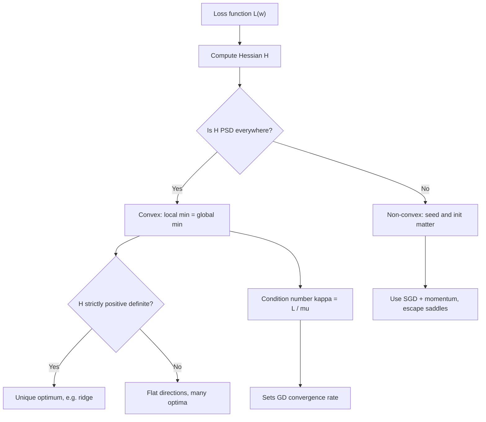

# Convexity and Optimization Basics

## TL;DR
A convex problem has one basin: any local minimum is global, and where you start does not matter. Linear regression, logistic regression, ridge, lasso and linear SVMs are convex — same answer every run. Neural networks are not, so seed, initialisation and schedule change the result. Convexity is checked by the Hessian being positive semi-definite, and the Hessian's *conditioning* — not its definiteness — is what actually decides how slowly gradient descent crawls.

## Intuition
Convex is a bowl: roll a ball anywhere and it reaches the same bottom. Non-convex is a mountain range: where you land depends on where you were dropped. The useful twist for deep learning is that the range has so many roughly-equally-deep valleys that "finding the global minimum" stops being the goal — you want a wide, flat valley that generalises, not the deepest crack.

## The maths

**Convex set.** $C$ is convex if for all $x,y\in C$ and $\theta\in[0,1]$, $\theta x + (1-\theta)y \in C$.

**Convex function.** $f$ is convex if its domain is convex and

$$
f(\theta x + (1-\theta)y) \le \theta f(x) + (1-\theta) f(y).
$$

The chord sits above the function. **Strictly** convex replaces $\le$ with $<$ (for $x\ne y$), which guarantees a *unique* minimiser. **Strongly convex** with parameter $\mu>0$ means $f - \tfrac{\mu}{2}\lVert x\rVert^2$ is still convex — this gives linear convergence rates.

**First-order condition.** For differentiable $f$: convex iff $f(y)\ge f(x) + \nabla f(x)^\top(y-x)$ for all $x,y$. Every tangent plane is a global underestimator — which is why $\nabla f(x^\star)=0$ certifies a global minimum in the convex case.

**Second-order condition.** For twice-differentiable $f$: convex iff the Hessian $H(x) = \nabla^2 f(x)$ is positive semi-definite everywhere, i.e. $v^\top H v \ge 0$ for all $v$, i.e. all eigenvalues $\ge 0$. Strictly/strongly convex corresponds to $H \succ 0$ (all eigenvalues $>0$).

**Operations that preserve convexity** (say these in an interview; they are how you prove a loss is convex without computing anything):
non-negative weighted sums; composition with an affine map $f(Ax+b)$; pointwise maximum of convex functions; and $g(f(x))$ when $g$ is convex and non-decreasing and $f$ is convex.

**Why linear regression is convex.** $L(w)=\lVert Xw-y\rVert_2^2$ has $H = 2X^\top X$, and $v^\top X^\top X v = \lVert Xv\rVert^2 \ge 0$ always. So convex; strictly convex iff $X$ has full column rank. Adding ridge gives $H = 2(X^\top X + \lambda I) \succ 0$ — strictly convex for any $\lambda>0$, hence a unique solution even with collinear features.

**Why logistic regression is convex — the derivation.** With $p_i = \sigma(x_i^\top w)$ and

$$
L(w) = -\sum_i \big[y_i\log p_i + (1-y_i)\log(1-p_i)\big],
$$

using $\sigma' = \sigma(1-\sigma)$ we get

$$
\nabla L = X^\top(p - y), \qquad H = X^\top S X, \quad S=\mathrm{diag}\big(p_i(1-p_i)\big).
$$

Since $p_i\in(0,1)$, every $S_{ii}>0$, so $v^\top H v = \lVert S^{1/2}Xv\rVert^2 \ge 0$: PSD, hence convex. It is *strictly* convex only when $X$ has full column rank — and note that with perfectly separable data the optimum runs off to infinity (weights diverge, the likelihood never quite reaches 1). That is why sklearn's `LogisticRegression` regularises by default: $+\lambda\lVert w\rVert^2$ makes $H \succ 0$ and pins the solution down.

**Why a neural network is not convex.** Even ignoring the activation, a two-layer net computes $W_2\phi(W_1x)$ — a product of parameters, so the loss surface is non-convex in $(W_1,W_2)$ jointly. There are also exact symmetries: permute hidden units and you get an identical function at a different point, so there are at least $h!$ equivalent global minima. A function with multiple isolated global minima cannot be convex.

**Worked 1-D convexity check.** $f(x)=x^4$: $f''=12x^2 \ge 0$ → convex, but $f''(0)=0$ so not strongly convex, and gradient descent slows to a crawl near the optimum. $f(x)=x^3$: $f''=6x$, negative for $x<0$ → not convex. $f(x)=\lvert x\rvert$: convex, not differentiable at 0 — hence subgradients, hence lasso needs coordinate descent or proximal methods rather than plain GD.

**Conditioning — the thing that actually matters.** For a quadratic $f(x)=\tfrac12 x^\top Ax$ with eigenvalues in $[\mu, L]$, define $\kappa = L/\mu$. Gradient descent with the optimal step $\eta = 2/(L+\mu)$ converges at rate

$$
\lVert x_{k}-x^\star\rVert \le \Big(\frac{\kappa-1}{\kappa+1}\Big)^{k}\lVert x_0-x^\star\rVert .
$$

For $A=\mathrm{diag}(1,10)$, $\kappa = 10$ and the rate is $9/11 \approx 0.818$ per step — you need about 24 steps to cut the error by $100\times$. At $\kappa=1000$ it is $\approx0.998$ and you need thousands. This is the entire motivation for feature scaling, batch norm, momentum and Adam.

**Convergence rates to quote.** Smooth convex: $O(1/k)$ for GD, $O(1/k^2)$ for Nesterov acceleration (the optimal first-order rate). Smooth and strongly convex: linear, $O(\rho^k)$. Non-smooth convex subgradient: $O(1/\sqrt{k})$. Newton's method: locally quadratic, but $O(d^3)$ per step for the Hessian solve, which is why nobody runs it on a 7B model.

**Saddle points.** In high dimensions the dominant stationary points are saddles, not local minima — for a random symmetric Hessian the chance that all $d$ eigenvalues are positive shrinks fast with $d$. Plain GD can stall near a saddle because the gradient is small; SGD's noise and momentum both help escape.

## Diagram



## Code

```python
import numpy as np

# 1. Logistic-regression Hessian is PSD -> the loss is convex
rng = np.random.default_rng(0)
n, d = 200, 5
X = rng.normal(size=(n, d))
w_true = rng.normal(size=d)
y = (rng.uniform(size=n) < 1 / (1 + np.exp(-X @ w_true))).astype(float)

def sigmoid(z): return 1 / (1 + np.exp(-z))

for _ in range(5):                            # check at random points in w-space
    w = rng.normal(size=d)
    p = sigmoid(X @ w)
    H = X.T @ (X * (p * (1 - p))[:, None])    # X^T S X
    print(np.linalg.eigvalsh(H).min() >= -1e-9)   # True every time

# A random non-convex surrogate: same model, squared loss on probabilities
def mse_hess_min_eig(w):
    eps = 1e-4
    g = np.zeros(d); H = np.zeros((d, d))
    def f(w):
        return ((sigmoid(X @ w) - y) ** 2).mean()
    for i in range(d):
        for j in range(d):
            e_i, e_j = np.eye(d)[i], np.eye(d)[j]
            H[i, j] = (f(w + eps*e_i + eps*e_j) - f(w + eps*e_i - eps*e_j)
                       - f(w - eps*e_i + eps*e_j) + f(w - eps*e_i - eps*e_j)) / (4*eps**2)
    return np.linalg.eigvalsh((H + H.T) / 2).min()

print(min(mse_hess_min_eig(rng.normal(size=d) * 3) for _ in range(10)) < 0)   # True: non-convex

# 2. Conditioning decides GD speed, on a quadratic where we know the answer
def gd_steps(kappa, tol=1e-6):
    A = np.diag([1.0, kappa])
    L, mu = kappa, 1.0
    eta = 2 / (L + mu)                         # optimal fixed step
    x = np.array([1.0, 1.0])
    for k in range(1, 200001):
        x = x - eta * (A @ x)
        if np.linalg.norm(x) < tol:
            return k, (kappa - 1) / (kappa + 1)
    return None, (kappa - 1) / (kappa + 1)

for kappa in (1, 10, 100, 1000):
    print(kappa, gd_steps(kappa))
# steps grow roughly linearly in kappa; rate -> 1 as kappa grows

# 3. Convex problems are seed-independent; non-convex ones are not
from sklearn.linear_model import LogisticRegression
from sklearn.neural_network import MLPClassifier
lr = [LogisticRegression(max_iter=2000, random_state=s).fit(X, y).coef_.ravel()
      for s in range(3)]
print(np.allclose(lr[0], lr[1], atol=1e-4), np.allclose(lr[0], lr[2], atol=1e-4))  # True True
mlp = [MLPClassifier(hidden_layer_sizes=(8,), max_iter=800, random_state=s).fit(X, y)
       .coefs_[0].ravel() for s in range(3)]
print(np.allclose(mlp[0], mlp[1], atol=1e-2))                                       # False
```

## In practice
- **Use it when:** justifying why a model is reproducible, explaining why feature scaling matters, choosing an optimiser, or arguing that a hyperparameter search over random seeds is (or is not) meaningful.
- **Defaults that work:** standardise features before any gradient-based linear model — it directly shrinks $\kappa$. For convex problems use L-BFGS or the library's default solver, not hand-rolled SGD. For non-convex deep models use AdamW plus a warmup-then-decay schedule, and fix seeds for reproducibility while reporting variance over at least three seeds.
- **Breaks when:** you assume a convex guarantee transfers. Adding a non-linear feature transform keeps convexity in $w$ (composition with a fixed map is affine in the parameters), but learning the transform destroys it. Also note L1 is convex but non-smooth — plain gradient descent is not the right algorithm.
- **Cost / latency:** Newton and IRLS are $O(nd^2 + d^3)$ per iteration but converge in a handful of steps — excellent for $d$ in the hundreds (this is what `sklearn`'s `lbfgs`/`newton-cg` exploit), useless for $d$ in the millions.

## Interview angle

**Q. Why does logistic regression have a unique optimum but a neural network does not?**
Logistic loss has Hessian $X^\top S X$ with $S = \mathrm{diag}(p_i(1-p_i))$, all entries positive, so $v^\top Hv = \lVert S^{1/2}Xv\rVert^2 \ge 0$: the loss is convex, and strictly convex when $X$ has full column rank, giving a single global minimum. A neural network multiplies parameters together ($W_2\phi(W_1x)$) and has permutation symmetries among hidden units, so there are many distinct parameter settings with identical loss — a function with multiple isolated global minima cannot be convex. Practically: retrain logistic regression and you get the same coefficients; retrain the net with a different seed and you get different weights and slightly different metrics.

**Follow-up.** *If logistic regression is convex, why does it ever fail to converge?* → Perfect separability. The likelihood increases monotonically as $\lVert w\rVert\to\infty$, so there is no finite optimum; the solver hits `max_iter` with huge coefficients. Regularisation makes the problem strongly convex and the solution finite. Sklearn regularises by default (`C=1.0`), which is why people rarely see this.

**Follow-up 2.** *Does that mean non-convexity is a problem in deep learning?* → Much less than theory feared. In high dimensions most stationary points are saddles rather than poor local minima, over-parameterised networks have many near-equivalent global-quality minima, and SGD noise helps escape saddles. The practical concerns are conditioning, generalisation and the flatness of the basin you land in — not "is it the global minimum".

**Q. How do you check convexity of a loss you just invented?**
Fastest route: build it from convex pieces using the preserving operations — non-negative sums, affine precomposition $f(Ax+b)$, pointwise max, and convex-non-decreasing composition. If that fails, compute the Hessian and check PSD-ness (all eigenvalues $\ge 0$), analytically or numerically at many random points. Numerically finding one negative eigenvalue disproves convexity; it can never prove it.

**Q. Why does feature scaling speed up gradient descent?**
For a quadratic the convergence rate is $((\kappa-1)/(\kappa+1))^k$ with $\kappa$ the ratio of largest to smallest Hessian eigenvalue. Features on wildly different scales produce an elongated bowl, huge $\kappa$, and gradient descent zig-zags across the narrow valley instead of down it. Standardising makes the level sets closer to spherical, shrinking $\kappa$ and letting a single global learning rate work for all coordinates. Trees do not care because they split on order, not distance.

**Q. What is a saddle point and why does it matter more than local minima?**
A stationary point where the Hessian has both positive and negative eigenvalues — a minimum along some directions, a maximum along others. In $d$ dimensions a random stationary point is overwhelmingly likely to be a saddle rather than a minimum, because all $d$ eigenvalues would have to be positive. Gradients near saddles are small, so plain GD stalls; SGD's gradient noise and momentum's accumulated velocity both provide escape.

**Q. Ridge versus lasso from an optimisation standpoint.**
Ridge is smooth and strongly convex: unique solution, closed form, any gradient method works. Lasso is convex but non-differentiable at zero, so you need subgradients, coordinate descent, or proximal/ISTA methods; the solution can be non-unique when features are exactly collinear. That non-smoothness is not a defect — it is the source of the exact zeros. See [[regularization-l1-l2]].

## Traps
- **"Convex means easy."** A convex problem with $\kappa = 10^8$ is miserable in practice. Definiteness tells you *whether* you converge; conditioning tells you *how fast*.
- **"Convex means differentiable."** $\lvert x\rvert$, hinge loss and lasso are convex and non-smooth. Use the right algorithm.
- **Claiming XGBoost is "convex".** Each boosting step solves a convex sub-problem given the current residuals, but the greedy tree-structure search over splits is combinatorial, and the overall procedure has no global-optimality guarantee.
- **"Deep learning fails because of local minima."** Outdated. Saddles, conditioning and generalisation are the real issues; most minima in over-parameterised nets reach comparable training loss.
- **Confusing convexity in $x$ with convexity in $w$.** For fixed basis functions, a linear model in $w$ stays convex however non-linear the features are. Learning the features breaks it.
- **Reporting one seed's number for a non-convex model.** For any deep model, report mean and spread over seeds; a single run's metric is not reproducible and interviewers notice.
- **"The Hessian is PSD at my optimum, so the function is convex."** Local PSD-ness at one point says nothing globally. Convexity requires PSD everywhere in the domain.

## Flashcards
Definition of a convex function via the chord condition?::$f(\theta x + (1-\theta)y) \le \theta f(x) + (1-\theta)f(y)$ for all $\theta\in[0,1]$.
Second-order test for convexity?::The Hessian is positive semi-definite everywhere (all eigenvalues $\ge 0$).
Hessian of the logistic loss?::$X^\top S X$ with $S=\mathrm{diag}(p_i(1-p_i))$ — PSD, so the loss is convex.
Why is a neural network loss non-convex?::Parameters multiply across layers and hidden-unit permutations give many distinct equivalent minima.
Gradient-descent convergence rate on a quadratic with condition number $\kappa$?::$((\kappa-1)/(\kappa+1))^k$ with the optimal step $2/(L+\mu)$.
Four operations that preserve convexity?::Non-negative weighted sum, affine precomposition, pointwise maximum, and composition with a convex non-decreasing function.
Why does unregularised logistic regression diverge on separable data?::The likelihood keeps improving as $\lVert w\rVert\to\infty$, so no finite optimum exists; regularisation fixes it.
What is a saddle point?::A stationary point whose Hessian has both positive and negative eigenvalues; dominant over local minima in high dimensions.
Convergence rate of Nesterov acceleration for smooth convex problems?::$O(1/k^2)$, the optimal first-order rate, versus $O(1/k)$ for plain gradient descent.

## Related
[[gradient-descent-variants]] · [[lagrange-multipliers-and-constraints]] · [[matrix-calculus-and-gradients]] · [[logistic-regression]] · [[regularization-l1-l2]] · [[optimizers-sgd-adam]] · [[feature-scaling-and-transforms]] · [[support-vector-machines]] · [[moc-maths]]
