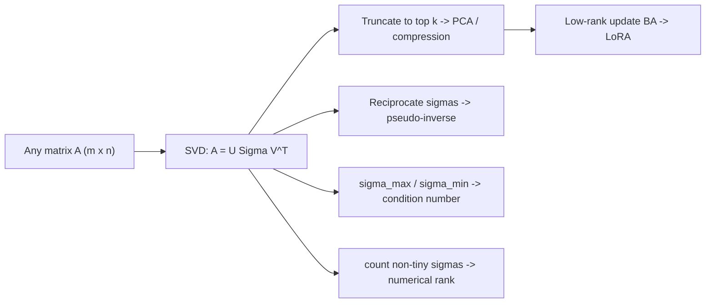

# Eigendecomposition and SVD

## TL;DR
Eigendecomposition answers "which directions does this square matrix only stretch?"; SVD generalises that to **any** matrix and always exists. SVD is the single most useful factorisation in ML: PCA is SVD of the centred data matrix, the pseudo-inverse is SVD with reciprocated singular values, matrix rank and conditioning are read off the singular values, and LoRA is a deliberately low-rank $BA$ update motivated by the fact that the useful part of a weight update is low-rank.

## Intuition
Every matrix, however messy, does the same three things in sequence: **rotate, scale along axes, rotate again**. SVD names those three steps: $A = U\Sigma V^\top$. The singular values in $\Sigma$ are the stretch factors, sorted biggest first, and they tell you how much "energy" each direction carries. Truncating the small ones is lossy compression of a linear map — which is what PCA, latent semantic analysis, and low-rank adapters all are.

## The maths

**Eigendecomposition.** For square $A \in \mathbb{R}^{n\times n}$, a non-zero $v$ with

$$
Av = \lambda v
$$

is an eigenvector with eigenvalue $\lambda$. If $A$ has $n$ independent eigenvectors, $A = V\Lambda V^{-1}$. Eigenvalues solve $\det(A-\lambda I)=0$.

**Spectral theorem (the case that matters).** If $A$ is real symmetric, its eigenvalues are real and its eigenvectors can be chosen orthonormal:

$$
A = Q\Lambda Q^\top, \qquad Q^\top Q = I .
$$

Covariance matrices, Gram matrices $X^\top X$, kernel matrices and Hessians are all symmetric, so this is the version you actually use. $A$ is PSD iff all $\lambda_i \ge 0$.

**Worked eigen example.** $A=\begin{bmatrix}2&1\\1&2\end{bmatrix}$. Then $\det(A-\lambda I) = (2-\lambda)^2 - 1 = \lambda^2-4\lambda+3=(\lambda-3)(\lambda-1)$, so $\lambda = 3, 1$ with eigenvectors $\tfrac{1}{\sqrt2}[1,1]^\top$ and $\tfrac{1}{\sqrt2}[1,-1]^\top$. Note $\operatorname{tr}(A)=4=3+1$ and $\det(A)=3=3\cdot1$ — two free sanity checks.

**SVD.** For **any** $A \in \mathbb{R}^{m\times n}$ with $r = \operatorname{rank}(A)$,

$$
A = U\Sigma V^\top = \sum_{i=1}^{r}\sigma_i\, u_i v_i^\top,
$$

with $U\in\mathbb{R}^{m\times m}$ and $V\in\mathbb{R}^{n\times n}$ orthogonal, $\Sigma$ diagonal with $\sigma_1 \ge \sigma_2 \ge \dots \ge \sigma_r > 0$. The links to eigendecomposition:

$$
A^\top A = V\Sigma^\top\Sigma V^\top, \qquad AA^\top = U\Sigma\Sigma^\top U^\top, \qquad \sigma_i = \sqrt{\lambda_i(A^\top A)} .
$$

**Worked SVD example you can verify by hand.** Take $A=\begin{bmatrix}3&0\\4&5\end{bmatrix}$.

$$
A^\top A = \begin{bmatrix}25&20\\20&25\end{bmatrix}
$$

with eigenvalues $45$ and $5$ (eigenvectors $\tfrac{1}{\sqrt2}[1,1]^\top$, $\tfrac{1}{\sqrt2}[1,-1]^\top$). So $\sigma_1 = 3\sqrt5 \approx 6.708$, $\sigma_2=\sqrt5\approx 2.236$; note $\sigma_1\sigma_2 = 15 = \lvert\det A\rvert$ and $\kappa(A)=\sigma_1/\sigma_2 = 3$. Then $u_i = Av_i/\sigma_i$ gives $u_1 = \tfrac{1}{\sqrt{10}}[1,3]^\top$, $u_2=\tfrac{1}{\sqrt{10}}[3,-1]^\top$, and

$$
\sigma_1 u_1v_1^\top = \begin{bmatrix}1.5&1.5\\4.5&4.5\end{bmatrix},\qquad
\sigma_2 u_2v_2^\top = \begin{bmatrix}1.5&-1.5\\-0.5&0.5\end{bmatrix},
$$

which sum back to $A$. The first term alone is the best rank-1 approximation.

**Eckart–Young.** Truncating to the top $k$ terms, $A_k=\sum_{i\le k}\sigma_iu_iv_i^\top$, minimises $\lVert A - B\rVert_F$ over all rank-$k$ $B$, with error $\lVert A-A_k\rVert_F^2 = \sum_{i>k}\sigma_i^2$. This one theorem justifies PCA, truncated-SVD embeddings, and low-rank weight compression.

**PCA from SVD.** Centre $X$ (subtract the column means). The sample covariance is $C = \tfrac{1}{n-1}X^\top X$. With $X=U\Sigma V^\top$, $C = V\tfrac{\Sigma^2}{n-1}V^\top$ — so principal directions are the right singular vectors $v_i$, explained variance is $\sigma_i^2/\sum_j\sigma_j^2$, and scores are $XV = U\Sigma$. In practice you run SVD on $X$ directly instead of forming $X^\top X$, because squaring squares the condition number.

**Pseudo-inverse.** $A^+ = V\Sigma^+U^\top$ where $\Sigma^+$ inverts the non-zero singular values. $\hat w = A^+y$ is the minimum-norm least-squares solution, and it exists even when $A^\top A$ is singular.

**Low-rank adaptation (LoRA).** Freeze $W_0 \in \mathbb{R}^{d\times k}$ and learn $\Delta W = BA$ with $B\in\mathbb{R}^{d\times r}$, $A\in\mathbb{R}^{r\times k}$, $r \ll \min(d,k)$. Trainable parameters drop from $dk$ to $r(d+k)$ — for $d=k=4096$, $r=8$ that is $16.8\text{M} \to 65\text{K}$, a $\sim256\times$ reduction. The empirical claim is that the *update* needed for adaptation has low intrinsic rank, not that $W_0$ does. See [[parameter-efficient-finetuning-lora]].

## Diagram



## Code

```python
import numpy as np

A = np.array([[3., 0.], [4., 5.]])
U, s, Vt = np.linalg.svd(A)
print(s)                              # [6.7082 2.2361] == [3*sqrt5, sqrt5]
print(np.isclose(s.prod(), abs(np.linalg.det(A))))        # True: 15.0
print(np.isclose(s[0] / s[1], np.linalg.cond(A)))         # True: 3.0

# Rank-1 truncation is the best rank-1 approximation (Eckart-Young)
A1 = s[0] * np.outer(U[:, 0], Vt[0])
print(A1)                                                  # [[1.5,1.5],[4.5,4.5]]
err = np.linalg.norm(A - A1, 'fro') ** 2
print(np.isclose(err, s[1] ** 2))                          # True

# PCA via SVD == eigendecomposition of the covariance matrix
rng = np.random.default_rng(0)
X = rng.normal(size=(500, 4)) @ np.array([[3., 1., 0., 0.],
                                          [0., 2., 0., 0.],
                                          [0., 0., 1., 0.],
                                          [0., 0., 0., .1]])
Xc = X - X.mean(0)
U2, s2, V2t = np.linalg.svd(Xc, full_matrices=False)
explained = s2 ** 2 / (s2 ** 2).sum()

C = np.cov(Xc, rowvar=False)
lam, Q = np.linalg.eigh(C)                 # eigh: ascending, symmetric input
lam = lam[::-1]
print(np.allclose(lam, s2 ** 2 / (len(Xc) - 1)))          # True
print(explained.round(3))

# Pseudo-inverse handles a rank-deficient design matrix gracefully
Xd = np.c_[Xc, 2 * Xc[:, 0]]               # exactly collinear column
y = Xc @ np.array([1., -2., 0.5, 0.]) + 0.1 * rng.normal(size=len(Xc))
w = np.linalg.pinv(Xd) @ y                 # min-norm solution, no exception
print(np.linalg.matrix_rank(Xd), np.round(w, 3))

# LoRA parameter accounting
d = k = 4096
for r in (4, 8, 16, 64):
    print(r, r * (d + k), f"{r * (d + k) / (d * k):.4%}")
```

## In practice
- **Use it when:** reducing dimensionality ([[dimensionality-reduction-pca]]), diagnosing multicollinearity, compressing embedding tables, initialising or analysing weights, building recommender factorisations, or explaining why LoRA works.
- **Defaults that work:** `np.linalg.svd(X, full_matrices=False)` for tall data; `scipy.sparse.linalg.svds` or `sklearn.decomposition.TruncatedSVD` when you only want the top $k$ of a huge or sparse matrix (TruncatedSVD does **not** centre, which is what you want for TF-IDF). Use `eigh` not `eig` for symmetric matrices — it is faster and returns real, sorted results.
- **Breaks when:** you feed uncentred data to PCA (the first component then just points at the mean), or unscaled features (the component with the largest units dominates), or the structure is genuinely non-linear — then use [[tsne-and-umap]] or an autoencoder.
- **Cost / latency:** full SVD of $m\times n$ is $O(\min(m,n)^2\max(m,n))$ — fine for thousands of columns, hopeless for a million. Randomised SVD gets the top $k$ in roughly $O(mnk)$ and is the default inside `sklearn`'s `PCA(svd_solver="randomized")`.

## Interview angle

**Q. Derive PCA from SVD.**
Centre $X$ so column means are zero. Sample covariance $C=\frac{1}{n-1}X^\top X$. Write $X=U\Sigma V^\top$; then $X^\top X = V\Sigma^2V^\top$, so $C=V\frac{\Sigma^2}{n-1}V^\top$ is already an eigendecomposition. The principal axes are the columns of $V$, the eigenvalues (variances along those axes) are $\sigma_i^2/(n-1)$, and the projected data are $XV=U\Sigma$. Doing SVD on $X$ rather than eigendecomposition of $X^\top X$ avoids squaring the condition number.

**Follow-up.** *How many components do you keep?* → Whatever meets the downstream requirement. Common heuristics: cumulative explained variance (85–95%), the elbow in the scree plot, or — the only honest answer for a supervised task — cross-validated downstream metric. Say it out loud that PCA is unsupervised, so the top components are not guaranteed to be the predictive ones.

**Q. Every matrix has an SVD but not every matrix has an eigendecomposition. Why?**
Eigendecomposition requires a square matrix with a full set of linearly independent eigenvectors; defective matrices such as $\begin{bmatrix}1&1\\0&1\end{bmatrix}$ have a repeated eigenvalue with only one eigenvector. SVD applies to any rectangular matrix and always exists because it is built from the eigendecompositions of the symmetric PSD matrices $A^\top A$ and $AA^\top$, which the spectral theorem guarantees.

**Q. What is the connection between singular values and eigenvalues?**
$\sigma_i(A) = \sqrt{\lambda_i(A^\top A)}$. For a symmetric PSD matrix they coincide; for a symmetric matrix generally, $\sigma_i = \lvert\lambda_i\rvert$.

**Q. Why does LoRA work, and what does rank buy you?**
The fine-tuning update $\Delta W$ empirically has low intrinsic rank — the task adaptation lives in a small subspace — so parameterising it as $BA$ with $r \ll d$ loses little while cutting trainable parameters by two orders of magnitude and letting you keep the base weights frozen and shared across many adapters. Rank is the capacity knob: $r=4$–$8$ suffices for style or format adaptation; a genuinely new domain or skill usually needs larger $r$ or full fine-tuning. Because $BA$ merges into $W_0$ at inference, there is zero added serving latency.

**Follow-up.** *Why is $B$ initialised to zeros and $A$ randomly?* → So $\Delta W = BA = 0$ at step zero and the adapted model starts exactly equal to the base model. Initialising both randomly injects noise into a pretrained network.

**Q. Your linear model's coefficients swing wildly between CV folds. What do you check?**
Condition number of the design matrix via singular values. A large $\sigma_1/\sigma_{\min}$ means near-collinearity: small data perturbations produce large coefficient changes. Fix by standardising, dropping or combining correlated features, or adding L2 — ridge shrinks the low-singular-value directions hardest, which is exactly where the instability lives.

## Traps
- **"PCA removes correlated features."** It produces uncorrelated *components*, each a dense mixture of all original features. You lose interpretability — never claim PCA is feature selection.
- **Forgetting to centre.** Without centring, the first principal component chases the mean vector rather than the direction of maximum variance. `sklearn`'s `PCA` centres for you; `TruncatedSVD` deliberately does not.
- **Forgetting to scale.** PCA on raw features with mixed units (rupees and years) is dominated by whichever has the biggest numbers. Standardise, unless the units are genuinely comparable.
- **Fitting PCA on the full dataset before splitting.** That is [[data-leakage]] — fit on train, `transform` on validation and test, inside the pipeline.
- **"Eigenvalues are always real."** Only guaranteed for symmetric matrices. A general real matrix can have complex-conjugate eigenvalue pairs (a rotation, for instance).
- **Assuming SVD components are unique.** Signs are arbitrary, and any repeated singular value gives an arbitrary rotation within that subspace. Do not build logic that depends on component sign.
- **"LoRA with rank 8 always matches full fine-tuning."** It usually matches on narrow adaptation and usually does not on large domain shifts. Name the tradeoff.

## Flashcards
State the SVD of a general matrix $A$.::$A = U\Sigma V^\top$ with $U,V$ orthogonal and $\Sigma$ diagonal, non-negative, sorted descending.
Relationship between singular values of $A$ and eigenvalues of $A^\top A$?::$\sigma_i = \sqrt{\lambda_i(A^\top A)}$.
What does Eckart–Young guarantee?::Truncating the SVD to the top $k$ terms gives the best rank-$k$ approximation in Frobenius (and spectral) norm.
Explained variance ratio of the $i$-th principal component in terms of singular values?::$\sigma_i^2 / \sum_j\sigma_j^2$.
Why run SVD on $X$ instead of eigendecomposition of $X^\top X$?::Forming $X^\top X$ squares the condition number and loses precision.
What is the condition number in terms of singular values?::$\kappa = \sigma_{\max}/\sigma_{\min}$.
Trainable-parameter count for LoRA of rank $r$ on a $d\times k$ weight?::$r(d+k)$ instead of $dk$.
Why is LoRA's $B$ initialised to zero?::So $\Delta W = BA = 0$ at initialisation and the adapted model starts identical to the base model.
Which decomposition applies to symmetric matrices with orthonormal eigenvectors?::The spectral theorem: $A = Q\Lambda Q^\top$.

## Related
[[linear-algebra-essentials]] · [[dimensionality-reduction-pca]] · [[parameter-efficient-finetuning-lora]] · [[matrix-calculus-and-gradients]] · [[vector-norms-and-distances]] · [[embeddings]] · [[recommender-systems-basics]] · [[moc-maths]] · [[qbank-maths]]
