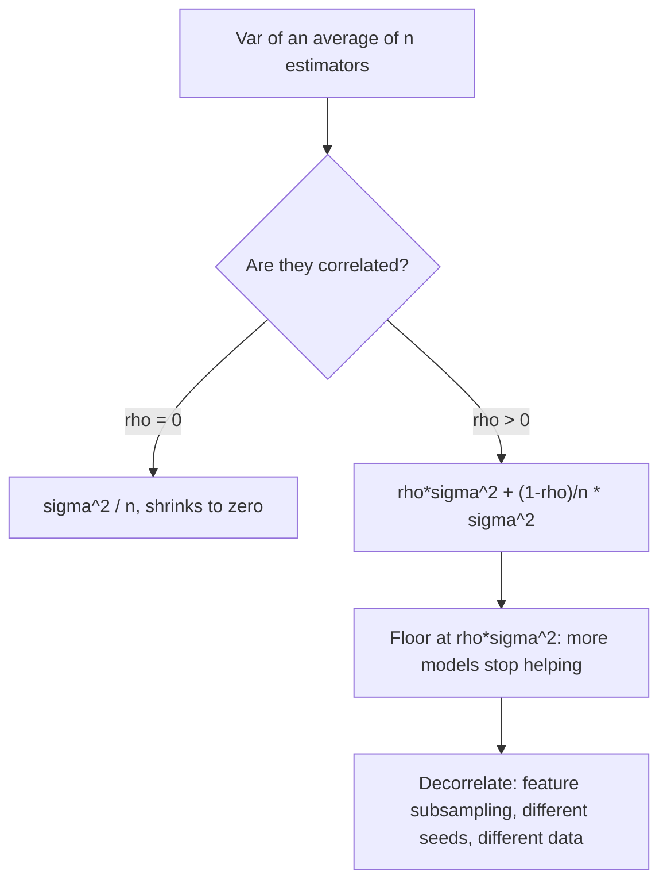

# Expectation, Variance and Covariance

## TL;DR
Expectation is linear always — no independence needed. Variance is quadratic and only additive when
terms are uncorrelated. Covariance measures co-movement in the units of the two variables;
correlation is covariance normalised into $[-1,1]$. Most "why is my standard error wrong" bugs are a
forgotten covariance term.

## Intuition
Expectation is the balance point of the distribution. Variance is the average squared distance from
that balance point — a moment of inertia. Covariance asks whether the two variables lean the same
way from their own balance points; positive if they tend to be high together. Everything in ML that
looks like averaging, error bars or the bias–variance decomposition is these three quantities being
pushed around.

## The maths

**Expectation.** For discrete $X$, $\mathbb{E}[X]=\sum_x x\,P(X=x)$; for continuous,
$\mathbb{E}[X]=\int x f(x)\,dx$.

**Linearity** — the workhorse, true even when $X$ and $Y$ are dependent:

$$
\mathbb{E}[aX + bY + c] = a\,\mathbb{E}[X] + b\,\mathbb{E}[Y] + c
$$

**LOTUS.** $\mathbb{E}[g(X)] = \sum_x g(x)P(X=x)$ — you never need the distribution of $g(X)$.
Note $\mathbb{E}[g(X)] \neq g(\mathbb{E}[X])$ in general; Jensen's inequality gives the direction:
for convex $g$, $\mathbb{E}[g(X)] \ge g(\mathbb{E}[X])$.

**Variance.**

$$
\operatorname{Var}(X)=\mathbb{E}\!\left[(X-\mu)^2\right]=\mathbb{E}[X^2]-\mu^2,
\qquad \mu=\mathbb{E}[X]
$$

$\operatorname{Var}(aX+b)=a^2\operatorname{Var}(X)$ — shifts do not change spread, scaling squares.

**Covariance and correlation.**

$$
\operatorname{Cov}(X,Y)=\mathbb{E}[(X-\mu_X)(Y-\mu_Y)]=\mathbb{E}[XY]-\mathbb{E}[X]\mathbb{E}[Y]
$$

$$
\rho_{XY}=\frac{\operatorname{Cov}(X,Y)}{\sigma_X\sigma_Y} \in [-1,1]
$$

**Variance of a sum** — the identity that actually gets tested:

$$
\operatorname{Var}\!\left(\sum_{i=1}^n X_i\right)=\sum_i \operatorname{Var}(X_i)
+ 2\sum_{i<j}\operatorname{Cov}(X_i,X_j)
$$

Independence $\Rightarrow$ zero covariance $\Rightarrow$ the cross terms vanish. The converse is
false: $X\sim\mathcal{N}(0,1)$, $Y=X^2$ has $\operatorname{Cov}=\mathbb{E}[X^3]=0$ but $Y$ is a
deterministic function of $X$. Zero correlation means *no linear* relationship only.

**Why bagging works.** Average $n$ estimators each with variance $\sigma^2$ and pairwise correlation
$\rho$:

$$
\operatorname{Var}(\bar{X}) = \rho\sigma^2 + \frac{1-\rho}{n}\sigma^2
$$

As $n\to\infty$ the second term vanishes but $\rho\sigma^2$ does not. So adding trees past a point
buys nothing — the gain has to come from *decorrelating* them, which is exactly what random feature
subsampling in [[random-forest]] does. The $\rho=0$ case gives the familiar $\sigma^2/n$ and the
$\sigma/\sqrt{n}$ standard error.

**Law of total expectation / variance.**

$$
\mathbb{E}[X]=\mathbb{E}\big[\mathbb{E}[X\mid Y]\big]
$$

$$
\operatorname{Var}(X)=\underbrace{\mathbb{E}\big[\operatorname{Var}(X\mid Y)\big]}_{\text{unexplained}}
+\underbrace{\operatorname{Var}\big(\mathbb{E}[X\mid Y]\big)}_{\text{explained}}
$$

This is the decomposition behind ANOVA, behind $R^2$, and behind the bias–variance split — see
[[bias-variance-tradeoff]].

**Covariance matrix.** For $\mathbf{x}\in\mathbb{R}^d$,
$\Sigma = \mathbb{E}[(\mathbf{x}-\mu)(\mathbf{x}-\mu)^\top]$ is symmetric positive semi-definite,
and for any $\mathbf{a}$, $\operatorname{Var}(\mathbf{a}^\top\mathbf{x})=\mathbf{a}^\top\Sigma\mathbf{a}\ge 0$.
Its eigenvectors are the principal components — [[dimensionality-reduction-pca]].

**Sample estimators.** $\hat\mu=\bar{x}$ is unbiased. The sample variance divides by $n-1$
(Bessel's correction) because $\bar{x}$ is itself estimated from the data, costing one degree of
freedom; dividing by $n$ underestimates variance systematically. NumPy defaults to `ddof=0`, pandas
to `ddof=1` — a genuine source of quiet bugs.

**Delta method.** For a smooth $g$ and $\hat\theta$ with variance $\sigma^2/n$,

$$
\operatorname{Var}\big(g(\hat\theta)\big) \approx g'(\theta)^2\,\frac{\sigma^2}{n}
$$

This is how you get a standard error for a *ratio* metric such as revenue-per-session — see
[[ab-testing-design]].

## Diagram



## Code

```python
import numpy as np

rng = np.random.default_rng(0)

# Var(X+Y) needs the covariance term
x = rng.normal(size=200_000)
z = rng.normal(size=200_000)
y = 0.8 * x + 0.6 * z                      # corr(x, y) = 0.8
lhs = np.var(x + y)
rhs = np.var(x) + np.var(y) + 2 * np.cov(x, y, ddof=0)[0, 1]
print(round(lhs, 4), round(rhs, 4))        # equal

# zero correlation does not mean independence
u = rng.normal(size=200_000)
print("corr(u, u^2) =", round(np.corrcoef(u, u**2)[0, 1], 3))   # ~0

# variance of an average of correlated estimators: rho*s2 + (1-rho)/n * s2
def avg_var(n, rho, s2=1.0, reps=20_000, rng=rng):
    common = rng.normal(scale=np.sqrt(rho * s2), size=(reps, 1))
    idio = rng.normal(scale=np.sqrt((1 - rho) * s2), size=(reps, n))
    return (common + idio).mean(axis=1).var()

for n in (1, 5, 50, 500):
    print(n, round(avg_var(n, rho=0.3), 4), " theory", round(0.3 + 0.7 / n, 4))

# law of total variance
y_grp = rng.integers(0, 3, 200_000)
vals = rng.normal(loc=np.array([0.0, 2.0, 5.0])[y_grp], scale=1.0)
within = np.mean([vals[y_grp == g].var() for g in range(3)])
between = np.var([vals[y_grp == g].mean() for g in range(3)])
print(round(vals.var(), 3), "≈", round(within + between, 3))

# Bessel: ddof=0 is biased low
truth = 1.0
s0 = np.mean([rng.normal(size=5).var(ddof=0) for _ in range(50_000)])
s1 = np.mean([rng.normal(size=5).var(ddof=1) for _ in range(50_000)])
print("ddof=0", round(s0, 3), " ddof=1", round(s1, 3), " truth", truth)
```

## In practice
- **Use it when:** deriving a standard error, sizing an experiment, explaining why an ensemble
  plateaus, or debugging a confidence interval that is implausibly tight.
- **Defaults that work:** state `ddof` explicitly whenever you compute a variance. For a ratio
  metric, use the delta method or a bootstrap, never the naive per-row variance.
- **Breaks when:** observations are not independent. Clustered data (multiple sessions per user,
  multiple rows per store) inflate the true variance by roughly the design effect
  $1+(m-1)\rho$ with $m$ the cluster size — ignoring it manufactures significance.
- **Cost / latency:** covariance of $d$ features is $O(nd^2)$ time and $O(d^2)$ memory; at
  $d \sim 10^4$ that matrix alone is ~800 MB in float64, which is why PCA on wide data uses
  randomised SVD rather than forming $\Sigma$.

## Interview angle

**Q. Does $\operatorname{Var}(X+Y)=\operatorname{Var}(X)+\operatorname{Var}(Y)$?**
Only when $\operatorname{Cov}(X,Y)=0$. In general you add $2\operatorname{Cov}(X,Y)$. Expectation is
linear unconditionally; variance is not, because it is a quadratic form.

**Follow-up.** Where does that bite in an A/B test? → When the randomisation unit is the user but you
compute variance over events. Events within a user are positively correlated, so the naive SE is too
small and your false-positive rate is well above 5%. Cluster the variance at the user level or use
the delta method on the ratio.

**Q. Why does adding more trees to a random forest eventually stop helping?**
$\operatorname{Var}(\bar{X})=\rho\sigma^2+\frac{1-\rho}{n}\sigma^2$. Only the second term decays with
$n$; the first is a floor set by how correlated the trees are. That is why the lever is
decorrelation — `max_features`, bootstrap sampling — not tree count. Boosting attacks bias instead;
see [[bagging-vs-boosting]].

**Q. $\operatorname{Cov}(X,Y)=0$ — are they independent?**
No. Zero covariance rules out a linear relationship only. $Y=X^2$ with $X$ symmetric about zero has
zero covariance and perfect dependence. Independence implies zero covariance; only for jointly
Gaussian variables does the implication run both ways.

**Q. Explain the law of total variance and where you have used it.**
$\operatorname{Var}(X)=\mathbb{E}[\operatorname{Var}(X\mid Y)]+\operatorname{Var}(\mathbb{E}[X\mid Y])$
— unexplained plus explained. Practically: it tells you the ceiling on how much a feature can help.
If segmenting by a candidate feature barely moves the between-group term, that feature has almost no
signal, and you learn this before training anything.

**Q. Why $n-1$ in the sample variance?**
Because $\bar{x}$ is fitted to the same data, the deviations $x_i-\bar{x}$ are on average smaller
than $x_i-\mu$; dividing by $n$ underestimates $\sigma^2$ by a factor $(n-1)/n$. One degree of
freedom is spent on the mean. Note the corrected variance is unbiased but its square root, $s$, is
*not* an unbiased estimate of $\sigma$ — Jensen again.

**Q. How would you compute a standard error for revenue per session in an experiment?**
Revenue per session is a ratio of two random sums with the randomisation at the user level, so the
denominator is random and rows are correlated. Use the delta method on
$\hat{R}=\bar{Y}/\bar{X}$ with user-level $(Y_i, X_i)$ totals, or bootstrap by resampling users. Do
not compute the variance across sessions.

## Traps
- **Adding variances of correlated terms.** The cross-covariance is the whole story in clustered
  and time-series data.
- **`np.var` defaults to `ddof=0`, `pandas.Series.var` to `ddof=1`.** Same data, different answer;
  state it.
- **Treating correlation as causation or as "the relationship".** Pearson $\rho$ near zero is
  compatible with a strong non-linear relationship; use mutual information for that — see
  [[information-theory-entropy-kl]].
- **Assuming $\mathbb{E}[1/X]=1/\mathbb{E}[X]$** or $\mathbb{E}[\log X]=\log\mathbb{E}[X]$. Jensen
  says these are inequalities, and the gap is why log-transformed regression predictions need a
  retransformation correction before you report them in rupees.
- **Reporting a standard error computed at the wrong unit of analysis.** SE at the event level with
  randomisation at the user level is the single most common A/B testing bug.
- **Believing correlation is scale-free but covariance is comparable.** Covariance carries units;
  never compare covariances across differently scaled features.

## Flashcards
Is expectation linear for dependent variables::Yes — E[aX+bY] = aE[X]+bE[Y] always, independence is not required.
Var(X+Y)::Var(X) + Var(Y) + 2Cov(X,Y).
Var of an average of n estimators with pairwise correlation rho::ρσ² + (1−ρ)σ²/n — the ρσ² floor is why ensembles plateau.
Does zero covariance imply independence::No. It rules out a linear relationship only; the converse holds for jointly Gaussian variables.
Law of total variance::Var(X) = E[Var(X|Y)] + Var(E[X|Y]) — unexplained plus explained.
Why divide by n−1 in sample variance::One degree of freedom is consumed estimating the mean; dividing by n biases the estimate low.
Var(aX+b)::a²Var(X) — location shifts do not affect spread.
Delta method for a ratio::Var(g(θ̂)) ≈ g′(θ)²·Var(θ̂); used for SEs of ratio metrics like revenue per session.
Jensen's inequality::For convex g, E[g(X)] ≥ g(E[X]); so E[1/X] ≠ 1/E[X].
Covariance matrix property::Symmetric positive semi-definite; aᵀΣa = Var(aᵀx) ≥ 0; its eigenvectors are the principal components.

## Related
- [[probability-fundamentals]]
- [[common-probability-distributions]]
- [[bias-variance-tradeoff]]
- [[central-limit-theorem]]
- [[dimensionality-reduction-pca]]
- [[bagging-vs-boosting]]
- [[moc-maths]]
