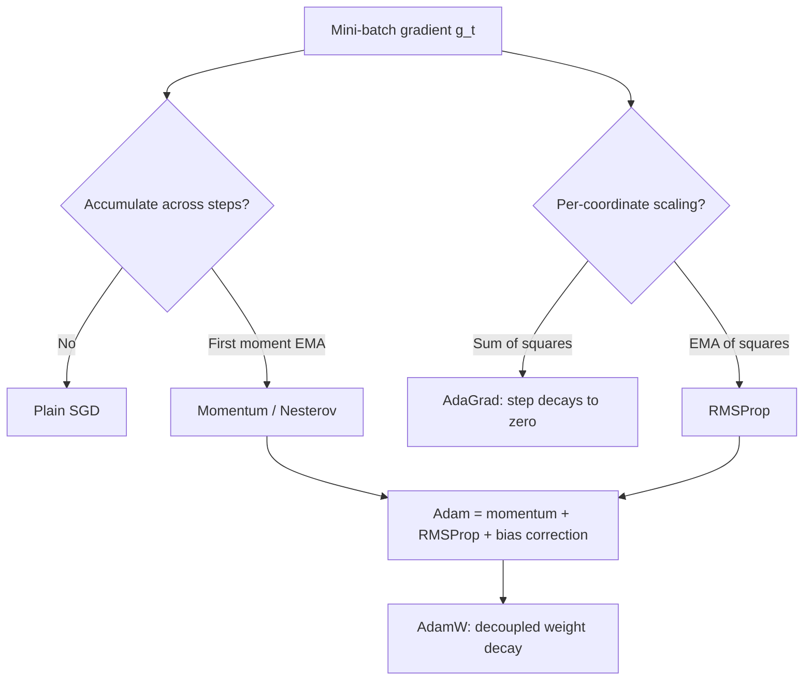

# Gradient Descent Variants

## TL;DR
All first-order optimisers are $\theta \leftarrow \theta - \eta\,\tilde g$ with different definitions of $\tilde g$. Batch GD uses the exact gradient and is too slow; SGD uses a noisy one-sample estimate; mini-batch is the practical compromise. Momentum averages gradients across steps to fix zig-zagging in ill-conditioned valleys; RMSProp/Adam divide by a running gradient magnitude to give each coordinate its own effective step size. Learning rate is the single hyperparameter that matters most, and the reason is conditioning, not the optimiser's name.

## Intuition
You are walking downhill in fog, feeling only the local slope. Plain GD takes a step proportional to the slope: in a long narrow valley that means bouncing off the steep walls while barely advancing along the floor. Momentum is a heavy ball — side-to-side bounces cancel out, the consistent downhill component accumulates. Adam adds a per-coordinate suspension: directions with historically large gradients get short steps, rarely-seen directions get long ones.

## The maths

**The family.** Let $g_t = \nabla_\theta L(\theta_t)$ (estimated on a mini-batch).

*Batch GD:* $g_t$ over all $n$ samples. Cost $O(n)$ per step, deterministic, converges to a genuine stationary point.

*SGD (mini-batch, size $B$):*

$$
\theta_{t+1} = \theta_t - \eta\, g_t, \qquad g_t=\frac{1}{B}\sum_{i\in \mathcal{B}_t}\nabla_\theta \ell_i(\theta_t).
$$

$g_t$ is unbiased, $\mathbb{E}[g_t]=\nabla L$, with variance $\propto 1/B$. So the gradient's standard error falls as $1/\sqrt{B}$: quadrupling batch size halves the noise. That is the justification for the **linear scaling rule** — multiply batch size by $k$, multiply learning rate by $k$ (with warmup) to keep the per-epoch noise budget roughly constant.

*Momentum (heavy ball):*

$$
v_{t+1} = \beta v_t + g_t, \qquad \theta_{t+1} = \theta_t - \eta\, v_{t+1}.
$$

At steady state under a constant gradient, $v \to g/(1-\beta)$, so the effective step is amplified by $1/(1-\beta)$ — $\beta=0.9$ gives a $10\times$ amplification. That is why you must *reduce* $\eta$ when you add momentum. Momentum improves the conditioning-limited rate from $\frac{\kappa-1}{\kappa+1}$ to roughly $\frac{\sqrt\kappa-1}{\sqrt\kappa+1}$ — for $\kappa=10^4$ that turns ~10,000 iterations into ~100.

*Nesterov:* evaluate the gradient at the look-ahead point $\theta_t - \eta\beta v_t$, giving a correction term that damps overshoot.

*AdaGrad:* $G_t = \sum_{s\le t} g_s^2$ (element-wise), $\theta_{t+1}=\theta_t - \frac{\eta}{\sqrt{G_t}+\epsilon}\odot g_t$. The accumulator only grows, so the effective learning rate decays monotonically to zero — fine for convex/sparse problems, fatal for long deep-learning runs.

*RMSProp:* replace the sum with an EMA, $v_t = \beta_2 v_{t-1} + (1-\beta_2)g_t^2$, which stops the monotonic decay.

*Adam:* EMA of both first and second moments plus bias correction:

$$
\begin{aligned}
m_t &= \beta_1 m_{t-1} + (1-\beta_1) g_t, & \hat m_t &= \frac{m_t}{1-\beta_1^{\,t}} \\
v_t &= \beta_2 v_{t-1} + (1-\beta_2) g_t^2, & \hat v_t &= \frac{v_t}{1-\beta_2^{\,t}} \\
\theta_{t+1} &= \theta_t - \eta\,\frac{\hat m_t}{\sqrt{\hat v_t}+\epsilon} .
\end{aligned}
$$

**Why bias correction exists — derive it.** With $m_0=0$, unrolling gives $m_t = (1-\beta_1)\sum_{s=1}^{t}\beta_1^{\,t-s}g_s$. If all $g_s$ had the same expectation $\bar g$, then $\mathbb{E}[m_t] = \bar g(1-\beta_1)\sum_{s=1}^{t}\beta_1^{t-s} = \bar g(1-\beta_1^{\,t})$. So $m_t$ underestimates by exactly the factor $(1-\beta_1^{\,t})$; dividing by it removes the bias. With $\beta_2=0.999$, at $t=1$ the uncorrected $v_1$ is $1000\times$ too small, so $\sqrt{\hat v}$ would be tiny and the first steps enormous. Without correction Adam blows up in the first few hundred iterations — which is also why warmup helps even with correction.

**AdamW.** Adam with L2 added to the loss produces $\lambda w$ inside $g_t$, which then gets divided by $\sqrt{\hat v_t}$ — so parameters with large gradients get *less* weight decay, which is not what you wanted. AdamW decouples it:

$$
\theta_{t+1} = \theta_t - \eta\Big(\frac{\hat m_t}{\sqrt{\hat v_t}+\epsilon} + \lambda\,\theta_t\Big).
$$

This is the default for transformer training. Do not apply decay to biases and LayerNorm gains.

**Convergence rates worth quoting.** Smooth convex, full-batch GD: $O(1/k)$. Nesterov: $O(1/k^2)$. Strongly convex GD: linear $O(\rho^k)$. SGD with a decaying step on a strongly convex objective: $O(1/k)$ in expectation — noise means you cannot do better without variance reduction. Fixed-step SGD does not converge to the optimum; it converges to a noise ball whose radius is $\propto \eta$, which is exactly why decaying the learning rate at the end of training produces that final drop in loss.

**Step-size bound.** For an $L$-smooth function, GD with $\eta < 2/L$ is guaranteed to decrease the objective; $\eta > 2/L$ diverges. $L$ is the largest Hessian eigenvalue, so "too large a learning rate diverges" has a precise threshold. This is also why the loss exploding is a learning-rate symptom first and an architecture symptom second.

**Worked example.** $f(x)=\tfrac12 x^\top Ax$ with $A=\mathrm{diag}(1,10)$: $L=10$, $\mu=1$, $\kappa=10$. GD diverges for $\eta>0.2$; the optimal fixed step is $2/(L+\mu)=2/11\approx0.1818$ with per-step error factor $9/11\approx0.818$. Momentum with $\beta$ tuned reaches roughly $(\sqrt{10}-1)/(\sqrt{10}+1)\approx0.52$, about three times fewer steps.

## Diagram



## Code

```python
import numpy as np

# Ill-conditioned quadratic: f(x) = 0.5 x^T A x, A = diag(1, 10)
A = np.diag([1.0, 10.0])
L_smooth, mu = 10.0, 1.0
grad = lambda x: A @ x
f = lambda x: 0.5 * x @ A @ x

def run(update, steps=300, x0=np.array([1.0, 1.0])):
    x, state = x0.copy(), {}
    hist = [np.linalg.norm(x)]
    for t in range(1, steps + 1):
        x = update(x, grad(x), t, state)
        hist.append(np.linalg.norm(x))
    return np.array(hist)

eta_star = 2 / (L_smooth + mu)          # 0.1818...

def sgd(x, g, t, s, eta=eta_star):
    return x - eta * g

def momentum(x, g, t, s, eta=0.05, beta=0.9):
    s["v"] = beta * s.get("v", 0.0) + g
    return x - eta * s["v"]

def adam(x, g, t, s, eta=0.1, b1=0.9, b2=0.999, eps=1e-8, correct=True):
    s["m"] = b1 * s.get("m", 0.0) + (1 - b1) * g
    s["v"] = b2 * s.get("v", 0.0) + (1 - b2) * g ** 2
    m, v = s["m"], s["v"]
    if correct:
        m, v = m / (1 - b1 ** t), v / (1 - b2 ** t)
    return x - eta * m / (np.sqrt(v) + eps)

for name, up in [("gd", sgd), ("momentum", momentum), ("adam", adam)]:
    h = run(up)
    first = np.argmax(h < 1e-4) if (h < 1e-4).any() else -1
    print(f"{name:9s} steps to 1e-4: {first}")

# Theoretical GD rate matches observed
h = run(sgd)
print("predicted per-step factor", (10 - 1) / (10 + 1))          # 0.8181
print("observed  per-step factor", round(h[200] / h[199], 4))

# Divergence threshold: eta > 2/L blows up
for eta in (0.19, 0.20, 0.21):
    h = run(lambda x, g, t, s, e=eta: x - e * g, steps=100)
    print(eta, "diverges" if not np.isfinite(h[-1]) or h[-1] > 1e3 else "ok")

# Bias correction matters most in the first steps
s1, s2 = {}, {}
x1 = x2 = np.array([1.0, 1.0])
for t in range(1, 6):
    x1 = adam(x1, grad(x1), t, s1, correct=True)
    x2 = adam(x2, grad(x2), t, s2, correct=False)
    print(t, np.round(x1, 4), np.round(x2, 4))    # uncorrected barely moves early

# Gradient-noise scaling: SE of the mini-batch gradient ~ 1/sqrt(B)
rng = np.random.default_rng(0)
per_sample = rng.normal(loc=0.5, scale=2.0, size=(100_000,))
for B in (1, 4, 16, 64, 256):
    means = per_sample[: (100_000 // B) * B].reshape(-1, B).mean(1)
    print(B, round(means.std(), 4), round(2.0 / np.sqrt(B), 4))    # match
```

## In practice
- **Use it when:** anything trained by gradients. The choice matters most when the problem is ill-conditioned or the gradients are sparse.
- **Defaults that work:** AdamW with $\eta=3\times10^{-4}$ (small models) to $1\times10^{-4}$ (large fine-tunes), $\beta=(0.9,0.999)$, $\epsilon=10^{-8}$, weight decay 0.01–0.1 on weights only, linear warmup over the first 1–5% of steps then cosine decay, global gradient clipping at 1.0. For convex or shallow problems, SGD with momentum 0.9 and a step schedule often generalises slightly better in vision. For classical ML on tabular data you are usually using L-BFGS or a tree booster and none of this applies.
- **Breaks when:** the learning rate is wrong. If loss goes NaN, halve the LR before touching anything else. If loss plateaus high, your LR is too small or your schedule decayed too early. Adam on very small batches with sparse gradients can have a badly-estimated $\hat v$; raising $\epsilon$ to $10^{-6}$ often stabilises it.
- **Cost / latency:** Adam stores two extra fp32 tensors per parameter. For a 7B model that is 7B×4×2 = 56 GB of optimiser state on top of weights and gradients — the direct reason for ZeRO sharding, 8-bit optimisers, and why full fine-tuning of a 7B model needs far more memory than its 14 GB of fp16 weights suggests.

## Interview angle

**Q. Walk me from batch gradient descent to Adam, saying what problem each step solves.**
Batch GD computes the exact gradient — correct but $O(n)$ per step, so on a million rows you get one update per full pass. Mini-batch SGD trades gradient accuracy for many more updates; the estimate is unbiased with variance $\propto 1/B$, and the noise even helps escape saddles. But SGD still uses one global step size, so in an ill-conditioned valley it zig-zags. Momentum accumulates an EMA of gradients: oscillating components cancel, the consistent direction accumulates, improving the rate from $\kappa$-limited to roughly $\sqrt\kappa$-limited. Separately, coordinates have very different gradient scales — think rare embedding rows versus a dense layer. AdaGrad/RMSProp divide by a running gradient magnitude per coordinate. Adam is momentum plus RMSProp plus bias correction on both moments. AdamW then fixes the interaction between Adam's normalisation and L2 by decoupling weight decay.

**Q. Why does Adam need bias correction?**
The moment EMAs are initialised at zero, so early on they are biased toward zero. Unrolling gives $\mathbb{E}[m_t]=\bar g(1-\beta_1^t)$, so dividing by $(1-\beta_1^t)$ makes the estimator unbiased. It matters most for $v$, since $\beta_2=0.999$ means $v_1$ is a thousand times too small; without correction $\sqrt{\hat v}$ is tiny and the first updates are enormous, which destabilises training.

**Follow-up.** *If Adam corrects the bias, why do we still use warmup?* → Because the variance of $\hat v$ is high in the first few hundred steps even after debiasing — the estimate is built from very few samples. Warmup keeps the step small while the second-moment estimate settles. It also helps with large-batch training and with the sharp initial curvature of a randomly-initialised transformer.

**Q. What batch size would you pick and why?**
The largest that fits and keeps the hardware saturated, then scale the learning rate roughly linearly with warmup. The statistical argument: gradient noise falls as $1/\sqrt{B}$, so past some point you are paying linearly more compute for a square-root reduction in noise — there is a critical batch size beyond which you get no wall-clock benefit. The practical argument in India-sized budgets: gradient accumulation lets you get a large effective batch on a single GPU at the cost of more steps per update. Small batches add regularising noise; very large batches need warmup or they diverge.

**Follow-up.** *Your loss goes NaN at step 500 with batch 1024.* → Check in this order: learning rate too high for the new batch size, missing warmup, no gradient clipping, fp16 overflow (switch to bf16 or check the loss scaler), and finally a bad sample or a division by zero in a custom loss.

**Q. Adam or SGD with momentum?**
Adam converges faster in wall-clock on transformers, sparse embeddings and anything where coordinate gradient scales differ wildly, and it is far less sensitive to the initial learning rate. Well-tuned SGD with momentum plus a schedule often generalises marginally better on convolutional vision models, and it uses a third of the optimiser memory. Default to AdamW for language and multimodal work, and consider SGD if memory is the binding constraint or you are reproducing a vision paper.

**Q. Why is a learning-rate schedule needed at all?**
Fixed-step SGD does not converge to the optimum; it converges to a ball around it whose radius is proportional to $\eta$ times the gradient noise. Shrinking $\eta$ shrinks the ball, which is why the loss drops visibly when cosine decay reaches its tail. Warmup at the start handles the badly-conditioned early phase and the unsettled optimiser state.

## Traps
- **"Adam is adaptive so I do not need to tune the learning rate."** Adam adapts the *relative* per-coordinate scale; the global $\eta$ still spans orders of magnitude across problems and is still the highest-leverage hyperparameter.
- **Adding momentum without lowering the learning rate.** Momentum multiplies the effective step by $1/(1-\beta)$; keeping the old $\eta$ with $\beta=0.9$ is a $10\times$ increase and usually diverges.
- **Using Adam with plain L2 in the loss and calling it weight decay.** It is not equivalent — use AdamW. And exclude biases and norm parameters from decay.
- **Scaling batch size without scaling the learning rate.** Fewer, equally-sized updates per epoch means you effectively train less. Scale LR linearly with warmup.
- **"SGD means one sample at a time."** In every modern framework "SGD" means mini-batch SGD. Say mini-batch explicitly.
- **Blaming the architecture for a divergence.** For an $L$-smooth objective, $\eta>2/L$ provably diverges. Rule out the learning rate first.
- **Reusing AdaGrad for a long deep-learning run.** Its accumulator grows without bound and the effective step decays to zero; the run silently stops learning.
- **Forgetting `optimizer.zero_grad()` in PyTorch.** Gradients accumulate by default, so you silently train with a growing effective batch and exploding steps.

## Flashcards
General form of every first-order optimiser?::$\theta \leftarrow \theta - \eta\,\tilde g$, where variants differ only in how $\tilde g$ is built from past gradients.
How does mini-batch gradient noise scale with batch size?::Standard error $\propto 1/\sqrt{B}$ — quadrupling $B$ halves the noise.
Effective step amplification from momentum $\beta$?::$1/(1-\beta)$ at steady state, so $\beta=0.9$ multiplies the step by 10.
Adam's bias-correction factors?::$\hat m_t = m_t/(1-\beta_1^t)$ and $\hat v_t = v_t/(1-\beta_2^t)$, because zero-initialised EMAs are biased toward zero.
What does AdamW change relative to Adam plus L2?::It decouples weight decay from the adaptive denominator, applying $-\eta\lambda\theta$ directly.
Step-size bound for guaranteed descent on an $L$-smooth function?::$\eta < 2/L$, where $L$ is the largest Hessian eigenvalue.
Why does AdaGrad stall on long runs?::Its squared-gradient accumulator only grows, so the effective learning rate decays monotonically to zero.
Why does fixed-step SGD not reach the exact optimum?::Gradient noise keeps it in a ball of radius $\propto \eta$; decaying the step shrinks the ball.
Optimiser-state memory for Adam in fp32?::8 bytes per parameter (two moments), on top of weights and gradients.

## Related
[[convexity-and-optimization-basics]] · [[optimizers-sgd-adam]] · [[learning-rate-schedules]] · [[matrix-calculus-and-gradients]] · [[backpropagation]] · [[training-tricks-and-debugging]] · [[mixed-precision-and-memory]] · [[distributed-training]] · [[moc-maths]]
