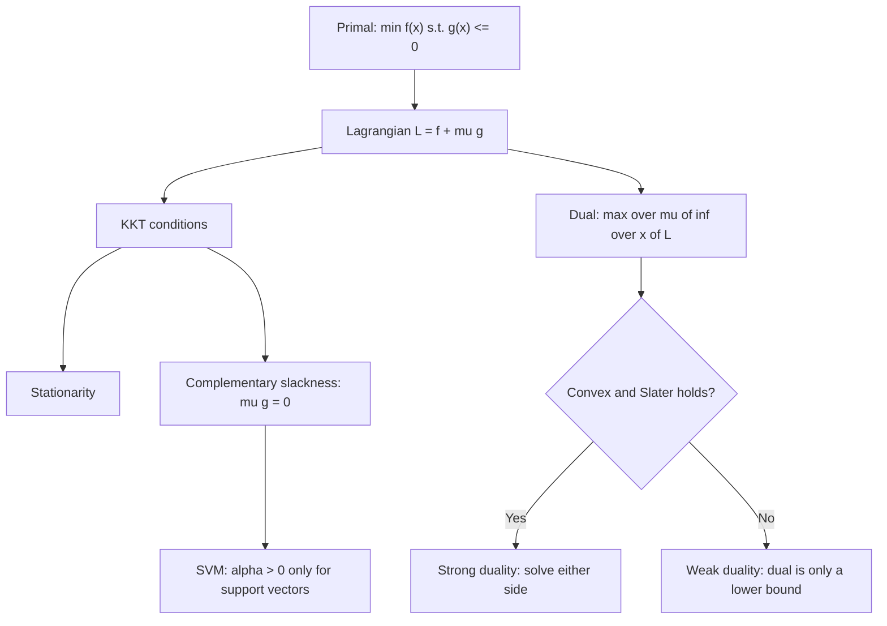

# Lagrange Multipliers and Constraints

## TL;DR
Lagrange multipliers turn "minimise $f$ subject to $g=0$" into an unconstrained stationarity problem, and KKT extends that to inequalities. Three ML payoffs: it proves that ridge/lasso penalties are *equivalent* to hard norm budgets (so $\lambda$ is a Lagrange multiplier, not a magic number), it produces the SVM dual and hence support vectors and the kernel trick, and it is the machinery behind constrained RLHF-style objectives such as a KL budget in PPO.

## Intuition
You are walking on a fenced hillside trying to get as low as possible without leaving the fence. At the best point the downhill direction must point *straight through the fence* — otherwise you could slide along it and get lower. "Straight through the fence" means the gradient of the objective is parallel to the gradient of the constraint. The multiplier $\lambda$ is how hard the fence is pushing back, which is exactly the shadow price: how much the optimum improves per unit of relaxed constraint.

## The maths

**Equality constraints.** Minimise $f(x)$ subject to $h_i(x)=0$, $i=1..p$. Form the Lagrangian

$$
\mathcal{L}(x,\nu) = f(x) + \sum_i \nu_i h_i(x).
$$

Stationarity requires $\nabla_x\mathcal{L}=0$ and $\nabla_\nu\mathcal{L}=0$ (the latter just restates the constraints):

$$
\nabla f(x^\star) = -\sum_i \nu_i \nabla h_i(x^\star).
$$

**Worked example you can verify.** Maximise $xy$ subject to $x+y=6$. $\nabla(xy)=(y,x)$, $\nabla(x+y)=(1,1)$, so $y=\lambda$, $x=\lambda$, and $x+y=6$ gives $\lambda=3$, $x=y=3$, objective $9$. Interpretation of $\lambda=3$: relax the budget to $x+y=7$ and the optimum becomes $3.5^2=12.25$, an increase of $3.25$ — close to $\lambda=3$, with the gap being second-order. The multiplier is the marginal value of the constraint.

**Inequality constraints and KKT.** Minimise $f(x)$ s.t. $g_j(x)\le 0$ and $h_i(x)=0$. With $\mathcal{L}=f + \sum_j\mu_j g_j + \sum_i\nu_i h_i$, the KKT conditions at an optimum (under a constraint qualification such as Slater's) are:

$$
\begin{aligned}
&\text{Stationarity:} && \nabla f + \textstyle\sum_j \mu_j\nabla g_j + \sum_i \nu_i \nabla h_i = 0\\
&\text{Primal feasibility:} && g_j(x)\le0,\quad h_i(x)=0\\
&\text{Dual feasibility:} && \mu_j \ge 0\\
&\text{Complementary slackness:} && \mu_j\, g_j(x) = 0 \;\;\forall j
\end{aligned}
$$

**Complementary slackness is the one that carries meaning.** Either the constraint is tight ($g_j=0$, and it can have a non-zero price $\mu_j$) or it is slack ($g_j<0$, and then $\mu_j=0$ — an inactive constraint costs nothing). In the SVM this is literally the definition of a support vector.

**Duality.** The dual function $d(\mu,\nu) = \inf_x \mathcal{L}(x,\mu,\nu)$ is always concave and always lower-bounds the primal optimum (weak duality). For a convex problem satisfying Slater's condition, strong duality holds: $d(\mu^\star,\nu^\star)=f(x^\star)$, so you may solve whichever side is easier. That is the entire justification for solving the SVM in the dual.

**Penalty and constraint are the same thing.** Ridge in constrained form,

$$
\min_w \lVert Xw-y\rVert_2^2 \quad\text{s.t.}\quad \lVert w\rVert_2^2 \le t,
$$

has Lagrangian $\lVert Xw-y\rVert^2 + \lambda(\lVert w\rVert^2 - t)$. Dropping the constant $-\lambda t$ leaves exactly the penalised objective. For every $t$ there is a $\lambda$ giving the same solution, and vice versa; $\lambda$ *is* the multiplier on the norm budget. Complementary slackness says that if the unconstrained OLS solution already satisfies $\lVert w\rVert^2 \le t$ then $\lambda=0$ — the penalty does nothing. Identically for lasso with $\lVert w\rVert_1\le t$: the diamond-shaped budget set is where the sparsity comes from ([[regularization-l1-l2]]).

**SVM dual — derive it.** Hard-margin primal:

$$
\min_{w,b}\ \tfrac12\lVert w\rVert^2 \quad\text{s.t.}\quad y_i(w^\top x_i + b) \ge 1 .
$$

Lagrangian $\mathcal{L} = \tfrac12\lVert w\rVert^2 - \sum_i\alpha_i[y_i(w^\top x_i+b)-1]$ with $\alpha_i\ge0$. Setting derivatives to zero:

$$
\frac{\partial\mathcal{L}}{\partial w}=0 \Rightarrow w=\sum_i \alpha_i y_i x_i,
\qquad
\frac{\partial\mathcal{L}}{\partial b}=0 \Rightarrow \sum_i \alpha_i y_i = 0 .
$$

Substituting back gives the dual

$$
\max_\alpha\ \sum_i\alpha_i - \tfrac12\sum_{i,j}\alpha_i\alpha_j y_iy_j\, x_i^\top x_j
\quad\text{s.t.}\quad \alpha_i\ge0,\ \sum_i\alpha_iy_i=0 .
$$

Two consequences that get asked about constantly:

1. **Support vectors.** Complementary slackness $\alpha_i[y_i(w^\top x_i+b)-1]=0$ means $\alpha_i>0$ only for points exactly on the margin. Every other point has $\alpha_i=0$ and contributes nothing to $w=\sum\alpha_iy_ix_i$. The decision boundary depends only on the support vectors.
2. **The kernel trick.** Data enter the dual only through inner products $x_i^\top x_j$, so replace them with $K(x_i,x_j)$ and you fit in an implicit high-dimensional space without ever computing the mapping. For soft margin, the only change is the box constraint $0\le\alpha_i\le C$, which caps how much any single point can influence the solution — the formal reason $C$ controls robustness to outliers.

**Where else this shows up.**

- **PCA.** Maximise $w^\top C w$ subject to $\lVert w\rVert^2=1$ gives $\mathcal{L}=w^\top Cw - \lambda(w^\top w - 1)$, so $Cw=\lambda w$: the constraint *derives* the eigenvector problem, and $\lambda$ is the variance explained. See [[eigen-decomposition-and-svd]].
- **Maximum entropy.** Maximising $H(p)$ subject to $\sum p_i=1$ and moment constraints yields the exponential family — softmax is the max-entropy distribution under a linear expectation constraint.
- **Constrained RL / RLHF.** PPO's practical objective is "maximise reward subject to staying close to the reference policy in KL". The KL coefficient $\beta$ is a Lagrange multiplier; adaptive-KL controllers literally implement dual ascent on $\beta$ to hit a target KL. See [[rlhf]] and [[information-theory-entropy-kl]].
- **Constrained deployment.** "Maximise recall subject to precision $\ge$ 0.9" or "minimise cost subject to p95 latency $\le$ 200 ms" are KKT problems; in practice you sweep the threshold or the knob, which is doing dual search by hand. See [[threshold-selection]].

## Diagram



## Code

```python
import numpy as np
from scipy.optimize import minimize

# 1. Hand example: max xy subject to x + y = 6  ->  x = y = 3, lambda = 3
res = minimize(lambda v: -v[0] * v[1], x0=[1., 5.],
               constraints=[{"type": "eq", "fun": lambda v: v[0] + v[1] - 6}])
print(res.x.round(6))                        # [3. 3.]
# shadow price: relax the budget by 1 and the optimum improves by about lambda
opt = lambda b: max(-minimize(lambda v: -v[0]*v[1], [1., 5.],
        constraints=[{"type": "eq", "fun": lambda v, b=b: v[0]+v[1]-b}]).fun, 0)
print(opt(6), opt(7), round(opt(7) - opt(6), 3))    # 9.0 12.25 3.25  ~ lambda = 3

# 2. Ridge: penalised form and constrained form give the same w
rng = np.random.default_rng(0)
n, d = 60, 5
X = rng.normal(size=(n, d)); y = X @ rng.normal(size=d) + 0.3 * rng.normal(size=n)
lam = 2.0
w_pen = np.linalg.solve(X.T @ X + lam * np.eye(d), X.T @ y)
t = w_pen @ w_pen                                   # the implied budget
con = minimize(lambda w: ((X @ w - y) ** 2).sum(), x0=np.zeros(d),
               constraints=[{"type": "ineq", "fun": lambda w: t - w @ w}])
print(np.allclose(w_pen, con.x, atol=1e-4))         # True

# 3. SVM: only support vectors get non-zero dual coefficients
from sklearn.svm import SVC
Xs = np.array([[0., 0.], [1., 1.], [0., 1.], [1., 0.],
               [3., 3.], [4., 4.], [3., 4.], [4., 3.]])
ys = np.array([0, 0, 0, 0, 1, 1, 1, 1])
svc = SVC(kernel="linear", C=1e6).fit(Xs, ys)       # C huge -> hard margin
print(svc.support_)                                  # indices of support vectors only
print(np.abs(svc.dual_coef_).round(3))

# w = sum alpha_i y_i x_i, reconstructed from the duals
alpha_y = svc.dual_coef_.ravel()                     # already signed alpha*y
w = alpha_y @ Xs[svc.support_]
print(np.allclose(w, svc.coef_.ravel(), atol=1e-6))  # True

# margin points satisfy y(wx+b) == 1 (complementary slackness active)
marg = ys[svc.support_] * 2 - 1
print(np.round(marg * (Xs[svc.support_] @ w + svc.intercept_), 4))   # all 1.0

# 4. Dual ascent on a KL budget: the coefficient is a Lagrange multiplier
target_kl, beta = 0.02, 1.0
kls = [0.08, 0.05, 0.03, 0.018, 0.02]
for kl in kls:                                       # simple adaptive controller
    beta *= 1.5 if kl > 1.5 * target_kl else (1 / 1.5 if kl < target_kl / 1.5 else 1.0)
    print(round(kl, 3), round(beta, 3))
```

## In practice
- **Use it when:** you need to explain why $\lambda$ and a norm budget are the same knob, why SVMs are sparse in the data, why kernels are possible, or how to express a business constraint (precision floor, latency ceiling, fairness parity) as an optimisation problem rather than a post-hoc filter.
- **Defaults that work:** for the SVM use the dual when $n$ is modest and $d$ is huge or you need a kernel; use the primal (`LinearSVC`, liblinear) when $n$ is in the hundreds of thousands. For constrained deployment targets, tune the multiplier by bisection on a validation set rather than trying to solve the KKT system.
- **Breaks when:** the problem is non-convex — then KKT conditions are necessary but not sufficient, a duality gap can exist, and dual solutions need not be primal-feasible. Also breaks when constraint qualifications fail (degenerate, tangent, or linearly dependent constraint gradients).
- **Cost / latency:** the SVM dual involves the $n\times n$ kernel matrix, so memory is $O(n^2)$ and training roughly $O(n^2)$ to $O(n^3)$. That is the practical reason kernel SVMs are effectively capped around tens of thousands of rows and lose to [[gradient-boosting]] on large tabular data.

## Interview angle

**Q. Show that ridge regression's penalty is equivalent to a constraint.**
Write the constrained problem $\min_w\lVert Xw-y\rVert^2$ s.t. $\lVert w\rVert_2^2\le t$. Its Lagrangian is $\lVert Xw-y\rVert^2 + \lambda(\lVert w\rVert^2-t)$; the constant $\lambda t$ does not affect the argmin, so for the right $\lambda$ the solution is identical to the penalised form. The correspondence is monotone: larger $\lambda$ ↔ smaller $t$. Complementary slackness adds the nice detail that if OLS already satisfies the budget, $\lambda=0$ and the penalty is inert. The same argument with $\lVert w\rVert_1\le t$ gives lasso, and the corners of that $\ell_1$ ball are where the exact zeros come from.

**Q. Derive the SVM dual and explain what a support vector is.**
Give the derivation above. Then: complementary slackness $\alpha_i[y_i(w^\top x_i + b)-1]=0$ forces $\alpha_i=0$ for any point strictly outside the margin. Since $w = \sum_i\alpha_iy_ix_i$, only the points on (or, in the soft-margin case, inside) the margin define the boundary. That is why an SVM is robust to far-away points but sensitive to points near the boundary, and why the model size scales with the number of support vectors, not the dataset size.

**Follow-up.** *Where does the kernel trick come from?* → The dual objective contains the data only as inner products $x_i^\top x_j$. Replace them with $K(x_i,x_j)$ for any PSD kernel and you are optimising in the induced feature space without materialising it. Mercer's condition (the kernel matrix must be PSD) is what makes the dual still convex.

**Follow-up 2.** *What does $C$ do in soft-margin SVM, in KKT terms?* → It becomes the upper bound in $0\le\alpha_i\le C$. A point that is badly misclassified saturates at $\alpha_i=C$, capping the influence any single outlier can have. Small $C$ means a wide, tolerant margin (more regularisation); large $C$ approaches hard margin.

**Q. What do the KKT conditions actually say, in words?**
At an optimum: you cannot improve by moving in any direction that stays feasible (stationarity); you are inside the feasible set (primal feasibility); constraint prices for inequalities are non-negative, because a constraint can only push you back, not pull you (dual feasibility); and any constraint that is not tight has price zero (complementary slackness).

**Q. What is the interpretation of the multiplier?**
The shadow price — the rate of change of the optimal objective per unit relaxation of the constraint. In ML this is directly useful: the KL coefficient in a PPO objective tells you how much reward you are giving up per nat of divergence budget, and the ridge $\lambda$ tells you the marginal cost in training error of tightening the weight budget.

**Q. You must ship a fraud model with precision at least 0.9 while maximising recall. Frame it.**
It is a constrained optimisation: $\max$ recall s.t. precision $\ge 0.9$. Because both are functions of a single threshold on a fixed scorer, the practical solution is to sweep the threshold on a validation set and take the highest-recall point meeting the precision floor, with a confidence interval on precision so you do not overfit the threshold. If you also have a business cost per false positive, drop the hard constraint and minimise expected cost directly — that is the unconstrained form with $\lambda$ set by the actual cost ratio, which is a stronger answer. See [[threshold-selection]] and [[case-fraud-detection]].

## Traps
- **Sign confusion.** Write inequalities as $g(x)\le 0$ before forming the Lagrangian; the requirement $\mu\ge0$ is only meaningful in that convention. Equality multipliers $\nu$ are unrestricted in sign.
- **"KKT points are optima."** For non-convex problems KKT is necessary, not sufficient — a KKT point may be a saddle or a maximum. Only with convexity (plus Slater) do KKT conditions certify a global optimum.
- **Forgetting the constraint qualification.** Slater's condition (a strictly feasible point exists) is what buys strong duality. Without it there can be a duality gap even for convex problems.
- **"The dual is always easier."** For the linear SVM with $n \gg d$, the primal is far cheaper — the dual's $n\times n$ kernel matrix is the bottleneck. Choose by problem shape.
- **Treating $\lambda$ as unitless.** $\lambda$ trades off two terms with different units; its scale depends entirely on feature scaling and on whether the loss is summed or averaged. Always tune it on a log grid after standardising.
- **Claiming all points with $\alpha_i>0$ lie exactly on the margin.** True for hard margin. In soft margin, points with $\alpha_i=C$ are inside the margin or misclassified; only those with $0<\alpha_i<C$ sit exactly on it.
- **Penalising the intercept.** The bias $b$ is excluded from $\lVert w\rVert^2$ in the SVM and should be excluded in ridge too — otherwise the solution depends on where you centred $y$.

## Flashcards
Write the four KKT conditions.::Stationarity $\nabla f + \sum\mu_j\nabla g_j + \sum\nu_i\nabla h_i = 0$; primal feasibility; dual feasibility $\mu_j\ge0$; complementary slackness $\mu_jg_j=0$.
What does complementary slackness mean in words?::An inactive constraint has zero price; a constraint with a non-zero multiplier must be tight.
How is ridge's $\lambda$ related to a norm budget $t$?::$\lambda$ is the Lagrange multiplier on $\lVert w\rVert_2^2 \le t$; each $t$ corresponds to some $\lambda$ and vice versa, monotonically.
What is a support vector, in KKT terms?::A training point with $\alpha_i > 0$; complementary slackness forces $\alpha_i=0$ for points strictly outside the margin.
Why does the kernel trick work in the SVM dual?::The dual depends on the data only through inner products $x_i^\top x_j$, which can be replaced by any PSD kernel $K(x_i,x_j)$.
What does the box constraint $0\le\alpha_i\le C$ do?::Caps the influence of any single point, making the soft-margin SVM robust to outliers; small $C$ means more regularisation.
Interpretation of a Lagrange multiplier?::The shadow price — the marginal improvement in the optimal objective per unit of constraint relaxation.
What condition guarantees strong duality for a convex problem?::Slater's condition — a strictly feasible point exists.
How does Lagrange give PCA?::Maximising $w^\top Cw$ s.t. $\lVert w\rVert^2=1$ yields $Cw=\lambda w$, so the optimum is the top eigenvector and $\lambda$ is the explained variance.

## Related
[[convexity-and-optimization-basics]] · [[support-vector-machines]] · [[regularization-l1-l2]] · [[eigen-decomposition-and-svd]] · [[matrix-calculus-and-gradients]] · [[information-theory-entropy-kl]] · [[rlhf]] · [[threshold-selection]] · [[moc-maths]]
