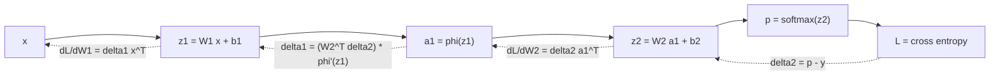

# Matrix Calculus and Gradients

## TL;DR
Backprop is the chain rule applied to matrix-valued functions, plus one bookkeeping rule: **the gradient always has the same shape as the thing it differentiates**. Get four results into muscle memory — $\nabla_x(a^\top x)=a$, $\nabla_x(x^\top Ax)=(A+A^\top)x$, $\partial L/\partial W = \delta\, x^\top$, and $\nabla_z(\text{softmax} + \text{cross-entropy}) = p - y$ — and you can derive any layer's backward pass on a whiteboard.

## Intuition
A gradient is the vector of "if I nudge this knob, how much does the loss move". For a chain of layers, the influence of an early weight on the loss is the product of the sensitivities along the path — that product *is* the chain rule, and it is why gradients vanish or explode when the per-layer factors are consistently below or above 1. Autograd is just this bookkeeping done automatically, but interviewers want to see you do one layer by hand.

## The maths

**Layout convention.** Use the *denominator* (gradient) layout: for scalar $L$ and $W\in\mathbb{R}^{m\times n}$, $\partial L/\partial W \in \mathbb{R}^{m\times n}$. This is what PyTorch gives you and it makes SGD's $W \leftarrow W - \eta\,\partial L/\partial W$ shape-legal by construction. If a derivation produces the wrong shape, transpose — the shape check is a genuine correctness test.

**Jacobian.** For $f:\mathbb{R}^n\to\mathbb{R}^m$, $J\in\mathbb{R}^{m\times n}$ with $J_{ij}=\partial f_i/\partial x_j$. The chain rule for composed maps is $J_{f\circ g}(x) = J_f(g(x))\,J_g(x)$.

**Core identities (memorise these).** With $a, x \in \mathbb{R}^n$, $A\in\mathbb{R}^{n\times n}$:

$$
\begin{aligned}
\nabla_x\,(a^\top x) &= a \\
\nabla_x\,(x^\top A x) &= (A + A^\top)x \;=\; 2Ax \text{ if } A=A^\top \\
\nabla_x\,\lVert x\rVert_2^2 &= 2x \\
\nabla_W\,(Wx) &\text{ contracted with upstream } \delta:\quad \frac{\partial L}{\partial W} = \delta\,x^\top \\
\nabla_x\,(Wx) &\text{ contracted with upstream } \delta:\quad \frac{\partial L}{\partial x} = W^\top\delta \\
\nabla_W\,\lVert Xw-y\rVert_2^2 &= 2X^\top(Xw-y)
\end{aligned}
$$

The last one gives the normal equations immediately — see [[linear-algebra-essentials]].

**Why $\partial L/\partial W = \delta x^\top$.** With $z = Wx$, $z_i = \sum_k W_{ik}x_k$, so $\partial z_i/\partial W_{ij} = x_j$ when $i$ matches and $0$ otherwise. Then

$$
\frac{\partial L}{\partial W_{ij}} = \sum_i \frac{\partial L}{\partial z_i}\frac{\partial z_i}{\partial W_{ij}} = \delta_i x_j \quad\Longrightarrow\quad \frac{\partial L}{\partial W} = \delta x^\top,
$$

an outer product: $(m\times1)(1\times n) = m\times n$, the shape of $W$. For a batch $X\in\mathbb{R}^{B\times n}$ with upstream $\Delta\in\mathbb{R}^{B\times m}$, it becomes $\partial L/\partial W = \Delta^\top X$ and $\partial L/\partial b = \Delta^\top \mathbf{1}$ (sum over the batch).

**Element-wise activations.** For $a = \phi(z)$ applied element-wise, the Jacobian is diagonal, so the chain rule collapses to a Hadamard product:

$$
\frac{\partial L}{\partial z} = \frac{\partial L}{\partial a}\odot \phi'(z).
$$

For sigmoid, $\sigma'(z)=\sigma(z)(1-\sigma(z)) \le 0.25$ — the factor that causes vanishing gradients in deep sigmoid stacks. For ReLU, $\phi'(z)=\mathbb{1}[z>0]$, a pass-through gate.

**Softmax + cross-entropy — the derivation interviewers ask for.** Let $z\in\mathbb{R}^K$ be logits, $p_i = e^{z_i}/\sum_k e^{z_k}$, and $L = -\sum_i y_i\log p_i$ for one-hot $y$.

Softmax Jacobian:

$$
\frac{\partial p_i}{\partial z_j} = p_i(\delta_{ij} - p_j),
$$

where $\delta_{ij}$ is the Kronecker delta. Then

$$
\begin{aligned}
\frac{\partial L}{\partial z_j}
&= -\sum_i \frac{y_i}{p_i}\frac{\partial p_i}{\partial z_j}
= -\sum_i \frac{y_i}{p_i}\,p_i(\delta_{ij}-p_j) \\
&= -\sum_i y_i(\delta_{ij}-p_j)
= -y_j + p_j\sum_i y_i
= p_j - y_j ,
\end{aligned}
$$

using $\sum_i y_i = 1$. So

$$
\boxed{\;\nabla_z L = p - y\;}
$$

The $1/p_i$ from the log and the $p_i$ from the softmax cancel exactly. That cancellation is the whole point: the gradient is bounded, never saturates, and is linear in the error. Pair softmax with anything other than cross-entropy (MSE, say) and you reintroduce a $p(1-p)$ factor that goes to zero on confidently-wrong predictions — the model stops learning precisely where it is most wrong. The binary case gives $\partial L/\partial z = \sigma(z) - y$, identically.

**Numerical stability.** Compute softmax as $e^{z_i - \max_k z_k}/\sum_k e^{z_k-\max}$, and use `log_softmax` + NLL (or `CrossEntropyLoss` on raw logits) rather than `log(softmax(z))`. Framework losses take logits for exactly this reason.

**Two-layer backprop, end to end.** $z_1 = W_1x + b_1$, $a_1 = \phi(z_1)$, $z_2 = W_2a_1+b_2$, $p=\mathrm{softmax}(z_2)$, $L=\mathrm{CE}(p,y)$:

$$
\begin{aligned}
\delta_2 &= p - y \\
\partial L/\partial W_2 &= \delta_2 a_1^\top, \qquad \partial L/\partial b_2 = \delta_2 \\
\delta_1 &= (W_2^\top\delta_2)\odot\phi'(z_1) \\
\partial L/\partial W_1 &= \delta_1 x^\top, \qquad \partial L/\partial b_1 = \delta_1
\end{aligned}
$$

Every deep net is this pattern repeated. Memory cost: you must cache $x$ and $a_1$ for the backward pass — that is why activations, not weights, dominate training memory, and why gradient checkpointing trades recomputation for memory.

**Reverse-mode vs forward-mode.** Reverse mode costs one forward plus roughly one backward pass regardless of the number of parameters, but is proportional to the number of *outputs*. Since ML has one scalar loss and billions of parameters, reverse mode wins overwhelmingly. Forward mode costs one pass per input dimension, useful only when inputs are few.

## Diagram



## Code

```python
import numpy as np

rng = np.random.default_rng(0)

def softmax(z):
    z = z - z.max(axis=-1, keepdims=True)      # stability
    e = np.exp(z)
    return e / e.sum(axis=-1, keepdims=True)

# 1. Verify dL/dz == p - y against a finite-difference gradient
K = 5
z = rng.normal(size=K)
y = np.zeros(K); y[2] = 1.0

def loss(z):
    return -(y * np.log(softmax(z) + 1e-12)).sum()

analytic = softmax(z) - y
eps = 1e-6
numeric = np.array([(loss(z + eps * np.eye(K)[i]) - loss(z - eps * np.eye(K)[i])) / (2 * eps)
                    for i in range(K)])
print(np.max(np.abs(analytic - numeric)))          # ~1e-9

# 2. Verify grad of x^T A x == (A + A^T) x  for a NON-symmetric A
A = rng.normal(size=(4, 4))
x = rng.normal(size=4)
analytic = (A + A.T) @ x
numeric = np.array([( (x + eps*np.eye(4)[i]) @ A @ (x + eps*np.eye(4)[i])
                    - (x - eps*np.eye(4)[i]) @ A @ (x - eps*np.eye(4)[i])) / (2*eps)
                    for i in range(4)])
print(np.max(np.abs(analytic - numeric)))          # ~1e-8

# 3. Full two-layer backprop from scratch, gradient-checked
B, n, h, K = 8, 6, 5, 3
X = rng.normal(size=(B, n))
Y = np.eye(K)[rng.integers(0, K, size=B)]
W1, b1 = rng.normal(size=(n, h)) * .5, np.zeros(h)
W2, b2 = rng.normal(size=(h, K)) * .5, np.zeros(K)

def forward(W1, b1, W2, b2):
    z1 = X @ W1 + b1
    a1 = np.maximum(z1, 0)                      # ReLU
    z2 = a1 @ W2 + b2
    P = softmax(z2)
    L = -(Y * np.log(P + 1e-12)).sum() / B
    return L, (z1, a1, P)

L, (z1, a1, P) = forward(W1, b1, W2, b2)
d2 = (P - Y) / B                                # (B, K)
gW2, gb2 = a1.T @ d2, d2.sum(0)
d1 = (d2 @ W2.T) * (z1 > 0)                     # (B, h)
gW1, gb1 = X.T @ d1, d1.sum(0)

# numeric check on one entry of W1
i, j = 2, 3
W1p = W1.copy(); W1p[i, j] += eps
W1m = W1.copy(); W1m[i, j] -= eps
num = (forward(W1p, b1, W2, b2)[0] - forward(W1m, b1, W2, b2)[0]) / (2 * eps)
print(gW1[i, j], num)                            # match to ~1e-8
```

```python
# Same check with PyTorch autograd, if available
import torch
z = torch.randn(4, 5, requires_grad=True)
target = torch.tensor([0, 2, 1, 4])
loss = torch.nn.functional.cross_entropy(z, target, reduction="sum")
loss.backward()
p = torch.softmax(z, dim=1)
onehot = torch.nn.functional.one_hot(target, 5).float()
print(torch.allclose(z.grad, p - onehot, atol=1e-6))   # True
```

## In practice
- **Use it when:** writing a custom layer or loss, debugging a training run that will not converge, explaining vanishing gradients, or reasoning about training memory.
- **Defaults that work:** never hand-write a backward pass in production — use autograd and validate with `torch.autograd.gradcheck` (in float64) when you do write one. Always pass **logits** to `CrossEntropyLoss` / `BCEWithLogitsLoss`, never post-softmax probabilities.
- **Breaks when:** the function is non-differentiable at points you actually hit (ReLU at 0 — frameworks pick a subgradient, fine), or when you have in-place ops that clobber values the backward pass needs, or when gradient magnitudes underflow in fp16 (hence loss scaling — see [[mixed-precision-and-memory]]).
- **Cost / latency:** the backward pass is roughly 2× the forward pass in FLOPs, so training a step costs about 3× inference on the same batch. Activation memory scales with batch × sequence × width × depth, which is why checkpointing recomputes activations to trade ~30% extra compute for a large memory saving.

## Interview angle

**Q. Derive the gradient of cross-entropy with respect to the logits for a softmax output.**
Give the derivation above: softmax Jacobian $\partial p_i/\partial z_j = p_i(\delta_{ij}-p_j)$, substitute into $\partial L/\partial z_j = -\sum_i (y_i/p_i)\,\partial p_i/\partial z_j$, the $p_i$ cancels, $\sum_i y_i = 1$, and you get $p - y$. Then say *why it matters*: the gradient is bounded and does not saturate, so a confidently wrong prediction produces a large, clean learning signal.

**Follow-up.** *What happens if you use MSE with a softmax output instead?* → The cancellation disappears and the gradient picks up a $p_i(1-p_i)$ factor, which is near zero when the model is confidently wrong. Learning stalls exactly where you need it most. This is the standard "why does cross-entropy pair with softmax" answer.

**Q. Why does $\partial L/\partial W$ come out as an outer product $\delta x^\top$?**
Because each weight $W_{ij}$ touches exactly one output unit $z_i$ and is multiplied by exactly one input $x_j$, so the partial is $\delta_i x_j$. Stacking over $i,j$ is the outer product, which is automatically the shape of $W$ — the shape check confirms the derivation.

**Q. Explain vanishing gradients in terms of the chain rule.**
Backprop multiplies per-layer Jacobians. For element-wise activations the factor is $\phi'(z)$; for sigmoid that is at most $0.25$, so ten layers give a factor of at most $0.25^{10}\approx 10^{-6}$ before weights are even considered. Early layers stop learning. Fixes attack the multiplicative chain directly: ReLU-family activations ($\phi'=1$ on the positive side), residual connections (which add an identity path so the Jacobian is $I + \text{something}$), and normalisation layers that keep pre-activations in the non-saturating region.

**Follow-up.** *And exploding gradients?* → Same mechanism with per-layer factors above 1, common in RNNs over long sequences. Fix with global-norm gradient clipping and careful initialisation — see [[weight-initialization]].

**Q. Why is reverse-mode autodiff the right choice for deep learning?**
The cost of reverse mode is proportional to the number of outputs (one scalar loss), not the number of parameters; one backward pass produces all billions of gradients at roughly 2× forward cost. Forward mode costs one pass per input dimension, which would be catastrophic here. The price of reverse mode is memory: you must store intermediate activations for the backward pass.

**Q. Your custom layer trains but slowly. How do you confirm the gradient is right?**
Gradient check: compare the analytic gradient against a central finite difference $(f(x+\epsilon)-f(x-\epsilon))/2\epsilon$ in float64 with $\epsilon\approx10^{-6}$, on a handful of random coordinates, using relative error $\lvert a-n\rvert/\max(\lvert a\rvert,\lvert n\rvert,10^{-8})$ below about $10^{-6}$. Do it on a tiny random input with a smooth activation — ReLU's kink makes finite differences unreliable exactly at zero.

## Traps
- **Shape sloppiness.** If your gradient is not the shape of the parameter, it is wrong. Do the shape check before the algebra check.
- **Confusing $\odot$ with matrix multiply.** Element-wise activation derivatives produce Hadamard products. Using `@` where you need `*` gives a wrong answer that may still have a valid shape when the matrices are square.
- **Applying softmax twice.** Passing probabilities into `CrossEntropyLoss` (which applies log-softmax internally) is one of the most common silent bugs in PyTorch code — the model trains, just badly.
- **"The gradient points to the minimum."** It points in the direction of steepest *local* increase; the negative gradient is a descent direction, which is not the same as pointing at the optimum unless the level sets are spherical. This is why ill-conditioning makes plain GD zig-zag — see [[gradient-descent-variants]].
- **Numeric gradient checks in float32.** Catastrophic cancellation in the subtraction swamps the signal. Use float64.
- **Forgetting to divide by batch size consistently.** If your forward averages over the batch but your backward sums, your effective learning rate is off by a factor of $B$.
- **"Non-differentiable means autograd fails."** ReLU at exactly 0, `max`, and `abs` all work fine — frameworks return a valid subgradient. Genuinely blocking operations are `argmax`, sampling, and hard thresholds, which need straight-through estimators or a policy-gradient formulation.

## Flashcards
What is $\nabla_x (x^\top A x)$?::$(A + A^\top)x$, which is $2Ax$ when $A$ is symmetric.
Given upstream $\delta = \partial L/\partial z$ for $z = Wx$, what are the two backward results?::$\partial L/\partial W = \delta x^\top$ and $\partial L/\partial x = W^\top\delta$.
Gradient of cross-entropy w.r.t. softmax logits?::$p - y$.
Why does softmax pair with cross-entropy?::The $1/p$ from the log cancels the $p$ from the softmax Jacobian, giving a bounded non-saturating gradient $p-y$.
Chain rule for an element-wise activation $a=\phi(z)$?::$\partial L/\partial z = (\partial L/\partial a)\odot\phi'(z)$ — the Jacobian is diagonal.
Maximum value of the sigmoid derivative?::$0.25$, at $z=0$ — the source of vanishing gradients in deep sigmoid stacks.
Why is reverse-mode autodiff preferred over forward mode in ML?::Its cost scales with the number of outputs (one scalar loss), not the number of parameters.
How do you gradient-check a custom layer?::Central finite differences in float64 with $\epsilon\approx10^{-6}$, compare relative error against the analytic gradient.
Softmax Jacobian entry $\partial p_i/\partial z_j$?::$p_i(\delta_{ij} - p_j)$.

## Related
[[backpropagation]] · [[linear-algebra-essentials]] · [[gradient-descent-variants]] · [[loss-functions]] · [[vanishing-and-exploding-gradients]] · [[activation-functions]] · [[convexity-and-optimization-basics]] · [[mixed-precision-and-memory]] · [[moc-maths]]
