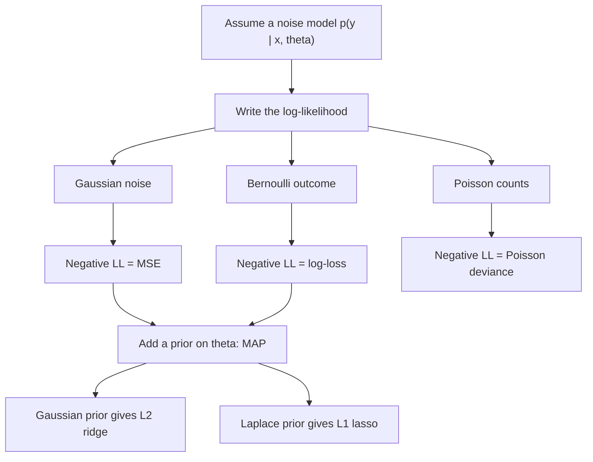

# Maximum Likelihood Estimation

## TL;DR
MLE picks the parameters that make the observed data most probable: maximise
$\prod_i p(x_i\mid\theta)$, equivalently minimise the negative log-likelihood. Almost every loss
function you use is an NLL in disguise — MSE is the Gaussian one, log-loss is the Bernoulli one. Add
a prior and you get MAP, which is exactly where L2 and L1 regularisation come from.

## Intuition
Turn the question around. The data are fixed; the parameter is the knob. For each setting of the
knob, ask "how probable was what I actually saw?" and keep the setting that scores highest. The
likelihood is not a probability distribution over $\theta$ — it is a *function* of $\theta$ with the
data nailed down. That distinction is the whole frequentist/Bayesian fault line.

## The maths

**Setup.** Data $x_1,\dots,x_n$ i.i.d. from $p(\cdot\mid\theta)$. The likelihood and log-likelihood:

$$
L(\theta)=\prod_{i=1}^n p(x_i\mid\theta),
\qquad
\ell(\theta)=\sum_{i=1}^n \log p(x_i\mid\theta)
$$

$\hat\theta_{\text{MLE}}=\arg\max_\theta \ell(\theta)$. Logs because products underflow, sums
differentiate cleanly, and $\log$ is monotone so the argmax is unchanged.

### Derivation 1 — Bernoulli

$y_i\in\{0,1\}$, $P(y=1)=p$. Then $p(y_i\mid p)=p^{y_i}(1-p)^{1-y_i}$ and

$$
\ell(p)=\sum_i\big[y_i\log p+(1-y_i)\log(1-p)\big]
$$

$$
\frac{d\ell}{dp}=\frac{\sum_i y_i}{p}-\frac{n-\sum_i y_i}{1-p}=0
\;\Longrightarrow\;
\hat p=\frac{1}{n}\sum_i y_i=\bar y
$$

The MLE of a coin's bias is the sample proportion. Note $-\ell(p)$ **is** binary cross-entropy.

### Derivation 2 — Gaussian

$x_i\sim\mathcal{N}(\mu,\sigma^2)$:

$$
\ell(\mu,\sigma^2)=-\frac{n}{2}\log(2\pi\sigma^2)-\frac{1}{2\sigma^2}\sum_i (x_i-\mu)^2
$$

$$
\frac{\partial\ell}{\partial\mu}=\frac{1}{\sigma^2}\sum_i(x_i-\mu)=0 \;\Rightarrow\; \hat\mu=\bar x
$$

$$
\frac{\partial\ell}{\partial\sigma^2}=-\frac{n}{2\sigma^2}+\frac{1}{2\sigma^4}\sum_i(x_i-\hat\mu)^2=0
\;\Rightarrow\;
\hat\sigma^2=\frac1n\sum_i(x_i-\bar x)^2
$$

Divide by $n$, not $n-1$ — **the Gaussian variance MLE is biased low**. MLE is consistent and
asymptotically efficient, but not generally unbiased, and this is the standard example.

### The bridge: MSE = Gaussian MLE

Model $y_i=f_\theta(x_i)+\varepsilon_i$ with $\varepsilon_i\sim\mathcal{N}(0,\sigma^2)$, $\sigma$
fixed and known. Then

$$
-\ell(\theta)=\frac{n}{2}\log(2\pi\sigma^2)+\frac{1}{2\sigma^2}\sum_i\big(y_i-f_\theta(x_i)\big)^2
$$

The first term is constant in $\theta$ and the second is $\frac{1}{2\sigma^2}\times$ the sum of
squared errors. **Minimising MSE is exactly maximum likelihood under Gaussian noise of constant
variance.** So squared error is not a neutral choice: it encodes symmetric, thin-tailed,
homoscedastic errors. Heavy-tailed residuals? Laplace noise gives MAE. Count data? Poisson gives the
deviance loss. That is the whole logic of [[generalized-linear-models]].

### The bridge: log-loss = Bernoulli MLE

With $\hat p_i=\sigma(\mathbf{w}^\top\mathbf{x}_i)$,

$$
-\ell(\mathbf{w})=-\sum_i\big[y_i\log\hat p_i+(1-y_i)\log(1-\hat p_i)\big]
$$

which is binary cross-entropy. Differentiating and using $\sigma'(z)=\sigma(z)(1-\sigma(z))$:

$$
\nabla_\mathbf{w}(-\ell)=\sum_i (\hat p_i-y_i)\,\mathbf{x}_i = X^\top(\hat{\mathbf{p}}-\mathbf{y})
$$

The same $\hat y - y$ residual form as linear regression — that is not a coincidence, it is the
canonical-link property of the exponential family. There is no closed form, so you use IRLS or
gradient descent; see [[logistic-regression]].

### MAP — where regularisation comes from

Put a prior $p(\theta)$ on the parameters and maximise the posterior:

$$
\hat\theta_{\text{MAP}}=\arg\max_\theta \big[\ell(\theta)+\log p(\theta)\big]
$$

**Gaussian prior $\theta_j\sim\mathcal{N}(0,\tau^2)$:**

$$
\log p(\theta)=-\frac{1}{2\tau^2}\sum_j\theta_j^2+\text{const}
\;\Longrightarrow\;
\min_\theta \ \|y-X\theta\|^2+\lambda\|\theta\|_2^2,
\quad \lambda=\frac{\sigma^2}{\tau^2}
$$

**Ridge is MAP with a Gaussian prior.**

**Laplace prior $p(\theta_j)\propto e^{-|\theta_j|/b}$:**

$$
\min_\theta \ \|y-X\theta\|^2+\lambda\|\theta\|_1
$$

**Lasso is MAP with a Laplace prior.** The Laplace density has a kink at zero, which is precisely why
the L1 solution sets coefficients exactly to zero while the smooth Gaussian prior only shrinks them
— see [[regularization-l1-l2]].

Two things fall out immediately:
- $\lambda=\sigma^2/\tau^2$: more noise or a tighter prior belief means more shrinkage. Choosing
  $\lambda$ by cross-validation is empirically estimating how strong your prior should have been.
- As $n\to\infty$ the likelihood term grows like $n$ while the prior stays $O(1)$, so MAP → MLE. A
  prior is a finite-sample device.

MAP is still a point estimate — it is the *mode* of the posterior, not the posterior. Full Bayes
integrates instead of maximising; see [[bayesian-inference-basics]].

**Properties of MLE.** Under regularity conditions: consistent ($\hat\theta\to\theta$),
asymptotically normal with
$\sqrt{n}(\hat\theta-\theta)\xrightarrow{d}\mathcal{N}(0, I(\theta)^{-1})$ where
$I(\theta)=-\mathbb{E}[\partial^2\ell/\partial\theta^2]$ is the Fisher information, and
asymptotically efficient (attains the Cramér–Rao bound). Invariant: the MLE of $g(\theta)$ is
$g(\hat\theta)$ — handy, and not true of unbiasedness. Standard errors come from the inverse
Hessian at the optimum, which is how `statsmodels` prints them.

## Diagram



## Code

```python
import numpy as np
from scipy import optimize, stats

rng = np.random.default_rng(0)

# --- Bernoulli MLE is the sample mean ---------------------------------------
y = rng.binomial(1, 0.37, 5_000)
nll_bern = lambda p: -np.sum(y * np.log(p) + (1 - y) * np.log(1 - p))
opt = optimize.minimize_scalar(nll_bern, bounds=(1e-6, 1 - 1e-6), method="bounded")
print("Bernoulli MLE", round(opt.x, 5), " sample mean", round(y.mean(), 5))

# --- Gaussian MLE: mean = x-bar, variance divides by n (biased low) ----------
x = rng.normal(4.0, 2.0, 40)
def nll_gauss(params):
    mu, log_s = params
    return -np.sum(stats.norm.logpdf(x, mu, np.exp(log_s)))
res = optimize.minimize(nll_gauss, [0.0, 0.0])
mu_hat, s_hat = res.x[0], np.exp(res.x[1])
print("mu", round(mu_hat, 4), round(x.mean(), 4),
      "| sigma^2", round(s_hat**2, 4), round(x.var(ddof=0), 4), "vs ddof=1", round(x.var(ddof=1), 4))

bias = np.mean([rng.normal(0, 1, 5).var(ddof=0) for _ in range(100_000)])
print("E[MLE variance] for n=5 =", round(bias, 3), " truth 1.0, expected (n-1)/n = 0.8")

# --- minimising MSE == Gaussian MLE for the same weights --------------------
X = np.c_[np.ones(500), rng.normal(size=(500, 3))]
w_true = np.array([1.0, 2.0, -1.5, 0.5])
yv = X @ w_true + rng.normal(0, 1.5, 500)

w_ols = np.linalg.lstsq(X, yv, rcond=None)[0]
nll_lin = lambda w: -np.sum(stats.norm.logpdf(yv, X @ w, 1.5))
w_mle = optimize.minimize(nll_lin, np.zeros(4)).x
print("OLS", np.round(w_ols, 4), "\nMLE", np.round(w_mle, 4))

# --- minimising log-loss == Bernoulli MLE == sklearn LogisticRegression -----
from sklearn.linear_model import LogisticRegression
z = X @ np.array([0.3, 1.2, -0.8, 0.4])
yb = rng.binomial(1, 1 / (1 + np.exp(-z)))

def nll_logit(w):
    p = 1 / (1 + np.exp(-(X @ w)))
    p = np.clip(p, 1e-9, 1 - 1e-9)
    return -np.sum(yb * np.log(p) + (1 - yb) * np.log(1 - p))

w_hand = optimize.minimize(nll_logit, np.zeros(4)).x
clf = LogisticRegression(C=1e10, max_iter=2000).fit(X[:, 1:], yb)   # C huge ~ no penalty
print("hand-rolled MLE", np.round(w_hand, 3))
print("sklearn        ", np.round(np.r_[clf.intercept_, clf.coef_[0]], 3))

# --- MAP with a Gaussian prior == ridge ------------------------------------
sigma, tau = 1.5, 0.5
lam = sigma**2 / tau**2
map_obj = lambda w: nll_lin(w) + np.sum(w**2) / (2 * tau**2)
w_map = optimize.minimize(map_obj, np.zeros(4)).x
w_ridge = np.linalg.solve(X.T @ X + lam * np.eye(4), X.T @ yv)
print("MAP  ", np.round(w_map, 4))
print("ridge", np.round(w_ridge, 4), " lambda = sigma^2/tau^2 =", lam)
```

Running this once is worth more than reading the derivation twice: the hand-rolled optimiser and
`sklearn` agree to three decimals, and the MAP objective and the ridge normal equation agree exactly.

## In practice
- **Use it when:** you need a principled loss for a new kind of target (counts, durations, censored
  outcomes, ordinal labels) rather than reaching for MSE by reflex.
- **Defaults that work:** always optimise the *negative log*-likelihood, use `logsumexp` for
  normalising constants, parameterise positive quantities as $\log\sigma$ so the optimiser is
  unconstrained (as above), and get standard errors from the inverse Hessian.
- **Breaks when:** the likelihood is unbounded (a Gaussian mixture component can shrink onto a
  single point and drive the likelihood to $\infty$ — regularise or bound the variances); perfect
  separation in logistic regression sends $\|\mathbf{w}\|\to\infty$ and the MLE does not exist,
  which is why sklearn applies L2 by default; small $n$, where MLE's asymptotic guarantees mean
  nothing.
- **Cost / latency:** convex and fast for GLMs. For a deep network the NLL is non-convex, so you get
  a local optimum, and everything asymptotic stops applying — but the loss is still an NLL, which is
  why the model outputs can be read as probabilities at all.

## Interview angle

**Q. Derive the MLE for a Bernoulli.**
$\ell(p)=\sum_i[y_i\log p+(1-y_i)\log(1-p)]$. Set the derivative to zero:
$\frac{k}{p}=\frac{n-k}{1-p}$ with $k=\sum y_i$, giving $\hat p=k/n$. Second derivative is negative
so it is a maximum. And $-\ell$ is precisely binary cross-entropy — the loss and the estimator are
the same object.

**Q. Show that least squares is maximum likelihood.**
Assume $y=f_\theta(x)+\varepsilon$, $\varepsilon\sim\mathcal{N}(0,\sigma^2)$ i.i.d. Then
$-\ell(\theta)=\text{const}+\frac{1}{2\sigma^2}\sum(y_i-f_\theta(x_i))^2$, so the $\theta$ that
minimises SSE maximises the likelihood. The corollary matters more than the result: MSE bakes in an
assumption of symmetric, constant-variance, thin-tailed noise. If residuals are heavy-tailed, the
Laplace likelihood gives MAE and is far more robust.

**Follow-up.** So what does heteroscedasticity do to OLS? → The estimates stay unbiased but are no
longer efficient, and the standard errors are wrong. Fix with weighted least squares
($w_i=1/\sigma_i^2$, which is the correct MLE), robust/HC standard errors, or model the variance
directly.

**Q. MLE vs MAP.**
MLE maximises $p(D\mid\theta)$; MAP maximises $p(D\mid\theta)p(\theta)$. MAP is MLE plus a penalty
equal to the negative log-prior — a Gaussian prior gives L2/ridge, a Laplace prior gives L1/lasso.
Both are point estimates; neither gives you a posterior. As $n$ grows the data term dominates and
MAP converges to MLE.

**Follow-up.** Then why does cross-validated $\lambda$ work at all if the prior is subjective? →
Because $\lambda=\sigma^2/\tau^2$ is just a bias–variance knob. CV picks the shrinkage that
generalises best; you can read that as empirically estimating the prior variance (empirical Bayes)
rather than asserting it.

**Q. Is the MLE unbiased?**
Not in general. The Gaussian variance MLE is $\frac1n\sum(x_i-\bar x)^2$, which underestimates
$\sigma^2$ by the factor $(n-1)/n$ — hence Bessel's correction for an unbiased estimator. What MLE
does guarantee asymptotically is consistency, normality, and efficiency. Unbiasedness is not always
desirable anyway: ridge is deliberately biased and usually has lower MSE.

**Q. Why does L1 give exact zeros and L2 not?**
From the MAP view: the Laplace prior has a non-differentiable spike at zero, so the penalty's
subgradient is a constant $\pm\lambda$ right up to the origin and can hold the solution exactly at
zero whenever the likelihood's pull is smaller than $\lambda$. The Gaussian prior's penalty gradient
$2\lambda\theta$ vanishes as $\theta\to 0$, so it never quite gets there. Geometrically, the L1 ball
has corners on the axes.

**Q. When does the MLE not exist?**
Perfect separation in logistic regression — any scaling of a separating hyperplane increases the
likelihood, so $\|\mathbf{w}\|$ diverges. Symptoms: huge coefficients, enormous standard errors,
convergence warnings. Remedies: any regularisation (which makes MAP well-defined), Firth's penalised
likelihood, or dropping the offending feature — which is often a leakage flag; see [[data-leakage]].

## Traps
- **"The likelihood is the probability of the parameters."** It is the probability of the *data*, read
  as a function of the parameters. It does not integrate to 1 over $\theta$.
- **Reporting the Gaussian MLE variance as unbiased.** It divides by $n$; the unbiased one divides
  by $n-1$.
- **Maximising the likelihood instead of minimising the NLL in code.** Products of thousands of
  densities underflow float64 long before you notice.
- **Assuming MSE is the "default" loss.** It is the Gaussian assumption. For counts, durations or
  skewed monetary targets it is the wrong likelihood, and a log-link Poisson or Gamma GLM is
  usually a strict improvement.
- **Treating MAP as Bayesian inference.** MAP is a mode; it carries no uncertainty and is not even
  invariant to reparameterisation (the mode moves under a change of variables, the mean does not).
- **Ignoring that MLE's guarantees are asymptotic.** With $n=30$ and 15 parameters, nothing about
  efficiency or normality applies.

## Flashcards
Definition of MLE::The θ maximising the likelihood of the observed data; equivalently minimising the negative log-likelihood.
MLE for a Bernoulli::p̂ = ȳ, the sample proportion — and its NLL is exactly binary cross-entropy.
MLE for a Gaussian variance::(1/n)Σ(xᵢ − x̄)², which is biased low; the unbiased version divides by n − 1.
Minimising MSE equals which MLE::Gaussian likelihood with constant known variance — MSE encodes symmetric homoscedastic thin-tailed noise.
Minimising log-loss equals which MLE::Bernoulli / categorical likelihood.
MAP vs MLE::MAP adds log p(θ) to the log-likelihood; it is MLE plus the negative-log-prior as a penalty, and converges to MLE as n grows.
Ridge as MAP::L2 penalty = Gaussian prior on the weights, with λ = σ²/τ².
Lasso as MAP::L1 penalty = Laplace prior; the density's kink at zero produces exact zeros.
Asymptotic properties of MLE::Consistent, asymptotically normal with variance I(θ)⁻¹, and efficient — but not generally unbiased.
Where do MLE standard errors come from::The inverse Fisher information, estimated as the inverse Hessian of the NLL at the optimum.
When does the logistic MLE fail to exist::Perfect separation — the weights diverge; fix with regularisation or Firth's penalty.

## Related
- [[bayesian-inference-basics]]
- [[logistic-regression]]
- [[linear-regression]]
- [[regularization-l1-l2]]
- [[generalized-linear-models]]
- [[loss-functions]]
- [[information-theory-entropy-kl]]
- [[moc-stats]]
