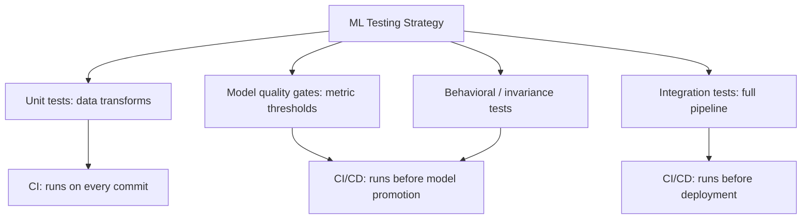

# ML Testing Strategy

## TL;DR
"Testing an ML system" is broader than "testing that the model's accuracy is good enough." You need
four layers: **unit tests** for data transforms (deterministic, standard software testing),
**model quality gates** (metric thresholds a model must clear before promotion), **behavioral/
invariance tests** (does the model respond sensibly to small, meaningful perturbations?), and
**integration tests** for the full pipeline (does raw input actually flow to a correct prediction
end to end?). Skipping any one layer leaves a real class of bugs uncaught.

## Intuition
Testing a bridge isn't just "does it hold the expected traffic load" (the quality gate) — you also
check every individual beam was manufactured correctly (unit tests), that it doesn't collapse if a
truck is 5% heavier than expected (invariance/robustness tests), and that the whole assembled
structure holds together as one system, not just each part in isolation (integration tests).

## The maths
Not maths-heavy, but the useful framing: model quality gates are a hypothesis test in disguise —
"is the challenger's metric distribution significantly and meaningfully better/no-worse than the
threshold," ideally with a confidence interval, not a single point estimate:

$$
H_0: \mu_{\text{metric}} \le \tau \quad \text{vs} \quad H_1: \mu_{\text{metric}} > \tau
$$

Invariance tests formalize a robustness property: for a perturbation function $T$ that shouldn't
change the answer (e.g., $T$ = swap a candidate's name from a male to female name on an otherwise
identical resume-screening input),

$$
f(x) \approx f(T(x)) \quad \text{should hold within tolerance } \epsilon
$$

A significant violation is itself the bug report — you don't need ground truth for $x$ to know
$f(x) \neq f(T(x))$ shouldn't be true.

## Diagram


## Code
Unit test for a data transform — deterministic, fast, standard `pytest`:

```python
import pandas as pd
from features import compute_customer_tenure_days

def test_tenure_computed_correctly():
    df = pd.DataFrame({
        "signup_date": ["2024-01-01"],
        "as_of_date": ["2024-04-01"],
    })
    result = compute_customer_tenure_days(df)
    assert result["tenure_days"].iloc[0] == 91
```

A model quality gate that blocks promotion — this is the kind of check a CI/CD pipeline
([[ci-cd-for-ml]]) runs after training, before touching the registry:

```python
def test_challenger_clears_quality_gate(challenger_metrics: dict):
    assert challenger_metrics["auc"] >= 0.80, "AUC below minimum acceptable threshold"
    assert challenger_metrics["calibration_error"] <= 0.05, "Miscalibrated beyond tolerance"
    assert challenger_metrics["p95_latency_ms"] <= 150, "Too slow for serving SLA"
```

An invariance/perturbation test for a fairness-sensitive model — the prediction shouldn't change
when a protected attribute is swapped on an otherwise identical record:

```python
def test_invariant_to_protected_attribute(model, base_applicant: dict):
    male_score = model.predict_proba(with_gender(base_applicant, "M"))[0][1]
    female_score = model.predict_proba(with_gender(base_applicant, "F"))[0][1]
    assert abs(male_score - female_score) < 0.02, "Model sensitive to protected attribute"
```

An integration test for the full pipeline — raw input to final prediction, catching contract
breaks between stages that unit tests miss:

```python
def test_end_to_end_scoring_pipeline(spark_session):
    raw = spark_session.createDataFrame(SAMPLE_RAW_RECORDS)
    features = build_features(raw)                       # feature engineering stage
    predictions = mlflow.pyfunc.spark_udf(spark_session, MODEL_URI)
    scored = features.withColumn("score", predictions(*FEATURE_COLS))
    assert scored.filter("score IS NULL").count() == 0, "Pipeline produced null scores"
```

## In practice
- **Use it when:** every model that reaches production, without exception — unit tests and
  integration tests are non-negotiable baseline hygiene; behavioral/invariance tests are especially
  important for anything with fairness or safety implications (credit, hiring, medical, content
  moderation).
- **Defaults that work:** unit tests for every feature transform, run on every commit; a quality
  gate baked into the training pipeline's promotion step (a model that doesn't clear it can't be
  registered as a candidate for production); a small, curated invariance test suite covering the
  perturbations you actually care about (not an exhaustive fuzz — targeted, meaningful cases);
  a nightly or pre-deploy integration test on a realistic sample of production-shaped data.
- **Breaks when:** teams treat "the notebook ran without error" as sufficient testing — a
  successful run says nothing about correctness of a feature transform, let alone the model's
  behavior on edge cases.
- **Cost / latency:** unit and integration tests are cheap and fast (seconds to minutes) and belong
  in every CI run; invariance test suites and full quality-gate evaluation can be more expensive
  (running inference across many perturbed examples) — run these at promotion time, not on every
  commit, unless your pipeline is small enough to afford it.

## Interview angle
**Q. What's different about testing an ML pipeline compared to testing regular software, and what
carries over unchanged?**
Unit testing individual functions (a feature transform, a data validation rule) carries over
directly — those are deterministic and testable exactly like regular software. What's new is that
"correctness" for the model itself isn't a boolean pass/fail on a fixed input/output pair — it's a
statistical property (a metric distribution clearing a threshold) that can regress without any code
changing, purely from data drift. That's why ML testing needs quality gates re-evaluated on live/
recent data, not just a one-time test suite frozen at code-review time, and why behavioral tests
matter — you're testing *properties* the model should have (robustness to irrelevant perturbation,
fairness invariance) rather than exact outputs.

**Follow-up.** Give an example of a bug that unit tests would never catch but an integration test
would. → A schema mismatch between the feature engineering stage's output column order and what the
model's signature expects — each stage's unit tests pass individually (the transform function is
correct, the model loads and predicts correctly on its own test input) but wiring them together
silently mismatches columns, producing nonsense scores that only an end-to-end test on realistic
data surfaces.

**Q. Design a test suite for a resume-screening model before it goes into production.**
Unit tests on every feature transform (tenure calculation, skill-extraction parsing). A quality
gate on standard metrics (precision/recall at the operating threshold, calibration) against a
held-out labeled set. Behavioral/invariance tests specifically for protected attributes — the score
shouldn't materially change when name, gender-coded terms, or age-correlated features (graduation
year) are swapped on an otherwise identical resume; this is both a quality and a legal/ethical
requirement (see [[security-and-pii-in-ml]]). An integration test running the full pipeline (PDF
parsing → feature extraction → model → decision) on a realistic sample, checking for silent
failures (nulls, parsing errors) rather than just successful completion.

**Follow-up.** How would you turn the invariance test into an automated CI/CD gate rather than a
one-off audit? → Bake it into the same promotion pipeline as the quality gate — a candidate model
that fails the invariance suite (difference beyond tolerance on paired perturbed examples) is
blocked from promotion exactly like a model that fails the accuracy threshold, with the same
severity, not treated as a separate "nice to have" audit that happens occasionally.

## Traps
- "The model passed all our unit tests" as a complete answer — unit tests validate deterministic
  code, not the model's statistical behavior; conflating the two is a tell that the candidate
  hasn't distinguished testing code from testing a model.
- Running invariance tests as an occasional manual audit instead of an automated CI/CD gate — this
  means regressions ship silently between audits.
- Treating "the pipeline ran end-to-end without an exception" as proof of correctness — a
  successful run with silently wrong values (nulls coerced to zero, a mismatched join producing
  duplicate rows) passes this bar while being badly broken.
- No quality gate at all — a training pipeline that always registers its output model regardless of
  metrics, relying on a human to notice and roll back after the fact.

## Flashcards
What are the four layers of a complete ML testing strategy?::Unit tests for data transforms, model quality gates (metric thresholds), behavioral/invariance tests (perturbation testing), and integration tests for the full pipeline.
Why do model quality gates need re-evaluation on recent data, unlike a typical software test suite?::Model correctness is a statistical property that can regress purely from data drift, with no code change — a test suite frozen at code-review time won't catch that.
What does an invariance/perturbation test check that a standard accuracy metric doesn't?::That the model's output doesn't change unreasonably under a perturbation that shouldn't matter (e.g., swapping a protected attribute) — it needs no ground truth, only the property that f(x) ≈ f(T(x)).
Give an example of a bug integration tests catch that isolated unit tests miss.::A column-order or schema mismatch between the feature engineering stage's output and the model's expected input — each stage passes its own tests but the wiring between them is broken.
Why is "the pipeline ran without an exception" insufficient as a correctness check?::It says nothing about whether values are silently wrong (nulls coerced, mismatched joins) — only that no exception was thrown.
Where should invariance/fairness tests be enforced to actually prevent regressions?::As an automated CI/CD promotion gate alongside the accuracy quality gate, not as an occasional manual audit.

## Related
[[ci-cd-for-ml]]
[[testing-python-code]]
[[data-quality-and-validation]]
[[model-retraining-strategies]]
[[security-and-pii-in-ml]]
