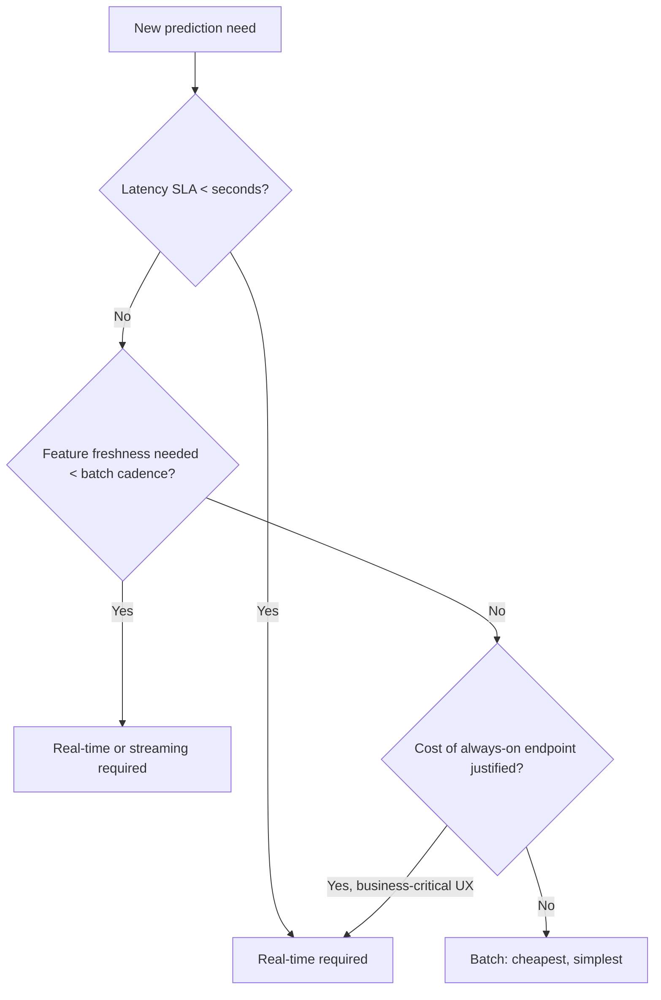

# Batch vs Real-Time Inference

## TL;DR
The choice between batch and real-time inference is a decision framework, not a preference: it
comes down to **latency SLA** (does a decision have to happen within milliseconds of an event?),
**cost** (can you afford always-on compute?), and **feature freshness** (does the prediction need
data from the last few seconds, or is last night's snapshot fine?). Get the framework right and the
architecture follows; guess, and you build the wrong thing at 5x the necessary cost.

## Intuition
Ask: "if this prediction were computed an hour ago instead of right now, would anyone notice or
care?" If no — demand forecasting, monthly churn scores, quarterly customer segmentation — it's
batch. If yes — someone is waiting on this specific answer to act right now (approve this
transaction, rank this search) — it's real-time.

## The maths
Frame it as three questions, each with a concrete threshold:

$$
\text{Latency SLA: } L_{\text{required}} \ \text{vs} \ L_{\text{batch pipeline}} \ (\text{typically hours})
$$
$$
\text{Freshness: } \Delta t_{\text{max acceptable staleness}} \ \text{vs} \ \Delta t_{\text{batch cadence}}
$$
$$
\text{Cost: } C_{\text{always-on endpoint}} \ \text{vs} \ C_{\text{scheduled job}} \times \frac{1}{\text{utilization}}
$$

If $L_{\text{required}}$ is on the order of seconds or less, batch is disqualified outright — no
batch pipeline delivers sub-second turnaround. If $\Delta t_{\text{max}}$ is smaller than any
practical batch cadence, same conclusion. Only when both tolerate slack does cost get to be the
tiebreaker, and cost almost always favors batch (no idle provisioned compute, better hardware
utilization from vectorized scoring over millions of rows at once).

## Diagram


## Code
The decision itself isn't code, but the two extremes look like this in a Databricks/PySpark shop.

Batch — demand forecasting, scored nightly for next-day planning:

```python
# Runs as a scheduled Databricks Job, no latency pressure
forecast_udf = mlflow.pyfunc.spark_udf(spark, model_uri="models:/demand_forecast/Production")
(
    spark.read.table("prod.silver.store_sku_daily")
    .withColumn("forecast_units", forecast_udf(*feature_cols))
    .write.mode("overwrite").saveAsTable("prod.gold.demand_forecast_next7d")
)
```

Real-time — fraud detection, scored per-transaction with a 100ms budget:

```python
@app.post("/score-transaction")
def score(txn: TransactionRequest):
    features = feature_store.get_online_features(txn.card_id, txn.merchant_id)  # sub-10ms lookup
    score = model.predict(features)
    return {"block": score > THRESHOLD, "score": score}
```

## In practice
- **Use it when:** batch for anything where "as of last night" is an acceptable answer and volume
  is large (score the whole customer base); real-time for anything gating a user-facing decision
  in the moment (approve/deny, rank now, recommend now).
- **Defaults that work:** start with batch unless a concrete product requirement forces real-time —
  it's cheaper to build, cheaper to run, and far easier to validate (you can inspect the whole
  scored table before it's used, unlike a live endpoint).
- **Breaks when:** a batch system gets pressed into a near-real-time role by shortening the cron
  interval — you pay increasing overhead (job startup cost, small-file writes) without ever reaching
  true low latency; that's the sign you actually need streaming or online serving, not "batch but
  faster."
- **Cost / latency:** real-time endpoints require provisioned (or serverless-with-cold-start)
  compute running continuously — cost scales with uptime, not just usage; batch cost scales with
  data volume and compute-time, and idles at zero between runs.

### Two worked examples
- **Fraud detection → real-time.** A transaction must be approved or blocked within the payment
  authorization window (typically under a few hundred milliseconds end-to-end). Any staleness in
  fraud signal (this exact transaction, this exact device fingerprint) directly costs money —
  either fraud losses (too slow/lenient) or false declines (too aggressive). This is the textbook
  case for online serving with a low-latency online feature store.
- **Demand forecasting → batch.** A retailer forecasting SKU-level demand for next week's inventory
  planning needs the forecast once a day (or once a week), consumed by downstream planning systems
  that themselves run on daily/weekly cycles. There is no product moment where "give me this
  forecast in the next 200ms" matters — running it as a nightly Spark job against the full
  medallion-architecture gold table is strictly cheaper and easier to validate than standing up an
  endpoint nobody needs to hit synchronously.

## Interview angle
**Q. Walk me through how you'd decide batch vs real-time for a new use case, without me telling
you the answer.**
Start with the latency SLA the product actually needs — ask "what happens if this prediction is an
hour stale?" If the answer is "nothing, we'd never notice," batch is very likely correct and you
default to it for cost and simplicity. If the answer is "the user is staring at a blank screen" or
"we lose money on this specific transaction," real-time is required regardless of cost. Freshness
of the input features is the second filter — even a "real-time" request is only as good as its
features; if the features themselves only update daily, serving in real-time buys you nothing.
Cost is the tiebreaker only after latency and freshness have ruled real-time in or out.

**Follow-up.** The product team says "we want real-time" but the SLA is actually "within the hour."
What do you do? → Push back with the framework: an hourly SLA is comfortably served by a
15–30 minute micro-batch or streaming job at a fraction of the cost and operational burden of a
true real-time endpoint — "real-time" as a stated requirement often means "fast enough," not literally
sub-second, and it's your job to find out which.

**Q. Give an example where you'd deliberately choose real-time even though the model is expensive
to serve.**
A search/ranking model where re-ranking has to happen per query, on the fly, because the candidate
set and user context are only known at request time — you can't pre-compute rankings for every
possible query. Here freshness of context (this specific query, this specific user session) forces
real-time regardless of the cost of running a heavier model per request; the response is to
optimize the model (distillation, quantization, see [[cost-optimization-for-ml]]) rather than move
it to batch, because batch simply can't answer the question being asked.

**Q. How does feature freshness interact with this decision independently of latency?**
Even a request that can tolerate a 5-second response might still require real-time serving if the
input features change every second and staleness of even a few minutes materially changes the
correct answer (e.g., live inventory levels, live bid prices). Latency and freshness are separate
axes — a slow real-time system and a fast batch system can both fail the same use case for
different reasons.

## Traps
- Answering "always real-time, it's more impressive" — interviewers read this as not having
  actually shipped anything, since real cost pressure in production always pushes you toward batch
  wherever the product allows it.
- Ignoring feature freshness and reasoning purely on request latency — a real-time endpoint serving
  yesterday's batch-computed features is not actually "real-time" in any way that matters.
- Treating "streaming" and "real-time" as synonyms — streaming is about continuous processing of
  unbounded data with bounded per-record latency; real-time/online serving is about request-response
  latency for a single query. They often combine but are different axes.
- Not naming cost as a real factor — an answer that never mentions "and this is more expensive to
  run 24/7" reads as inexperienced.

## Flashcards
What three factors drive the batch vs real-time decision?::Latency SLA, feature freshness requirement, and cost of always-on compute vs scheduled compute.
Why is demand forecasting almost always a batch problem?::The consuming systems (inventory planning) run on daily/weekly cycles themselves, so no product moment needs a forecast faster than a scheduled job can deliver, and batch is far cheaper.
Why is fraud detection almost always a real-time problem?::The approve/deny decision must happen within the payment authorization window (sub-second to low hundreds of ms), and any staleness directly costs money.
What's wrong with shortening a batch job's cron interval to fake real-time?::You pay increasing per-run overhead without ever reaching true low latency, and you still don't get proper handling of unbounded/continuous or late-arriving data — that's a sign you need streaming or online serving instead.
Why can feature freshness force real-time serving even when response latency tolerance is loose?::If the underlying features change faster than the batch cadence updates them, even a slow-tolerant request gets a stale, wrong answer unless features are computed or looked up freshly.
When should cost be the deciding factor between batch and real-time?::Only after latency SLA and freshness requirements have both been checked and both tolerate slack — cost is the tiebreaker, not the first filter.

## Related
[[model-serving-patterns]]
[[feature-stores]]
[[latency-and-throughput-budgets]]
[[cost-optimization-for-ml]]
[[case-fraud-detection]]
[[case-demand-forecasting]]
