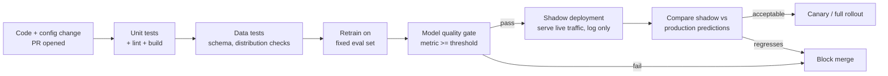

# CI/CD for ML

## TL;DR
CI/CD for ML keeps everything traditional CI/CD checks (unit tests, linting, build)
and adds a second layer that traditional software doesn't need: data tests and model
quality gates, because a change can be "correct code" and still ship a worse model.
Shadow deployment — running the new model on live traffic without serving its
predictions — is the pre-prod gate that catches what offline evaluation can't.

## Intuition
Shipping a web service change: does the code compile, do the unit tests pass, does it
not crash — pass those and you ship. Shipping a model change: all of that, plus "is
the *model itself* actually better," which no unit test can answer, because model
quality is a statistical property of predictions over a distribution, not a
deterministic function you can assert equal to an expected value.

## The maths
Not a derivation, but the structural distinction worth stating precisely: a
traditional CI gate checks a deterministic property —

$$
\text{test passes} \iff f(\text{input}) = \text{expected output}
$$

A model quality gate checks a statistical property over a held-out distribution —

$$
\text{gate passes} \iff \hat{\theta}(\text{metric over } D_{\text{holdout}}) \ge \tau
$$

where $\hat{\theta}$ is itself an estimate with sampling variance. This means a model
CI gate needs to account for the noise in $\hat{\theta}$ (is a 0.3-point AUC
improvement real or within the confidence interval of holdout-set noise?) in a way a
traditional unit test — which has zero variance by design — never has to.

## Diagram


## Code
```python
# A minimal model-quality CI gate, the kind that runs after a training job
# inside a CI pipeline (GitHub Actions / Databricks Workflows job on PR).

import mlflow
from scipy import stats

def model_quality_gate(candidate_metrics: dict, baseline_metrics: dict,
                        min_improvement: float = -0.005) -> bool:
    """Fail the build if the candidate is worse than baseline beyond noise tolerance."""
    delta = candidate_metrics["auc"] - baseline_metrics["auc"]
    return delta >= min_improvement  # allow tiny regressions within noise, block real ones

def data_test_schema(df, expected_schema: dict) -> bool:
    actual = {f.name: f.dataType.simpleString() for f in df.schema.fields}
    return all(actual.get(col) == dtype for col, dtype in expected_schema.items())

def data_test_distribution(df, column: str, expected_mean: float, tolerance: float) -> bool:
    observed_mean = df.agg({column: "mean"}).collect()[0][0]
    return abs(observed_mean - expected_mean) <= tolerance

# CI job pseudocode:
# 1. run data_test_schema + data_test_distribution against the training table
# 2. train candidate model, log to MLflow
# 3. compare candidate_metrics vs current-production baseline via model_quality_gate
# 4. only on pass: deploy to shadow, and require a second, separate gate on
#    shadow-vs-production prediction agreement before canary rollout
```

## In practice
- **Use it when:** any model change — retraining on new data, a feature pipeline
  change, a hyperparameter change, a new model architecture — before it reaches
  production, the same discipline applied to any code change plus the ML-specific
  layer on top.
- **Defaults that work:** run data tests (schema, null rates, distribution sanity)
  before spending compute on a full retrain, same fail-fast principle as
  [[training-pipelines]]; gate merges/promotions on a model quality metric compared
  against the current production baseline, not an absolute number, since "good
  enough" is relative to what's already shipped; use shadow deployment for any
  change with real business risk — it catches issues offline eval can't (real
  traffic distribution, real latency, real downstream interactions) without exposing
  users to it.
- **Breaks when:** teams treat "unit tests pass" as sufficient for an ML change —
  code correctness and model quality are orthogonal; code can be bug-free and still
  ship a model that's meaningfully worse on the metric that matters, which is exactly
  what a model quality gate exists to catch and a unit test suite structurally
  cannot.
- **Cost / latency:** shadow deployment costs double the inference compute (both
  models score every request) for the shadow period, plus engineering effort to log
  and compare predictions — worth it for high-stakes changes, often skipped (in
  favor of a canary with a small traffic percentage instead) for low-risk, frequent
  retrains.

## Interview angle
**Q. What's different about CI/CD for ML compared to traditional software CI/CD?**
Traditional CI/CD checks deterministic correctness — does the code do what it's
supposed to, verified by unit/integration tests with a fixed expected output. ML adds
a layer that's inherently statistical: data tests (is the input data still shaped and
distributed the way training assumed) and model quality gates (is the retrained
model's performance, measured with sampling variance, actually at or above the
current production baseline) — neither has a deterministic pass/fail the way a unit
test assertion does.

**Follow-up.** How do you build a model quality gate that accounts for the fact that
holdout metrics have sampling noise? → Don't gate on "candidate beats baseline by any
margin" — require an improvement beyond a tolerance informed by the eval set's
variance (e.g. bootstrap a confidence interval on the metric difference, or use a
fixed noise-tolerance margin derived from historical run-to-run variance on an
unchanged pipeline), so you're not blocking merges over noise or shipping regressions
that look like noise-level "no change."

**Q. What is shadow deployment and what does it catch that offline evaluation
can't?**
Shadow deployment runs the new model on live production traffic in parallel with the
current production model, logging its predictions without ever serving them to
users. It catches discrepancies between the offline holdout distribution and the
real, current production traffic distribution — feature pipeline bugs that only
manifest on real traffic shapes, latency regressions under real load, and
interactions with downstream systems that a static holdout set can't reveal, all
without any user-facing risk since predictions aren't served.

**Follow-up.** What's the difference between shadow deployment and canary
deployment, and when would you use each? → Shadow serves zero real traffic from the
new model (pure comparison, no risk, but also no way to observe real business-metric
impact); canary serves a small percentage of real traffic from the new model (real
risk, but real signal on business metrics, not just prediction agreement). Use shadow
first to catch structural issues cheaply, then canary to validate actual outcome
impact before full rollout — see [[shadow-and-canary-deployment]].

**Q. Why can't a model quality gate be a simple equality assertion like a typical
unit test?**
Because model output on a holdout set is a statistical estimate of a metric over a
distribution, not a single deterministic value — the same code, same data, and a
different random seed or slightly different eval-set sample can shift the measured
metric by a nontrivial amount even with no real quality change. Gating on exact
equality (or a threshold with zero tolerance) either blocks legitimate no-op merges
constantly (false positives from noise) or, if the tolerance is set too loose, lets
real regressions slip through as "within variance."

## Traps
- Treating "unit tests pass, deploy" as adequate for a model change — this is the
  fastest way to ship a code-correct, quality-regressed model, since nothing in a
  standard test suite measures statistical model quality.
- Setting a model quality gate threshold with zero tolerance for noise — this either
  blocks harmless variance-driven fluctuations constantly (teams learn to ignore or
  bypass the gate) or, if set too loosely to avoid that, lets real regressions
  through disguised as "noise."
- Skipping shadow deployment for "just a small retrain" — small changes are exactly
  where subtle feature-pipeline or distribution issues hide, because they're not
  scrutinized as carefully as a big architecture change would be.
- Comparing a candidate model only against a fixed historical benchmark rather than
  the *current* production model — the right comparison for a promotion decision is
  "better than what's live now," not "better than some number from six months ago."

## Flashcards
What does a model quality gate check that a standard unit test can't?::A statistical property (a metric over a holdout distribution, with sampling variance) rather than a deterministic equality — "is this actually better" instead of "does this match an expected value."
Why should a model quality gate compare against current production, not a fixed historical number?::Because the promotion decision is "is this better than what's live right now" — a stale benchmark doesn't reflect the actual regression risk of replacing the current model.
What does shadow deployment catch that offline evaluation on a holdout set cannot?::Real-traffic-distribution issues, latency under real load, and downstream interaction bugs — all invisible to a static offline holdout evaluation.
Shadow vs. canary deployment — what's the key structural difference?::Shadow serves zero real traffic from the new model (pure logging/comparison, no user risk); canary serves a small real percentage (real risk, but real business-metric signal).
Why can't a model quality gate use a zero-tolerance threshold?::Because holdout metrics carry sampling variance — a zero-tolerance gate either blocks harmless noise-driven fluctuations constantly or, if loosened incorrectly, lets real regressions through as "within variance."

## Related
[[ml-testing-strategy]]
[[training-pipelines]]
[[shadow-and-canary-deployment]]
[[model-registry-and-versioning]]
[[model-monitoring]]
[[data-quality-and-validation]]
