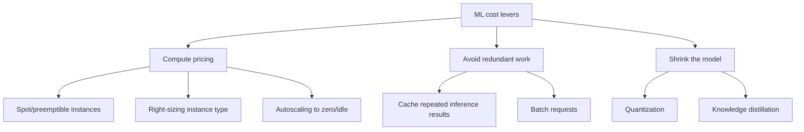

# Cost Optimization for ML

## TL;DR
ML cost has three independent levers: **compute pricing** (spot instances, right-sizing,
autoscaling), **avoiding redundant work** (caching inference results, batching), and **shrinking the
model itself** (distillation, quantization). A senior engineer treats cost as a first-class design
constraint alongside latency and accuracy, not an afterthought discovered from a surprise cloud bill.

## Intuition
You wouldn't run a car engine at full throttle in a parking lot (right-sizing/autoscaling), you
wouldn't buy a brand-new car when a well-maintained used one does the job just as well
(spot instances), you wouldn't drive the same route twice in a day when you already know the way
(caching), and you wouldn't use a cargo truck to deliver a single envelope (distillation/quantization
— use a smaller model when the task doesn't need the biggest one).

## The maths
Total serving cost is roughly:

$$
\text{Cost} = \underbrace{(\text{instance-hours}) \times (\text{price/hour})}_{\text{compute}} \;+\; \underbrace{(\text{storage GB}) \times (\text{price/GB})}_{\text{storage}}
$$

Spot/preemptible instances cut price/hour by roughly 60–90% versus on-demand in exchange for
preemption risk — worth it for fault-tolerant, restartable workloads (training jobs with
checkpointing, batch scoring jobs) and risky for anything stateful mid-request (a live serving
endpoint that can't tolerate mid-response eviction).

Quantization reduces the per-parameter memory/compute cost directly — an LLM at fp16 needs roughly
2 bytes/parameter just for weights; int8 quantization roughly halves that again, int4 halves it
again, trading some accuracy for a proportional drop in memory bandwidth and often inference
latency (memory-bandwidth-bound decoding benefits directly from smaller weights). See
[[quantization]] for the full mechanics.

Distillation trades training-time compute (train a smaller student to mimic a larger teacher) for
permanently lower serving-time compute — worth it whenever a model is served at high enough volume
that the one-time distillation cost is repaid by inference savings:

$$
\text{Break-even volume} = \frac{\text{distillation training cost}}{\text{cost saved per inference} \times (\text{teacher} \to \text{student})}
$$

## Diagram


## Code
Autoscaling a Databricks job cluster to scale down aggressively when idle (avoiding paying for idle
provisioned compute):

```json
{
  "autoscale": {"min_workers": 1, "max_workers": 8},
  "spot_bid_price_percent": 100,
  "aws_attributes": {"availability": "SPOT_WITH_FALLBACK"},
  "spark_conf": {"spark.databricks.cluster.autoTermination.minutes": "15"}
}
```

A simple inference cache for a deterministic model, keyed on the input hash, avoiding recomputation
for repeated queries (common in RAG/LLM apps where many users ask near-identical questions):

```python
from functools import lru_cache
import hashlib

def cache_key(payload: dict) -> str:
    return hashlib.sha256(str(sorted(payload.items())).encode()).hexdigest()

@lru_cache(maxsize=10_000)
def cached_predict(key: str, payload_json: str):
    return model.predict(json.loads(payload_json))
```

For a real system this cache belongs in Redis/a shared cache layer (not in-process `lru_cache`,
which doesn't share across replicas) — see [[caching-strategies]].

## In practice
- **Use it when:** every production ML system should default-check these levers; the ROI is highest
  for high-volume serving (LLM inference, real-time recommendation) where compute is the dominant
  cost line.
- **Defaults that work:** spot instances for training and batch jobs with checkpointing (see
  [[distributed-training]] for checkpoint strategy); autoscaling with a sensible idle-timeout for
  interactive clusters; a semantic or exact-match cache in front of any LLM call that's likely to
  see repeated queries; quantize to int8 as a near-default for LLM serving unless accuracy
  requirements are unusually tight.
- **Breaks when:** spot instances used for stateful, latency-sensitive serving without graceful
  eviction handling — a mid-request preemption becomes a user-facing outage; aggressive
  quantization applied without an evaluation step can silently degrade accuracy on edge cases
  (rare classes, tail latency-sensitive tokens) that the aggregate metric doesn't surface.
- **Cost / latency:** each lever has a different latency interaction — quantization and
  distillation typically *improve* latency alongside cost (smaller model, less compute per
  request); caching improves latency for cache hits and adds negligible overhead for misses;
  autoscaling can *hurt* tail latency during scale-up if cold-start time isn't accounted for.

### Right-sizing, concretely
Match instance type to the actual bottleneck. A Spark ETL job that's I/O-bound doesn't benefit from
more CPU cores; a GPU inference workload that's memory-bandwidth-bound (typical for LLM decoding)
doesn't benefit from more compute (FLOPs) without more memory bandwidth. Profile before scaling —
adding bigger/more instances to a job that's actually bottlenecked elsewhere (shuffle spill,
network I/O) wastes money without moving the needle. See [[spark-performance-tuning]].

## Interview angle
**Q. Your LLM-based feature is popular but the inference bill is 3x what was budgeted. Walk me
through how you'd bring it down.**
Layer the levers rather than picking one: first, add a cache for repeated/similar queries (a
semantic cache catches paraphrased duplicate questions, not just exact matches) — this is usually
the highest-ROI, lowest-risk first move because it needs no model change. Second, check whether the
current model is over-provisioned for the task — could a smaller or distilled model handle most of
the traffic, routing only harder queries to the larger model (a cascade/router pattern)? Third,
quantize the serving model if it isn't already — int8 typically costs little accuracy for a real
compute/memory win. Fourth, check infrastructure: is compute autoscaling to zero during low-traffic
periods, and would spot/preemptible capacity work for the batch portions of the workload? Only
after these would I consider a genuinely smaller/cheaper model family, since that risks a larger,
harder-to-reverse quality hit.

**Follow-up.** How do you validate that quantization/distillation didn't quietly hurt quality on
important segments? → Run the full evaluation suite (see [[llm-evaluation]] / [[ml-testing-strategy]])
segmented by important slices, not just the aggregate metric — a distilled model can look fine on
average while regressing badly on a minority but business-critical query type; shadow-mode testing
against the original model before cutover is the safer path (see [[shadow-and-canary-deployment]]).

**Q. When are spot instances a bad idea?**
For anything stateful and latency-sensitive where a mid-request preemption directly causes a
user-facing failure — a live serving endpoint without a fast failover to on-demand capacity. They're
excellent for training jobs (checkpoint and resume), batch scoring, and any fault-tolerant,
restartable workload, but the eviction risk (typically low but nonzero, and correlated during
capacity crunches) has to be matched to a workload that can actually tolerate it.

**Q. How does model size reduction (distillation/quantization) tie back into a cost-optimization
plan, and when is it not worth it?**
It's the highest-leverage lever at high inference volume, because savings compound per request
indefinitely after a one-time training/conversion cost — the break-even is a function of traffic
volume. At low volume (an internal tool used by ten people) the engineering cost of doing
distillation properly (need a teacher, a distillation training loop, an evaluation harness) likely
exceeds any savings — just right-size the instance and move on.

## Traps
- Optimizing model size before checking for redundant work — many systems have far more upside from
  caching/deduplication than from shrinking the model, and it's much lower risk.
- Quantizing/distilling without a segmented evaluation — an aggregate metric can hide a real
  regression on a specific, business-important slice.
- Using spot instances for a live serving path without a fallback — treats a cost optimization as
  free when it actually trades money for reliability risk that needs to be explicitly engineered
  around (multi-AZ fallback, graceful degradation).
- Assuming bigger instances always mean faster — if the workload is bottlenecked on something other
  than the resource you scaled (I/O, network, shuffle), you pay more for no improvement.

## Flashcards
What are the three independent levers for ML cost optimization?::Compute pricing (spot/right-sizing/autoscaling), avoiding redundant work (caching/batching), and shrinking the model (quantization/distillation).
Why are spot instances well suited to training but risky for live serving?::Training jobs can checkpoint and resume after preemption; a live serving endpoint has no such tolerance for mid-request eviction without engineered failover.
Roughly how does int8 quantization affect an LLM's serving memory footprint?::It roughly halves the per-parameter memory versus fp16 (about 1 byte vs 2 bytes per parameter), often improving latency too since LLM decoding is typically memory-bandwidth-bound.
Why should caching usually be tried before shrinking the model itself?::It requires no model change, carries little accuracy risk, and often has the highest ROI for workloads with repeated or similar queries.
What determines whether distillation is worth the engineering investment?::Inference volume — the one-time training cost needs enough serving volume afterward to be repaid by per-request savings.
Why is validating quantization/distillation on aggregate metrics alone risky?::A model can look fine on average while regressing badly on a specific, business-critical segment that the aggregate hides.

## Related
[[quantization]]
[[knowledge-distillation]]
[[caching-strategies]]
[[distributed-training]]
[[llm-serving-and-throughput]]
[[case-llm-cost-reduction]]
