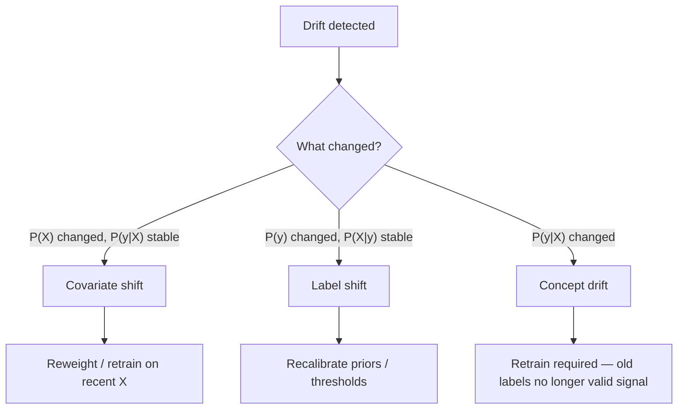

# Data Drift and Concept Drift

## TL;DR
"Drift" is an umbrella term for three distinct failure modes: **covariate shift** ($P(X)$ changes,
$P(y\mid X)$ doesn't), **label shift** ($P(y)$ changes, $P(X\mid y)$ doesn't), and **concept drift**
($P(y\mid X)$ itself changes — the same input now means something different). They need different
detection methods and different fixes; conflating them leads to chasing the wrong signal.

## Intuition
Covariate shift: the population walking into your store changed (more younger customers) but their
buying behaviour given who they are hasn't. Label shift: the mix of what's being bought changed
(more returns during a recession) but each customer type still behaves the same way it always did.
Concept drift: the exact same customer profile now behaves differently than it used to — the rule
itself changed, e.g., a fraud pattern evolved to evade your existing model.

## The maths
Let $X$ be features, $y$ the target.

- **Covariate shift:** $P_{\text{train}}(X) \neq P_{\text{serve}}(X)$, but $P(y \mid X)$ is stable.
- **Label/prior shift:** $P_{\text{train}}(y) \neq P_{\text{serve}}(y)$, but $P(X \mid y)$ is stable.
- **Concept drift:** $P(y \mid X)$ itself changes over time — the decision boundary moves.

Detection methods, matched to what they measure:

$$
\text{PSI} = \sum_i (Q_i - P_i)\ln\frac{Q_i}{P_i}
\qquad
D_{\mathrm{KL}}(P\,\|\,Q) = \sum_i P_i \ln\frac{P_i}{Q_i}
$$

PSI and KL divergence both compare a reference distribution $P$ against a current one $Q$ over
binned values — useful for covariate/label shift on individual features. Rule of thumb: PSI
$< 0.1$ no significant shift, $0.1$–$0.25$ moderate, $> 0.25$ significant. KL is asymmetric
($D_{\mathrm{KL}}(P\|Q) \neq D_{\mathrm{KL}}(Q\|P)$) and blows up when $Q_i = 0$ where $P_i > 0$;
PSI is a symmetrized, more numerically forgiving variant popular in industry for exactly that
reason. See [[information-theory-entropy-kl]] for the derivation of KL divergence itself.

For continuous features, a two-sample **Kolmogorov–Smirnov test** compares empirical CDFs directly
without binning:

$$
D = \sup_x \left| F_{\text{train}}(x) - F_{\text{serve}}(x) \right|
$$

Concept drift is harder to detect directly because it requires labels — you typically detect it
indirectly via a rolling accuracy/error-rate monitor once labels arrive, or via a proxy (a
challenger model trained on recent data consistently outperforming the champion suggests the
relationship shifted, not just the inputs).

## Diagram


## Code
```python
import numpy as np
from scipy.stats import ks_2samp

def ks_drift_check(reference: np.ndarray, current: np.ndarray, alpha: float = 0.01) -> dict:
    stat, p_value = ks_2samp(reference, current)
    return {"ks_statistic": stat, "p_value": p_value, "drift_detected": p_value < alpha}

result = ks_drift_check(train_df["transaction_amount"], live_df["transaction_amount"])
```

```python
def kl_divergence(p: np.ndarray, q: np.ndarray, eps: float = 1e-8) -> float:
    p, q = p + eps, q + eps          # avoid log(0) / division by zero
    p, q = p / p.sum(), q / q.sum()
    return float(np.sum(p * np.log(p / q)))
```

Note the KS test's p-value is sensitive to sample size — with millions of rows, even a trivially
small, practically meaningless shift will be "statistically significant." Pair the p-value with an
effect-size threshold (the KS statistic $D$ itself, or PSI) rather than relying on $p < 0.05$ alone.

## In practice
- **Use it when:** any deployed model with a live feature pipeline — drift is a certainty over long
  enough horizons, not an edge case; the question is when you'll notice, not if.
- **Defaults that work:** PSI on top-N important features (by SHAP/feature importance) computed
  daily or weekly against a fixed training-time reference window; KS test for continuous features
  where you want a formal hypothesis test rather than a heuristic threshold; monitor prediction
  distribution drift the same way you monitor input drift.
- **Breaks when:** you only monitor marginal ($P(X)$) distributions and miss that individual
  features are fine but their *joint* relationship changed (a correlation-structure shift) — this
  requires either model-based proxies (challenger retrain performance) or joint-distribution tests,
  which are much rarer in practice due to cost.
- **Cost / latency:** computing PSI/KS on a handful of key features daily is cheap (seconds of
  compute on a summarized table); computing it on every feature at high frequency is wasted spend —
  prioritize features the model actually depends on heavily.

### What to do when drift is detected
1. Confirm it's not a data quality bug upstream first (a schema change, a column that went all-null)
   — this is the single most common false alarm.
2. Classify the type: covariate shift alone may not need retraining if the model generalizes across
   the new region of $X$-space; label shift might only need threshold recalibration; concept drift
   almost always needs retraining because the old labels no longer describe the current relationship.
3. Quantify business impact before reacting — not every statistically detected shift moves the
   metric that matters; check downstream KPIs, not just the drift statistic.
4. If retraining is warranted, follow a champion/challenger evaluation before promoting
   (see [[model-retraining-strategies]]) rather than auto-promoting on drift alone.

## Interview angle
**Q. Distinguish covariate shift, label shift, and concept drift, with an example of each.**
Covariate shift: an e-commerce model trained mostly on desktop traffic now sees a majority-mobile
user base — the users look different, but a given user's buying behaviour given their profile is
unchanged. Label shift: a loan default model's overall default rate jumps during a recession, but
for any given applicant profile the odds of default given that profile haven't changed — the class
mix shifted. Concept drift: a fraud model where fraudsters adapt their behaviour specifically to
evade the current model — the same feature values that used to mean "legitimate" now mean "fraud."

**Follow-up.** Which of the three is hardest to detect, and why? → Concept drift, because it
requires labels to observe directly (feature distributions alone look unchanged); it's usually
caught late, via degrading business KPIs or challenger-model comparisons, rather than via a
feature-level statistical test.

**Q. PSI shows 0.3 on a key feature. What do you do next, in order?**
First rule out a pipeline bug (check for schema changes, null spikes, unit changes — e.g., a
currency field silently switching from USD to local currency). Second, check whether the shift is
seasonal/expected (a retail model seeing holiday-season traffic) versus genuinely novel. Third,
check whether the model's performance on any available ground truth has actually degraded, since
not all input drift changes output quality (a robust model can generalize past its training
distribution). Only then decide between recalibration, retraining, or accepting the drift as benign.

**Q. Why is a p-value from a KS test dangerous to rely on alone at high data volume?**
With millions of samples, the KS test has enough statistical power to detect vanishingly small,
practically meaningless differences as "significant" — you'll get constant false alarms. Always
pair a significance test with an effect-size measure (the KS statistic itself, or PSI/Cohen's d)
and a business-relevance threshold, not raw $p < 0.05$.

## Traps
- Treating "PSI > 0.25" as automatically meaning "retrain now" — it means "investigate," not
  "retrain reflexively"; many drifted-but-fine cases exist.
- Using KL divergence directly without symmetrizing or handling zero-probability bins — it diverges
  to infinity and silently breaks the monitor; PSI or Jensen-Shannon divergence are the practical
  fixes.
- Conflating drift detection with model performance — a model can be robust to certain covariate
  shifts (tree ensembles handling out-of-range numeric features gracefully) and genuinely not need
  retraining despite a drift alert firing.
- Ignoring sample-size effects on statistical tests — running a KS test on a tiny daily batch gives
  low power (misses real drift); running it on huge batches gives false positives on trivial shifts.

## Flashcards
What's the defining difference between covariate shift and concept drift?::Covariate shift changes P(X) while P(y|X) stays the same; concept drift changes P(y|X) itself — the same input now implies a different output.
Why is PSI generally preferred over raw KL divergence for monitoring?::PSI is symmetric and more numerically stable (avoids KL's blow-up when a bin's reference probability is zero), making it more practical for automated alerting.
Why is concept drift the hardest of the three to detect directly?::It requires labels/ground truth to observe P(y|X) change; feature-distribution monitoring alone can't see it.
What's the danger of relying only on KS test p-values at large sample sizes?::High statistical power detects trivially small, practically irrelevant shifts as "significant," causing alert fatigue — pair with an effect-size threshold.
What should you check first when a drift alert fires, before deciding to retrain?::Rule out a data quality/pipeline bug upstream (schema change, nulls, unit change) as the actual cause.
Give one example each of label shift and concept drift.::Label shift — a recession changes the overall default rate without changing default odds per applicant profile; concept drift — fraudsters adapt tactics so the same feature values that meant "legitimate" now mean "fraud."

## Related
[[information-theory-entropy-kl]]
[[model-monitoring]]
[[model-retraining-strategies]]
[[common-statistical-tests]]
[[hypothesis-testing]]
