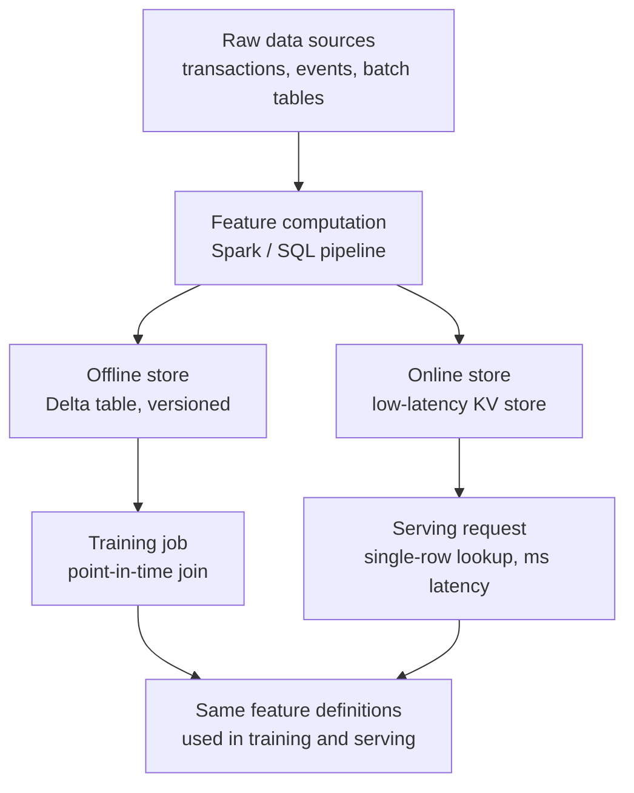

# Feature Stores

## TL;DR
A feature store separates feature *computation* from feature *consumption*, and
provides two access patterns for the same underlying features: an offline store for
bulk training reads and an online store for low-latency single-row lookups at serving
time. Its core value is point-in-time correctness — guaranteeing the features you
train on reflect exactly what would have been known at prediction time, which is what
prevents training-serving skew.

## Intuition
Imagine a chef who preps ingredients twice — once in a big batch for tasting/recipe
development (offline), and once fresh, one plate at a time, when a customer orders
(online) — but from the same fridge, prepped by the same recipe. If the two prep
processes ever disagree (the batch prep secretly uses tomorrow's delivery that wasn't
actually available yet), the tasting notes lie about what the dish will taste like
when actually served. A feature store's whole job is making sure both preps come from
one recipe and one fridge, correctly time-ordered.

## The maths
Point-in-time correctness has a precise statement. For a label event at time $t$ for
entity $e$, the feature vector used in training must be:

$$
x(e, t) = \left\{ f_i(e, t') : t' \le t \text{, using only data available as of } t \right\}
$$

i.e. every feature value must be computable from information available strictly at or
before $t$ — never using $t' > t$ data ("future leakage"). Training-serving skew is the
violation of this constraint at training time specifically: computing $x(e,t)$ using
data that wouldn't actually have existed yet at prediction time, producing artificially
good offline metrics that don't hold in production, since online serving mechanically
cannot violate this (it only has data up to "now").

## Diagram


## Code
```python
# Point-in-time correct training join: for each labeled event, pull feature
# values as of that event's timestamp, never a later value.

from pyspark.sql import functions as F
from pyspark.sql.window import Window

# labels: (entity_id, label, event_ts)
# features: (entity_id, feature_value, feature_ts)  -- feature history, not just latest

joined = labels.join(features, on="entity_id", how="left") \
    .where(F.col("feature_ts") <= F.col("event_ts"))

w = Window.partitionBy("entity_id", "event_ts").orderBy(F.col("feature_ts").desc())
point_in_time = joined.withColumn("rn", F.row_number().over(w)) \
    .where(F.col("rn") == 1) \
    .drop("rn", "feature_ts")

# This is the join logic a feature store's training API does for you —
# Databricks Feature Engineering (Feature Store) exposes it as create_training_set()
# against feature tables defined once, so training and serving share one definition:
#
# from databricks.feature_engineering import FeatureEngineeringClient, FeatureLookup
# fe = FeatureEngineeringClient()
# training_set = fe.create_training_set(
#     df=labels,
#     feature_lookups=[FeatureLookup(table_name="customer_features",
#                                     lookup_key="entity_id", timestamp_lookup_key="event_ts")],
#     label="label",
# )
```

## In practice
- **Use it when:** multiple models or teams reuse the same features (so definitions
  must be shared, not reimplemented per model), features require temporal joins that
  are easy to get subtly wrong by hand (point-in-time correctness), or serving
  requires low-latency lookups computed from a much larger offline history.
- **Defaults that work:** define each feature once, computed by one pipeline, exposed
  through both offline (batch, for training) and online (low-latency KV, for serving)
  interfaces — this is the structural guarantee against skew, not a policy someone
  has to remember. On a Databricks/Unity Catalog stack, feature tables are Delta
  tables with a registered primary key and timestamp key, giving point-in-time joins
  and lineage for free.
- **Breaks when:** it's used for a small team or a single model with no reuse and no
  serving-latency requirement — building and operating a feature store (online store
  infra, sync pipelines, governance) is real overhead that isn't justified if
  features are computed once, for one batch model, by one person. In that case a
  well-organized Delta table with clear versioning is enough.
- **Cost / latency:** the online store adds an infrastructure component (a
  low-latency KV store, sync pipelines keeping it fresh from the offline store) with
  its own operational cost — this buys serving-time latency (single-digit to
  low-double-digit milliseconds) that a batch table alone can't provide, but it's not
  free to run.

## Interview angle
**Q. What problem does a feature store actually solve that a well-organized data
warehouse doesn't?**
Two things a plain warehouse doesn't give you structurally: (1) point-in-time correct
joins for training, computed correctly by the store rather than reimplemented (and
potentially miscomputed) by each modeling team, and (2) an online, low-latency
serving path for the *same* feature definitions used offline — a warehouse alone is
batch/offline only and doesn't solve the serving-latency half of the problem.

**Follow-up.** Could you get most of the benefit without a dedicated feature store
product? → Partially — you can enforce point-in-time joins by convention/shared code
and serve from a cache populated by a batch job, but you lose the single-definition
guarantee (nothing stops two teams from computing "days since last purchase"
slightly differently) and you're maintaining the sync/governance layer yourself.

**Q. Explain training-serving skew and how a feature store prevents it.**
Training-serving skew is when a model performs well offline but worse in production
because the features it sees at serving time differ from what it was trained on —
often because training computed a feature using information that wouldn't have been
available yet (future leakage), or the serving pipeline computes the same
"feature name" with subtly different logic (e.g. a different aggregation window). A
feature store prevents this by defining the feature once and enforcing point-in-time
correctness in its training API, so both paths are mechanically guaranteed to agree
on the recipe.

**Follow-up.** Give an example of skew a feature store wouldn't catch. → If the
*upstream raw data itself* differs between environments (e.g. a raw event stream
that's delayed or incomplete in production versus a clean backfilled batch table used
for training) — the feature store guarantees the transformation logic is shared, not
that the raw inputs feeding it are identical between training-time and serving-time.

**Q. When would you tell a team a feature store is overkill?**
A small team with one or two models, no feature reuse across models, and no strict
serving-latency requirement (e.g. daily batch scoring, not real-time) — in that case
the operational cost of standing up and maintaining online-store infrastructure and
governance exceeds the benefit; a well-versioned Delta table with disciplined
point-in-time join code gets most of the value at a fraction of the complexity.

## Traps
- Describing a feature store as "just a cache for features" — that's only the online
  half; the point-in-time correctness guarantee for training is the half that
  actually prevents the expensive failure mode (skew), and it's easy to miss in a
  quick answer.
- Recommending a feature store reflexively for any ML project — for a single-model,
  no-latency-requirement use case, it's added operational surface with no
  corresponding benefit; naming this tradeoff is what separates a strong answer.
- Assuming a feature store fixes all training-serving skew — it fixes
  transformation-logic skew, not skew from upstream raw data differing between
  environments.
- Forgetting the temporal join is the hard part — treating a feature store as "an
  online KV store with a training export button" undersells why point-in-time
  correctness is genuinely difficult to get right by hand at scale.

## Flashcards
What are the two access patterns a feature store provides for the same features?::An offline store for bulk/batch reads at training time, and an online store for low-latency single-row lookups at serving time.
What is point-in-time correctness, precisely?::Every feature value used for a labeled training example must be computable only from data available at or before that example's event timestamp — never from data that would only exist later.
What specific failure does point-in-time correctness prevent?::Training-serving skew caused by future leakage — training on feature values that wouldn't have actually been available at real prediction time, producing offline metrics that don't hold up in production.
When is a feature store overkill?::Small team, one or two models, no feature reuse across teams/models, and no strict serving-latency requirement — a well-versioned table with disciplined join code covers the need instead.
Does a feature store prevent all forms of training-serving skew?::No — it prevents transformation-logic skew (same feature definition used both places); it does not guarantee the upstream raw data feeding training and serving is itself identical.

## Related
[[data-versioning]]
[[training-serving-skew]]
[[data-leakage]]
[[delta-lake]]
[[batch-vs-realtime-inference]]
[[unity-catalog-and-governance]]
