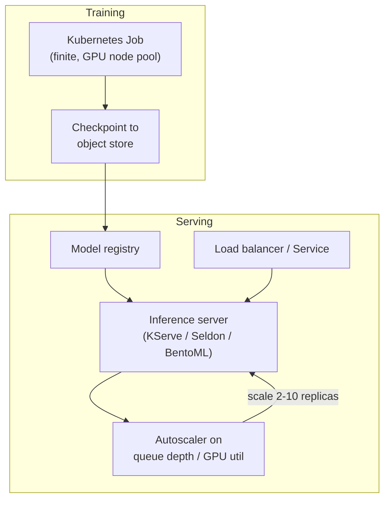

# Kubernetes for ML Workloads

## TL;DR
Kubernetes is the deployment substrate under most self-managed model-serving and distributed
training systems, but ML workloads stress it in ways a generic web service doesn't: GPUs are a
schedulable-but-not-shareable resource, training Jobs are batch/finite instead of long-running
Deployments, and inference pods have multi-minute startup costs (loading model weights) that break
naive health checks. See [[kubernetes]] for the general orchestration mechanics this builds on.

## Intuition
A normal Kubernetes Deployment assumes a pod is cheap to kill and restart and ready almost
instantly. An ML serving pod is the opposite: expensive to (re)schedule (needs a specific GPU
type), slow to become useful (loading a multi-GB checkpoint into GPU memory), and its "load" isn't
CPU percentage but queue depth or GPU memory/utilization. Nearly every Kubernetes-for-ML pattern —
custom autoscaling metrics, dedicated GPU node pools, Jobs instead of Deployments for training —
exists to correct for that mismatch.

## Diagram


## Code
```yaml
# Training: a Job, not a Deployment — it must run to completion, not stay up forever.
apiVersion: batch/v1
kind: Job
metadata:
  name: xgboost-train-run-42
spec:
  backoffLimit: 2
  template:
    spec:
      restartPolicy: Never
      nodeSelector: {workload-type: gpu-training}
      containers:
        - name: train
          image: my-registry/train:1.4
          resources:
            requests: {nvidia.com/gpu: "1"}
            limits: {nvidia.com/gpu: "1"}
---
# Serving: autoscale on a custom metric (in-flight requests), not CPU —
# CPU utilization is a poor proxy for load on a GPU-bound inference server.
apiVersion: autoscaling/v2
kind: HorizontalPodAutoscaler
metadata:
  name: llm-serving-hpa
spec:
  scaleTargetRef: {apiVersion: apps/v1, kind: Deployment, name: llm-server}
  minReplicas: 2
  maxReplicas: 20
  metrics:
    - type: Pods
      pods:
        metric: {name: inflight_requests_per_replica}
        target: {type: AverageValue, averageValue: "4"}
```

## In practice
- **Training vs serving are different Kubernetes objects.** Training runs as a `Job` (or
  `CronJob` for scheduled retraining) that terminates on completion; serving runs as a long-lived
  `Deployment` behind a `Service`. Conflating them (running training as a Deployment) leaves
  zombie pods burning GPU-hours after a run finishes.
- **GPU node pools are usually separate and tainted** so ordinary CPU workloads don't accidentally
  land on expensive GPU nodes; ML pods carry a matching toleration plus a `nodeSelector` or node
  affinity rule.
- **Readiness probes must account for model load time.** A model server can take 30s-several
  minutes to load weights into GPU memory; a default `initialDelaySeconds` tuned for a typical web
  service routes traffic to a pod before it can serve, causing failed requests on every rollout —
  see the same trap called out in [[kubernetes]].
- **Autoscale on the metric that actually reflects load.** CPU utilization barely moves on a
  GPU-bound inference server; production setups scale on GPU utilization, queue depth, or in-flight
  request count instead — see [[batch-vs-realtime-inference]] for how this interacts with
  latency SLOs.
- **A managed platform is often the pragmatic default.** Databricks Model Serving, SageMaker
  endpoints, or Vertex AI absorb most of this Kubernetes complexity; teams reach for raw Kubernetes
  (or KServe/Seldon Core/BentoML on top of it) when they need multi-cloud portability, custom
  GPU bin-packing across many small models, or already have platform-team investment in the
  cluster. See [[model-serving-patterns]] for the broader serving-architecture tradeoff.

## Interview angle
**Q. Why would you run model training as a Kubernetes Job instead of a Deployment?**
A Deployment's contract is "keep N replicas running forever" — it will restart a completed training
container, treating success as a crash. A Job's contract is "run to completion, N times, with a
retry budget," which matches what a training run actually is; `CronJob` extends that to scheduled
retraining.

**Q. Your LLM-serving pods pass liveness checks but requests are timing out under load. What do you
check first?**
Whether the HPA is scaling on a metric that reflects real load (queue depth / in-flight requests)
rather than CPU, which stays low on a GPU-bound server even while requests queue up — a liveness
probe only proves the process is alive, not that it has capacity.

**Follow-up.** How would you avoid a slow rollout causing a capacity dip?
Use a `maxUnavailable: 0` rolling-update strategy with a readiness probe tuned to real model-load
time, so new pods are proven ready before old ones are terminated — the naive default order
(terminate old, then start new) creates exactly the capacity gap being asked about.

## Traps
- Autoscaling on CPU for a GPU-bound inference workload — the signal barely moves while requests
  queue up and latency SLOs blow past their budget.
- Running training as a Deployment (or forgetting `restartPolicy: Never` on a Job) — completed runs
  get treated as crashes and endlessly restarted, silently burning GPU-hours.
- No readiness probe, or one with too short an `initialDelaySeconds`, on a model-serving pod — every
  rollout or scale-up briefly routes real traffic to a pod that hasn't finished loading weights.
- Requesting a GPU without setting matching `limits` — some clusters allow this and it either wastes
  reserved capacity or causes unpredictable scheduling collisions with other GPU workloads.

## Flashcards
Why is autoscaling on CPU usually wrong for GPU-bound inference?::CPU utilization stays low even as GPU memory/compute saturates and requests queue, so CPU-based HPA scales too late or not at all.
Training job vs serving deployment — which Kubernetes object for each?::Training → `Job`/`CronJob` (finite, retries, terminates on success); serving → `Deployment` (long-running, N replicas) behind a `Service`.
What does a readiness probe protect against that a liveness probe doesn't?::Traffic being routed to a pod that's alive but not yet finished loading a multi-GB model into memory.
Name one reason a team would choose a managed serving platform over raw Kubernetes.::Removes most autoscaling/GPU-scheduling/rollout boilerplate at the cost of less custom control — the right tradeoff absent a specific need for portability or custom scheduling.

## Related
[[kubernetes]]
[[model-serving-patterns]]
[[batch-vs-realtime-inference]]
[[infrastructure-as-code]]
[[distributed-training]]
[[shadow-and-canary-deployment]]
