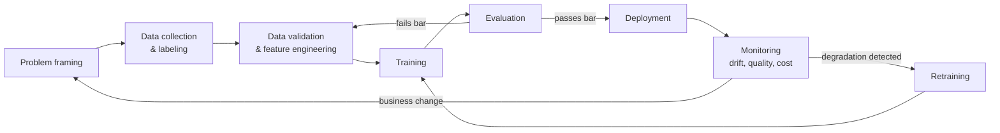

# ML Lifecycle

## TL;DR
The ML lifecycle is a loop, not a pipeline: problem framing → data → training →
evaluation → deployment → monitoring → retraining, feeding back into itself. In real
projects, the vast majority of time and failure sits in the data stages — sourcing,
cleaning, labeling, validating — not in the modeling step interview prep tends to
over-index on.

## Intuition
Building the model is like writing the recipe; getting good data is like sourcing and
prepping the ingredients. A brilliant recipe with rotten ingredients produces a bad
meal every time, and most kitchens spend far more hours prepping than plating. The
lifecycle diagram looks symmetric, but in practice the "data" side of the loop is
where projects actually live or die.

## The maths
Not a derivation-heavy topic, but the framing worth stating precisely: model quality
$Q$ is bounded above by data quality in a way no amount of modeling effort recovers
from — for any model family $f_\theta$ trained on data $D$:

$$
Q(f_\theta) \le Q_{\max}(D)
$$

where $Q_{\max}(D)$ is the best achievable performance given the information content
and label quality of $D$ itself. This is why teams that skip straight to hyperparameter
tuning on noisy, leaky, or unrepresentative data are optimizing the wrong term — no
value of $\theta$ raises the ceiling set by $D$.

## Diagram


## Code
```python
# The lifecycle as a set of stage gates, not a linear script.
# This is the shape a Databricks + MLflow implementation typically takes:
# each stage gate is a checkable condition before promotion to the next.

def evaluate_stage_gate(stage: str, metrics: dict, thresholds: dict) -> bool:
    """A minimal stage-gate check used between lifecycle phases."""
    gate = thresholds.get(stage, {})
    return all(metrics.get(k, float("-inf")) >= v for k, v in gate.items())

# e.g. between "evaluation" and "deployment":
thresholds = {"evaluation": {"auc": 0.80, "recall_at_p50": 0.65}}
metrics = {"auc": 0.83, "recall_at_p50": 0.70}
can_deploy = evaluate_stage_gate("evaluation", metrics, thresholds)

# Logged with MLflow so the gate decision is auditable against the exact
# run that produced it:
# import mlflow
# with mlflow.start_run():
#     mlflow.log_metrics(metrics)
#     mlflow.set_tag("stage_gate_passed", str(can_deploy))
```

## In practice
- **Use it when:** framing any ML project plan, especially in an interview — walking
  through this loop explicitly (not just "collect data, train, deploy") signals you've
  shipped, not just modeled.
- **Defaults that work:** budget project time expecting data work (collection,
  cleaning, labeling, validation, feature engineering) to consume 60-80% of total
  effort on a typical real-world project — this is a durable pattern across
  organizations, not a one-off anecdote; treat monitoring and retraining as part of
  the deliverable, not an afterthought once the model "works" in an offline notebook.
- **Breaks when:** teams treat deployment as the finish line — a model with no
  monitoring silently degrades as the world drifts away from the training
  distribution (see [[data-drift-and-concept-drift]]), and nobody notices until a
  downstream metric (revenue, complaints) makes it obvious.
- **Cost / latency:** the lifecycle's retraining loop has its own cost structure —
  frequent retraining catches drift faster but costs compute and engineering time on
  every cycle; the right cadence is a monitoring-driven decision, not a fixed
  calendar schedule (see [[model-retraining-strategies]]).

## Interview angle
**Q. Walk me through the ML lifecycle for a project you've shipped, and tell me
where most of the time actually went.**
Frame it as the loop, not a straight line, and be honest that data work dominated:
sourcing and validating training data, handling label noise or class imbalance, and
building feature pipelines typically took multiples of the time spent on model
selection or hyperparameter tuning. Interviewers with real experience are checking
whether you'll say "mostly data" unprompted — it's the single most reliable signal
that you've actually shipped something versus only done modeling exercises.

**Follow-up.** What made the data stage take so long specifically? → Concrete answer
expected: label quality issues, discovering leakage late, schema drift between
training-time and serving-time feature computation, or a labeling process that needed
several iterations to get inter-annotator agreement acceptable.

**Q. Why is "deployment" not the end of the lifecycle?**
Because the training distribution is a snapshot and the real world keeps moving —
without monitoring, a deployed model's performance degrades silently as input
distributions shift (data drift) or as the relationship between inputs and the true
label changes (concept drift). The lifecycle only closes the loop if monitoring
triggers retraining, which is why production ML teams budget for monitoring
infrastructure and retraining pipelines as first-class deliverables, not
"maintenance."

**Follow-up.** How do you decide when monitoring should trigger a retrain versus just
an alert? → Tie it to a measurable, agreed-upon threshold on a business or model
metric (not just "drift detected," since some drift doesn't hurt performance) —
retrain when the metric crosses a threshold that was set with stakeholders in
advance, alert-only for drift signals that haven't yet crossed that bar.

## Traps
- Describing the lifecycle as "collect data, train model, deploy" with no feedback
  loop — this is the single most common tell that a candidate hasn't run a model in
  production.
- Spending an interview answer mostly on modeling techniques when asked about the
  lifecycle — the strong answer foregrounds data and monitoring, which is where real
  projects actually spend their time and fail.
- Treating evaluation as a single offline metric check — a full lifecycle evaluation
  stage includes checking for leakage, slice-level performance, and calibration, not
  just an aggregate AUC.
- Assuming retraining on a fixed schedule (e.g. "weekly") is inherently correct —
  the right cadence depends on observed drift and cost, not a calendar default.

## Flashcards
What does the ML lifecycle loop consist of, in order?::Problem framing → data collection/labeling → validation/feature engineering → training → evaluation → deployment → monitoring → retraining, feeding back into earlier stages.
Why does model quality have a hard ceiling set by data quality?::Because no choice of model parameters can exceed the information content and label quality present in the training data — Q(f_θ) ≤ Q_max(D) regardless of θ.
Where does most real-world ML project time actually go?::Data work — collection, cleaning, labeling, validation, and feature engineering — typically 60-80% of total effort, not modeling.
Why is deployment not the end of the lifecycle?::Because the world keeps moving after deployment (data/concept drift), so without monitoring a model's performance degrades silently until something else surfaces it.
What should trigger a retrain rather than a calendar schedule?::A measurable metric crossing an agreed threshold, informed by monitoring — not a fixed cadence chosen without reference to observed drift or cost.

## Related
[[ml-problem-framing]]
[[experiment-tracking-mlflow]]
[[data-drift-and-concept-drift]]
[[model-retraining-strategies]]
[[reproducibility]]
[[training-pipelines]]
