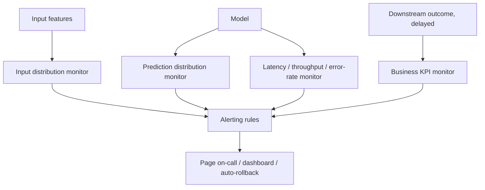

# Model Monitoring

## TL;DR
A model that only gets checked by re-running accuracy on a labeled test set fails silently in
production, because ground-truth labels usually arrive late (or never, for many business problems).
Real monitoring watches four layers — **input data**, **predictions**, **system health**
(latency/throughput/errors), and **business KPIs** — because each layer can go wrong independently
and each catches a different class of failure earlier than waiting for labels.

## Intuition
Think of it like monitoring a factory line, not just inspecting the finished product at the end.
You watch the raw materials coming in (input distributions), the machine's vital signs (latency,
error rate), the output before it ships (prediction distribution), and eventually whether customers
are happy (business KPI) — waiting only for customer complaints (labels/accuracy) means you find
out weeks after the line broke.

## The maths
Most drift/monitoring statistics reduce to comparing a reference distribution $P$ (training-time)
against a live distribution $Q$ (serving-time) for some measured quantity — a feature, a prediction,
a latency:

$$
\text{PSI} = \sum_{i} (Q_i - P_i) \ln\!\left(\frac{Q_i}{P_i}\right)
$$

where $i$ indexes bins of the variable. See [[data-drift-and-concept-drift]] for the full detection
toolkit (PSI, KL divergence, KS test) — monitoring is the *system* that runs these checks on a
schedule and turns a threshold breach into a page, not the statistics themselves.

## Diagram


## Code
A minimal PSI check you'd run as a scheduled job comparing today's scored batch to a stored
training reference, logged so it's queryable over time:

```python
import numpy as np

def psi(reference: np.ndarray, current: np.ndarray, bins: int = 10) -> float:
    quantile_edges = np.quantile(reference, np.linspace(0, 1, bins + 1))
    quantile_edges[0], quantile_edges[-1] = -np.inf, np.inf
    ref_counts, _ = np.histogram(reference, bins=quantile_edges)
    cur_counts, _ = np.histogram(current, bins=quantile_edges)
    ref_pct = np.clip(ref_counts / len(reference), 1e-6, None)
    cur_pct = np.clip(cur_counts / len(current), 1e-6, None)
    return float(np.sum((cur_pct - ref_pct) * np.log(cur_pct / ref_pct)))

score = psi(reference=train_feature_values, current=today_feature_values)
if score > 0.25:
    raise SystemExit(f"PSI alert: {score:.3f} — feature distribution shifted materially")
```

In a Databricks setup this is typically a scheduled job writing results to a `monitoring` Delta
table, with a dashboard (or MLflow's built-in monitoring/Lakehouse Monitoring) on top and an alert
wired to Slack/PagerDuty when a threshold is crossed.

## In practice
- **Use it when:** every model in production, without exception — the cheapest monitoring (logging
  prediction distributions and latency) should be non-negotiable even for a "simple" model.
- **Defaults that work:** log every prediction with its input feature snapshot, model version, and
  timestamp; track PSI/KS on top-N most important features weekly at minimum, daily for
  high-stakes models; alert on both statistical thresholds (PSI > 0.2) and hard business thresholds
  (approval rate suddenly drops 30%).
- **Breaks when:** you only monitor accuracy and wait for labels — for many production systems
  (credit risk, LTV) ground truth arrives months later, by which time a broken model has already
  made months of bad decisions. Monitoring inputs and predictions gives you a leading indicator
  instead of a lagging one.
- **Cost / latency:** monitoring adds logging overhead (usually negligible — a few KB per
  prediction) and a scheduled aggregation job; the real cost is in alert fatigue if thresholds are
  set too tight — tune for signal, not for zero false negatives at any cost.

## Interview angle
**Q. Your model's accuracy on a held-out test set was 92% at launch. Three months later, is it
still 92%? How would you know without waiting for labels?**
You likely can't know accuracy directly without labels — but you can monitor proxies that predict
accuracy is at risk: input feature distributions drifting from training (PSI/KS tests), the
prediction distribution shifting (e.g., the fraction of positive predictions creeping up with no
change in the input mix — a sign of miscalibration or drift), and any available proxy labels or
delayed ground truth as it trickles in. The absence of drift doesn't guarantee accuracy is intact,
but its presence is a strong early warning that something changed.

**Follow-up.** What if the input distribution hasn't drifted but accuracy has silently dropped? →
That's concept drift — the relationship between $X$ and $y$ changed even though $P(X)$ didn't (see
[[data-drift-and-concept-drift]]); this is the hardest case because feature monitoring alone won't
catch it — you need either fast-arriving proxy labels or business KPI monitoring as the tripwire.

**Q. Design the alerting strategy for a model with a business KPI (conversion rate) as the ultimate
signal but a 2-week label delay.**
Layer alerts by lead time: system health (latency, error rate, request volume anomalies) alerts in
minutes; input/prediction distribution alerts in hours (PSI/KS run on a rolling window); business
KPI alerts, even though delayed, still get monitored continuously as the leading — if lagging —
ground truth, with a 2-week-lagged baseline comparison rather than day-over-day noise. Route
severity appropriately: a system-health alert pages on-call immediately, a distribution-drift alert
creates a ticket for a data scientist to investigate, a KPI regression triggers a formal incident
review including whether to roll back the model.

**Q. What's the difference between monitoring for ML systems and monitoring for regular software?**
Regular software monitoring assumes correctness is binary and detectable immediately (an exception,
a 500 error, a failed health check). ML systems can be "running successfully" — no crashes, normal
latency, valid-looking outputs — while being silently wrong, because the failure mode is
statistical, not exceptional. You need domain-specific signals (drift statistics, calibration
checks, business KPIs) layered on top of standard system observability
([[observability-and-logging]]), not instead of it.

## Traps
- "We monitor accuracy" as the entire monitoring strategy — accuracy needs labels, which are often
  delayed or unavailable at the volume/speed needed for early detection; it's necessary but not
  sufficient.
- Setting drift thresholds once at launch and never revisiting them — natural, benign seasonal
  shifts (holiday shopping patterns) will trip a static threshold and train the team to ignore
  alerts (alert fatigue), defeating the point.
- Monitoring only the model's own outputs and ignoring upstream data quality — a broken upstream ETL
  job (a column silently going all-null) looks identical to drift unless you also run basic data
  quality checks ([[data-quality-and-validation]]) as a first line of defense.
- Treating monitoring as a one-time launch task rather than an owned, on-call responsibility —
  dashboards nobody looks at are not monitoring.

## Flashcards
What four layers should model monitoring cover beyond accuracy?::Input data distributions, prediction distributions, system health (latency/throughput/errors), and business KPIs.
Why is waiting for ground-truth labels an insufficient monitoring strategy on its own?::Labels are often delayed by weeks or months (credit risk, LTV) or never fully available, making accuracy a lagging rather than leading indicator.
What's the difference between input drift and prediction drift as monitoring signals?::Input drift shows the data feeding the model changed; prediction drift shows the model's output distribution changed — either can happen without the other, and both can happen without an accuracy change if the model is robust to the shift.
Why can accuracy silently drop even with no input distribution drift?::Concept drift — the relationship between features and target changed even though the feature distribution itself is unchanged.
What's the risk of setting static drift-alert thresholds and never revisiting them?::Benign seasonal shifts trigger false alarms repeatedly, causing alert fatigue and the team learning to ignore the monitor.
Why does ML monitoring need more than standard system observability (latency, uptime, errors)?::ML systems can run with normal system health while producing statistically wrong outputs — a failure mode standard software monitoring cannot detect.

## Related
[[data-drift-and-concept-drift]]
[[observability-and-logging]]
[[model-retraining-strategies]]
[[ml-lifecycle]]
[[information-theory-entropy-kl]]
