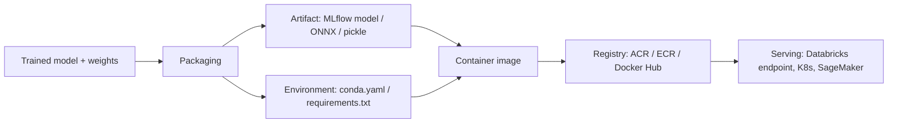

# Model Packaging and Containers

## TL;DR
A model is useless until it can run somewhere that isn't your notebook. Packaging means freezing
the model artifact, its code, and its exact dependency graph into one deployable unit — usually a
container — so it behaves identically in dev, staging, and prod. The two competing designs are
**model-as-artifact** (weights + a generic serving runtime) and **model-as-code-plus-weights**
(your custom inference code ships alongside the weights). Most production MLOps setups use both,
at different layers.

## Intuition
Think of a container as a shipping container, literally: the whole point is that the dock worker
(the serving infrastructure) never needs to know what's inside — glassware or engine parts — only
that it fits the standard slot. A model packaged well doesn't care if it lands on your laptop,
a Databricks model serving endpoint, or a Kubernetes pod: the interface is identical because the
environment travelled with the artifact instead of being assumed.

## The maths
Not a maths-heavy topic, but the core invariant worth stating precisely:

$$
\text{prediction} = f_\theta(x) \quad \text{must hold for identical } (\theta, x) \text{ regardless of runtime}
$$

Training-serving skew (see [[training-serving-skew]]) is frequently a packaging bug in disguise —
different library versions computing $f_\theta$ slightly differently (e.g., `sklearn` 1.1 vs 1.4
changing a default, or a CPU vs GPU BLAS kernel giving different floating-point rounding). Pinning
removes this as a variable.

## Diagram


## Code
An MLflow model directory is the cleanest example of "model-as-artifact" packaging — it bundles
the model, its flavor-specific loader, and the exact environment in one folder.

```python
import mlflow
import mlflow.sklearn
from sklearn.ensemble import RandomForestClassifier

model = RandomForestClassifier(n_estimators=200, max_depth=8).fit(X_train, y_train)

with mlflow.start_run():
    mlflow.sklearn.log_model(
        sk_model=model,
        artifact_path="model",
        registered_model_name="churn_rf",
        conda_env={
            "channels": ["defaults"],
            "dependencies": [
                "python=3.10.13",
                "pip",
                {"pip": ["scikit-learn==1.4.2", "mlflow==2.14.1", "pandas==2.2.2"]},
            ],
            "name": "churn_rf_env",
        },
        signature=mlflow.models.infer_signature(X_train, model.predict(X_train)),
        input_example=X_train.iloc[:3],
    )
```

Building a serving container from that artifact (Databricks and `mlflow models build-docker` do
this for you):

```bash
mlflow models build-docker \
  --model-uri "models:/churn_rf/Production" \
  --name churn-rf-serving \
  --enable-mlserver
```

The resulting image has the exact conda env baked in — no "works on my laptop" surprises.

## In practice
- **Use it when:** any model leaving a notebook — a container is the default unit of deployment
  for batch jobs, real-time endpoints, and even scheduled scoring jobs on Databricks clusters.
- **Defaults that work:** MLflow's `pyfunc` flavor for artifact portability + Unity Catalog model
  registry for versioning (see [[model-registry-and-versioning]]) + a slim base image
  (`python:3.10-slim`, not a 4 GB CUDA image, unless you actually need the GPU stack).
- **Breaks when:** you pin the model but not the *feature engineering code* that ran before it —
  skew shows up not in the model but in the transform. Package the whole pipeline (`sklearn.Pipeline`
  or a Spark ML pipeline), not just the estimator.
- **Cost / latency:** a fat container (unpinned CUDA + all of PyPI) adds minutes to cold starts on
  autoscaling endpoints and gigabytes to registry storage; multi-stage Docker builds and slim
  base images matter more than people expect on serverless/autoscaled serving.

## Interview angle
**Q. Why containerize a model instead of just `pip install`-ing dependencies on the serving box?**
Determinism and isolation. A container freezes OS libraries, Python version, native BLAS/CUDA
versions, and the dependency tree together — the same image runs identically on your machine, CI,
and prod. Without it, "it worked in staging" failures come from silent environment drift (a
transitive dependency got bumped, a system library changed) that's nearly impossible to bisect
after the fact.

**Follow-up.** What's the downside of containers? → Image size and build time, especially for GPU
workloads (CUDA base images are gigabytes); a slow CI/CD loop if every commit rebuilds a multi-GB
image; and you now have to patch OS-level CVEs in your images, which is its own maintenance burden.

**Q. Model-as-artifact vs model-as-code-plus-weights — what's the actual distinction, and when do
you pick each?**
Model-as-artifact treats the model as a self-describing blob (weights + signature + a generic
runtime like MLflow `pyfunc` or ONNX Runtime knows how to execute it) — good when you want a
uniform serving layer across many model types, e.g., a shared inference service that loads
whatever the registry hands it. Model-as-code-plus-weights ships your custom `predict()` logic
(pre/post-processing, business rules, prompt templates for an LLM app) as versioned code alongside
the weights — necessary when inference isn't "call `.predict()`" but a multi-step pipeline. In
practice most real systems are a hybrid: a generic artifact format wrapping custom code
(`mlflow.pyfunc.PythonModel` subclasses are exactly this hybrid).

**Q. How do you pin dependencies so a model built today still builds identically in a year?**
Pin exact versions (not ranges) for the model's direct dependencies, and lock the full transitive
graph — `pip freeze` / `conda-lock` / a multi-stage Dockerfile with a hash-pinned base image tag,
not `:latest`. MLflow captures a `conda.yaml`/`requirements.txt` automatically at log-model time,
which is the transitive-dependency-freezing already done for you at the moment of training.

**Follow-up.** What if a CVE forces you to bump a pinned base image years later? → You re-run the
training pipeline (or at minimum the packaging step) against the new environment and re-validate
the model's outputs match within tolerance before promoting — this is why reproducibility
([[reproducibility]]) and packaging are the same discipline in different clothes.

**Q. Your Databricks Model Serving endpoint has a 30-second cold start. Where do you look?**
Image size and initialization cost first — an oversized container (unused GPU libraries, a full
Anaconda base instead of slim) is the most common cause; then check if there's expensive work
happening in `load_context`/model init (loading a huge embedding index from disk on every cold
start) that could be cached or lazily loaded; then look at whether the endpoint's compute is even
provisioned (serverless endpoints from zero instances are why concurrency-based autoscaling
policies matter, see [[cost-optimization-for-ml]]).

## Traps
- "I logged the model to MLflow, so it's reproducible" — logging captures the *model* environment,
  not necessarily the *feature pipeline* that produced the training data upstream. Package the
  whole path from raw features to prediction, or you'll get skew nobody can explain.
- Using `:latest` tags for base images in a Dockerfile — silently breaks reproducibility the moment
  upstream publishes a new `latest`.
- Assuming a pickle file is portable — `pickle` is Python-version and library-version sensitive
  and isn't a cross-language format; it's fine for artifact storage between identical environments,
  risky as a long-term interchange format (prefer ONNX or MLflow's `pyfunc` wrapper for that).
- Treating "container built successfully" as "model works" — a build can succeed with the wrong
  package version silently satisfying a loose version range; always add a smoke-test inference call
  as part of the CI/CD gate ([[ci-cd-for-ml]]), not just a successful `docker build`.

## Flashcards
What are the two dominant model packaging paradigms?::Model-as-artifact (weights + a generic runtime, e.g. MLflow pyfunc/ONNX) and model-as-code-plus-weights (custom inference code shipped with the weights).
Why pin exact dependency versions instead of ranges for a served model?::To guarantee the same prediction function is computed at serving time as at training time — ranges let transitive dependencies drift and silently change model behaviour (training-serving skew).
What does MLflow capture automatically when you log a model?::The model artifact, its signature (input/output schema), an environment spec (conda.yaml/requirements.txt), and optionally an input example.
Why avoid `:latest` tags on container base images for ML serving?::It breaks build reproducibility — the same Dockerfile can produce a different, unvalidated environment days later.
What's a key operational cost of oversized GPU container images?::Slower cold starts and higher registry storage cost on autoscaled/serverless endpoints.
Why package the whole feature pipeline, not just the model object?::Skew often comes from the pre-model transform code, not the estimator — packaging only the model leaves that code unpinned.

## Related
[[model-registry-and-versioning]]
[[ci-cd-for-ml]]
[[training-serving-skew]]
[[reproducibility]]
[[model-serving-patterns]]
