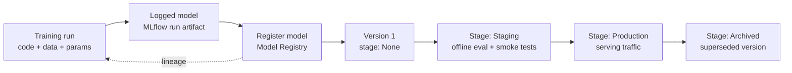

# Model Registry and Versioning

## TL;DR
A model registry manages the lifecycle of a trained model *after* it exists — staging
it, promoting it to production, and tracking lineage back to the exact run that
produced it. The core interview insight: "the model" isn't just the weights file — it's
the tuple (code, data, config, weights), and versioning any one part without the
others breaks reproducibility.

## Intuition
Think of the registry as source control, but for artifacts instead of text — a
`git tag` for a specific commit that says "this is the version we shipped." Just as
`git blame` traces a line of code back to a commit and author, a model registry traces
a served prediction back to a specific model version, and from there back to the
exact training run, data, and code that made it.

## The maths
Not a derivation, but the precise object definition is the interview content: define a
"model" not as a weights artifact $W$ alone, but as the tuple

$$
M = (\text{code}_v, \text{data}_v, \text{config}, W)
$$

Two deployments with identical $W$ but different `config` (e.g. a different
preprocessing threshold applied before inference) are not the same model in any
meaningful sense — they can produce different predictions on the same raw input. This
is why registries version the *model artifact plus its metadata* (signature,
training run link, environment) as one unit, not the weights file in isolation.

## Diagram


## Code
```python
import mlflow
from mlflow import MlflowClient

client = MlflowClient()

# Register a model logged during a training run (ties back to run_id -> full lineage)
run_id = "abc123def456"
model_uri = f"runs:/{run_id}/model"
registered = mlflow.register_model(model_uri, name="churn_predictor")

# Promote through stages with an explicit gate — this is where CI-style
# checks (see ci-cd-for-ml) plug in before a transition is allowed
client.transition_model_version_stage(
    name="churn_predictor",
    version=registered.version,
    stage="Staging",
)

# After staging validation passes (offline eval thresholds, smoke test on
# sample traffic), promote to Production, archiving the prior version
client.transition_model_version_stage(
    name="churn_predictor",
    version=registered.version,
    stage="Production",
    archive_existing_versions=True,
)

# Lineage: from a served version, trace back to the exact run
version_details = client.get_model_version("churn_predictor", registered.version)
source_run = client.get_run(version_details.run_id)
print(source_run.data.params, source_run.data.tags.get("data_version"))
```

```python
# On Databricks, Unity Catalog extends this with catalog-level governance:
# models are versioned assets in a catalog.schema.model_name namespace,
# with access control and lineage shared across tables, features, and models —
# not a separate silo per workspace.
# mlflow.set_registry_uri("databricks-uc")
# mlflow.register_model(model_uri, name="main.ml_models.churn_predictor")
```

## In practice
- **Use it when:** any model that will be served in production, revisited later, or
  needs an audit trail of who promoted what and why — which is essentially always
  past the exploratory-notebook stage.
- **Defaults that work:** never register a model without its training run linked (so
  lineage is automatic, not reconstructed later from memory); gate stage transitions
  behind explicit checks (offline metric thresholds, schema/signature validation,
  a smoke test) rather than manual promotion on trust; use Unity Catalog (or
  equivalent catalog-based governance) when multiple teams/workspaces need shared
  access control and lineage across models, features, and tables together.
- **Breaks when:** teams version only the weights file (e.g. a `.pkl` in a bucket)
  with no link to the training run — this looks fine until someone needs to explain
  why production behavior changed, or needs to reproduce a model from two versions
  ago, and there's no trail back to the data or config that produced it.
- **Cost / latency:** registry operations themselves are cheap; the cost is
  organizational — without registry discipline, "which model is actually serving
  right now" becomes a Slack-archaeology question during an incident, which is far
  more expensive than the registry overhead.

## Interview angle
**Q. Why isn't a serialized model file (the weights) sufficient to call "the model"?**
Because the weights alone don't determine behavior — the same weights combined with a
different preprocessing config, feature computation logic, or serving-time code path
can produce different predictions on identical raw input. "The model" is properly the
tuple (code version, data version, config, weights); versioning weights alone is
necessary but not sufficient for reproducibility or for correctly attributing a
production incident to its cause.

**Follow-up.** Give a concrete example where identical weights produce different
served predictions. → A feature computation bug fix deployed without a corresponding
model retrain — the weights are unchanged, but a changed feature transformation
(e.g. a fixed timezone bug in a "days since last purchase" feature) changes the
distribution of what the model sees at inference time, changing its output.

**Q. Design a promotion process from a newly trained model to production, with
appropriate gates.**
Register the model with its run lineage intact; transition to Staging only after
automated checks pass — offline metrics above threshold, model signature matches the
serving schema, a smoke test against a held-out or shadow traffic sample; require
explicit approval (human or automated policy) to transition Staging → Production;
archive the previous Production version rather than deleting it, so rollback is a
stage transition, not a redeploy from scratch.

**Follow-up.** How do you handle rollback if the new Production version regresses a
business metric a week after promotion? → Because the prior version was archived, not
deleted, roll back by transitioning the archived version back to Production — this is
why versioning (keeping every promoted version addressable) matters operationally,
not just for audit purposes.

**Q. What does "model lineage" mean concretely, and why does it matter beyond
compliance?**
Lineage is the traceable chain from a served model version back to the exact training
run (its code commit, data version, hyperparameters, and evaluation metrics) that
produced it. Beyond compliance/audit, it matters for debugging — when a production
metric regresses, lineage tells you whether the last promoted model actually changed,
or whether the regression is coming from upstream data or feature drift instead
(see [[data-drift-and-concept-drift]]).

## Traps
- Conflating "model versioning" with "weights file versioning" — the weights are one
  of four components, and the other three (code, data, config) are what actually
  determine whether two versions behave identically.
- Deleting archived model versions to save storage — this destroys rollback
  capability and lineage; archive, don't delete, until a retention policy explicitly
  says otherwise.
- Manual, undocumented promotion to production ("I just moved the file") — this is
  the single biggest reason "who approved this model and why" becomes unanswerable
  during an incident review.
- Treating registry stages (Staging/Production) as labels rather than gates — if
  nothing automated checks a transition, the stage name is decorative, not a control.

## Flashcards
What is "a model" properly defined as, beyond the weights?::The tuple (code version, data version, config, weights) — identical weights with a different config or upstream code can produce different served predictions.
Why register a model with its training run linked rather than just uploading a weights file?::To preserve lineage — the ability to trace a served model version back to the exact code, data, and hyperparameters that produced it, which is essential for debugging and audit.
What should gate a Staging → Production promotion?::Automated checks (offline metric thresholds, signature/schema validation, smoke tests on sample traffic) plus explicit approval — not manual trust.
Why archive rather than delete a superseded production model version?::So rollback is a simple stage transition to the archived version instead of a full redeploy or retrain from scratch.
What does Unity Catalog add on top of a plain MLflow model registry?::Catalog-level governance — shared access control and lineage across models, features, and tables spanning multiple teams and workspaces, not siloed per workspace.

## Related
[[experiment-tracking-mlflow]]
[[data-versioning]]
[[reproducibility]]
[[ci-cd-for-ml]]
[[unity-catalog-and-governance]]
[[shadow-and-canary-deployment]]
