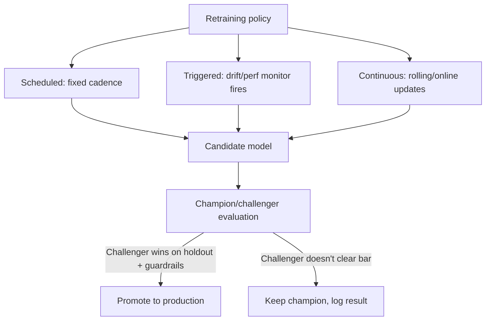

# Model Retraining Strategies

## TL;DR
Retraining cadence is a cost/freshness tradeoff with three basic policies: **scheduled** (retrain
every N days regardless), **triggered** (retrain when a drift or performance monitor fires), and
**continuous** (retrain constantly, e.g., online learning or daily incremental updates). None of
them should auto-promote to production — every retrained model goes through a **champion/challenger**
evaluation first, because "retrained" is not the same as "better."

## Intuition
Think of it like re-tuning a musical instrument. Scheduled = you retune before every concert whether
it needs it or not (safe, sometimes wasteful). Triggered = you retune when it sounds off (efficient,
but you need a reliable "sounds off" detector). Continuous = the instrument retunes itself in real
time (great in theory, terrifying if the tuning mechanism itself has a bug — now every note is
wrong).

## The maths
Model quality as a function of time since last training degrades roughly monotonically for most
non-stationary problems:

$$
\text{Quality}(t) = Q_0 - \delta(t), \quad \delta(t) \text{ increasing with concept/data drift rate}
$$

Retraining cost $C_r$ (compute, validation, deployment risk) is roughly fixed per retrain; benefit
is the recovered quality $\delta(t)$ at the retrain point. The economically optimal retraining
frequency $f^*$ balances:

$$
f^* = \arg\min_f \; f \cdot C_r + \int_0^{1/f} \delta(t)\, \text{Cost}_{\text{business}}(t)\, dt
$$

In words: retrain often enough that the accumulated cost of staleness between retrains doesn't
exceed the cost of retraining itself. A slow-drifting problem (customer LTV) tolerates monthly
retrains; a fast-drifting one (fraud, ad click-through) may need daily or trigger-based retraining.

## Diagram


## Code
A trigger-based retraining check, run as a scheduled job that decides whether to *kick off* a
training pipeline (see [[training-pipelines]] and [[orchestration-and-workflows]] for the pipeline
itself):

```python
def should_retrain(psi_score: float, rolling_accuracy_drop: float) -> bool:
    DRIFT_THRESHOLD = 0.25
    ACCURACY_DROP_THRESHOLD = 0.03  # 3 percentage points
    return psi_score > DRIFT_THRESHOLD or rolling_accuracy_drop > ACCURACY_DROP_THRESHOLD

if should_retrain(psi_score=today_psi, rolling_accuracy_drop=acc_drop):
    dbutils.jobs.run_now(job_id=RETRAIN_PIPELINE_JOB_ID)
```

Champion/challenger comparison before promotion, using MLflow's model registry stages/aliases:

```python
import mlflow
client = mlflow.MlflowClient()

challenger_metrics = evaluate_on_holdout(challenger_model, holdout_df)
champion_metrics = evaluate_on_holdout(champion_model, holdout_df)

if (challenger_metrics["auc"] > champion_metrics["auc"] + 0.01
        and challenger_metrics["calibration_error"] <= champion_metrics["calibration_error"] * 1.1):
    client.set_registered_model_alias("churn_rf", "champion", challenger_version.version)
else:
    print("Challenger did not clear promotion bar — champion retained")
```

## In practice
- **Use it when:** scheduled retraining as the default for most business problems (weekly/monthly);
  triggered retraining when you have reliable drift/performance monitoring and drift is irregular
  (bursty, event-driven, like a fraud pattern shift); continuous/online learning only for
  high-volume, fast-moving problems where the infrastructure cost is justified (ad ranking, some
  recommender systems) — it's the highest-maintenance option.
- **Defaults that work:** scheduled retraining on a cadence matched to the domain's natural drift
  rate (weekly for most tabular business problems), plus a triggered *safety net* on top so an
  unexpected drift event doesn't have to wait for the schedule.
- **Breaks when:** continuous retraining without strong automated evaluation gates — a feedback
  loop can form where a slightly-off model's predictions influence the labels it's later trained on
  (this is a classic recommender-system trap), silently degrading quality with no obvious single
  cause.
- **Cost / latency:** scheduled retraining has predictable, budgetable compute cost; triggered
  retraining has spiky, less predictable cost but avoids paying for retrains nobody needed;
  continuous retraining has the highest steady-state compute and engineering cost (pipeline must
  be bulletproof since it runs unattended, constantly).

### Champion/challenger, concretely
1. Train the challenger on the latest available labeled data.
2. Evaluate both champion and challenger on the *same*, most recent holdout set — never compare
   the challenger's fresh holdout against the champion's original (stale) test metrics.
3. Check not just the primary metric (AUC, RMSE) but calibration, fairness/segment-level metrics,
   and latency/resource footprint — a challenger that's 1% better on AUC but miscalibrated or 5x
   slower to serve may not be a net win.
4. Promote via shadow mode or a canary rollout (see [[shadow-and-canary-deployment]]) rather than
   a hard cutover, so a bad promotion is caught before it affects all traffic.

## Interview angle
**Q. How do you decide between scheduled and triggered retraining for a given model?**
Look at the domain's drift characteristics. If drift is slow and roughly continuous (customer
lifetime value, credit risk over macroeconomic cycles), a scheduled cadence matched to that rate is
simplest and predictable. If drift is bursty and event-driven (a new fraud pattern emerging, a
sudden market shift), a fixed schedule either retrains too often (wasting compute during calm
periods) or too rarely (missing a fast-emerging shift) — triggered retraining reacts to the actual
signal instead. Most mature systems run both: a baseline schedule plus a drift-triggered safety net.

**Follow-up.** What has to be true of your monitoring for triggered retraining to be safe to rely
on? → The drift/performance monitor has to have low false-negative rate for the failure modes that
matter (see [[model-monitoring]]) — if the trigger doesn't fire reliably, triggered retraining
silently becomes "never retrain."

**Q. Why can't you just auto-promote every retrained model straight to production?**
Because "retrained on newer data" doesn't imply "better" — a smaller or noisier recent data window,
a labeling pipeline bug, or a training run that got a bad hyperparameter draw can all produce a
challenger that's actually worse than the current champion. Champion/challenger evaluation on a
shared, recent holdout set — plus a staged rollout (shadow or canary) rather than a hard cutover —
catches this before it reaches all users.

**Follow-up.** What metrics beyond the primary one should the challenger clear before promotion? →
Calibration, segment/fairness-relevant slices (not just aggregate metric), latency/resource cost if
the model architecture changed, and ideally an early read from shadow-mode traffic before a full
canary.

**Q. What's the danger specific to continuous/online retraining that scheduled retraining doesn't
have?**
Feedback loops: if the model's own predictions influence the data it's later trained on (a
recommender suppressing certain items, so they get fewer clicks, so the model learns they're less
relevant, reinforcing the suppression), continuous retraining can amplify a small initial bias into
a large one with no discrete "bad deploy" moment to point to — much harder to detect and diagnose
than a scheduled retrain that clearly regressed on a known evaluation date.

## Traps
- "We retrain nightly, so we're always fresh" stated as if that alone solves drift — a nightly
  retrain with no evaluation gate can just as easily nightly-deploy a worse model.
- Comparing challenger metrics against the champion's *original* test-set metrics instead of a
  fresh, shared, recent holdout — this makes every challenger look artificially better (or worse)
  due to distribution differences between the two evaluation sets.
- Assuming continuous/online learning is strictly superior because it's "more real-time" — it trades
  simplicity and auditability for freshness, and introduces feedback-loop risk that batch retraining
  with discrete evaluation gates doesn't have.
- Retraining on a schedule that ignores the label-availability lag — retraining weekly is pointless
  if true labels only arrive after 45 days; you'd be retraining on stale or leaked data.

## Flashcards
What are the three basic retraining cadence policies?::Scheduled (fixed interval), triggered (drift/performance-based), and continuous (constant/online updates).
Why should every retrained model go through champion/challenger evaluation rather than auto-promoting?::A retrain on newer data isn't guaranteed to be better — a bad data window, pipeline bug, or unlucky hyperparameter run can produce a worse challenger; evaluation catches this before it reaches production.
What's the key rule for comparing champion and challenger metrics fairly?::Evaluate both on the same, most recent shared holdout set — never compare the challenger's fresh metrics against the champion's original stale test metrics.
What's the main risk unique to continuous/online retraining?::Feedback loops — the model's own predictions can influence the data it's later trained on, amplifying small biases with no discrete bad-deploy moment to trace.
When is triggered retraining preferable to a fixed schedule?::When drift is bursty and event-driven rather than slow and continuous — a fixed schedule either wastes compute in calm periods or misses fast emerging shifts.
Besides the primary metric, what else should a challenger be checked on before promotion?::Calibration, segment/fairness-relevant slices, and latency/resource cost — not just an aggregate accuracy or AUC improvement.

## Related
[[data-drift-and-concept-drift]]
[[model-monitoring]]
[[shadow-and-canary-deployment]]
[[model-registry-and-versioning]]
[[training-pipelines]]
[[experiment-tracking-mlflow]]
