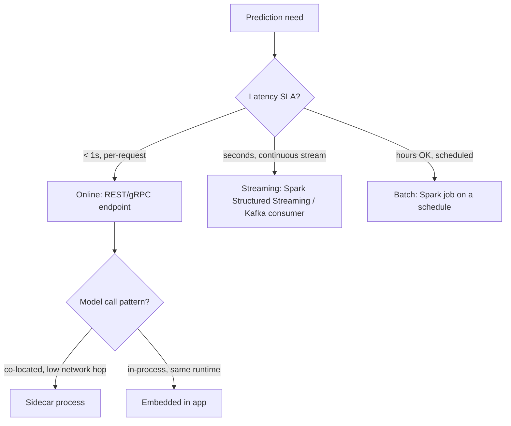

# Model Serving Patterns

## TL;DR
There are three fundamentally different ways to get a prediction out of a trained model: **online**
(a request-response endpoint, REST/gRPC), **batch** (score a large dataset on a schedule), and
**streaming** (score records continuously as they flow through a message bus). Pick based on
latency SLA, throughput, and how fresh the input features need to be — not on what's fashionable.
A second, orthogonal choice is **sidecar vs embedded**: does the model live in its own process next
to your app, or inside the app itself.

## Intuition
Imagine three kinds of restaurants: à la carte (online — one customer, one order, cooked to order,
must be fast), a catering hall running one giant batch for a wedding (batch — huge throughput, no
individual latency requirement, done ahead of time), and a food truck serving a moving line
continuously (streaming — steady throughput, bounded per-item latency, but no fixed start/end).
You wouldn't cater a wedding à la carte, and you wouldn't run a food truck like a batch kitchen.

## The maths
Serving pattern choice is really a constraint-satisfaction problem over three variables:

$$
\text{latency SLA } (L), \quad \text{throughput } (T \text{ requests/sec}), \quad \text{feature freshness } (F)
$$

- Online: optimizes for low $L$ (milliseconds), tolerates lower $T$ per instance (compensated by
  horizontal scaling), needs point-in-time-correct $F$.
- Batch: optimizes for high $T$ (vectorized over millions of rows), $L$ is irrelevant (hours are
  fine), $F$ is whatever the last ETL run produced.
- Streaming: intermediate — bounded $L$ (seconds), high sustained $T$, $F$ is "as new as the last
  micro-batch/message."

The practical cost driver is compute utilization: batch amortizes model-load and JVM/Python
startup cost over millions of rows, so its per-row cost is far lower than online serving, which
pays a per-request overhead (network hop, feature lookup, serialization) that doesn't shrink with
volume.

## Diagram


## Code
Online serving with FastAPI, embedded model (loaded once at startup, called in-process):

```python
from fastapi import FastAPI
import mlflow.pyfunc

app = FastAPI()
model = mlflow.pyfunc.load_model("models:/churn_rf/Production")  # loaded once, at startup

@app.post("/predict")
def predict(features: dict):
    import pandas as pd
    df = pd.DataFrame([features])
    return {"prediction": float(model.predict(df)[0])}
```

Batch scoring on Databricks — the same registered model, applied to a Delta table:

```python
import mlflow

predict_udf = mlflow.pyfunc.spark_udf(spark, model_uri="models:/churn_rf/Production")

scored = (
    spark.read.table("prod.silver.customer_features")
    .withColumn("churn_score", predict_udf(*feature_cols))
)
scored.write.mode("overwrite").saveAsTable("prod.gold.churn_scores")
```

Streaming scoring — same UDF, applied to a Structured Streaming DataFrame instead of a static one:

```python
(
    spark.readStream.table("prod.silver.transactions_stream")
    .withColumn("fraud_score", predict_udf(*feature_cols))
    .writeStream.trigger(processingTime="10 seconds")
    .toTable("prod.gold.fraud_scores_live")
)
```

## In practice
- **Use it when:** online for user-facing, single-entity decisions (fraud block, recommendation
  on page load); batch for large-scale, non-urgent scoring (nightly churn scores, demand forecasts);
  streaming when you need near-real-time freshness across a continuous, unbounded input.
- **Defaults that work:** start batch unless you have a demonstrated latency requirement — batch is
  cheaper, simpler to test, and easier to roll back. Move to streaming or online only when the
  product actually needs it.
- **Breaks when:** you build an online endpoint for a use case that's actually batch (demand
  forecasting doesn't need millisecond latency) — you pay for always-on compute and operational
  complexity you don't need. Conversely, forcing a batch pipeline into a "just call it more often"
  hack (cron every minute) instead of proper streaming gives you neither low latency nor batch
  efficiency.
- **Cost / latency:** online endpoints need warm/provisioned compute (cost even at zero traffic,
  unless serverless with cold-start tradeoffs); batch is the cheapest per-prediction but stalest;
  streaming sits in between on both axes and adds operational surface (checkpointing, backpressure,
  exactly-once semantics).

### Sidecar vs embedded
- **Embedded**: model loaded directly inside the application process (as above). Lowest latency
  (no network hop), but couples the app's deployment lifecycle to the model's — redeploying the
  model means redeploying the app, and a memory-hungry model (a 7B LLM) can crowd out the app's own
  resources.
- **Sidecar**: model runs as a separate process/container next to the app (e.g., a dedicated
  inference server like NVIDIA Triton, TorchServe, or a separate [[fastapi]] service), called over
  localhost or gRPC. Decouples model updates from app deploys and isolates resource usage, at the
  cost of a network hop's worth of latency (usually sub-millisecond on localhost, more over a
  service mesh) and an extra moving part to operate.

## Interview angle
**Q. When would you choose streaming inference over a very frequent batch job?**
When the freshness requirement is tighter than your batch cadence can deliver economically — e.g.
fraud detection needs a decision within seconds of a transaction, not "run every 5 minutes and hope."
Streaming also handles unbounded, continuously-arriving data naturally (no need to define batch
boundaries), and gives bounded per-record latency instead of "wait for the next batch window."
The tradeoff is operational complexity: checkpointing, watermarking for late data, and harder
debugging than a batch job you can just re-run.

**Follow-up.** How would you decide the trigger interval for a Structured Streaming job? → Balance
the freshness need against the overhead of triggering micro-batches too often (small-file problems
on the sink, JVM/scheduler overhead) — a 10–30 second `processingTime` trigger is a common
sweet spot for "near real-time but not literally per-event."

**Q. Sidecar or embedded for serving a model as part of a larger microservice?**
Depends on the coupling you want. Embedded if the model is small, changes rarely, and low latency
matters most (a small XGBoost model for a request-routing decision). Sidecar if the model is large,
updates on its own cadence independent of app releases, needs GPU resources the app container
shouldn't carry, or is shared across multiple app services (a shared embedding/reranking model
behind several product features) — the sidecar/dedicated-service pattern is also what lets you
scale model replicas independently of app replicas.

**Q. Design the serving architecture for a real-time fraud-scoring system processing 5,000
transactions/sec with a 100ms latency budget.**
Online REST/gRPC endpoint behind a load balancer, model embedded or in a co-located sidecar to
avoid an extra network hop eating the budget, features pulled from a low-latency online feature
store (see [[feature-stores]]) rather than recomputed on the fly, model kept small/quantized enough
to fit the latency budget, horizontal autoscaling on request volume, and a fallback rule-based
score if the model call times out (never let ML unavailability block the transaction pipeline).

## Traps
- "Streaming is just batch run more often" — no; streaming systems have to handle unbounded input,
  late/out-of-order data, and exactly-once vs at-least-once delivery semantics that batch jobs never
  face. Treating them as interchangeable causes correctness bugs (double-counted events) not just
  performance ones.
- Defaulting to an always-on REST endpoint for everything "to be safe" — burns money on idle compute
  for workloads that were always going to be batch.
- Ignoring feature freshness at serving time — an online model scoring against features that are
  actually a day stale (because the feature pipeline is still batch) silently degrades to
  batch-quality predictions while paying online-serving cost.
- Conflating "sidecar" with "microservice per model" at massive fan-out — one sidecar per model per
  pod can multiply resource overhead; a shared model-serving tier is often more efficient at scale.

## Flashcards
What are the three core model serving patterns?::Online (request-response endpoint), batch (scheduled scoring of a dataset), and streaming (continuous scoring of an unbounded input stream).
What's the main cost advantage of batch serving over online?::It amortizes model-load and per-call overhead across millions of rows, giving much lower per-prediction cost; latency is irrelevant so there's no need for always-on provisioned compute.
Embedded vs sidecar serving — what's the core tradeoff?::Embedded has lower latency but couples model and app deploy lifecycles; sidecar decouples them and isolates resources at the cost of a network hop and extra operational surface.
Why might a "just cron it every minute" approach fail to substitute for real streaming?::It doesn't handle unbounded/continuous input, late or out-of-order events, or delivery semantics (at-least-once vs exactly-once) correctly — those need real streaming infrastructure.
When should you default to batch serving?::Whenever there's no demonstrated latency SLA requiring online/streaming — it's cheaper, simpler, and easier to test and roll back.
What determines whether fraud detection needs online vs batch serving?::The decision must happen within the transaction window (seconds), so it needs online/streaming with a low-latency feature store, not batch.

## Related
[[batch-vs-realtime-inference]]
[[feature-stores]]
[[training-serving-skew]]
[[llm-serving-and-throughput]]
[[shadow-and-canary-deployment]]
