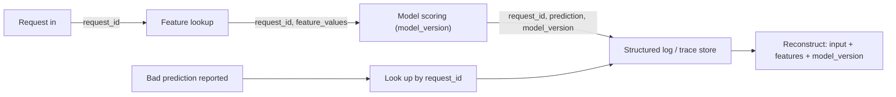

# Observability and Logging for ML Systems

## TL;DR
Observability rests on three pillars — logs (discrete events), metrics (aggregated numbers over
time), and traces (the path a single request took across services). For ML systems the pillar that
generic software observability misses is the ability to tie a *bad prediction* back to the exact
input, feature values, and model version that produced it — without that, "why did the model say
this" is undebuggable.

## Intuition
Metrics tell you *something* is wrong (latency p99 spiked, accuracy dropped 3 points). Logs tell you
*what happened* at a point in time. Traces tell you *where in the request path* it happened. For ML
specifically, none of the three pillars alone answers "why did this one customer get denied a loan" —
that needs a fourth thing: a durable link from a prediction ID back to its input payload, the feature
values used, and the exact model artifact version that scored it.

## The maths
Not maths-heavy, but two quantitative ideas recur in interviews:

- **Cardinality cost of structured logs**: if you log $k$ high-cardinality fields (user_id, request_id)
  per event at $n$ events/sec, your log storage/indexing cost scales with $k \times n$ — this is why
  teams sample or aggregate rather than log every field at full fidelity in production.
- **Correlation via a request/prediction ID**: given a prediction $p$ made at time $t$, you need a
  join key (a `request_id` or `prediction_id`) present in (a) the logged input payload, (b) the
  feature store lookup log, (c) the model-serving log with `model_version`, and (d) any downstream
  outcome/label log — the ID is what lets you `JOIN` these four artifacts back together when someone
  disputes a prediction weeks later.

## Diagram


## Code
```python
import logging
import json
import uuid
from datetime import datetime, timezone

logger = logging.getLogger("scoring_service")

def log_prediction(request_id: str, input_payload: dict, features: dict,
                    model_version: str, prediction: float, latency_ms: float) -> None:
    """Structured log line — one JSON object per prediction, correlatable by request_id."""
    record = {
        "timestamp": datetime.now(timezone.utc).isoformat(),
        "request_id": request_id,
        "model_version": model_version,
        "input_hash": hash(json.dumps(input_payload, sort_keys=True)),  # avoid logging raw PII
        "feature_values": features,      # only non-PII derived features
        "prediction": prediction,
        "latency_ms": latency_ms,
    }
    logger.info(json.dumps(record))

def score(input_payload: dict, model, feature_store, model_version: str) -> dict:
    request_id = str(uuid.uuid4())
    t0 = time.perf_counter()
    features = feature_store.lookup(input_payload["entity_id"])
    prediction = model.predict(features)
    latency_ms = (time.perf_counter() - t0) * 1000
    log_prediction(request_id, input_payload, features, model_version, prediction, latency_ms)
    return {"request_id": request_id, "prediction": prediction}
```

```sql
-- Reconstructing "why did the model say this" from structured logs in a lake table
SELECT request_id, model_version, feature_values, prediction, latency_ms, timestamp
FROM ml_logs.prediction_log
WHERE request_id = 'a1b2c3d4-...'
```

## In practice
- **Use it when:** any model serving real predictions to users or downstream systems, and any batch
  pipeline where "which run produced this row" needs to be answerable.
- **Defaults that work:** structured (JSON) logs, not free-text; a `request_id` generated at the
  entry point and threaded through every downstream log line and trace span; `model_version` logged
  on every prediction, not just at deploy time; metrics emitted separately from logs (don't compute
  aggregates by grepping log files in production).
- **Breaks when:** logs are unstructured strings — you can't reliably query "all predictions from
  model v12 with latency > 500ms" out of grep-able free text at scale; or when the correlation ID
  isn't propagated through an async/queue boundary, breaking the trace.
- **Cost / latency:** structured logging at full input fidelity for every request is often too
  expensive/risky (PII, storage) — log hashes or non-PII derived features, and sample raw payloads at
  a low rate for deep debugging rather than always.

## Interview angle
**Q. A customer complains a model gave them a bad decision three weeks ago. Walk me through how you'd
investigate.**
Look up the `request_id` (from the customer's support ticket / API response) in the structured
prediction log; that record should carry the model_version, the feature values used, and (via a hash
or reference) the raw input. Reconstruct: was the model version the one live at that time? Were the
feature values correct/fresh, or was there a feature-store staleness bug? Only then look at whether
the model's *behaviour* was reasonable given those exact inputs — reproduce the prediction offline
with the same model artifact and inputs to rule out a serving-layer bug.

**Follow-up.** What if the feature values logged don't match what you compute for that entity today?
→ That's evidence of training-serving skew or feature-store staleness/backfill — the logged values
are ground truth for what happened, not today's recomputation, which is exactly why you log the
values used at inference time rather than relying on being able to recompute them later.

**Q. What are the three pillars of observability and how do they map onto an ML system specifically?**
Logs = discrete events (a prediction was made, an error was thrown); metrics = aggregated numbers
over time (p99 latency, request rate, live accuracy proxy, drift score); traces = the path one
request took across services (gateway → feature store → model server → post-processing). For ML,
metrics alone (e.g. "accuracy dropped") tell you something's wrong but not why — you need the
logs/traces layer to get to a specific input and model version.

**Q. Why can't you just log every raw input at full fidelity for debugging?**
Cost (storage/indexing at scale) and, more importantly, PII/compliance risk — raw inputs often
contain sensitive customer data, and retaining it indefinitely in logs creates a second, less-governed
copy of regulated data. Log a hash/reference plus derived non-PII features, and sample raw payloads
at low rate under access control for deep debugging.

**Q. How do you monitor a model's health beyond "is the service up"?**
Layer metrics: infra health (latency, error rate, throughput), input health (feature drift vs
training distribution, null rates, schema violations), and outcome health (prediction distribution
shift, and — once labels arrive — live accuracy/calibration vs a held-out baseline). Each layer alerts
on a different failure mode; infra can be fine while the model is silently degrading on drifted input.

## Traps
- "Logging = observability" — logs alone can't answer aggregate questions cheaply (need metrics) or
  cross-service causality questions (need traces); the three pillars are complementary, not
  substitutes.
- Not propagating a correlation ID across an async boundary (message queue, batch job) — the trace
  breaks exactly where debugging usually needs it most.
- Logging raw PII "just in case it's useful for debugging" — this creates an unmanaged second copy of
  sensitive data and is a direct security/compliance liability (see [[security-and-pii-in-ml]]).
- Treating model-version as implicit ("it's whatever was deployed then") instead of an explicit field
  on every prediction log — deployments happen mid-day and "then" is ambiguous without it.

## Flashcards
What are the three pillars of observability?::Logs (discrete events), metrics (aggregated numbers over time), traces (a request's path across services).
What extra correlation does ML observability need beyond generic software observability?::A durable link from a prediction back to its exact input, feature values, and model version, via a request/prediction ID.
Why prefer structured (JSON) logs over free text for prediction logging?::They're reliably queryable at scale (filter/aggregate by field) rather than requiring fragile text parsing.
Why log a hash of the input rather than the raw input?::To avoid creating an ungoverned, PII-laden copy of sensitive data purely for debugging convenience.
What three layers should ML model monitoring cover?::Infra health (latency/errors), input health (drift, nulls, schema), outcome health (prediction shift, live accuracy/calibration).
Why must model_version be logged per-prediction rather than inferred from deploy time?::Deployments happen mid-day; "the model at that time" is ambiguous without an explicit per-prediction field.

## Related
[[model-monitoring]]
[[data-drift-and-concept-drift]]
[[security-and-pii-in-ml]]
[[training-serving-skew]]
[[model-serving-patterns]]
