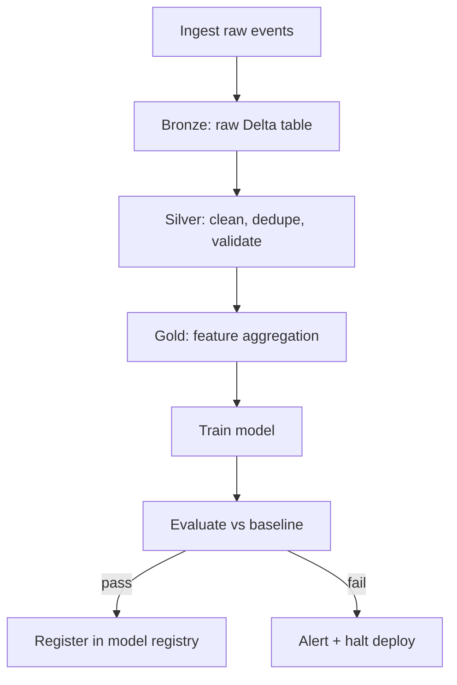

# Orchestration and Workflows

## TL;DR
Orchestration is scheduling and running a set of interdependent tasks (extract → transform → train →
evaluate → deploy) as a DAG, with retries, backfills, alerting and dependency awareness built in.
Airflow, Dagster and Databricks Workflows all solve the same core problem — "run task B only after
task A succeeds, on a schedule, and tell me when it doesn't" — with different opinions on authoring
model and state.

## Intuition
A cron job knows *when* to run something. An orchestrator knows *what depends on what*, so it can
retry only the failed branch, skip downstream tasks when an upstream one fails, backfill three months
of missed daily partitions in one command, and show you exactly where a 2am pipeline broke. The DAG
(directed acyclic graph) is the whole idea: tasks are nodes, dependencies are edges, and "acyclic"
guarantees the pipeline can't wait on itself forever.

## The maths
A workflow is a DAG $G = (V, E)$ where $V$ is the set of tasks and $E$ the set of dependency edges;
$(u, v) \in E$ means task $v$ cannot start until task $u$ succeeds. The orchestrator computes a
topological ordering of $V$ so that every task runs after all its predecessors. Two properties matter
operationally:

- **Idempotency of each node**: rerunning task $v$ with the same inputs produces the same output and
  doesn't double-count — this is what makes retries and backfills safe rather than corrupting.
- **Backfill as a schedule replay**: for a daily task $v$ with logical dates $d_1, \dots, d_n$, a
  backfill is just re-invoking $v$ for each missed $d_i$, provided $v$'s logic partitions by date
  input rather than "process everything since last run" (the latter breaks on reruns).

## Diagram


## Code
```python
# Databricks Workflows via the Jobs API (declarative task graph)
job_config = {
    "name": "daily-fraud-retrain",
    "tasks": [
        {"task_key": "ingest", "notebook_task": {"notebook_path": "/pipelines/ingest_bronze"}},
        {
            "task_key": "silver_clean",
            "depends_on": [{"task_key": "ingest"}],
            "notebook_task": {"notebook_path": "/pipelines/silver_clean"},
        },
        {
            "task_key": "train",
            "depends_on": [{"task_key": "silver_clean"}],
            "notebook_task": {"notebook_path": "/pipelines/train_xgb"},
            "max_retries": 2,
            "min_retry_interval_millis": 60000,
        },
        {
            "task_key": "evaluate",
            "depends_on": [{"task_key": "train"}],
            "notebook_task": {"notebook_path": "/pipelines/evaluate"},
        },
    ],
    "schedule": {"quartz_cron_expression": "0 0 2 * * ?", "timezone_id": "Asia/Kolkata"},
}
```

```python
# Same DAG shape, expressed in Airflow (for contrast — same dependency logic)
from airflow.decorators import dag, task
from datetime import datetime

@dag(schedule="@daily", start_date=datetime(2026, 1, 1), catchup=True)
def daily_fraud_retrain():
    @task(retries=2, retry_delay=60)
    def ingest(): ...
    @task
    def silver_clean(): ...
    @task
    def train(): ...
    @task
    def evaluate(): ...

    evaluate(train(silver_clean(ingest())))

daily_fraud_retrain()
```

## In practice
- **Use it when:** any multi-step pipeline with real dependencies, especially ones that must run on
  a schedule with failure handling — training pipelines, feature pipelines, batch scoring, agentic
  multi-step workflows.
- **Defaults that work:** partition tasks by logical date (not "now"), make every task idempotent,
  set sane retry counts (2-3) with exponential backoff, alert on task failure not just DAG failure so
  you know which stage broke.
- **Breaks when:** tasks aren't idempotent (a retry double-writes or double-charges), or the DAG
  hides a *data* dependency the orchestrator doesn't know about (task C reads a table task A writes,
  but the DAG only declares B → C) — this causes intermittent, hard-to-reproduce failures.
- **Cost / latency:** orchestration overhead itself is small (seconds of scheduling latency); the real
  cost lever is whether tasks fan out to right-sized clusters and shut down when idle, and whether
  retries are bounded so a broken task doesn't loop indefinitely.

## Interview angle
**Q. Walk me through how you'd design a daily retraining pipeline with backfill support.**
Partition every task by logical/execution date rather than wall-clock "now" so each run is
self-contained and reproducible; make ingestion and transformation idempotent (upsert/merge, not
append) so reruns for a past date don't duplicate data; declare explicit task dependencies (ingest →
clean → feature-build → train → evaluate → register) so a failure halts only downstream tasks; expose
a backfill command that replays the DAG for a date range.

**Follow-up.** A backfill for the last 30 days needs to run without overwhelming shared cluster
capacity — how do you throttle it? → Use the orchestrator's concurrency/pool limits (Airflow pools,
Databricks Workflows' max concurrent runs) to cap parallel backfill task instances, and/or serialise
by date if downstream tasks share a resource.

**Q. Airflow vs Databricks Workflows vs Dagster — how do you choose?**
Databricks Workflows if the whole pipeline lives inside Databricks (notebooks/jobs/DLT) and you want
native cluster/lineage integration with zero extra infra. Airflow when you need to orchestrate across
many heterogeneous systems (Databricks + a REST API + a Kubernetes job + an email) with a mature
ecosystem of operators. Dagster when you want strong software-defined-assets semantics — testable,
typed data assets rather than opaque tasks — and better local development/testing story.

**Q. What's the difference between a task failing and a task retrying, and how do you decide retry
counts?**
A failure is terminal for that run unless a retry is configured; retries should be bounded (2-3) with
backoff so a systemic outage (e.g. the source API is down) doesn't hammer it repeatedly, and paired
with alerting after the final retry so a human is looped in rather than the pipeline silently going
stale.

**Q. How do you avoid a DAG becoming an untestable ball of notebooks?**
Keep task logic in importable, unit-testable modules/functions and have the notebook or task be a
thin entrypoint that calls them; this lets you unit-test the transformation logic outside the
orchestrator and only integration-test the DAG shape itself.

## Traps
- Confusing "scheduled" with "orchestrated" — a cron job that runs five sequential scripts with no
  dependency awareness will happily run step 3 even after step 1 failed; that's not orchestration.
- Non-idempotent tasks — "append new rows" logic breaks the moment you need to retry or backfill,
  because a retry after partial failure double-appends.
- Ignoring the "catchup" backfill behaviour — most orchestrators will try to run every missed
  scheduled interval since `start_date` unless you explicitly disable catchup, which can trigger a
  surprise flood of historical runs.
- Treating orchestration as purely a scheduling problem and ignoring data dependencies that aren't
  expressed as DAG edges — the DAG is only correct if it reflects every real read/write dependency.

## Flashcards
What makes a workflow a DAG and not just a schedule?::Explicit dependency edges between tasks, so downstream tasks only run after upstream ones succeed — not just time-based triggering.
Why must pipeline tasks be idempotent for orchestration to be safe?::Because retries and backfills re-invoke the same task; without idempotency, reruns duplicate or corrupt data.
What is a backfill?::Replaying a DAG's logic for a range of past logical dates it either missed or needs recomputed.
When would you pick Airflow over Databricks Workflows?::When orchestrating across many heterogeneous systems beyond Databricks itself, needing a broad operator ecosystem.
What does "catchup" do in Airflow and why is it dangerous by default?::It runs every missed scheduled interval since the DAG's start date, which can trigger a flood of historical runs if not disabled deliberately.
Why partition tasks by logical date instead of "now"?::So each run is self-contained, reproducible, and safely rerunnable/backfillable independent of when it actually executes.

## Related
[[training-pipelines]]
[[infrastructure-as-code]]
[[dlt-declarative-pipelines]]
[[medallion-architecture]]
[[batch-vs-realtime-inference]]
