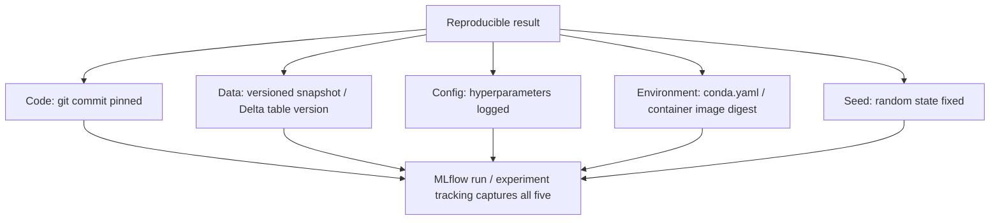

# Reproducibility

## TL;DR
Reproducing an ML result requires pinning five things together, not one: **code**, **data**,
**config/hyperparameters**, **environment** (library/OS versions), and **random seeds**. Miss any
one and "it worked on my machine" becomes a debugging nightmare, because ML failures are usually
silent — a wrong result still looks like a plausible number, unlike a stack trace.

## Intuition
A cooking recipe that only records the ingredients (data) but not the exact oven temperature
(environment), the order of steps (code), the amount of salt (config), or which specific stove was
used to test it (seed/hardware nondeterminism) will produce a different dish every time someone else
tries it — and worse, they won't be able to tell *why* it came out different, because nothing about
the dish itself looks obviously wrong.

## The maths
Reproducibility is a five-dimensional pinning problem:

$$
\text{Result} = f(\underbrace{\text{code}}_{C},\ \underbrace{\text{data}}_{D},\ \underbrace{\text{config}}_{H},\ \underbrace{\text{environment}}_{E},\ \underbrace{\text{seed}}_{S})
$$

Reproducing a result requires fixing all five: $C, D, H, E, S$ identical $\Rightarrow$ identical
(or, for GPU non-determinism, statistically indistinguishable) result. Change any one and you no
longer have a controlled comparison — which is exactly why an un-pinned training run "improving"
overnight is not evidence of anything: you don't know which of the five changed.

Note that even with all five pinned, some non-determinism can remain from GPU kernel scheduling
(atomic add ordering in parallel reductions) — bitwise-identical results across hardware are not
always achievable, but statistically indistinguishable results (same distribution of outcomes
across seeds) should be.

## Diagram


## Code
Pinning all five dimensions in a single MLflow-tracked training run:

```python
import mlflow, random, numpy as np
import torch

SEED = 42
random.seed(SEED)
np.random.seed(SEED)
torch.manual_seed(SEED)
torch.use_deterministic_algorithms(True)   # trade some speed for determinism

with mlflow.start_run():
    mlflow.log_param("seed", SEED)
    mlflow.log_param("data_version", "prod.silver.customer_features@v17")   # Delta table version
    mlflow.log_params(hyperparams)                                          # config
    mlflow.log_param("git_commit", get_current_git_sha())                   # code

    model = train(hyperparams, seed=SEED)
    mlflow.sklearn.log_model(model, "model")   # captures the environment automatically
```

Reading a Delta table at a pinned historical version — this is what makes "data" reproducible on
Databricks, since a plain table reference otherwise points at whatever the table looks like *now*:

```python
df = spark.read.option("versionAsOf", 17).table("prod.silver.customer_features")
# or, time-based:
df = spark.read.option("timestampAsOf", "2026-08-01").table("prod.silver.customer_features")
```

## In practice
- **Use it when:** every training run that might need to be audited, debugged, or exactly repeated
  later — which in practice means every training run in a regulated or business-critical context,
  and ideally all of them by default since the marginal cost of logging is low.
- **Defaults that work:** MLflow autologging captures most of this (params, metrics, environment,
  git commit) with almost no code; Delta Lake's time travel (`versionAsOf`) gives you data
  versioning for free if your feature tables are already Delta (see [[data-versioning]] and
  [[delta-lake]]); set and log a seed even when you don't think it matters — you'll thank yourself
  when a bug report says "the model behaves differently."
- **Breaks when:** "data" is treated as reproducible just because there's a file path — if the file
  or table at that path is mutable (a table that gets appended to daily with no versioning), the
  same code pointed at "the same table" six months later reads different data with no error and no
  warning.
- **Cost / latency:** fully deterministic GPU training (`torch.use_deterministic_algorithms(True)`)
  can slow training meaningfully (some fast non-deterministic kernels have no deterministic
  equivalent) — a reasonable default is to log seeds and accept statistical (not bitwise)
  reproducibility for expensive deep learning training, reserving full determinism for
  smaller/critical runs.

## Interview angle
**Q. A model trained last quarter can no longer be reproduced — retraining with "the same" code and
data gives different results. Where do you look?**
Go through the five dimensions systematically. Data first, since it's the most commonly unpinned:
was the training data pulled from a live, mutable table rather than a versioned snapshot? Next,
environment: did a library get silently upgraded (an unpinned `requirements.txt`, a base image
`:latest` tag) that changed a default hyperparameter or numerical behavior? Then config: were
hyperparameters actually logged, or reconstructed from memory/a stale config file that's since been
edited? Then seed: was one set at all, and does it cover every source of randomness (data shuffling,
weight init, dropout, GPU non-determinism)? Code is usually the easiest to rule in/out since git
gives an exact diff — but the other four routinely get treated as "obviously the same" when they
aren't.

**Follow-up.** Which of these five is hardest to retrofit onto a system that didn't consider it
from day one? → Data versioning, because it requires the upstream data platform itself to support
point-in-time reads (Delta Lake time travel, a feature store with time-travel semantics) — if the
raw data was never captured or versioned, there may be no way to reconstruct exactly what a training
run saw six months ago; this is why data versioning ([[data-versioning]]) needs to be a platform
decision made early, not bolted on after the fact.

**Q. Why is "it worked on my machine" especially dangerous for ML, compared to regular software?**
In regular software, "worked on my machine but not in prod" usually manifests as a crash or an
obviously wrong output — loud and fast to notice. In ML, an unpinned environment or data difference
typically produces a model that trains successfully and predicts *plausible-looking* numbers that
are subtly wrong — no exception, no red flag, just quietly worse (or differently biased) predictions
that may not be caught until a business metric degrades weeks later. The failure mode is silent by
default, which is exactly why reproducibility has to be engineered in deliberately rather than
assumed.

**Q. Is bitwise-identical reproducibility achievable, and is it always the right bar?**
Not always, and not always necessary. GPU kernels with non-deterministic reduction order (parallel
atomic adds) can produce tiny floating-point differences even with every other variable pinned;
forcing full bitwise determinism can meaningfully slow training. The practical bar for most teams is
statistical reproducibility — the same five inputs produce results indistinguishable within
normal run-to-run variance — reserving the cost of full determinism for cases where an exact replay
is a hard requirement (a regulatory audit, debugging a specific reported anomaly).

## Traps
- "We use MLflow, so we're reproducible" as a complete answer — MLflow captures a lot automatically,
  but only if the training code actually logs the data version and seed; it can't retroactively
  version a table you read without a time-travel query.
- Treating a fixed file path as data versioning — a mutable table/file at a stable path is not
  pinned data; something changed the moment anyone else can read a different snapshot from the same
  reference.
- Setting a seed for one library (`np.random.seed`) and assuming it covers every source of
  randomness (Python's own `random`, framework-level RNGs, data loader shuffling, GPU
  non-determinism) — each needs its own seed set explicitly.
- Chasing bitwise-identical results as a universal requirement — often not achievable on GPU and
  not worth the training-speed cost when statistical reproducibility is enough for the actual need.

## Flashcards
What five things must be pinned together for a reproducible ML result?::Code, data, config/hyperparameters, environment, and random seeds.
Why is a stable file path not sufficient for data reproducibility?::If the table/file at that path is mutable, the same reference reads different data over time with no warning — true data versioning needs a point-in-time snapshot (e.g., Delta Lake time travel).
Why is "it worked on my machine" especially dangerous for ML vs regular software?::ML failures from unpinned environment/data are silent — the model trains successfully and produces plausible-looking but subtly wrong outputs, unlike a loud crash in regular software.
What does setting torch.use_deterministic_algorithms(True) trade off?::Full bitwise determinism at the cost of training speed, since some fast GPU kernels have no deterministic equivalent.
What does MLflow autologging typically capture toward reproducibility, and what must you add yourself?::It captures params, metrics, environment, and git commit automatically; you must explicitly log the data version (e.g., a Delta table version) and set/log random seeds yourself.
Why isn't bitwise-identical reproducibility always the right bar to aim for?::GPU non-determinism (parallel reduction order) can prevent it even with everything else pinned, and forcing it can slow training meaningfully — statistical reproducibility is often sufficient.

## Related
[[experiment-tracking-mlflow]]
[[data-versioning]]
[[delta-lake]]
[[model-packaging-and-containers]]
[[training-pipelines]]
