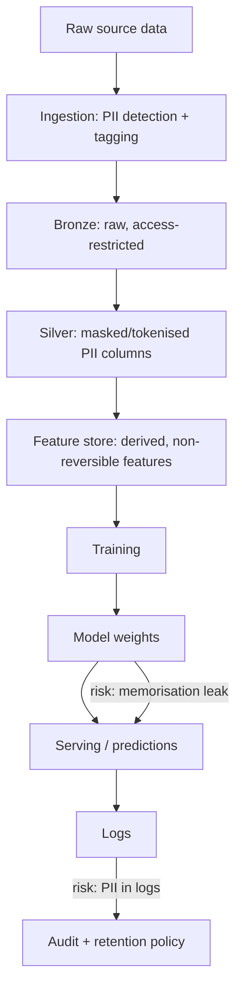

# Security and PII in ML Systems

## TL;DR
PII risk in ML has three distinct surfaces — data at rest (raw tables), data in motion through the
pipeline (features, logs, training sets), and data leaking back out through model behaviour (a model
memorising and regurgitating a training example, or an over-verbose LLM output). The controls are
data minimisation, detection/masking, layered access control (governance layer, not just app-layer
auth), and treating model outputs and logs as a leak surface, not just inputs.

## Intuition
Most engineers think "secure the database" and stop. But a model trained on PII can leak it through
its outputs even if the serving API never queries that database again — the model itself becomes a
compressed, harder-to-audit copy of the data. So the mental model is: PII isn't a place, it's a
substance that flows through ingestion → storage → features → training → model weights → predictions
→ logs, and you need controls at every stage, not just the first one.

## The maths
Not a numerical topic, but two structural principles are worth stating precisely:

- **Data minimisation as an optimisation**: for a modelling task, collect/retain the minimal feature
  set $F' \subseteq F$ such that model performance $\text{perf}(F') \approx \text{perf}(F)$ within an
  acceptable tolerance — every field in $F \setminus F'$ that doesn't move performance is pure
  liability with no offsetting benefit.
- **Access control as least privilege**: a subject $s$ should hold permission $p$ on resource $r$ only
  if $s$'s *task* requires $p$ on $r$ — Unity Catalog-style governance implements this as row/column-
  level grants plus dynamic views, not just table-level yes/no access.

## Diagram


## Code
```python
import re

def detect_pii_columns(df_sample: dict) -> list[str]:
    """Lightweight pattern-based PII flagging — a real pipeline would use a proper
    PII scanner (e.g. Presidio) plus column-name heuristics, not just regex."""
    patterns = {
        "email": re.compile(r"^[\w.+-]+@[\w-]+\.[a-z]{2,}$", re.IGNORECASE),
        "pan_india": re.compile(r"^[A-Z]{5}[0-9]{4}[A-Z]$"),
        "aadhaar_like": re.compile(r"^\d{4}\s?\d{4}\s?\d{4}$"),
        "phone_india": re.compile(r"^(\+91[\-\s]?)?[6-9]\d{9}$"),
    }
    flagged = []
    for col, values in df_sample.items():
        for kind, pattern in patterns.items():
            if any(pattern.match(str(v)) for v in values[:50] if v is not None):
                flagged.append((col, kind))
                break
    return flagged


def mask_column(value: str, kind: str) -> str:
    """Irreversible masking for logs/lower environments — not encryption, which is reversible."""
    if kind == "email":
        name, _, domain = value.partition("@")
        return f"{name[:1]}***@{domain}"
    return "***REDACTED***"
```

```sql
-- Unity Catalog: column-level masking via a dynamic view, not app-layer filtering
CREATE OR REPLACE VIEW silver.customers_masked AS
SELECT
  customer_id,
  CASE WHEN is_member('risk-ml-pii-readers') THEN email ELSE mask(email) END AS email,
  CASE WHEN is_member('risk-ml-pii-readers') THEN phone ELSE mask(phone) END AS phone,
  signup_date, region
FROM silver.customers;
```

## In practice
- **Use it when:** always, for any pipeline touching customer, employee or patient data — this is not
  optional hardening, it's baseline design.
- **Defaults that work:** classify and tag PII columns at ingestion (not as an afterthought); mask/
  tokenise PII before it reaches feature engineering wherever the raw value isn't needed; enforce
  access via the governance layer (Unity Catalog grants, row/column masking) rather than trusting
  every downstream notebook to filter correctly; scrub or hash PII before it hits application logs.
- **Breaks when:** access control lives only in application code — anyone with direct warehouse/lake
  access bypasses it entirely; this is why table/column-level grants in a catalog (not just API auth)
  matter.
- **Cost / latency:** masking and tokenisation add a small preprocessing cost; the larger cost is
  organisational — someone has to own PII classification and keep it current as new columns land.

## Interview angle
**Q. How do you prevent PII from leaking through a model's outputs, especially an LLM?**
At the data layer: minimise PII in training data in the first place, and mask/tokenise what must
remain. At the model layer: for LLMs, apply output-side guardrails — a PII detector/filter on
generated text before it's returned, and system-prompt/fine-tuning discipline that discourages
verbatim reproduction of training examples. At the evaluation layer: specifically test for
memorisation/leakage (canary strings, membership-inference-style probes) before shipping a model
trained on sensitive data. No single layer is sufficient — this is defence in depth.

**Follow-up.** Why is masking data before training not a complete fix? → A model can still learn and
later reproduce correlational patterns (e.g. inferring a masked attribute from surrounding context)
even without the raw value present verbatim — masking reduces but does not eliminate leakage risk, so
output-side controls are still needed.

**Q. What's the difference between access control at the application layer vs the governance/catalog
layer, and why does it matter for ML?**
App-layer control (an API checking a user's role before returning data) only protects that one access
path. A data scientist with a notebook and direct warehouse credentials bypasses it entirely. Catalog-
level governance (Unity Catalog grants, row/column security) enforces the same policy no matter which
tool or path is used to query the data — this is why "put access control in Unity Catalog, not just
the app" is the correct answer for anything with PII.

**Q. What does "data minimisation" mean practically, and how would you justify dropping a feature
that's mildly predictive but PII-adjacent?**
Collect and retain only what a task actually needs, and periodically re-justify retained sensitive
fields. If a feature is mildly predictive but carries PII/regulatory risk (e.g. a proxy for a
protected attribute), weigh the marginal lift against the liability and fairness/compliance exposure —
often the right call is to drop it or find a less sensitive proxy, especially when the lift is small
relative to the model's overall performance.

**Q. Your prediction logs contain user IDs and derived features that could re-identify someone. Is
that a problem, and what would you do about it?**
Yes — logs are a second, often less-governed copy of sensitive-adjacent data. Apply the same
retention/access controls to logs as to the source data: short retention windows, access restricted
to the same group entitled to the underlying PII, and hash rather than store raw identifiers where a
join key (not the raw value) is all that's needed for correlation (see
[[observability-and-logging]]).

## Traps
- Believing encryption-at-rest "solves" PII — encryption protects against disk theft, not against an
  authorised user querying the plaintext, and not against the model leaking learned patterns; it's
  one layer, not the whole answer.
- Treating PII risk as only a data-engineering problem — the model itself (weights) and its outputs
  are a leak surface once trained, and this is easy to forget in an ML-specific interview context.
- Logging full request/response payloads for LLM applications "for debugging" without a redaction
  step — this is one of the most common real-world PII leaks in agentic/RAG systems.
- Assuming app-layer role checks are sufficient access control — they don't stop a direct
  warehouse/lake query with elevated but broad credentials.
- Never revisiting what counts as PII as regulation evolves (e.g. device/behavioural fingerprints
  increasingly treated as personal data) — classification is a maintained process, not a one-time tag.

## Flashcards
Name the three surfaces where PII risk arises in an ML system.::Data at rest, data in motion through the pipeline, and leakage through model outputs/logs.
Why is app-layer access control insufficient for PII protection?::It only guards one access path; direct warehouse/lake credentials bypass it, so governance-layer (catalog) grants are needed too.
What is data minimisation as applied to feature engineering?::Retaining only the fields that materially move model performance; everything else is pure liability.
Why does masking training data not fully eliminate leakage risk?::A model can still learn correlational patterns that let it infer a masked value from context, even without verbatim reproduction.
Why should prediction logs be treated as a PII surface, not just the source database?::They're often a less-governed copy of sensitive-adjacent data (features, user IDs) with weaker retention/access discipline.
Give one defence-in-depth control at the "model output" layer for an LLM.::An output-side PII/leakage detector filtering generated text before it's returned to the caller.

## Related
[[unity-catalog-and-governance]]
[[observability-and-logging]]
[[llm-safety-and-guardrails]]
[[data-quality-and-validation]]
[[hallucination-and-grounding]]
