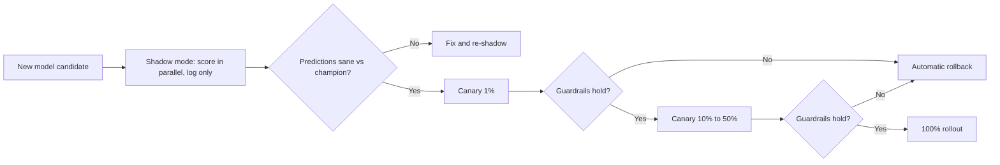

# Shadow and Canary Deployment

## TL;DR
Never cut over to a new model for 100% of traffic in one step. **Shadow mode** runs the new model
in parallel on live traffic, logging its predictions without acting on them — pure risk-free
observation. **Canary rollout** then routes a small, real percentage of traffic to the new model's
actual decisions, ramping up only if guardrail metrics hold. Both exist to catch a bad model before
it can do full damage, and both need pre-agreed **rollback criteria** decided before launch, not
improvised during an incident.

## Intuition
Shadow mode is a co-pilot trainee sitting in the cockpit calling out what they'd do, while the
captain still flies the plane — you learn if the trainee would've made the same calls with zero
risk to passengers. Canary is the trainee finally taking the controls, but only for the easiest
10-minute stretch of the flight, with the captain's hand hovering over the controls the whole time.

## The maths
Canary sizing is a statistical power problem: you want the smallest traffic percentage $p$ that
still gives enough samples $n = p \cdot N$ to detect a real regression of effect size $\Delta$ in
the guardrail metric within an acceptable time window, at a chosen significance level. Too small a
canary risks running for days without statistical power to catch a real problem; too large defeats
the point of limiting blast radius.

$$
n \approx \frac{2(z_{\alpha/2} + z_{\beta})^2 \sigma^2}{\Delta^2}
$$

(the same sample-size formula as [[statistical-power-and-sample-size]] and
[[ab-testing-design]] — a canary is functionally a small, safety-first A/B test.) Rollback
thresholds should be set on the guardrail metrics *before* the canary starts, derived from
historical variance, not chosen reactively once numbers start moving (that's p-hacking your own
rollback decision).

## Diagram


## Code
Shadow mode — score with both models, act only on the champion, log both for comparison:

```python
def handle_request(features: dict) -> dict:
    champion_pred = champion_model.predict(features)
    try:
        challenger_pred = challenger_model.predict(features)
        log_shadow_comparison(features, champion_pred, challenger_pred)  # fire-and-forget logging
    except Exception:
        pass  # shadow failures must never affect the served response
    return {"prediction": champion_pred}  # only the champion's output is ever acted on
```

Canary routing by a stable hash of a request ID, so the same user consistently lands on the same
arm during the rollout window:

```python
import hashlib

def route_to_canary(request_id: str, canary_pct: float) -> bool:
    bucket = int(hashlib.md5(request_id.encode()).hexdigest(), 16) % 100
    return bucket < canary_pct * 100

model = challenger_model if route_to_canary(req.request_id, canary_pct=0.05) else champion_model
```

## In practice
- **Use it when:** any model update to a business-critical serving path — shadow mode for
  high-stakes systems where even a small percentage of bad live decisions is unacceptable (credit
  decisions, medical triage); canary for the actual cutover once shadow mode gives confidence.
- **Defaults that work:** start canary at 1–5% traffic, hold for a pre-defined minimum observation
  window (long enough to cover a full daily/weekly cycle of traffic patterns, not just an hour),
  then step up (5% → 25% → 50% → 100%) with a guardrail check at each step.
- **Breaks when:** the canary population isn't representative — if canary traffic is routed by
  something correlated with the outcome (e.g., always the first N requests of the day, which skew
  toward a particular timezone/user segment), you get a false read in either direction.
- **Cost / latency:** shadow mode doubles inference compute (both models score every request) and
  adds logging overhead, but zero risk to served traffic; canary costs nothing extra in compute but
  carries real (bounded) business risk during the ramp.

### Rollback criteria — decide before launch, not during
- A guardrail metric (error rate, latency p99, a business KPI) crossing a pre-agreed threshold,
  checked automatically, not manually eyeballed on a dashboard.
- A statistically significant regression in the primary metric relative to the champion's canary-arm
  baseline (not the champion's historical average — compare like-for-like time windows).
- Any spike in downstream error rates or exceptions attributable to the new model (a schema
  mismatch, a missing feature causing null predictions).
- The rollback mechanism itself must be fast and automatic (traffic router flips back to 0% canary
  in seconds) — a rollback that requires a human to notice a dashboard and manually redeploy is too
  slow for a genuinely bad model.

## Interview angle
**Q. What's the difference between shadow mode and a canary, and when would you use each?**
Shadow mode runs the new model on live traffic in parallel but never acts on its output — purely
for comparing predictions and catching gross errors (crashes, wildly different predictions, latency
blowups) with zero business risk. A canary actually serves the new model's decisions to a small
slice of real traffic, which is the only way to observe real business-metric impact, but carries
real (bounded) risk. Use shadow mode first to catch obvious problems cheaply, then canary to
validate actual impact before a full rollout — skipping shadow mode and going straight to canary
means your first real signal on gross bugs comes at nonzero risk.

**Follow-up.** What can shadow mode never tell you, that only a canary can? → Anything about the
model's effect on user *behavior* or downstream business metrics — e.g., a recommender's shadow
predictions might look statistically reasonable, but you can't know if they'd actually increase
clicks/conversion without serving them to real users and measuring the response, because shadow
predictions never influence what the user does next.

**Q. How do you choose a canary rollout percentage and hold duration?**
Size it like an A/B test: compute the minimum sample size needed for enough statistical power to
detect a regression of a business-relevant effect size in your guardrail metric, then pick the
smallest traffic percentage that reaches that sample size within an acceptable time window. Hold
long enough to span natural cyclicality in traffic (at least one full day, ideally a full week for
anything with weekday/weekend patterns) — a 2-hour canary during an unusual traffic spike gives a
false read either way.

**Q. A canary at 10% shows a metric regression that's within normal day-to-day variance historically.
Do you roll back?**
Not automatically — check whether the observed difference exceeds the pre-agreed rollback threshold,
which should already be set wider than normal noise (derived from historical variance, per the
sample-size framing above). If it's within that threshold, continue monitoring rather than reflexively
rolling back on noise; if it's borderline, extend the observation window before deciding rather than
making a call on too little data. The discipline here is having decided the threshold *before* the
canary started, so you're not rationalizing a decision under pressure.

## Traps
- Treating shadow mode as sufficient validation on its own and skipping canary — shadow mode cannot
  observe behavioral/business-metric impact because its predictions never reach real decisions.
- Choosing rollback thresholds after seeing the canary numbers — this is post-hoc rationalization
  and defeats the purpose of a pre-committed safety gate.
- A canary rollout with no automatic rollback mechanism — relying on a human noticing a dashboard
  and manually intervening is too slow for the failure modes canaries exist to catch.
- Non-representative canary traffic selection (by time of day, geography, or any variable correlated
  with the outcome) — gives a biased read in either direction.
- Letting shadow-mode failures (the challenger model erroring out) silently affect the champion's
  served response — shadow logic must be fully isolated with its own error handling.

## Flashcards
What's the core difference between shadow mode and canary deployment?::Shadow mode scores in parallel without acting on the output (zero risk, no behavioral signal); canary actually serves a small percentage of real decisions from the new model (bounded risk, real business signal).
Why can't shadow mode tell you if a new recommender model will increase conversions?::Its predictions never influence real user behavior — only a canary, which actually serves the new model's decisions, can measure downstream behavioral/business impact.
Why must rollback thresholds be set before the canary starts, not during?::Setting them after seeing live numbers is post-hoc rationalization and defeats the purpose of a pre-committed safety gate.
Why does a canary rollout need a fast, automatic rollback mechanism rather than a manual one?::A rollback depending on a human noticing a dashboard is too slow to bound damage from a genuinely bad model.
How should a canary's traffic percentage be chosen?::Like an A/B test sample-size calculation — the smallest percentage that gives enough statistical power to detect a business-relevant regression within an acceptable observation window.
What can bias a canary's read even with a correctly sized traffic percentage?::Non-representative routing — if canary traffic correlates with time of day, geography, or another variable tied to the outcome, the comparison is confounded.

## Related
[[model-retraining-strategies]]
[[model-serving-patterns]]
[[ab-testing-design]]
[[statistical-power-and-sample-size]]
[[ci-cd-for-ml]]
