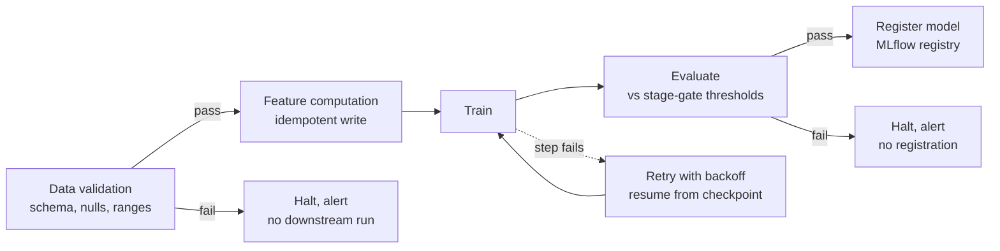

# Training Pipelines

## TL;DR
A training pipeline is the orchestrated sequence data validation → feature
computation → train → evaluate → register, built so any step can fail and retry
without corrupting state or double-charging side effects. The two properties that
separate a pipeline from "a notebook someone runs manually" are idempotency (re-running
a step produces the same result, not a duplicated or compounded one) and clean
failure/retry semantics at each stage.

## Intuition
A notebook run by hand is a chef cooking one meal, present the whole time to notice
if something's off. A training pipeline is a fully automated kitchen running unattended
overnight — if the oven step fails and the system retries it, it must not start with
an already-marinated dish and marinate it twice. Every stage needs to be safe to
re-run from wherever it stopped, because unattended automation *will* fail partway
through eventually.

## The maths
Idempotency has a precise definition worth stating exactly, since it's often used
loosely: an operation $f$ is idempotent if applying it multiple times has the same
effect as applying it once:

$$
f(f(x)) = f(x)
$$

For a pipeline stage, this means: writing the same computed feature table twice (e.g.
via an `overwrite` or `MERGE`, not a raw `append`) leaves the table in the same state
as writing it once; registering "a model" from a retried training step should not
create two registry versions for what is logically one run. A stage built as a raw
append or a raw `INSERT` violates idempotency — retrying it after a partial failure
duplicates data rather than reproducing the same end state.

## Diagram


## Code
```python
# Orchestrated as a Databricks Workflow / Airflow DAG; the important part is
# each task's idempotency and explicit failure handling, not the scheduler API.

def validate_data(table_path: str) -> bool:
    df = spark.read.format("delta").load(table_path)
    checks = [
        df.filter("label IS NULL").count() == 0,
        df.count() > MIN_EXPECTED_ROWS,
        set(df.columns) >= REQUIRED_COLUMNS,
    ]
    return all(checks)

def compute_features(input_table: str, output_table: str, run_date: str):
    features_df = build_features(spark.read.format("delta").load(input_table))
    # Idempotent write: overwrite the partition for this run_date, not append.
    # Re-running for the same run_date produces the same table state, not duplicates.
    (features_df.write.format("delta")
        .mode("overwrite")
        .option("replaceWhere", f"run_date = '{run_date}'")
        .save(output_table))

def train_and_evaluate(features_table: str, thresholds: dict) -> str | None:
    import mlflow
    with mlflow.start_run() as run:
        model, metrics = train_model(features_table)
        mlflow.log_metrics(metrics)
        if all(metrics[k] >= v for k, v in thresholds.items()):
            mlflow.sklearn.log_model(model, "model")
            return run.info.run_id
    return None  # failed the stage gate — do not register

def run_pipeline(run_date: str):
    if not validate_data(RAW_TABLE):
        raise PipelineError("data validation failed — halting before feature compute")
    compute_features(RAW_TABLE, FEATURES_TABLE, run_date)
    run_id = train_and_evaluate(FEATURES_TABLE, THRESHOLDS)
    if run_id is None:
        raise PipelineError("evaluation stage gate failed — not registering")
    mlflow.register_model(f"runs:/{run_id}/model", name="churn_predictor")
```

## In practice
- **Use it when:** any training process that runs unattended (scheduled, triggered
  by a data arrival event, or as part of a retraining loop) rather than a one-off
  exploratory run — orchestration and idempotency matter the moment a human isn't
  watching every execution.
- **Defaults that work:** validate data *before* spending compute on feature
  computation and training — fail fast and cheap, not after burning a full training
  run on bad data; make every write idempotent (`overwrite`/`MERGE` with a partition
  or key predicate, not raw `append`) so retries are safe; gate model registration
  behind an explicit evaluation threshold so a failed run never silently produces a
  registered candidate.
- **Breaks when:** stages are built assuming they run exactly once and never fail —
  any transient issue (a worker OOM, a network blip to object storage, a flaky
  upstream table) then either halts the whole pipeline with no automatic recovery, or
  worse, a naive retry duplicates data because the write wasn't idempotent.
- **Cost / latency:** retries with backoff add latency on failure (intentionally —
  immediate retry on a transient resource contention issue often just fails again);
  validation-first ordering trades a small amount of upfront latency for avoiding a
  much larger wasted cost (a full training run on data that was already broken).

## Interview angle
**Q. Why does data validation come before feature computation and training in the
pipeline, rather than checking quality at the end?**
Because compute is the expensive resource — running a full feature computation and
training job on bad data (nulls in the label column, a schema change, a partition
that didn't land) wastes the most expensive steps for a failure you could have caught
for the cost of a schema/row-count check. Fail fast, fail cheap: validate at the
narrowest, earliest point where the failure would be detected.

**Follow-up.** What would you actually check in the data validation stage for a
tabular training pipeline? → Schema match against expected columns/types, null rate on
required fields (especially the label), row count within an expected range
(catastrophic drop or spike signals an upstream issue), and basic distributional
sanity checks (e.g. a categorical feature suddenly showing an unseen category at high
frequency).

**Q. What makes a pipeline stage idempotent, and why does it matter for retries?**
A stage is idempotent if running it twice with the same input produces the same
end state as running it once — e.g. a write that overwrites/merges a specific
partition or key, rather than appending. It matters because unattended pipelines
*will* fail partway through eventually (transient infra issues are a certainty at
scale), and the recovery mechanism is almost always "retry the failed step" — if that
retry isn't safe, retries silently corrupt state (duplicate rows, double-registered
models) instead of recovering cleanly.

**Follow-up.** Give a concrete non-idempotent pattern and its fix. → A feature
pipeline that does `df.write.mode("append")` keyed by `run_date` — retrying after a
partial failure appends the same day's rows again, duplicating data. Fix: overwrite
with a `replaceWhere` predicate scoped to that `run_date`, or `MERGE` on a natural key,
so a retry converges to the same state instead of accumulating.

**Q. How would you design retry/backoff behavior for a training pipeline running on
a shared cluster?**
Distinguish failure classes: transient infra issues (worker eviction, temporary
storage throttling) should retry automatically with exponential backoff and a capped
attempt count; data-quality or evaluation-gate failures should *not* auto-retry
(retrying won't fix bad data) and instead halt with an alert for a human to
investigate — treating every failure the same (blind retry) either wastes compute
retrying a deterministic failure repeatedly, or gives up too early on a genuinely
transient one.

## Traps
- Building pipeline stages as raw appends "because it's simpler" — this is the
  single most common idempotency bug and it only shows up under retry, which means it
  passes every normal test run and fails during the exact incident when you need the
  pipeline to recover cleanly.
- Retrying every failure type the same way — blindly retrying a data-validation
  failure wastes compute on a run that will fail again deterministically; only
  transient/infra failures should auto-retry.
- Running validation and evaluation as "nice to have" logging rather than a hard
  gate that can halt the pipeline — a stage gate that only warns instead of stopping
  the pipeline is not actually a gate.
- Treating orchestration tooling (Airflow, Databricks Workflows) as the whole answer
  to reliability — the scheduler retries a task; whether that retry is *safe* is
  entirely a property of how the task's own reads/writes are built, not the
  orchestrator.

## Flashcards
What is idempotency, precisely, for a pipeline stage?::f(f(x)) = f(x) — running the stage twice with the same input leaves the system in the same state as running it once, so retries don't duplicate or compound effects.
Why does data validation run before feature computation and training, not after?::To fail fast and cheap — catching bad data before spending the most expensive compute steps (feature computation, training) on data that was already broken.
Give a common non-idempotent pattern in a training pipeline.::A raw df.write.mode("append") keyed by a run date — retrying after partial failure appends duplicate rows instead of converging to the same end state.
Should every pipeline failure type trigger an automatic retry?::No — transient infra failures should retry with backoff; data-quality or evaluation-gate failures should halt and alert, since retrying won't change a deterministic failure's outcome.
What should gate model registration in a training pipeline?::An explicit evaluation threshold check — a run that fails the stage gate should never produce a registered model candidate, even silently.

## Related
[[ml-lifecycle]]
[[experiment-tracking-mlflow]]
[[model-registry-and-versioning]]
[[orchestration-and-workflows]]
[[data-quality-and-validation]]
[[ci-cd-for-ml]]
