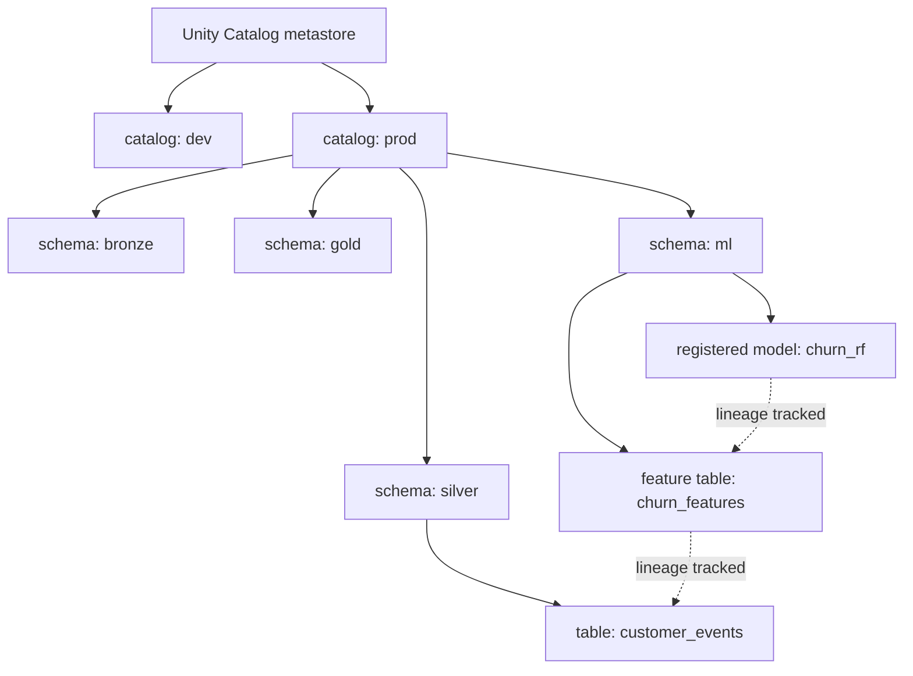

# Unity Catalog and Governance

## TL;DR
Unity Catalog gives Databricks a single, three-level namespace — `catalog.schema.table` — with
centralized access control, automatic lineage, and audit logging across *all* data and ML assets
(tables, files, models, features, notebooks), replacing the old world of a per-workspace Hive
metastore with no cross-workspace governance story. For ML specifically, it means your model
registry, feature tables, and training data all live under the same permission and lineage system —
so "which data trained this model, and who can see it" becomes a query, not an investigation.

## Intuition
A Hive metastore per workspace is like every department in a company keeping its own private filing
cabinet with its own lock and key — nobody outside that department can easily find out what's in
another cabinet, let alone prove a document in cabinet A was copied from a document in cabinet B.
Unity Catalog is the company switching to one shared, indexed records system with a single access
list and an automatic paper trail of who touched what and where it came from — across every
department, at once.

## The maths
Not a maths topic, but the structural invariant worth stating precisely — Unity Catalog's namespace
is a strict three-level hierarchy:

$$
\text{full name} = \texttt{catalog.schema.object}
$$

e.g. `prod.silver.customer_features`, `prod.ml.churn_model` (a registered model),
`prod.ml.churn_features` (a feature table). This is one extra level versus the classic Hive
metastore's two-level `schema.table`, and that extra `catalog` level is precisely what lets one
metastore serve multiple workspaces/environments (dev/staging/prod as separate catalogs) with a
single, consistent governance layer instead of one Hive metastore silently scoped per-workspace.

## Diagram


## Code
Three-level naming in day-to-day PySpark/SQL work — no more ambiguous, workspace-scoped table
names:

```python
# Read from a fully qualified Unity Catalog table
df = spark.read.table("prod.silver.customer_features")

# Write, governed by the same catalog's access control
df.write.mode("overwrite").saveAsTable("prod.gold.churn_scores")
```

```sql
-- Grant read access to a schema, centrally, once — applies across every workspace attached
-- to this metastore, not per-workspace
GRANT SELECT ON SCHEMA prod.gold TO `data-science-team`;

-- Row-level / column-level security via a view, governed the same way as any other object
CREATE VIEW prod.gold.customer_features_masked AS
SELECT customer_id, tenure_days, MASK(ssn) AS ssn
FROM prod.silver.customer_features;
```

Registering a model into Unity Catalog (rather than the old workspace-local MLflow registry) —
this is the ML-specific payoff: the model now lives in the same governed namespace as the data:

```python
import mlflow
mlflow.set_registry_uri("databricks-uc")

mlflow.register_model(
    model_uri="runs:/<run_id>/model",
    name="prod.ml.churn_model",   # three-level name, same as any table
)
```

## In practice
- **Use it when:** any Databricks estate with more than one workspace, or any team that needs
  auditable "who accessed this data/model and where did it come from" answers — which in a regulated
  industry (finance, healthcare) is effectively mandatory, not optional.
- **Defaults that work:** organize catalogs by environment (`dev`, `staging`, `prod`) and schemas by
  medallion layer (`bronze`, `silver`, `gold`) plus a dedicated `ml` schema for models and feature
  tables within each catalog; grant access at the schema level rather than per-table where possible,
  to keep the permission model manageable as the estate grows.
- **Breaks when:** teams keep using workspace-local Hive metastore tables "temporarily" alongside
  Unity Catalog ones — lineage and governance silently stop at that boundary, since Unity Catalog
  can't trace lineage through an object it never registered.
- **Cost / latency:** governance itself is close to free at query time (access checks are metadata
  operations); the real cost is migration effort from a legacy Hive metastore estate, which is
  typically the actual blocker to adoption, not any runtime overhead.

### How this changes ML governance vs a Hive metastore world
- **Lineage across the whole ML lifecycle, automatically.** In a Hive metastore world, knowing
  "which raw table ultimately fed this production model" required manual documentation or
  reverse-engineering notebook history. Unity Catalog tracks lineage automatically from raw table
  through every transformation, feature table, and into the registered model — a genuine answer to
  "if this upstream column is wrong, which models are affected?" (impact analysis), not a guess.
- **One access-control model for data *and* models.** Previously, table permissions lived in the
  Hive metastore (or cloud storage ACLs) while the MLflow model registry had its own, separate,
  workspace-scoped permission system. Unity Catalog unifies them — the same `GRANT`/`REVOKE`
  vocabulary governs a table, a feature table, and a registered model, and permissions are defined
  once at the metastore level rather than per-workspace.
- **Cross-workspace consistency.** A Hive metastore is scoped to a single workspace; the same table
  name in two workspaces could be two entirely different tables with independently drifting
  permissions. Unity Catalog's metastore can be attached to multiple workspaces, so `prod.ml.churn_model`
  means the same governed object everywhere it's referenced, with one audit trail.
- **Fine-grained access control built in.** Row filters and column masks (as in the `MASK` example
  above) are first-class, catalog-level constructs rather than something bolted onto each consuming
  application separately — critical for PII handling in ML feature pipelines (see
  [[security-and-pii-in-ml]]).

## Interview angle
**Q. Explain Unity Catalog's namespace model and why the third level (catalog) matters for
governance, not just organization.**
The three-level `catalog.schema.table` namespace exists specifically so one metastore can serve
multiple environments/workspaces without ambiguity — `dev.ml.churn_model` and `prod.ml.churn_model`
are unambiguously different objects with independently governed permissions, even though the
`schema.table` portion (`ml.churn_model`) is identical. In the old Hive metastore world, that
disambiguation only existed by accident of which workspace you happened to be in — there was no
single namespace where you could look up "what does `ml.churn_model` mean across the whole
company" and get one answer with one permission model attached.

**Follow-up.** How does this affect promoting a model from staging to production? → With a
consistent catalog-based environment separation, promotion becomes changing the model's registered
name/alias from `staging.ml.churn_model` to `prod.ml.churn_model` (or updating an alias within one
catalog), with access control and lineage following automatically — rather than re-registering into
a completely separate, disconnected workspace registry with its own permissions to reconfigure from
scratch.

**Q. A data scientist asks: "which production models depend on this raw table, and can I safely
change its schema?" How does Unity Catalog answer this that a Hive metastore setup couldn't?**
Unity Catalog's automatic lineage graph traces from the raw table through every downstream
transformation, feature table, and into any registered model that consumed features derived from
it — you can query this lineage directly (in the UI or via the lineage system tables) to get a
definitive list of downstream dependents before making the change. In a Hive metastore world this
answer typically didn't exist as queryable metadata at all; it depended on tribal knowledge,
notebook archaeology, or hoping someone documented the dependency, which made "can I safely change
this schema" essentially a manual audit every time.

**Q. What's the ML-specific governance risk of registering models outside Unity Catalog (e.g., in
a legacy workspace-local MLflow registry) even after adopting Unity Catalog for data?**
Lineage breaks at that boundary — Unity Catalog can trace data lineage right up to a Unity
Catalog-registered model, but a model registered in the old workspace-local registry is an
untracked leaf as far as the catalog's lineage graph is concerned. You also lose the unified
access-control story: that model's permissions live in a separate system from the feature tables it
was trained on, meaning access reviews and audits (who can see this model, does that match who can
see its training data) have to be reconciled manually across two systems instead of queried from
one.

## Traps
- Describing Unity Catalog as "just a naming convention" — the three-level namespace is the
  mechanism, but the actual value is the centralized access control, lineage, and audit log it
  enables across workspaces; naming alone is a minor detail.
- Registering models via the legacy workspace MLflow registry "because it's simpler" after adopting
  Unity Catalog elsewhere — this silently forfeits lineage and unified governance specifically for
  the ML assets, which is usually the part governance matters most for (model risk, explainability
  audits).
- Granting access at the table level everywhere out of caution — it works but becomes unmanageable
  at scale; schema-level (or catalog-level) grants with narrower row/column-level exceptions where
  actually needed is the more maintainable default.
- Assuming lineage is retroactive — objects created or transformed outside Unity Catalog's visibility
  (a table populated by a job that reads raw files directly, bypassing catalog-registered read paths)
  won't appear in the lineage graph even after the estate otherwise adopts Unity Catalog.

## Flashcards
What is Unity Catalog's namespace structure, and how does it differ from a classic Hive metastore?::A three-level catalog.schema.table namespace (vs Hive metastore's two-level schema.table), where the extra catalog level lets one metastore govern multiple environments/workspaces consistently.
What does Unity Catalog unify that was previously split between systems in an ML context?::Access control and lineage for data tables, feature tables, and registered models — previously the MLflow model registry had its own separate, workspace-scoped permission system.
Why does automatic lineage in Unity Catalog matter for a schema change to a raw table?::It lets you query exactly which downstream feature tables and models depend on that table before changing it, rather than relying on tribal knowledge or manual notebook archaeology.
What governance risk remains if models are registered in a legacy workspace-local MLflow registry even after adopting Unity Catalog for data?::Lineage breaks at that boundary — the model becomes an untracked leaf in the lineage graph, and its access control lives in a separate, unreconciled permission system from its training data.
What's the recommended default granularity for access-control grants in Unity Catalog?::Schema-level (or catalog-level) grants for manageability at scale, with row/column-level security (masks, filters) applied narrowly where actually needed.
How does Unity Catalog make row/column-level security for PII in ML feature pipelines easier?::Row filters and column masks are first-class catalog-level constructs applied once at the data layer, rather than logic each consuming application has to reimplement separately.

## Related
[[databricks-platform]]
[[model-registry-and-versioning]]
[[medallion-architecture]]
[[security-and-pii-in-ml]]
[[feature-stores]]
[[data-versioning]]
