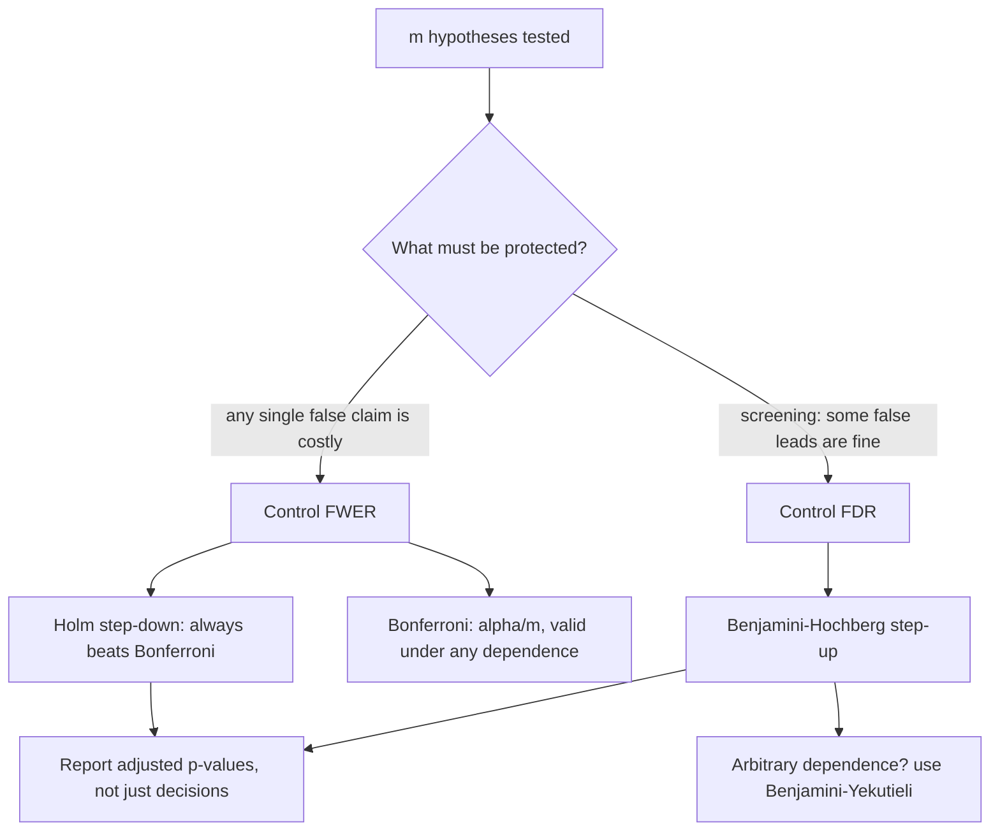

# Multiple Testing Correction

## TL;DR
Run 20 independent tests at $\alpha=0.05$ on pure noise and you expect one "discovery". FWER methods
(Bonferroni, Holm) control the probability of **any** false positive — strict, use when a single
false claim is expensive. FDR methods (Benjamini–Hochberg) control the expected **proportion** of
discoveries that are false — far more powerful, and the right default for screening, dashboards and
experimentation platforms.

## Intuition
One test is a coin that lands "significant" 5% of the time under the null. Twenty tests is twenty
coins. The question is what you are trying to protect: the claim "nothing I reported is wrong"
(FWER) or the claim "most of what I reported is right" (FDR). Genomics settled on FDR because
screening 20,000 genes under FWER finds nothing; experimentation platforms settled on FDR for the
same reason.

## The maths

**The problem.** With $m$ independent true nulls each tested at $\alpha$:

$$
P(\text{at least one false positive}) = 1-(1-\alpha)^m
$$

$m=5 \Rightarrow 0.23$; $m=10 \Rightarrow 0.40$; $m=20 \Rightarrow 0.64$; $m=50 \Rightarrow 0.92$.

**The two error rates.** With $V$ = false positives and $R$ = total rejections:

$$
\mathrm{FWER} = P(V \ge 1),
\qquad
\mathrm{FDR} = \mathbb{E}\!\left[\frac{V}{\max(R,1)}\right]
$$

FWER $\le$ FDR-controlling threshold in general; controlling FWER also controls FDR, never the
reverse. When **all** nulls are true, FDR = FWER, so BH is not a free lunch — it is only more
powerful when some alternatives are real.

**Bonferroni.** Reject $H_i$ if $p_i \le \alpha/m$. Controls FWER at $\alpha$ for *any* dependence
structure (via Boole's inequality: $P(\bigcup A_i)\le\sum P(A_i)$). Dead simple, valid always,
badly conservative when tests are correlated or $m$ is large. Equivalent form: multiply each p-value
by $m$ and compare to $\alpha$.

**Šidák.** $\alpha_{\text{adj}} = 1-(1-\alpha)^{1/m}$. Exact under *independence*, barely less
conservative than Bonferroni ($0.00256$ vs $0.0025$ at $m=20$) — rarely worth the assumption.

**Holm–Bonferroni (step-down).** Sort $p_{(1)}\le\dots\le p_{(m)}$. Compare $p_{(i)}$ against

$$
\frac{\alpha}{m-i+1}
$$

Stop at the first failure; reject everything before it. Controls FWER under any dependence,
**uniformly more powerful than Bonferroni** — it dominates it, so there is never a reason to prefer
plain Bonferroni except explaining the idea.

**Benjamini–Hochberg (step-up).** Sort ascending, find the largest $k$ with

$$
p_{(k)} \le \frac{k}{m}\,\alpha
$$

and reject $H_{(1)},\dots,H_{(k)}$. Controls FDR at $\alpha$ under independence and under positive
regression dependence (PRDS) — which covers most correlated-metric situations in practice. The
**Benjamini–Yekutieli** variant divides by $\sum_{i=1}^m 1/i \approx \ln m + 0.577$ and is valid
under arbitrary dependence, at a real power cost.

Note the largest-$k$ rule: BH can reject a hypothesis whose p-value exceeds its own threshold,
because a smaller-ranked one passed. That step-up behaviour is exactly where the extra power comes
from.

**Worked example**, $m=10$, $\alpha=0.05$:

| rank $i$ | $p_{(i)}$ | Bonferroni $\alpha/m$ | Holm $\alpha/(m-i+1)$ | BH $\frac{i}{m}\alpha$ |
| --- | --- | --- | --- | --- |
| 1 | 0.001 | 0.005 ✓ | 0.0050 ✓ | 0.005 ✓ |
| 2 | 0.008 | 0.005 ✗ | 0.0056 ✗ stop | 0.010 ✓ |
| 3 | 0.012 | 0.005 ✗ | — | 0.015 ✓ |
| 4 | 0.030 | 0.005 ✗ | — | 0.020 ✗ |
| 5 | 0.041 | 0.005 ✗ | — | 0.025 ✗ |
| … | … | … | … | … |
| 10 | 0.900 | ✗ | — | 0.050 ✗ |

Bonferroni: 1 discovery. Holm: 1. BH: **3** — it finds the largest $k$ with $p_{(k)}\le k\alpha/m$,
which is $k=3$ ($0.012 \le 0.015$), and rejects all three.

**Adjusted p-values.** Rather than adjusting $\alpha$, report adjusted p-values (`multipletests`
returns them) so a reader can apply their own threshold. BH-adjusted p-values are often called
q-values.

## Why an experimentation platform needs this

A mature platform runs hundreds of experiments, each reporting dozens of metrics across dozens of
segments. The arithmetic is unforgiving:

- One experiment × 20 metrics: $P(\ge1 \text{ false win}) \approx 0.64$. Every experiment produces
  a "surprising secondary win".
- 200 experiments per quarter × 20 metrics = 4,000 tests. At $\alpha=0.05$ under the null, **200
  false positives per quarter** — and those are precisely the results that get written up, because
  they are surprising.
- Add segment slicing (device × country × new/returning = 30 slices) and you are at $10^5$ tests.

Platform design that follows:

1. **One primary metric per experiment, decided in advance**, tested at an uncorrected $\alpha=0.05$.
   It alone decides ship/no-ship. This is the cheapest correction available: pre-registration makes
   $m=1$.
2. **Secondary metrics** reported with BH-adjusted q-values within the experiment. They explain
   mechanism; they are hypotheses for the next experiment, not decisions.
3. **Guardrails** are the exception — deliberately *under*-corrected, because here a false negative
   (shipping harm) costs more than a false positive. Some platforms even raise $\alpha$ on
   guardrails.
4. **Segment/slice views** carry BH correction and a "this is exploratory" label, or are hidden
   behind an explicit drill-down.
5. **Multi-arm tests** ($k$ variants vs control) are $k-1$ comparisons: correct, or use Dunnett's
   test, which is built for many-vs-one and is more powerful than Bonferroni.
6. **A/A tests run continuously** to verify the whole stack really produces a 5% rate.

> [!warning]
> Correction does not rescue peeking. Sequential looks are correlated tests over *time* and need
> group-sequential boundaries or always-valid inference, not BH — see [[ab-testing-pitfalls]].

## Diagram



## Code

```python
import numpy as np
from scipy import stats

# --- the problem, quantified ------------------------------------------------
for m in (1, 5, 10, 20, 50):
    print(f"m={m:>3}  P(at least one false positive) = {1 - 0.95**m:.3f}")

# --- the three procedures, implemented from scratch -------------------------
def bonferroni(p, alpha=0.05):
    return np.asarray(p) <= alpha / len(p)

def holm(p, alpha=0.05):
    p = np.asarray(p, float); m = len(p)
    order = np.argsort(p)
    rej = np.zeros(m, bool)
    for i, idx in enumerate(order):            # i = 0-based rank
        if p[idx] <= alpha / (m - i):
            rej[idx] = True
        else:
            break                              # step-down: stop at first failure
    return rej

def benjamini_hochberg(p, alpha=0.05):
    p = np.asarray(p, float); m = len(p)
    order = np.argsort(p)
    ps = p[order]
    passing = np.where(ps <= (np.arange(1, m + 1) / m) * alpha)[0]
    rej = np.zeros(m, bool)
    if passing.size:
        k = passing.max()                      # LARGEST k, not the first failure
        rej[order[: k + 1]] = True
    return rej

pvals = [0.001, 0.008, 0.012, 0.030, 0.041, 0.10, 0.22, 0.40, 0.63, 0.90]
print("bonferroni", bonferroni(pvals).sum(),
      "holm", holm(pvals).sum(),
      "BH", benjamini_hochberg(pvals).sum())      # 1, 1, 3

# cross-check against statsmodels if it is installed
try:
    from statsmodels.stats.multitest import multipletests
    for method in ("bonferroni", "holm", "fdr_bh"):
        rej, p_adj, _, _ = multipletests(pvals, alpha=0.05, method=method)
        print(f"{method:12s} reject={rej.sum()}  adj={np.round(p_adj, 4)}")
except ImportError:
    print("statsmodels not installed; the from-scratch versions above agree with it")

# --- simulate an experimentation platform: 20 metrics, only 3 real ----------
rng = np.random.default_rng(0)

def one_experiment(n_metrics=20, n_true=3, n=8_000, effect=0.06, rng=rng):
    ps, is_null = [], []
    for j in range(n_metrics):
        real = j < n_true
        a = rng.normal(0, 1, n)
        b = rng.normal(effect if real else 0.0, 1, n)
        ps.append(stats.ttest_ind(b, a, equal_var=False).pvalue)
        is_null.append(not real)
    return np.array(ps), np.array(is_null)

def evaluate(procedure, reps=2_000):
    any_fp, fdr_sum, power_sum = 0, 0.0, 0.0
    for _ in range(reps):
        p, is_null = one_experiment()
        rej = procedure(p)
        V = int((rej & is_null).sum()); R = int(rej.sum())
        any_fp += V >= 1
        fdr_sum += V / max(R, 1)
        power_sum += (rej & ~is_null).sum() / (~is_null).sum()
    return any_fp / reps, fdr_sum / reps, power_sum / reps

for name, proc in (("uncorrected", lambda p: np.asarray(p) <= 0.05),
                   ("bonferroni ", bonferroni),
                   ("holm       ", holm),
                   ("BH         ", benjamini_hochberg)):
    fwer, fdr, power = evaluate(proc)
    print(f"{name}  FWER={fwer:.3f}  FDR={fdr:.3f}  power={power:.3f}")
```

Expect roughly: uncorrected FWER around 0.55 with the highest power; Bonferroni and Holm with FWER
at or below 0.05 and Holm strictly more powerful; BH with FDR at or below 0.05 and power clearly
above both FWER methods. That last line is the entire argument for FDR in one row of output.

## In practice
- **Use it when:** more than one hypothesis contributes to a decision — multiple metrics, multiple
  arms, multiple segments, multiple features screened, multiple models compared.
- **Defaults that work:** BH at $q=0.05$ or $q=0.10$ for screening and secondary metrics; Holm when
  any single false claim is costly (regulatory, medical, a public launch claim); Dunnett for
  many-vs-one control comparisons; Tukey HSD for all-pairwise after ANOVA. Always report adjusted
  p-values alongside raw.
- **Breaks when:** you correct across a family you defined after seeing the results — the family must
  be pre-specified, or the correction is theatre. Also when tests are strongly negatively dependent
  (use BY), and when $m$ is huge and effects are tiny, where nothing survives any correction and you
  need a better-powered design instead.
- **Cost / latency:** a sort. The real cost is power, which is the thing to budget consciously:
  correcting over 20 metrics roughly doubles the effect size you can detect on the primary if you
  include it in the family — which is why you do not include it.

## Interview angle

**Q. You tested 20 metrics and 2 are significant at $p<0.05$. What do you conclude?**
Under the global null you expect one false positive; the probability of at least one is 64%. So two
hits is entirely consistent with nothing happening. I would apply BH across the 20 and see whether
either survives, check whether the pre-registered primary is among them, and look at effect sizes
and CIs — a metric with a tight CI around a meaningful effect is different from one scraping
$p=0.049$ with a CI spanning zero-ish values.

**Q. FWER versus FDR — how do you choose?**
FWER is $P(\text{at least one false positive})$; FDR is the expected fraction of my rejections that
are false. Choose FWER when one wrong claim is unacceptable: a regulated claim, a public launch
statement, a safety conclusion. Choose FDR when you are screening and will validate downstream —
feature selection, gene expression, exploratory metrics — because with $m$ in the thousands FWER
control leaves you with no discoveries at all. When all nulls are true the two coincide, so FDR's
extra power exists only because some effects are real.

**Q. Bonferroni or Holm?**
Holm. It controls FWER under the same (i.e. no) dependence assumptions and is uniformly more
powerful — its first threshold is $\alpha/m$, identical to Bonferroni, and every subsequent one is
larger. Bonferroni survives only because it is one line of arithmetic.

**Q. Explain Benjamini–Hochberg in procedural terms.**
Sort the p-values ascending, compare $p_{(i)}$ to $\frac{i}{m}\alpha$, find the **largest** $i$ that
passes, and reject everything up to and including it. Step-up, not step-down: a p-value above its own
line can still be rejected if a later one passes. Valid under independence and positive dependence;
use Benjamini–Yekutieli (dividing by $\approx\ln m$) for arbitrary dependence.

**Q. Your experimentation platform reports 30 metrics per test. Design the correction policy.**
One pre-registered primary metric tested uncorrected at 5% — it alone decides ship. Secondaries get
BH-adjusted q-values within the experiment and are labelled explanatory. Guardrails are deliberately
under-corrected because a false negative there means shipping harm. Segment drill-downs are
exploratory and corrected, with a warning in the UI. Multi-arm tests use Dunnett rather than
pairwise Bonferroni. And run continuous A/A tests to confirm the platform's realised false-positive
rate is actually 5%.

**Follow-up.** Should you correct across *experiments* too? → Formally the family is whatever you
will make claims over, so a quarterly review of 200 experiments is a family. In practice nobody
corrects across independent product decisions, because each has its own decision-maker and its own
cost of error. The defensible position: correct within a decision, and control quality across
decisions by replicating winners in a holdout rather than by inflating thresholds.

**Q. Where does this bite outside A/B testing?**
Feature screening by univariate p-value across thousands of columns (BH, or skip p-values and use a
model-based method); hyperparameter search, where "best of 200 configs on the validation set" is a
selection effect that needs a held-out test set rather than a correction; and monitoring, where an
alert on any of 500 features at 1% fires 5 times a day on pure noise — that dashboard needs FDR
control or it gets muted. See [[model-monitoring]].

## Traps
- **Correcting across a family chosen after the fact.** Deciding "the family is these 3 metrics"
  once you know which 3 won is not a correction.
- **Applying Bonferroni to 5,000 correlated tests** and concluding nothing is real. Correlation makes
  Bonferroni extremely conservative; use BH.
- **Treating BH-adjusted p-values as probabilities that each hypothesis is null.** They control an
  expected *proportion* across the set, not a per-hypothesis posterior.
- **Believing correction fixes peeking.** Sequential looks need sequential boundaries.
- **Correcting the primary metric into the same family as 30 secondaries.** You destroy the power of
  the one test the experiment was designed for. Keep the primary out of the family by
  pre-registering it.
- **Ignoring multiplicity in model selection.** Picking the best of 50 models on one validation set
  inflates the winner's apparent performance; the fix is a separate test set, not a p-value
  adjustment. See [[cross-validation]].
- **Using FDR for a safety or compliance claim.** By construction you are accepting that some
  proportion of your claims are wrong.

## Flashcards
P(at least one false positive) with m independent tests at alpha::1 − (1 − α)^m; 0.40 at m = 10, 0.64 at m = 20.
FWER definition::P(V ≥ 1) — the probability of making at least one false rejection.
FDR definition::E[V / max(R,1)] — the expected proportion of rejections that are false.
Bonferroni::Reject if p ≤ α/m; valid under any dependence, conservative when tests are correlated.
Holm procedure::Sort ascending, compare p₍ᵢ₎ to α/(m−i+1), stop at the first failure; controls FWER and dominates Bonferroni.
Benjamini–Hochberg procedure::Sort ascending, find the LARGEST k with p₍ₖ₎ ≤ (k/m)α, reject all up to k.
When is BH valid::Independence or positive regression dependence; use Benjamini–Yekutieli (divide by ≈ ln m) for arbitrary dependence.
When do FWER and FDR coincide::When every null is true — FDR's extra power exists only because some alternatives are real.
Correction policy for an experimentation platform::Uncorrected pre-registered primary; BH on secondaries; deliberately under-corrected guardrails; corrected exploratory slices.
Does correction fix peeking::No — sequential looks need group-sequential boundaries or always-valid confidence sequences.
Better test for k variants against one control::Dunnett's test — built for many-vs-one and more powerful than Bonferroni.

## Related
- [[hypothesis-testing]]
- [[p-values-and-significance]]
- [[ab-testing-design]]
- [[ab-testing-pitfalls]]
- [[common-statistical-tests]]
- [[statistical-power-and-sample-size]]
- [[feature-selection]]
- [[moc-stats]]
