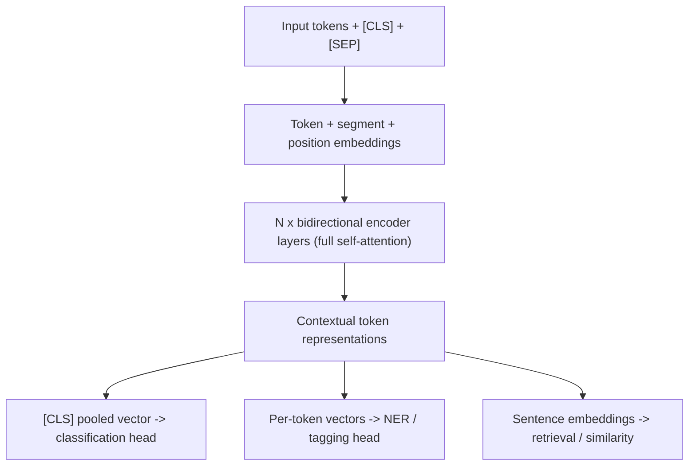

# BERT and Encoder Models

## TL;DR
BERT is a stack of transformer encoder layers trained with masked language modelling (plus originally
next-sentence prediction) to produce a bidirectional contextual representation of a sequence. It
doesn't generate text; it produces representations — embeddings, classification logits, token tags.
In 2026 it (and its descendants like RoBERTa, DeBERTa, ModernBERT) is still the right tool whenever
you need a cheap, fast, accurate encoder for retrieval, classification, or tagging rather than an
expensive generative LLM.

## Intuition
Reading comprehension vs. essay writing. An encoder like BERT reads the whole sentence at once,
both directions, and builds a rich internal understanding — great for "what is this text about /
similar to / labelled as." A decoder like GPT writes one word at a time, only ever having seen what
it already wrote — great for "produce the next sentence." Neither is strictly better; they're built
for different jobs.

## The maths

### Architecture
BERT is $L$ stacked transformer **encoder** layers, each with bidirectional multi-head self-attention
(no causal mask) followed by a position-wise feed-forward network, with residual connections and
layer normalisation:

$$
h^{(l)} = \text{LayerNorm}\left(h^{(l-1)} + \text{MHSA}(h^{(l-1)})\right), \quad
h^{(l)} = \text{LayerNorm}\left(h^{(l)} + \text{FFN}(h^{(l)})\right)
$$

Since there's no causal mask, attention scores $A_{ij} = \text{softmax}_j\left(\frac{q_i^\top
k_j}{\sqrt{d_k}}\right)$ are computed for **every** pair $(i,j)$, letting a token at position 3 attend
to a token at position 50 directly — this is what "bidirectional" means concretely.

### Pretraining objective
Masked language modelling (see [[language-modeling-objectives]]): mask ~15% of input tokens, predict
them from bidirectional context. Original BERT also used next-sentence prediction (NSP) — predict
whether sentence B follows sentence A — later shown by RoBERTa to add little value; RoBERTa dropped
NSP, trained longer, on more data, with dynamic masking, and outperformed BERT with the same
architecture, which is itself a good interview point: architecture is not the whole story, training
recipe matters enormously.

### The `[CLS]` token and pooling
A special `[CLS]` token is prepended to every input; its final-layer hidden state is used (after a
small pooling/projection head) as the sequence-level representation for classification. For
similarity/retrieval, raw `[CLS]` embeddings from vanilla BERT are known to be poor (anisotropic,
clustered) — this motivated **Sentence-BERT**, which fine-tunes with a contrastive/triplet objective
specifically so that cosine similarity between pooled embeddings is meaningful.

## Diagram


## Code
```python
from transformers import AutoTokenizer, AutoModel
import torch

tokenizer = AutoTokenizer.from_pretrained("bert-base-uncased")
model = AutoModel.from_pretrained("bert-base-uncased")

inputs = tokenizer("The bank raised interest rates.", return_tensors="pt")
with torch.no_grad():
    outputs = model(**inputs)

# Full bidirectional contextual representations, one vector per token
last_hidden = outputs.last_hidden_state          # (1, seq_len, hidden_size)
cls_embedding = last_hidden[:, 0, :]              # pooled [CLS] representation

# Fine-tuning for classification adds a linear head on top of cls_embedding:
# logits = nn.Linear(hidden_size, num_labels)(cls_embedding)
```

## In practice
- **Use it when:** text classification, NER/token tagging, semantic search / retrieval embeddings
  (via a sentence-embedding fine-tune), reranking, or any structured-output task where you need speed
  and a small footprint rather than open-ended generation.
- **Defaults that work:** `bert-base` (110M params) or a distilled/modern variant for latency-sensitive
  services; fine-tune with a small learning rate (2e-5–5e-5) for a few epochs; use a
  sentence-embedding-specific model (not raw BERT `[CLS]`) for retrieval.
- **Breaks when:** you need the model to generate free-form text, follow instructions, or reason
  step by step — encoders have no decoding head or generation training at all.
- **Cost / latency:** an order of magnitude cheaper to serve than a multi-billion-parameter decoder
  LLM for the same input length — this is the main reason encoders remain the default for high-QPS
  classification/embedding services rather than routing every request through a large generative model.

## In practice — still the right tool in 2026
- **Retrieval/embeddings pipelines**: encoder-only (or encoder-derived bi-encoder) models remain the
  backbone of production RAG retrieval because they're fast, small, and don't need generation.
- **High-throughput classification/tagging**: fraud flags, content moderation, NER in a document
  pipeline — anywhere latency and cost per request dominate and labels/spans (not prose) are the
  output.
- **As a component inside larger systems**: rerankers, guardrail classifiers, and feature extractors
  in a Databricks/MLflow batch pipeline are commonly encoder models, not LLM calls, precisely because
  they're cheap enough to run over millions of rows.

## Interview angle

**Q. Why can't you fine-tune BERT for a chat-style generation task?**
BERT has no autoregressive decoding capability or causal masking — its self-attention is fully
bidirectional by design, so there's no mechanism to generate a coherent sequence one token at a time
conditioned only on the past. You'd need a fundamentally different architecture (decoder or
encoder-decoder) and training objective.

**Q. Why did RoBERTa outperform BERT with an identical architecture?**
It removed the NSP objective (shown to add little signal), trained with dynamic masking (a new mask
each epoch rather than a fixed one), used larger batches, more data, and longer training. This is a
core interview point: gains often come from training recipe and data scale, not just architecture.

**Q. When would you pick an encoder model over calling GPT-4/Claude for a classification task in
production?**
When the task is high-volume, latency-sensitive, and well-defined (fixed label set / span
extraction) — a fine-tuned encoder is orders of magnitude cheaper and faster per request, easier to
version and monitor (MLflow model registry, standard batch scoring), and doesn't carry the
non-determinism or prompt-injection surface of an LLM call. Reach for a generative LLM when the task
needs reasoning, open-ended output, or you don't have labelled data to fine-tune an encoder.

**Follow-up.** What if you don't have labelled data yet? → Prototype with a zero/few-shot LLM prompt
to validate the task and bootstrap labels, then distil into a fine-tuned encoder once volume justifies
the switch — a common production pattern.

**Q. What does `[CLS]` actually represent, and why is naive cosine similarity on it often poor?**
It's a learned aggregate token whose final hidden state is trained (via NSP/classification heads) to
be useful for whatever head sits on top — not explicitly optimised to make cosine similarity between
two `[CLS]` vectors meaningful. Raw BERT embeddings are known to be anisotropic (compressed into a
narrow cone), which is why Sentence-BERT-style contrastive fine-tuning is needed for good retrieval
embeddings.

## Traps
- Saying "BERT is bidirectional so it's strictly more powerful than GPT" — bidirectionality is a
  structural mismatch with generation, not a strict improvement; they solve different problems.
- Using raw pretrained BERT `[CLS]` embeddings for semantic search without any fine-tuning and being
  surprised similarity scores are poor — this is a well-documented failure mode.
- Calling encoder-decoder models (T5/BART) "the same as BERT" — they add a decoder and a different
  (span-corruption) objective; see [[language-modeling-objectives]].
- Assuming a bigger generative LLM always beats a fine-tuned small encoder on a narrow classification
  task — for well-labelled, high-volume, fixed-schema tasks, a fine-tuned encoder often wins on both
  accuracy and cost.

## Flashcards
BERT stands for::Bidirectional Encoder Representations from Transformers
BERT's pretraining objective::masked language modelling (plus originally next-sentence prediction)
Why BERT can't generate text::no causal mask / decoding head; trained only to fill bidirectional blanks
What RoBERTa changed vs BERT::removed NSP, dynamic masking, more data and longer training — same architecture
Why raw [CLS] embeddings are poor for similarity search::anisotropic representation, not trained for cosine similarity
When to prefer an encoder over a generative LLM in production::high-volume, latency-sensitive, fixed-label-set tasks
What full bidirectional self-attention means mechanically::no masking; every token attends to every other token, past and future

## Related
[[language-modeling-objectives]]
[[gpt-and-decoder-models]]
[[attention-mechanism]]
[[embeddings]]
[[vs-encoder-vs-decoder-models]]
