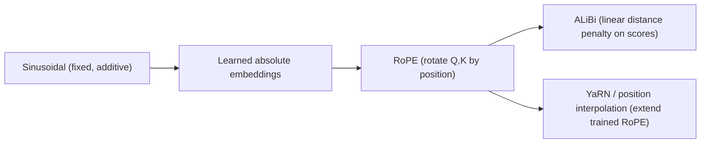

# Context Window and Positional Encoding

## TL;DR

Self-attention has no inherent notion of token order — it's permutation-equivariant — so
transformers must inject position information explicitly. The field moved from fixed sinusoidal
encodings, to learned absolute embeddings, to RoPE (rotary position embedding, the current default
in most LLMs), to ALiBi (a simpler linear bias alternative), with YaRN and position interpolation
as post-hoc tricks to stretch a model's trained context length. Separately, "context window" is a
capacity number, and a bigger one does not substitute for retrieval — models reliably attend worse
to information in the middle of a long context ("lost in the middle"), so relevant context still
has to be found and placed well, not just fit inside the window.

## Intuition

Attention computes a weighted average over *values* using *content* similarity between queries and
keys — nothing in $QK^\top$ cares whether a key came from position 3 or position 3000. If you feed
a transformer the same set of tokens in scrambled order, self-attention alone gives you the same
set of outputs, just permuted. Positional encoding is the patch: inject a signal into the
computation that lets the model tell "the token two positions to my left" apart from "the token two
hundred positions to my left." The interesting engineering history is entirely about *how* to
inject that signal so it (a) generalizes to sequence lengths never seen in training and (b) plays
well with attention's dot-product structure.

## The maths

### Sinusoidal (original Transformer)

Fixed, non-learned position embeddings added to token embeddings:

$$
PE_{(pos, 2i)} = \sin\!\left(\frac{pos}{10000^{2i/d}}\right), \quad
PE_{(pos, 2i+1)} = \cos\!\left(\frac{pos}{10000^{2i/d}}\right)
$$

Different frequencies per dimension pair means each position gets a unique fingerprint, and because
sinusoids are periodic and additive, $PE_{pos+k}$ is a linear function of $PE_{pos}$ — the intent
was that relative position could in principle be recovered by a linear transform. In practice this
absolute-position injection at the input only weakly propagates the *relative* relationship through
many attention layers, which motivated everything that followed.

### Learned absolute embeddings

Simply a lookup table $E \in \mathbb{R}^{L_{max}\times d}$, one trainable vector per position, added
to token embeddings (used in GPT-2, BERT). Cheap and effective within the trained range, but
provides **zero information about positions beyond $L_{max}$** — the model has literally never seen
an embedding for position $L_{max}+1$, so extending context length requires retraining or
interpolation.

### RoPE (Rotary Position Embedding)

Instead of adding a position vector, RoPE **rotates** the query and key vectors by an angle
proportional to their position, applied to pairs of dimensions. For a 2D pair $(x_1, x_2)$ at
position $m$:

$$
R_{\Theta,m}\begin{pmatrix}x_1\\x_2\end{pmatrix} =
\begin{pmatrix}\cos m\theta & -\sin m\theta\\ \sin m\theta & \cos m\theta\end{pmatrix}
\begin{pmatrix}x_1\\x_2\end{pmatrix}
$$

applied independently to each of $d/2$ dimension pairs with a distinct frequency $\theta_i$ per
pair (same frequency schedule idea as sinusoidal encoding). The key derivation: the dot product of
two rotated vectors depends only on the *difference* in rotation angle, i.e. the relative position.

**Why rotation makes relative position fall out of the dot product.** Treat a dimension pair as a
complex number $z = x_1 + ix_2$; rotating by angle $m\theta$ is multiplying by $e^{im\theta}$. The
rotated query at position $m$ is $q e^{im\theta}$ and the rotated key at position $n$ is
$k e^{in\theta}$. Their attention score (the real part of one times the conjugate of the other,
which is exactly what the dot product of the 2D rotated pairs computes) is:

$$
\text{Re}\big[(q e^{im\theta})\overline{(k e^{in\theta})}\big]
= \text{Re}\big[q\bar{k}\, e^{i(m-n)\theta}\big]
$$

The absolute positions $m$ and $n$ only ever appear through their **difference** $(m-n)$. This is
exact, not approximate: rotating both vectors by the same amount doesn't change the angle between
them, only their difference in rotation does — so the attention score is provably a function of
relative position alone, for every dimension pair, at every layer, with no learned parameters
required. This is why RoPE both extrapolates more gracefully than learned absolute embeddings (the
rotation formula is defined for any position, not just ones seen in training) and needs no
per-position embedding table.

### ALiBi (Attention with Linear Biases)

Skip explicit positional embeddings on Q/K entirely. Instead, add a fixed linear penalty to the
attention scores based on the distance between query and key positions:

$$
\text{score}_{ij} = q_i \cdot k_j - m \cdot |i - j|
$$

where $m$ is a fixed, head-specific slope (different heads get different slopes, geometrically
spaced). Closer tokens get less penalty, distant tokens more — a soft recency bias baked directly
into attention. No learned or rotated position vectors at all, which makes it simple and, notably,
extrapolates to much longer sequences than trained on with little quality loss, because the penalty
formula, like RoPE's rotation, is defined smoothly for any distance.

### YaRN and position interpolation

A model trained with RoPE at context length $L$ has frequencies $\theta_i$ tuned for positions up to
$L$; feeding it positions beyond $L$ pushes the rotation angles into a regime the model never
learned to interpret, and quality degrades sharply. **Position interpolation** rescales positions
so a longer sequence maps back into the trained range: instead of feeding actual position $m$,
feed $m \cdot L/L'$ for a new target length $L'$ — compressing the effective rotation range back to
what the model has seen, at the cost of reduced resolution between adjacent tokens. **YaRN**
refines this by interpolating different frequency bands differently — low frequencies
(slow-rotating, long-range dependencies) get interpolated more aggressively, high frequencies
(fast-rotating, local/short-range dependencies, which are more sensitive to interpolation
distortion) are left closer to their original scale — plus a temperature adjustment to attention
logits to compensate for the resulting change in entropy. This gets meaningfully better long-context
extrapolation than naive linear interpolation, usually with a short fine-tuning phase at the new
length rather than none at all.

### Lost in the middle

Even models with a large advertised context window show a measurable U-shaped accuracy curve on
retrieval-style tasks: information at the very start or very end of the context is recalled more
reliably than information buried in the middle. This isn't fully explained by any single mechanism,
but contributing factors are architectural: RoPE-style relative encodings still make very distant
key-query pairs harder to discriminate than very close ones, causal masking gives earlier tokens
more "opportunities" to be attended to by everything after them, and training data rarely contains
long documents where the single most important fact sits in the exact middle — so the skill is
comparatively under-trained.

## Diagram



## Code

RoPE applied to a query/key pair, illustrating that only relative position survives in the score:

```python
import numpy as np

def rope_rotate(x, pos, theta=10000.0):
    d = x.shape[-1]
    freqs = 1.0 / (theta ** (np.arange(0, d, 2) / d))
    angles = pos * freqs
    x1, x2 = x[..., 0::2], x[..., 1::2]
    cos, sin = np.cos(angles), np.sin(angles)
    rotated = np.empty_like(x)
    rotated[..., 0::2] = x1 * cos - x2 * sin
    rotated[..., 1::2] = x1 * sin + x2 * cos
    return rotated

d = 8
q, k = np.random.randn(d), np.random.randn(d)

# score at absolute positions (5, 2) vs (105, 102) -- same relative offset (3)
q5, k2 = rope_rotate(q, 5), rope_rotate(k, 2)
q105, k102 = rope_rotate(q, 105), rope_rotate(k, 102)

print(np.dot(q5, k2), np.dot(q105, k102))  # near-identical: score depends on relative offset
```

## In practice

- **Use it when:** RoPE is the default choice for any new decoder-only LLM today (LLaMA, Mistral,
  Qwen and most open models use it); ALiBi is a reasonable simpler alternative when extreme
  extrapolation robustness matters more than peak in-distribution quality.
- **Defaults that work:** RoPE with base $\theta = 10000$ for standard context lengths; for
  extending an existing RoPE model beyond its trained length, YaRN with a short fine-tuning phase
  outperforms naive linear position interpolation.
- **Breaks when:** any positional scheme is pushed well past its trained/calibrated range without
  interpolation — expect a sharp, not gradual, quality cliff, because the model is evaluating
  attention patterns it never saw during training.
- **Cost / latency:** positional encoding itself is essentially free (RoPE rotation is O(d) per
  token); the real cost of "bigger context window" is quadratic attention compute and linear KV
  cache growth (see [[flash-attention-and-efficient-attention]],
  [[kv-cache-and-inference-optimization]]), not the positional scheme.

## Interview angle

**Q. Derive why RoPE's attention score depends only on relative position.**
Represent a 2D dimension-pair as a complex number and rotation by angle $\theta$ per position as
multiplication by $e^{i\theta \cdot \text{pos}}$. The score between a query rotated by $m\theta$ and
a key rotated by $n\theta$ reduces, via the identity $\text{Re}[q\bar k \, e^{i(m-n)\theta}]$, to an
expression where $m$ and $n$ appear only through their difference $m-n$. So no matter what absolute
positions two tokens sit at, if their offset is the same, the rotational contribution to their
attention score is identical.

**Follow-up.** Why is this better than adding a learned position vector? → An additive embedding
mixes absolute position into the representation and relies on the network to *learn* to extract
relative relationships through training; RoPE makes relative-position-dependence a mathematical
property of the dot product itself, so it holds by construction, including at positions the model
saw rarely or never during training.

**Q. Why doesn't a 1M-token context window make retrieval-augmented generation unnecessary?**
Two independent reasons: (1) "lost in the middle" — measured recall degrades for information
placed in the middle of a very long context even when it technically fits, so cramming everything
in doesn't guarantee the model actually uses it; (2) cost and latency — attention is quadratic in
sequence length and KV cache grows linearly, so filling a huge context window on every request is
expensive and slow compared to retrieving only the relevant few thousand tokens. Long context and
retrieval solve different problems: long context lets a model reason over material *once it's been
selected*; retrieval decides *what deserves to be there in the first place*, cheaply.

**Follow-up.** When would you actually want to just stuff everything into a huge context window
instead of retrieving? → When the task genuinely requires holistic reasoning over the whole
document set at once (e.g. cross-document consistency checking) rather than answering a query that
depends on a small relevant subset — and when cost/latency at that scale is acceptable.

**Q. What's the practical difference between ALiBi and RoPE for long-context extrapolation?**
ALiBi bakes a monotonic distance penalty directly into the attention scores with no learned or
rotated position vectors, which empirically extrapolates further past the trained length with
smaller quality loss out of the box. RoPE gives better in-distribution quality at trained lengths
and is the current default, but needs an explicit extension technique (YaRN, position
interpolation) to extrapolate well.

## Traps

- Saying attention "naturally" respects word order — it does not; order is added entirely via
  positional encoding, and this is worth stating explicitly even when not asked directly.
- Claiming a model's "context window" number is the same as its *effective* usable context — long-
  context benchmarks routinely show real recall degradation well before the nominal limit.
- Describing RoPE as "adding" positional information like sinusoidal encoding does — it's
  multiplicative/rotational applied to Q and K specifically, not additive to the input embedding;
  conflating the two is a common and checkable mistake.
- Assuming ALiBi has "no positional information" — it has a very simple, strictly monotonic one
  (linear in distance), not none; it just skips the rotation/embedding machinery.
- Treating position interpolation and YaRN as the same technique — naive linear interpolation
  degrades short-range resolution because it scales all frequencies equally; YaRN's frequency-band
  -dependent scaling is the improvement.

## Flashcards

Why is a positional encoding needed at all in a transformer?::Self-attention is permutation-equivariant — it has no built-in notion of token order — so position must be injected explicitly.
In RoPE, what mathematical operation encodes position?::Rotating query and key vectors (per dimension pair) by an angle proportional to their absolute position.
Why does RoPE's attention score depend only on relative position?::Because rotating both a query and key vector, then taking their dot product, produces a result that depends only on the difference between their rotation angles — i.e. their positional offset.
What is ALiBi's mechanism for encoding position?::A fixed linear penalty subtracted from attention scores, proportional to the distance between query and key positions, with per-head slopes.
What problem does position interpolation solve, and what's its cost?::It lets a RoPE model handle sequences longer than it was trained on by rescaling positions back into the trained range; the cost is reduced resolution between nearby tokens.
What does YaRN improve over naive linear position interpolation?::It interpolates different frequency bands differently — low frequencies more aggressively, high frequencies less — instead of scaling all frequencies uniformly.
What is "lost in the middle"?::The empirical finding that models recall information placed in the middle of a long context less reliably than information at the start or end, even when everything fits within the context window.
Does a larger context window replace the need for retrieval?::No — attention cost grows quadratically and recall degrades for buried information, so retrieving only relevant content is usually cheaper and more reliable than stuffing everything in.

## Related

[[attention-mechanism]]
[[transformer-architecture]]
[[kv-cache-and-inference-optimization]]
[[rag-overview]]
[[flash-attention-and-efficient-attention]]
