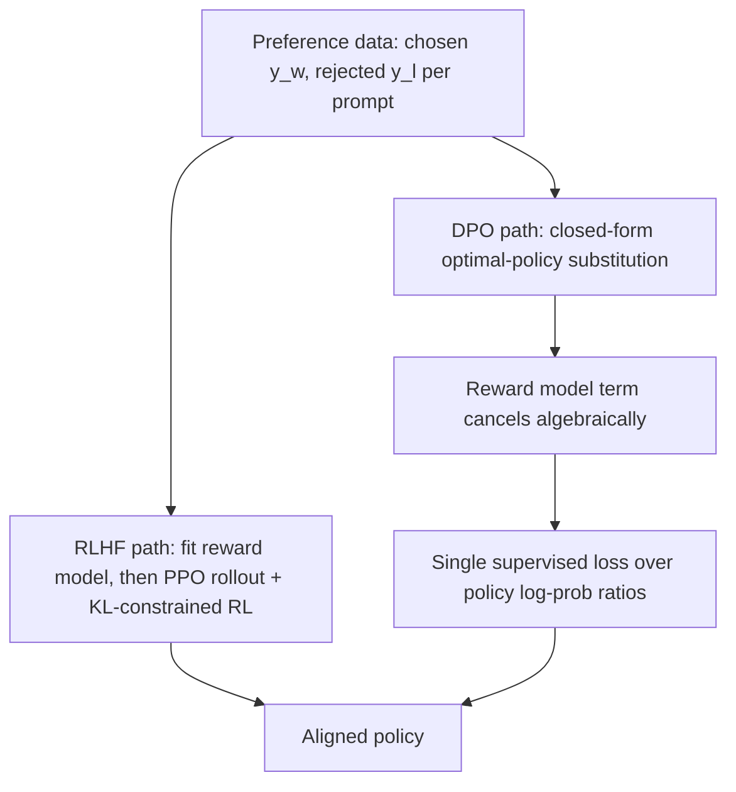

# DPO and Preference Optimisation

## TL;DR
Direct Preference Optimisation (DPO) achieves the same alignment goal as RLHF — pushing the model
toward human-preferred outputs while staying close to a reference policy — but as a single, closed-form
supervised loss on (chosen, rejected) pairs, with **no separate reward model and no reinforcement
learning loop**. It's the key derivation result: RLHF's KL-constrained reward-maximisation problem has
an analytic optimal-policy solution, and substituting that solution back into the Bradley-Terry
preference model eliminates the reward model entirely, leaving a simple classification-style loss.

## Intuition
RLHF does: learn a scorer for "which response is better," then run a whole reinforcement learning
procedure to nudge the policy toward what that scorer likes, being careful not to wander too far. DPO
notices that if you write down the *math* of "the optimal policy under that RL objective," you can
solve for it in closed form — and that closed form tells you exactly what the reward function must
have looked like in terms of the policy itself. Plug that back into the preference-comparison
equation and the reward model cancels out algebraically, leaving you a plain supervised loss you can
train with ordinary gradient descent, no sampling/rollouts/RL required.

## The maths

### Starting point — the same KL-constrained objective as RLHF
$$
\max_\pi \; \mathbb{E}_{x,\, y \sim \pi(\cdot|x)}\big[r(x,y)\big] - \beta \, D_{\text{KL}}\big(\pi(\cdot|x) \,\|\, \pi_{\text{ref}}(\cdot|x)\big)
$$

### Step 1 — closed-form optimal policy for a fixed reward $r$
This objective has a known analytic maximiser (a standard result for KL-regularised reward
maximisation — the solution is a reference-weighted Boltzmann distribution):

$$
\pi_r(y \mid x) = \frac{1}{Z(x)} \, \pi_{\text{ref}}(y \mid x) \, \exp\!\left(\frac{1}{\beta} r(x,y)\right)
$$

where $Z(x) = \sum_y \pi_{\text{ref}}(y\mid x)\exp\!\big(\tfrac{1}{\beta}r(x,y)\big)$ is an
intractable normalising constant (summing over all possible responses $y$).

### Step 2 — invert to express the reward in terms of the policy
Rearranging for $r(x,y)$:

$$
r(x,y) = \beta \log \frac{\pi_r(y\mid x)}{\pi_{\text{ref}}(y\mid x)} + \beta \log Z(x)
$$

This is the key reparameterisation: **any reward function consistent with this optimal-policy form
can be written purely in terms of the policy ratio to the reference model**, up to a
prompt-dependent (not response-dependent) constant $\beta\log Z(x)$.

### Step 3 — substitute into the Bradley-Terry preference model
Recall the Bradley-Terry preference probability from RLHF's reward-model training
(see [[rlhf]]): $p(y_w \succ y_l \mid x) = \sigma\big(r(x,y_w) - r(x,y_l)\big)$. Substitute the
reparameterised reward from Step 2. Crucially, the intractable $\beta \log Z(x)$ term is **identical**
for $y_w$ and $y_l$ (both responses to the same prompt $x$), so it **cancels** in the difference:

$$
r(x,y_w) - r(x,y_l) = \beta \log \frac{\pi_\theta(y_w\mid x)}{\pi_{\text{ref}}(y_w\mid x)} - \beta \log \frac{\pi_\theta(y_l\mid x)}{\pi_{\text{ref}}(y_l\mid x)}
$$

### Step 4 — the DPO loss
Plugging this back into the preference likelihood and maximising it directly over the policy
$\pi_\theta$ (rather than fitting a separate reward model first) gives the DPO loss:

$$
\mathcal{L}_{\text{DPO}}(\theta) = -\mathbb{E}_{(x,y_w,y_l)}\left[
\log \sigma\!\left(\beta \log \frac{\pi_\theta(y_w\mid x)}{\pi_{\text{ref}}(y_w\mid x)} - \beta \log \frac{\pi_\theta(y_l\mid x)}{\pi_{\text{ref}}(y_l\mid x)}\right)
\right]
$$

This is a plain binary classification loss over log-probability ratios — no reward model, no
sampling from the policy during training, no PPO. $\beta$ plays the same role as in RLHF: it controls
how far the implicit reward (and therefore the trained policy) is allowed to diverge from the
reference policy — small $\beta$ allows larger divergence (stronger preference-fitting, more risk of
drifting off-distribution), large $\beta$ keeps the policy closer to $\pi_{\text{ref}}$.

### Why this is legitimate, not just a heuristic
DPO isn't an approximation of RLHF — it's an exact reparameterisation of the same optimisation
problem. The reward model implicit in a DPO-trained policy is recoverable (up to the constant) as
$\hat r(x,y) = \beta \log \frac{\pi_\theta(y\mid x)}{\pi_{\text{ref}}(y\mid x)}$; DPO simply skips
ever fitting $\hat r$ as a separate network and estimating its gradient through samples, jumping
straight to the policy that would have resulted from doing so.

## Diagram


## Code
```python
import torch
import torch.nn.functional as F

def dpo_loss(policy_logps_chosen, policy_logps_rejected,
             ref_logps_chosen, ref_logps_rejected, beta=0.1):
    """
    policy_logps_*, ref_logps_*: sum of token log-probs for the response
    under the trained policy and the frozen reference model, respectively.
    """
    policy_logratios = policy_logps_chosen - policy_logps_rejected
    ref_logratios = ref_logps_chosen - ref_logps_rejected

    logits = beta * (policy_logratios - ref_logratios)
    loss = -F.logsigmoid(logits).mean()
    return loss

# Using HF TRL's DPOTrainer in practice:
# from trl import DPOTrainer, DPOConfig
# trainer = DPOTrainer(
#     model=policy_model,
#     ref_model=ref_model,          # frozen SFT copy; can be None to reuse adapter base
#     args=DPOConfig(beta=0.1, learning_rate=5e-6),
#     train_dataset=preference_dataset,   # columns: prompt, chosen, rejected
#     tokenizer=tokenizer,
# )
# trainer.train()
```

## In practice
- **Use it when:** you already have (or can construct) a static preference dataset — pairs of
  (chosen, rejected) responses per prompt — and want alignment gains without building and maintaining
  a separate reward model or RL training infrastructure. This describes most production preference-
  tuning pipelines in 2026.
- **Defaults that work:** $\beta$ in the 0.1–0.5 range as a starting point; initialise the reference
  model as a frozen copy of the SFT checkpoint; small learning rates (on the order of 1e-6 to 5e-6 for
  full fine-tuning, higher for LoRA adapters); combine with LoRA/QLoRA (see
  [[parameter-efficient-finetuning-lora]]) to make preference tuning affordable on modest hardware.
- **Breaks when:** the preference dataset is noisy, inconsistent, or too narrow (the model overfits
  to spurious surface patterns that correlate with "chosen" in the data, e.g. length or formatting
  bias); or when you need online/iterative preference collection against an evolving reward signal —
  DPO is inherently offline on a fixed dataset, whereas RLHF's PPO loop can incorporate fresh reward
  model queries against newly sampled model outputs.
- **Cost / latency:** dramatically cheaper than RLHF — no reward model to train and hold in memory,
  no online generation/rollout loop during training, just two forward passes (policy, frozen
  reference) per batch and a standard backward pass — closer in cost profile to SFT than to PPO-based
  RLHF.

## Interview angle

**Q. Derive why DPO doesn't need a separate reward model.**
Walk through the four steps above: (1) the KL-constrained RL objective has a known closed-form
optimal policy in terms of the reward, $\pi_r \propto \pi_{\text{ref}} \exp(r/\beta)$; (2) invert this
to express $r$ in terms of the policy ratio to the reference, plus an intractable
prompt-dependent normaliser $Z(x)$; (3) substitute into the Bradley-Terry preference probability,
where the $Z(x)$ term cancels between the chosen and rejected response since it depends only on the
prompt; (4) the result is a supervised loss directly over $\pi_\theta$, with the reward model
implicit and never separately estimated.

**Q. What role does beta play in DPO, and is it the same beta as in RLHF?**
Conceptually yes — it's the same KL-regularisation strength from the shared underlying objective,
now appearing as a temperature-like scale on the log-probability-ratio logits fed into the sigmoid.
Small $\beta$ lets the trained policy diverge further from the reference to fit preferences more
aggressively (risking overfitting/off-distribution drift); large $\beta$ keeps it closer to the
reference, more conservative preference-fitting.

**Q. When would you still choose RLHF/PPO over DPO despite the added complexity?**
When you need online preference collection against a reward signal that keeps improving during
training (iterative RLHF, best-of-n distillation loops), when your preference data is itself
generated by an evolving reward model rather than fixed upfront, or when you have mature RL
infrastructure and want finer control over the exploration/exploitation tradeoff during training.
For a fixed, already-collected preference dataset, DPO recovers essentially the same objective with
far less engineering risk.

**Q. Practically: do you need RL (RLHF/DPO) at all, or is SFT enough for your use case?**
Ask whether the desired improvement is expressible as "there is one correct target output" (SFT
suffices — most narrow enterprise tasks: extraction, classification-as-generation, style/format
compliance with a single right answer) or "given two plausible outputs, one is preferred" (needs
preference optimisation — tone calibration, safety-nuance refusals, helpfulness/verbosity tradeoffs,
subjective quality). In practice: ship SFT first, measure where outputs are technically correct but
still not "what a human would pick," and only then invest in a preference dataset and DPO (default
choice for cost) or RLHF (if you specifically need online RL dynamics).

**Follow-up.** How would you build a preference dataset cheaply if you don't have human labellers at
scale? → Use a strong "judge" model to generate pairwise preferences (LLM-as-judge), optionally
combined with a smaller amount of human-verified gold comparisons to calibrate/validate the judge —
a common practical substitute, with the caveat that judge-model biases (e.g. length bias, position
bias) need explicit mitigation and spot-checking against human judgement.

## Traps
- Describing DPO as "an approximation to RLHF" — it's an exact algebraic reparameterisation of the
  same objective, not an approximation; the difference is computational path, not the target being
  optimised.
- Forgetting that the reference model in DPO must stay **frozen** throughout training — same
  requirement as RLHF's reference policy in the KL term.
- Claiming DPO "has no reward model" in an absolute sense — it has an *implicit* reward model
  ($\beta \log \frac{\pi_\theta}{\pi_{\text{ref}}}$), it's just never trained as a separate network.
- Assuming DPO is strictly better than RLHF in all cases — it's better on cost/simplicity/stability
  for a fixed offline preference dataset, but RLHF's online loop has genuine advantages when the
  reward signal itself needs to keep evolving during training.

## Flashcards
DPO's core mathematical trick::substitute the closed-form KL-regularised optimal policy back into the Bradley-Terry preference model, cancelling the reward model
Why the intractable normaliser Z(x) cancels in DPO::it depends only on the prompt, and appears identically for both the chosen and rejected response
DPO loss shape::negative log-sigmoid of beta times the difference of policy-to-reference log-probability ratios for chosen vs rejected
What beta controls in DPO::how far the implicit reward (and resulting policy) is allowed to diverge from the reference model
Main practical advantage of DPO over RLHF::no separate reward model or online RL rollout loop — a single supervised loss on a static preference dataset
When to prefer RLHF over DPO despite the complexity::online/iterative preference collection against an evolving reward signal
Rule of thumb: SFT vs preference optimisation (RLHF/DPO)::SFT for tasks with one correct target; RLHF/DPO when the goal is a preference between plausible outputs

## Related
[[rlhf]]
[[instruction-tuning-and-sft]]
[[parameter-efficient-finetuning-lora]]
[[llm-evaluation]]
[[llm-safety-and-guardrails]]
