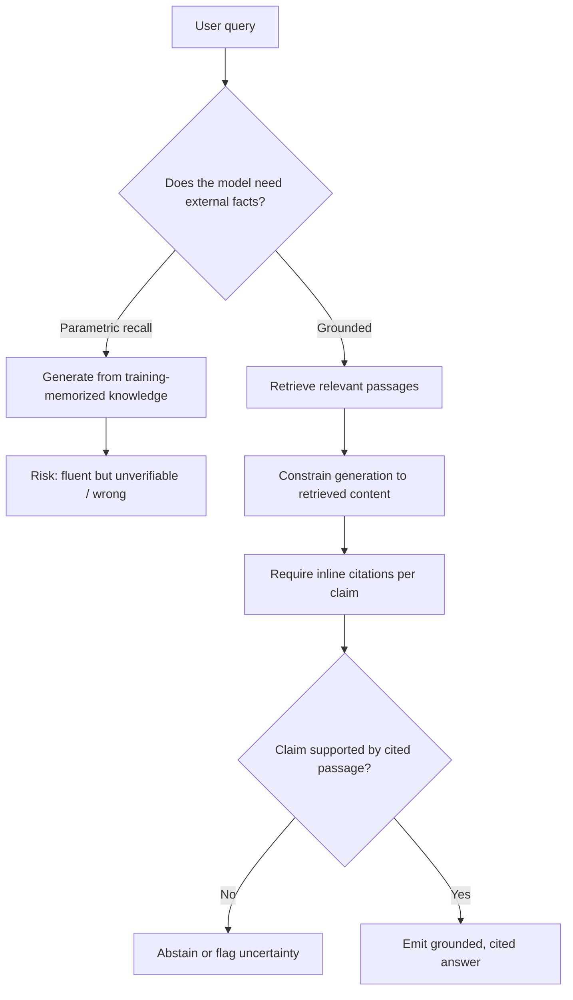

# Hallucination and Grounding

## TL;DR

Hallucination is an LLM producing fluent, confident output that is factually wrong or unsupported —
not a bug in the traditional sense but a direct consequence of how these models are trained:
next-token prediction optimizes for plausible continuations, not verified truth, and there's no
built-in mechanism that distinguishes "I recall this precisely" from "this is a statistically
plausible-sounding completion." Grounding — retrieval, citation enforcement, abstention — doesn't
fix the underlying mechanism; it constrains the model's output to be checkable against an external
source of truth, and measures whether it actually used it.

## Intuition

An LLM's weights encode a compressed, lossy, and imperfectly recalled statistical summary of its
training data — not a database with an exact-lookup guarantee. When asked something the model
doesn't robustly "know," it doesn't have a native "I don't know" reflex; it continues generating
the most locally plausible next tokens, and plausible-sounding-but-wrong output is just as easy
for the model to produce, token by token, as plausible-and-correct output. It's less "the model
lied" and more "the model was never given a way to know it was guessing." Grounding fixes this not
by making the model smarter, but by changing the task: instead of "recall the answer from your
weights," it becomes "read this retrieved passage and answer strictly from what's written there,"
which is a task the model is much better at (reading comprehension is far more reliable than
long-tail factual recall).

## The maths

There's no single "hallucination equation," but the mechanism has a fairly precise information-
theoretic framing worth being able to state:

### Why it happens mechanistically

1. **Training objective mismatch.** Pretraining minimizes next-token cross-entropy over a corpus;
   nothing in the loss distinguishes a token sequence that is *true* from one that is merely
   *distributionally likely* given the training data. A rare fact seen only a handful of times in
   training gets a weak, easily-overwritten gradient signal compared to common patterns — the model
   ends up with high confidence on common structures and comparatively poor, sometimes fabricated,
   recall on the long tail.

2. **No calibrated uncertainty signal exposed at inference.** The model's output distribution
   $p(x_t \mid x_{<t})$ can in principle be peaked (confident) or flat (uncertain), but standard
   decoding (see [[decoding-strategies]]) doesn't surface that uncertainty to the user — a
   token sampled from a fairly flat, uncertain distribution looks exactly as fluent as one sampled
   from a sharply peaked, confident one. Fluency and correctness are decoupled by construction.

3. **Instruction tuning rewards answering over abstaining.** RLHF/SFT data overwhelmingly reward
   helpful, direct answers; a dataset that rarely demonstrates "I don't know" as the preferred
   response teaches the model that hedging is dispreferred, compounding the problem — this is a
   training-data/reward artifact on top of the base mechanism, not an independent cause.

4. **Compounding autoregressive error.** Once an early token in a factual claim is wrong (a
   fabricated name, a wrong number), every subsequent token conditions on that error and tends to
   generate a self-consistent but entirely fabricated elaboration — the model isn't "double
   checking," it's continuing a plausible story it already started.

### Measuring it

Common approaches: **factual-consistency scoring** against a reference (entailment models or
LLM-as-judge checking whether each generated claim is supported by a ground-truth or retrieved
source — see [[llm-evaluation]]); **self-consistency / sampling variance** (generate the same
answer multiple times at nonzero temperature; high disagreement across samples correlates with low
confidence and higher hallucination risk, since a well-known fact should be reproduced consistently);
and **citation precision/recall** in RAG settings (of the claims made, what fraction are actually
supported by the cited source, and of the retrieved relevant passages, what fraction get cited).

## Diagram



## Code

A simple grounding-and-citation-check pattern: force the model to cite, then verify each citation
against the source passage with a lightweight entailment-style check.

```python
def answer_with_citations(query, retrieved_passages, llm_call):
    context = "\n\n".join(f"[{i}] {p}" for i, p in enumerate(retrieved_passages))
    prompt = (
        f"Answer the question using ONLY the passages below. "
        f"Cite the passage number for every factual claim, like [0]. "
        f"If the passages don't contain the answer, say 'I don't have enough information.'\n\n"
        f"Passages:\n{context}\n\nQuestion: {query}"
    )
    return llm_call(prompt)

def verify_citations(answer, retrieved_passages, nli_model):
    # nli_model: any entailment scorer, e.g. a cross-encoder fine-tuned on NLI
    import re
    claims = re.findall(r"([^.]+?)\[(\d+)\]", answer)
    results = []
    for claim_text, idx in claims:
        passage = retrieved_passages[int(idx)]
        entailment_score = nli_model.predict(premise=passage, hypothesis=claim_text.strip())
        results.append({"claim": claim_text.strip(), "supported": entailment_score > 0.5})
    unsupported = [r for r in results if not r["supported"]]
    return results, len(unsupported) == 0
```

## In practice

- **Use it when:** any factual, knowledge-heavy, or high-stakes application (legal, medical,
  financial, internal-docs Q&A) — anywhere an ungrounded, confidently-wrong answer is worse than a
  slower, sourced one.
- **Defaults that work:** retrieval-augmented generation with mandatory inline citations, an
  explicit "insufficient information" instruction in the system prompt, and a downstream check that
  citations actually support the claims (not just present) rather than trusting the model's own
  claim of grounding.
- **Breaks when:** the retrieval step itself returns irrelevant or stale documents (grounding is
  only as good as what's retrieved — see [[rag-failure-modes]]); the model ignores the "cite only
  from context" instruction under long or noisy contexts; or a task genuinely requires reasoning
  beyond what's in any retrievable document (grounding can't fix a question with no good source).
- **Cost / latency:** grounding adds a retrieval step and typically a longer prompt (retrieved
  context), plus optionally a verification pass — real latency/cost overhead, traded for a
  measurable reduction in unsupported claims; abstention design also has a cost in usefulness
  (a model that abstains too readily is unhelpful, so the threshold itself needs tuning and eval).

## Interview angle

**Q. Explain, mechanistically, why LLMs hallucinate — not just "they make things up."**
The training objective (next-token cross-entropy) optimizes for plausible continuations, not
verified truth, so the model has no built-in signal distinguishing a confidently memorized fact
from a merely plausible-sounding guess. This is compounded by three things: rare facts get weak
gradient signal during pretraining so recall on the long tail is unreliable; standard decoding
doesn't expose the model's internal uncertainty to the output, so an uncertain guess looks exactly
as fluent as a confident correct answer; and instruction tuning data overwhelmingly rewards direct
answers over abstention, actively discouraging "I don't know" as a learned behavior. Once a wrong
token starts a claim, autoregressive generation tends to continue it consistently rather than
self-correct.

**Follow-up.** Does making the model bigger fix hallucination? → It helps with the "weak gradient
signal on rare facts" part (bigger models have more capacity to memorize long-tail facts and are
empirically somewhat better calibrated), but it doesn't fix the structural issues — no exposed
uncertainty signal at decode time, and instruction-tuning incentives against abstention are
independent of model scale.

**Q. What's the difference between grounding via retrieval and just asking the model to "only say
things you're sure of"?**
The latter relies on the model's own (often poorly calibrated) self-assessment of certainty with no
external check — the model can be confidently wrong about being confident. Grounding via retrieval
changes the *task*: instead of recalling from parametric memory, the model does reading
comprehension over a provided passage, a task LLMs perform far more reliably, and critically it
gives you something to *check against* — you can verify a claim is actually supported by the cited
source, which you cannot do for an unsourced claim from parametric memory.

**Q. How would you measure hallucination rate in a production RAG system?**
Citation precision (of the claims made, what fraction are actually entailed by their cited
passage — checked via an NLI model or LLM-as-judge) and citation recall (of the retrieved relevant
information, how much got used/cited); self-consistency sampling (generate the same query multiple
times, measure variance — high variance on a factual question is a hallucination signal); and a
golden-answer regression suite (see [[llm-evaluation]]) run in CI so a prompt or retrieval change
that increases hallucination rate is caught before shipping, not discovered from user complaints.

**Follow-up.** What's a concrete failure mode where citations are present but the answer still
hallucinates? → The model cites a real, retrieved passage but the claim attached to it isn't
actually supported by that passage's content — a fabricated detail wrapped in a real-looking
citation, which is why citation *verification* (checking entailment) matters more than citation
*presence*.

**Q. Should a production system ever let the model abstain, and how do you decide the threshold?**
Yes, for high-stakes or narrow-domain applications — an explicit "insufficient information" path is
usually preferable to a fabricated answer. The threshold is a genuine precision/recall tradeoff: too
eager to abstain and the system becomes unhelpful (recall problem); too reluctant and unsupported
claims slip through (precision problem). Tune it against a labeled eval set of answerable vs
genuinely-unanswerable queries, not by intuition.

## Traps

- Saying "hallucination happens because the model doesn't have access to the internet" — this
  conflates knowledge-cutoff/stale-training-data issues with the deeper mechanistic cause; even a
  model with perfect training data hallucinates on the long tail because of the objective mismatch,
  not merely missing information.
- Treating RAG as a complete fix — retrieval reduces hallucination by giving the model something to
  ground against, but the model can still misread, ignore, or misattribute the retrieved context;
  "we added RAG" is not the same claim as "we measured and reduced hallucination rate."
- Confusing citation *presence* with citation *correctness* — a model can attach a plausible-looking
  citation to an unsupported claim; verification requires checking entailment, not just format.
- Assuming bigger/newer models have "solved" hallucination — it's reduced with scale and better
  post-training on many benchmarks, not eliminated, and the mechanistic cause (objective mismatch,
  no exposed uncertainty) is architectural, not something that goes away with more parameters alone.
- Proposing "just tell the model to be honest" as a complete mitigation — a prompt-level nudge with
  no external verification or measurement is a weak, unverified mitigation, not a grounding strategy.

## Flashcards

What is the core objective-level reason LLMs hallucinate?::Pretraining optimizes next-token plausibility, not verified truth, so nothing in the loss distinguishes a confidently-known fact from a merely plausible-sounding guess.
Why doesn't standard decoding expose the model's uncertainty to the user?::A token sampled from a flat, uncertain distribution is just as fluent-looking as one from a sharply peaked, confident distribution — fluency and correctness are decoupled.
How does instruction tuning make hallucination worse?::RLHF/SFT data overwhelmingly reward direct, helpful answers over abstention, teaching the model that "I don't know" is a dispreferred response even when warranted.
What task does grounding via retrieval change the model's job into?::From parametric recall (memorized facts) to reading comprehension over a provided passage — a task LLMs do far more reliably.
What's the difference between citation presence and citation correctness?::Presence means a citation marker exists; correctness means the cited passage actually entails the claim — checked via entailment/NLI, not just formatting.
Name two concrete ways to measure hallucination rate in production.::Citation precision/recall against retrieved sources (via entailment checking), and self-consistency sampling (variance across repeated generations at the same query).
Does RAG fully eliminate hallucination?::No — the model can still misread, ignore, or misattribute retrieved context; RAG gives a source to ground and check against, it doesn't guarantee the model uses it correctly.

## Related

[[rag-overview]]
[[rag-failure-modes]]
[[llm-evaluation]]
[[structured-output-and-function-calling]]
[[reranking]]
