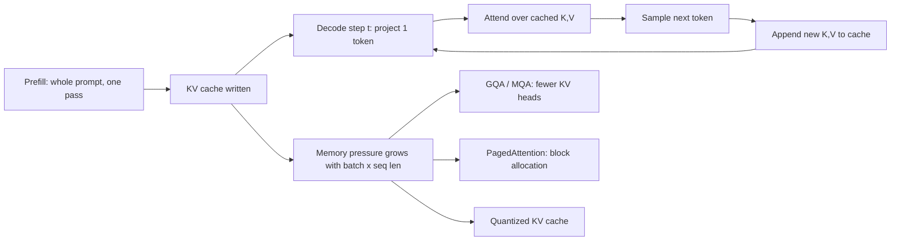

# KV Cache and Inference Optimization

## TL;DR
Autoregressive generation recomputes the same attention keys and values for every prior token at
every step. The KV cache stores them instead, turning decoding from $O(n^2)$ work per sequence into
$O(n)$ — at the cost of GPU memory that grows linearly with batch size and sequence length. Once
cached, decode becomes **memory-bandwidth-bound**, not compute-bound, and almost every serving
optimization (GQA, PagedAttention, continuous batching, quantized cache) is really an attack on
that memory wall.

## Intuition
Reading a long email thread to write a reply: you do not re-read every previous message before
typing each new word. You read it once, keep a summary in working memory, and consult that. The KV
cache *is* that working memory — one entry per token per layer per head. The catch is that working
memory sits in the same VRAM you wanted to use for weights and batch, and it never shrinks while
the conversation is alive.

## The maths

**Why a cache exists at all.** In a decoder block, for token positions $1..t$ with hidden states
$x_i \in \mathbb{R}^{d}$:

$$
q_t = W_Q x_t,\qquad k_i = W_K x_i,\qquad v_i = W_V x_i
$$

$$
\text{attn}(t) = \sum_{i \le t} \alpha_{ti}\, v_i,\qquad
\alpha_{ti} = \frac{\exp(q_t^\top k_i / \sqrt{d_\text{head}})}{\sum_{j \le t}\exp(q_t^\top k_j/\sqrt{d_\text{head}})}
$$

Symbols: $d$ = model hidden size, $d_\text{head}$ = per-head dimension, $W_Q, W_K, W_V$ = projection
matrices, $\alpha_{ti}$ = attention weight from query position $t$ onto key position $i$.

The crucial structural fact: **$k_i$ and $v_i$ depend only on $x_i$, not on $t$.** Because the mask
is causal, $x_i$ for $i<t$ never changes when we append token $t$. So $k_i, v_i$ are constant across
all future decode steps. Recomputing them is pure waste.

Without a cache, generating $n$ tokens costs $\sum_{t=1}^{n} O(t \cdot d) = O(n^2 d)$ in projections
alone. With a cache, each step projects **one** token: $O(n d)$ total, plus the unavoidable $O(n^2)$
in the attention score dot products themselves (you still compare $q_t$ against $t$ keys).

**Cache size.** For one sequence:

$$
M_{\text{KV}} = 2 \times L \times H_{kv} \times d_\text{head} \times S \times B \times b
$$

where $2$ = keys and values, $L$ = number of layers, $H_{kv}$ = number of **key/value** heads (equal
to query heads under MHA, fewer under GQA/MQA), $d_\text{head}$ = head dimension, $S$ = sequence
length in tokens, $B$ = batch size, $b$ = bytes per element (2 for fp16/bf16, 1 for fp8/int8).

**Worked example — a 7B-class model.** Take $L = 32$, $H_{kv} = 32$, $d_\text{head} = 128$ (so
$H_{kv} \cdot d_\text{head} = 4096 = d$), fp16 so $b = 2$.

Per token, per sequence:

$$
2 \times 32 \times 32 \times 128 \times 2 = 524{,}288 \text{ bytes} \approx 0.5 \text{ MB/token}
$$

So:

- 4{,}096-token context, batch 1: $\approx 2$ GB.
- 4{,}096-token context, batch 32: $\approx 64$ GB — **more than the model's own 14 GB of fp16
  weights**, and beyond a single 80 GB card once weights and activations are added.
- 128k context, batch 1: $\approx 64$ GB.

That single arithmetic result is the whole reason the field cares about GQA and paged memory. Say it
out loud in an interview and you have already separated yourself.

**Now with GQA at 8 KV heads** ($H_{kv}=8$, query heads still 32): the cache drops by $32/8 = 4\times$
to $\approx 0.125$ MB/token. Batch 32 at 4k context becomes $\approx 16$ GB. Same quality
ballpark, four times the concurrency.

**Prefill vs decode — the arithmetic intensity argument.**

- **Prefill** processes the whole prompt of $S_p$ tokens in one forward pass. Matrix–matrix
  multiplies, $O(S_p)$ FLOPs per weight byte loaded. Arithmetic intensity is high → **compute-bound**.
  Prefill cost scales with prompt length and sets **TTFT**.
- **Decode** processes one token per step. Every weight in the model is read from HBM to do a
  matrix–**vector** product. For a $P$-parameter model at $b$ bytes, each step moves $\approx P \cdot b$
  bytes but does only $\approx 2P$ FLOPs — arithmetic intensity $\approx 2/b$, i.e. ~1 FLOP per byte.
  Modern accelerators want hundreds. → **memory-bandwidth-bound**.

An upper bound on single-stream decode speed follows immediately:

$$
\text{tokens/sec} \lesssim \frac{\text{HBM bandwidth (bytes/s)}}{P \cdot b + \text{KV bytes read per step}}
$$

For a 7B fp16 model (14 GB of weights) on a card with ~2 TB/s of bandwidth, the ceiling is roughly
$2{,}000/14 \approx 140$ tokens/s for batch 1 — and no amount of extra FLOPs helps. This is also
why **batching is close to free on decode**: the weight read is amortized across the batch, so
throughput rises nearly linearly with batch size until the KV cache exhausts memory.

## Diagram



## Code

```python
import torch
import torch.nn.functional as F

def attend(q, k, v, d_head):
    # q: (B, H, 1, dh)  k,v: (B, H, S, dh)
    scores = (q @ k.transpose(-1, -2)) / (d_head ** 0.5)
    return F.softmax(scores, dim=-1) @ v

class CachedAttention:
    """Minimal single-layer decode loop showing cache growth."""
    def __init__(self, n_heads, d_head):
        self.n_heads, self.d_head = n_heads, d_head
        self.k_cache = None
        self.v_cache = None

    def step(self, q_t, k_t, v_t):
        # each: (B, H, 1, dh) for the newest token only
        self.k_cache = k_t if self.k_cache is None else torch.cat([self.k_cache, k_t], dim=2)
        self.v_cache = v_t if self.v_cache is None else torch.cat([self.v_cache, v_t], dim=2)
        return attend(q_t, self.k_cache, self.v_cache, self.d_head)

def kv_cache_bytes(layers, kv_heads, d_head, seq_len, batch, bytes_per_elem=2):
    return 2 * layers * kv_heads * d_head * seq_len * batch * bytes_per_elem

# 7B-class, MHA vs GQA-8, 4k context, batch 32
mha = kv_cache_bytes(32, 32, 128, 4096, 32)
gqa = kv_cache_bytes(32,  8, 128, 4096, 32)
print(f"MHA: {mha/2**30:.1f} GiB   GQA-8: {gqa/2**30:.1f} GiB")
```

With Hugging Face `transformers`, the cache is the `past_key_values` object returned by the model
and passed back in; `model.generate(..., use_cache=True)` is the default and turning it off is a
useful way to *see* the quadratic blow-up for yourself.

## In practice

- **Use it when:** always, for any autoregressive decoder. The only reason to disable `use_cache` is
  debugging or a memory-desperate training-time forward.
- **Defaults that work:** GQA models (8 KV heads is a common choice) for anything you self-host;
  vLLM or TensorRT-LLM rather than a hand-rolled loop; `--max-model-len` set to what you actually
  need, not the model's theoretical maximum, because the server pre-reserves KV blocks against it.
- **Breaks when:** long contexts plus high concurrency. Symptoms are OOM at a specific concurrency,
  or throughput collapsing because the scheduler starts preempting and recomputing sequences.
- **Cost / latency:** prefill dominates TTFT and scales with prompt tokens; decode dominates total
  latency for long outputs and is bandwidth-bound. Cutting a 4k-token prompt in half roughly halves
  TTFT; it barely touches inter-token latency.

**Optimizations, in the order they usually pay off:**

1. **Continuous (in-flight) batching.** Classic static batching waits for the longest sequence in the
   batch to finish, wasting slots. Continuous batching evicts finished sequences and admits new ones
   at every decode step. Typically the single largest throughput win on real, heterogeneous traffic.
2. **PagedAttention.** Treat the KV cache like virtual memory: allocate fixed-size blocks (e.g. 16
   tokens) from a pool and keep a per-sequence block table instead of one contiguous buffer. Kills
   the internal fragmentation of reserving `max_len` per request, and makes prefix sharing (copy-on-
   write blocks across sequences with a common system prompt) nearly free. This is what vLLM is.
3. **MQA / GQA.** Architectural, so a serving-side choice only in which model you pick — but it is
   the cleanest $4$–$8\times$ cache reduction available.
4. **Prefix / prompt caching.** Reuse cached KV for an identical prompt prefix across requests. Huge
   when every request carries the same 2k-token system prompt or a shared document.
5. **Quantized KV cache** (fp8, int8). Halves cache memory. Quality impact is usually small but is
   not zero — measure on your own eval set, keys tend to be more sensitive than values.
6. **Chunked prefill.** Split a long prefill into chunks interleaved with decode steps so one giant
   prompt does not stall every other user's token stream. Trades a little TTFT for much better p99.

## Interview angle

**Q. Why does an LLM need a KV cache — what exactly would be recomputed without it?**
Keys and values for every previous token, in every layer, at every decode step. They are functions
only of the earlier hidden states, which are frozen by causal masking, so recomputation is pure
redundancy. Without the cache, generating $n$ tokens is $O(n^2)$ in the projections; with it, $O(n)$.

**Follow-up.** *So the cache makes generation linear?* → Not entirely. The projection work becomes
linear, but each step still dots the new query against $t$ cached keys, so the attention score
computation remains $O(n^2)$ over the whole generation. The cache removes the redundant work, not
the inherent quadratic comparison.

**Q. Estimate the KV cache for a 7B model, 32 layers, 32 heads of dim 128, fp16, batch 16, 8k context.**
Per token: $2 \times 32 \times 32 \times 128 \times 2 = 0.5$ MB. Times 8{,}192 tokens is 4 GB per
sequence; times batch 16 is **64 GB** — well past the 14 GB of weights and past a single 80 GB card
once activations are counted. That's the number that forces GQA or a smaller max context.

**Q. Why is decoding memory-bandwidth-bound while prefill is compute-bound?**
Prefill multiplies matrices by matrices — each weight loaded from HBM is reused across all prompt
tokens, so arithmetic intensity is high. Decode multiplies matrices by a single vector: every weight
in the model is read to produce one token, roughly 2 FLOPs per parameter against $b$ bytes read.
The GPU's ALUs idle waiting on HBM.

**Follow-up.** *What follows operationally?* → Batch aggressively, since the weight read amortizes
across the batch and throughput rises almost linearly until KV memory runs out. Also: quantizing
weights speeds up decode directly (fewer bytes to read), which is not obvious if you think in FLOPs.

**Q. What does PagedAttention actually solve?**
Fragmentation. A contiguous per-sequence cache must be sized for the worst case, so a request that
generates 50 tokens still holds a 4k-token reservation. Paging into small fixed blocks with a block
table means you allocate only what you use, and identical prefixes can share blocks copy-on-write.
Effective concurrency typically improves severalfold on realistic workloads.

**Q. A customer reports the first token takes 4 seconds but the rest stream fine. Where do you look?**
TTFT is prefill, so: prompt length (are we stuffing 8k of RAG context?), queueing delay ahead of
prefill, and whether long prefills from other users are blocking the scheduler. Fixes in order —
shorten/rerank the context, enable prefix caching if the system prompt is shared, enable chunked
prefill, then scale out. Adding GPUs without shortening the prompt just moves the queue.

## Traps

- **"The KV cache stores the attention output."** Wrong — it stores the projected keys and values
  per layer per head. Attention outputs depend on the current query and cannot be reused.
- **"Queries are cached too."** Wrong. There is exactly one query per step and it is never reused.
  The cache is K and V only; that's where the factor of 2 in the formula comes from.
- **"Bigger GPU = faster tokens."** Wrong for single-stream decode: speed is capped by memory
  bandwidth divided by model bytes. A card with more VRAM but the same bandwidth gives you more
  concurrency, not faster tokens.
- **"GQA is a serving trick I can switch on."** Wrong — it's baked into the pretrained weights. You
  choose it by choosing the model.
- **"Quantizing the KV cache is free."** Wrong. It is usually cheap, but it is a quality change and
  needs the same eval treatment as any other. Long-context retrieval tasks degrade first.
- **"Set max context to the model maximum, it only uses what it needs."** Wrong on most servers —
  the scheduler sizes its KV block pool and admission control against `max-model-len`, so an
  inflated value silently cuts your concurrency.

## Flashcards

What does the KV cache store?::The per-layer, per-head projected keys and values for all previous tokens — not queries, not attention outputs.
Why can keys and values be cached at all?::Causal masking means earlier hidden states never change, so $k_i,v_i$ are independent of the current step $t$.
KV cache size formula?::$2 \times \text{layers} \times \text{kv heads} \times d_\text{head} \times \text{seq len} \times \text{batch} \times \text{bytes}$.
Per-token KV cost of a 32-layer, 32-head, d_head=128 fp16 model?::About 0.5 MB per token per sequence.
Why is decode memory-bandwidth-bound?::One token per step means matrix–vector products: ~2 FLOPs per parameter against the full weight read from HBM.
Why is prefill compute-bound?::The whole prompt goes through at once, so each loaded weight is reused across many tokens — high arithmetic intensity.
What does GQA change?::Fewer key/value heads than query heads, shrinking the KV cache proportionally (e.g. 32→8 heads is a 4x cut).
What problem does PagedAttention solve?::KV memory fragmentation — fixed-size blocks plus a block table replace contiguous worst-case reservations and enable prefix sharing.
What is continuous batching?::Admitting and evicting sequences at every decode step instead of waiting for the whole static batch to finish.
Why does batching barely hurt per-token latency on decode?::The weight read from HBM is amortized across the batch, so the bandwidth bottleneck is shared.

## Related

- [[llm-serving-and-throughput]]
- [[flash-attention-and-efficient-attention]]
- [[quantization]]
- [[attention-mechanism]]
- [[transformer-architecture]]
- [[context-window-and-positional-encoding]]
- [[decoding-strategies]]
- [[small-language-models-and-cost]]
- [[llm-system-design-framework]]
