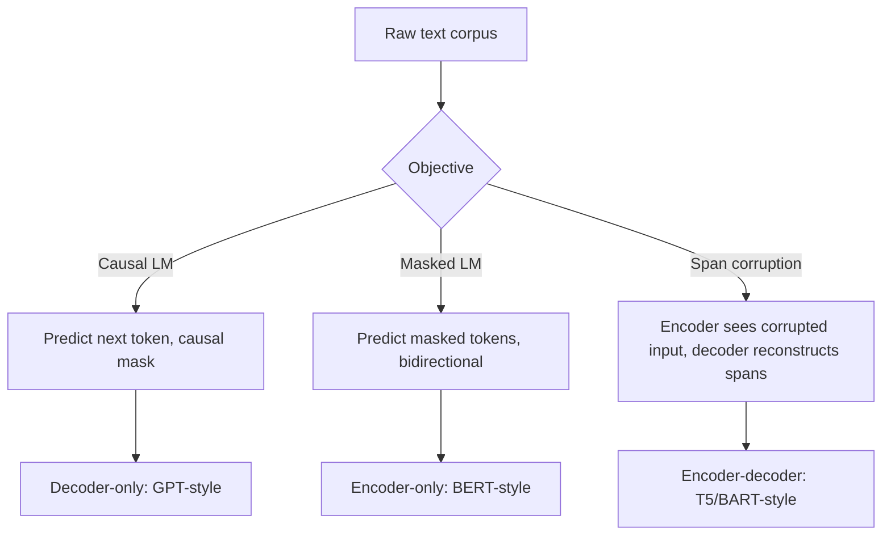

# Language Modelling Objectives

## TL;DR
Every pretrained NLP model is defined by what it's asked to predict during training. Causal
(autoregressive) LM predicts the next token given only the past — this is GPT and every modern
generative LLM. Masked LM predicts randomly hidden tokens given both left and right context — this is
BERT. Span-corruption / denoising objectives (T5, BART) sit between the two, masking and
reconstructing contiguous spans. The objective determines the architecture's attention pattern, what
the model is good at, and how it can be used downstream.

## Intuition
Think of the objective as the "exam" the model studies for. If the exam is "always guess the next
word," the model only ever practises reading left-to-right and generating — it becomes a generator.
If the exam is "fill in the blank using clues from both sides," the model practises building a rich
bidirectional understanding of the whole sentence — it becomes an encoder. You can't get generation
quality out of a fill-in-the-blank-trained model without extra work, and you can't get a bidirectional
representation for free out of a next-token predictor.

## The maths

### Causal (autoregressive) language modelling
Factorise the joint probability of a token sequence $x_1, \dots, x_T$ via the chain rule, and
maximise the log-likelihood of each token given only preceding tokens:

$$
\log p(x_1, \dots, x_T) = \sum_{t=1}^{T} \log p(x_t \mid x_{<t})
$$

$$
\mathcal{L}_{\text{CLM}} = -\frac{1}{T}\sum_{t=1}^{T} \log p_\theta(x_t \mid x_1, \dots, x_{t-1})
$$

Implemented with a **causal attention mask** — position $t$ can attend to positions $\le t$ only,
enforced by setting attention scores to $-\infty$ (before softmax) for $j > t$. This objective is what
lets a single training pass supervise every position in the sequence simultaneously (teacher forcing):
one forward pass gives $T$ next-token predictions and gradients.

### Masked language modelling (BERT-style)
Corrupt the input by replacing a random subset of tokens (typically 15%) with a `[MASK]` token (or a
random token, or leaving it unchanged — the original BERT recipe splits the 15% as 80% `[MASK]`, 10%
random token, 10% unchanged, so the model can't just learn "predict the identity function when
unmasked"), and predict the original tokens at the masked positions using **full bidirectional**
context:

$$
\mathcal{L}_{\text{MLM}} = -\sum_{i \in \mathcal{M}} \log p_\theta(x_i \mid x_{\setminus \mathcal{M}})
$$

where $\mathcal{M}$ is the set of masked positions and $x_{\setminus \mathcal{M}}$ is the full
sequence with those positions masked. No causal mask is needed — every token attends to every other
token, giving a much richer contextual representation per position, at the cost of not being able to
generate text autoregressively (there's no natural left-to-right sampling procedure for a bidirectional
model).

### Span corruption / denoising (T5, BART)
Generalises MLM: mask out contiguous **spans** of tokens (not just single tokens) and train an
encoder-decoder to reconstruct the missing spans, addressed by sentinel tokens. This trains a model
that has bidirectional understanding (encoder) **and** generation ability (decoder) — a middle ground,
at roughly double the parameter cost of an equivalently sized encoder-only or decoder-only model for
the encoder+decoder stack.

### Why perplexity is the standard intrinsic metric
Perplexity is the exponentiated average negative log-likelihood per token:

$$
\text{PPL} = \exp\left(-\frac{1}{T}\sum_{t=1}^{T} \log p_\theta(x_t \mid x_{<t})\right)
$$

Lower is better; it's interpretable as "the effective branching factor" the model is choosing among at
each step. It only applies cleanly to causal LMs since it needs a well-defined chain-rule
factorisation of the joint probability — there's no single natural perplexity for MLM.

## Diagram


## Code
```python
import torch
import torch.nn.functional as F

def causal_lm_loss(logits, labels):
    # logits: (batch, seq_len, vocab); labels: (batch, seq_len), shifted by one position
    shift_logits = logits[:, :-1, :].contiguous()
    shift_labels = labels[:, 1:].contiguous()
    return F.cross_entropy(
        shift_logits.view(-1, shift_logits.size(-1)),
        shift_labels.view(-1),
        ignore_index=-100,
    )

def mlm_loss(logits, labels, mask_positions):
    # labels at non-masked positions are set to -100 to be ignored by cross_entropy
    labels_masked = labels.clone()
    labels_masked[~mask_positions] = -100
    return F.cross_entropy(
        logits.view(-1, logits.size(-1)),
        labels_masked.view(-1),
        ignore_index=-100,
    )

def make_causal_mask(seq_len, device):
    # True where attention is allowed (lower triangular, including diagonal)
    return torch.tril(torch.ones(seq_len, seq_len, dtype=torch.bool, device=device))
```

## In practice
- **Use it when:** causal LM for anything generative (chat, completion, code); MLM/encoder objectives
  for classification, retrieval embeddings, NER, and any task where you need a fixed-size
  representation rather than free-form generation; span corruption for tasks that are naturally
  seq2seq (summarisation, translation) where you want one model to do both.
- **Defaults that work:** 15% masking rate for MLM is a robust default; causal LM needs no masking
  ratio decision at all, which is part of why it scaled better — no held-out hyperparameter to tune,
  and every token contributes a training signal instead of only ~15%.
- **Breaks when:** using an MLM checkpoint for open-ended generation (it wasn't trained to produce a
  coherent left-to-right continuation and has no calibrated stopping behaviour); using a causal LM
  where you need a fixed, task-agnostic sentence embedding without extra pooling/contrastive
  fine-tuning.
- **Cost / latency:** causal LM training is more sample-efficient per FLOP at scale (every token is a
  prediction target vs. ~15% for MLM), which is a major reason the whole industry converged on
  decoder-only architectures for large-scale pretraining.

## Interview angle

**Q. Why can BERT not be used directly for text generation?**
It was trained to fill in blanks using both left and right context, so its representations are
built assuming full bidirectional visibility. There's no valid way to sample the next token
left-to-right without knowing right-context that doesn't exist yet at generation time; you'd have to
iteratively mask-and-fill, which is slow and not how it was optimised.

**Q. Why do decoder-only causal LMs dominate large-scale pretraining today over encoder-only or
encoder-decoder?**
Every token position contributes a supervised training signal under causal LM (100% of tokens),
versus ~15% under MLM — far better sample efficiency per FLOP at the scale of trillions of tokens.
Causal LM also unifies training and inference into a single autoregressive interface, which composes
naturally with in-context learning, chat, and tool use — you don't need task-specific heads.

**Follow-up.** Then why does BERT still get used in 2026? → For non-generative tasks where a compact
bidirectional encoder is cheaper and often more accurate per parameter: embeddings for retrieval,
classification heads, NER/tagging, and any latency-sensitive service where you don't need to generate
free text — see [[bert-and-encoder-models]] vs [[gpt-and-decoder-models]].

**Q. What does the causal attention mask actually do mechanically?**
It zeroes out (sets to $-\infty$ pre-softmax) the attention score from query position $t$ to any key
position $j > t$, so the softmax assigns zero probability to attending "into the future." This is
what makes teacher-forced training equivalent to sequential generation at inference time.

**Q. Is perplexity a reliable proxy for how "good" an LLM is for downstream use?**
It correlates with next-token prediction quality but not directly with instruction-following,
factuality, or safety — a model can have excellent perplexity on generic web text and still be a poor
assistant before instruction tuning and RLHF/DPO are applied.

## Traps
- Saying MLM "can be used for generation, just less naturally" — it structurally cannot generate
  autoregressively; the training objective gives no calibrated next-token distribution conditioned
  only on the past.
- Claiming causal LM "only sees the past" is a limitation with no upside — it's precisely what
  enables single-pass teacher forcing and unifies training/inference, a major reason for its
  scaling success.
- Forgetting that MLM only supervises the masked subset (~15%) — a common wrong claim is that MLM is
  "as sample efficient" as causal LM.
- Confusing span corruption (T5/BART) with plain single-token MLM (BERT) — span corruption predicts
  multi-token spans via a decoder, a genuinely different (and more expensive) setup.

## Flashcards
Causal LM predicts::the next token given only preceding tokens, via a causal attention mask
MLM predicts::randomly masked tokens using full bidirectional context
Fraction of tokens supervised per step in causal LM vs MLM::100% vs roughly 15%
Perplexity formula::exp of the average negative log-likelihood per token
Why perplexity doesn't cleanly apply to MLM::no natural chain-rule factorisation of the joint probability
Span corruption objective used by::T5 and BART (encoder-decoder denoising)
Why decoder-only models dominate large-scale pretraining::better sample efficiency per FLOP and a unified generation interface
Why BERT can't generate text::trained only to fill blanks with bidirectional context, no calibrated left-to-right sampling

## Related
[[bert-and-encoder-models]]
[[gpt-and-decoder-models]]
[[llm-pretraining]]
[[attention-mechanism]]
[[tokenization-bpe-and-sentencepiece]]
