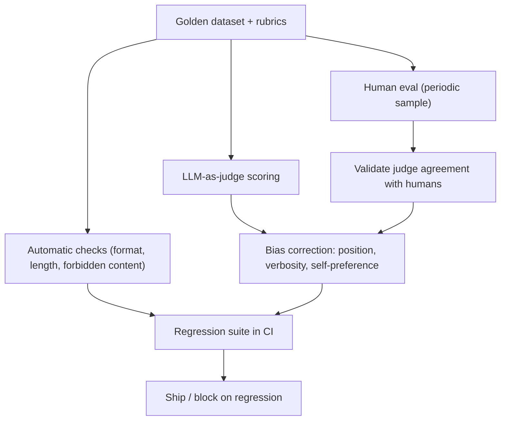

# LLM Evaluation

## TL;DR

"Accuracy" barely applies to open-ended generation — there's rarely one correct string, so
evaluation has to trade exactness for judgment: golden datasets with graded rubrics, LLM-as-judge
(with its own well-documented biases), pairwise comparison, and human eval, all stitched into a
regression suite that runs in CI on every prompt or model change. This is the most-asked and
least-prepared topic in LLM interviews at the 5-year level — most candidates can explain RAG or
fine-tuning in depth but go vague the moment they're asked "how do you know it's actually better."

## Intuition

Classical ML evaluation works because the label space is small, fixed, and unambiguous — a
prediction is right or wrong, or off by some well-defined amount. LLM outputs are open-ended text:
"summarize this contract" has many valid summaries of different length, tone, and emphasis, none
of which is *the* correct answer, and a naive string-match metric (exact match, ROUGE, BLEU) either
fails to reward genuinely good paraphrases or fails to punish subtly wrong ones. The field's answer
is to stop trying to make evaluation purely automatic and mechanical, and instead build a layered
system: cheap automatic checks catch obvious regressions, LLM-as-judge scales human-like judgment
cheaply (with known blind spots you must correct for), and human eval anchors the whole system
periodically so you know the automatic layers haven't drifted from what actually matters to users.

## The maths

There's no single formula here — the substance is methodology — but the parts worth being precise
about:

### Why accuracy is the wrong frame

A single "accuracy" number implicitly assumes a well-defined correct/incorrect partition of
outputs. For generation tasks, replace it with **task-specific, decomposed criteria**: factual
correctness, completeness, tone/style adherence, format compliance, safety, and latency/cost —
scored separately, because a model can be excellent on one axis and poor on another, and a single
blended score hides exactly the tradeoff a stakeholder needs to see.

### Golden datasets

A curated, versioned set of (input, reference-output-or-rubric) pairs that represent the
distribution of real usage, ideally including known-hard and adversarial cases, not just easy
average-case examples. The reference for open-ended tasks is often not a single gold string but a
**rubric**: a checklist of required facts, required format elements, or forbidden content, scored
per item — this is what makes golden-set scoring reproducible even without one canonical answer.

### LLM-as-judge and its biases

Using an LLM to score or compare outputs (often against a rubric or reference) instead of a human,
because it's far cheaper and faster at scale. It correlates reasonably well with human judgment on
many tasks, but has specific, well-documented systematic biases that must be corrected for, not
just acknowledged:

- **Position bias.** In pairwise comparison (which of A/B is better), the judge tends to favor
  whichever response is shown first (or, in some setups, second) regardless of quality — mitigated
  by evaluating both orderings and averaging, or randomizing position across the eval set.
- **Verbosity bias.** Longer responses are systematically rated as "more thorough" or "more
  helpful" even when the extra length adds no substantive content — mitigated by explicitly
  instructing the judge to penalize unnecessary length, or by controlling for length in the rubric.
- **Self-preference bias.** A judge model tends to rate outputs from the same model family (or
  itself) more favorably than outputs from a different model, even at matched quality — a
  significant confound when using, say, GPT-family judges to evaluate GPT-family candidate
  outputs. Mitigation: use a judge from a different model family than the candidates, or triangulate
  with human eval on a sample.
- **Format/style bias.** Judges over-reward superficial markers of quality (bullet points,
  confident phrasing, markdown formatting) that correlate with but don't guarantee substance.

None of these mean LLM-as-judge is unusable — they mean it needs the same rigor a survey
instrument needs: known biases, corrected where possible, and validated periodically against a
human-labeled sample to check the judge itself hasn't drifted.

### Pairwise comparison vs pointwise scoring

**Pointwise**: score a single output against a rubric (e.g. 1–5). Easier to aggregate and track
over time, but LLM judges are noisier at absolute scoring — a 4 vs a 5 is a fuzzier line for a
model to draw consistently than "is A better than B."
**Pairwise**: compare two outputs (e.g. old model vs new model on the same input) and pick a
winner (or tie). More reliable per-comparison judgment, standard for A/B-style model comparisons,
but doesn't give you an absolute quality number, only a relative one, and needs enough comparisons
to build a stable ranking (e.g. via a Bradley-Terry-style aggregation across many pairwise votes,
the same idea behind Elo ratings) if you have more than two candidates.

## Diagram



## Code

A minimal pairwise LLM-as-judge with position-bias correction (evaluate both orderings, require
agreement):

```python
def pairwise_judge(query, response_a, response_b, judge_llm):
    prompt_template = """Question: {query}

Response A: {a}
Response B: {b}

Which response better answers the question? Consider correctness, completeness, and clarity.
Reply with exactly one word: "A", "B", or "Tie"."""

    verdict_1 = judge_llm(prompt_template.format(query=query, a=response_a, b=response_b))
    # swap order to detect and neutralize position bias
    verdict_2 = judge_llm(prompt_template.format(query=query, a=response_b, b=response_a))
    verdict_2_normalized = {"A": "B", "B": "A", "Tie": "Tie"}[verdict_2.strip()]

    if verdict_1.strip() == verdict_2_normalized:
        return verdict_1.strip()          # consistent judgment across both orderings
    return "Tie"                          # disagreement across orderings -> treat as inconclusive

def run_regression_suite(golden_set, candidate_model, baseline_model, judge_llm):
    results = {"candidate_wins": 0, "baseline_wins": 0, "ties": 0}
    for item in golden_set:
        response_candidate = candidate_model(item["input"])
        response_baseline = baseline_model(item["input"])
        verdict = pairwise_judge(item["input"], response_candidate, response_baseline, judge_llm)
        if verdict == "A":
            results["candidate_wins"] += 1
        elif verdict == "B":
            results["baseline_wins"] += 1
        else:
            results["ties"] += 1
    return results
```

## In practice

- **Use it when:** any LLM-powered feature before and after every meaningful change — prompt edit,
  model swap, retrieval change, fine-tune — treat eval like a test suite, not a one-time launch
  gate.
- **Defaults that work:** a golden set of 50–200 representative + adversarial examples as a floor;
  pairwise comparison against the current production baseline for model/prompt changes; a judge
  model from a different family than the candidate; a small human-labeled sample (even 20–30
  examples) refreshed periodically to check judge-human agreement hasn't drifted.
- **Breaks when:** the golden set is stale relative to real usage (silent distribution shift in
  what users actually ask); the judge model itself is a weaker or same-family model prone to the
  biases above; teams treat a single aggregate score as sufficient without decomposed criteria,
  masking regressions on specific sub-tasks (e.g. safety) behind an improved average.
- **Cost / latency:** LLM-as-judge scoring costs real API calls at eval time — batch and cache
  aggressively, and reserve full human eval for periodic validation checkpoints rather than every
  CI run, since human eval is the accuracy anchor but doesn't scale to every commit.

## Interview angle

**Q. Why is "accuracy" the wrong frame for evaluating an LLM feature, and what do you use instead?**
Accuracy assumes a single correct answer to compare against, which doesn't hold for open-ended
generation — many valid summaries, phrasings, or responses exist for the same input. Instead,
evaluation decomposes into task-specific criteria scored separately (factual correctness,
completeness, format compliance, safety, tone), each measured via a golden set with rubrics rather
than exact-match, because a blended single score hides which specific dimension regressed.

**Follow-up.** Give a concrete example where a high aggregate score hid a real regression. → A
customer-support assistant's average "helpfulness" score from a judge stayed flat across a prompt
change, but decomposed scoring showed a drop specifically in "correctly declines out-of-scope
requests" — a safety-relevant sub-metric averaged away by the aggregate.

**Q. Name the three most important LLM-as-judge biases and how you'd correct for each.**
Position bias (favoring whichever response is shown first/second) — corrected by evaluating both
orderings and requiring agreement, or randomizing position across the eval set. Verbosity bias
(rating longer responses as better regardless of substance) — corrected by explicit rubric
instructions penalizing unnecessary length, or controlling for length statistically. Self-
preference bias (a judge favoring outputs from its own model family) — corrected by using a judge
from a different model family than the candidates being evaluated, and periodically validating
judge output against human labels.

**Follow-up.** How would you detect that your judge has developed a new bias you haven't accounted
for? → Periodically sample judge decisions and have humans re-label the same items; a sustained gap
in judge-human agreement, especially one correlated with a specific output characteristic (length,
tone, model source), signals an uncorrected bias worth investigating.

**Q. Pairwise comparison vs pointwise rubric scoring — when would you use each?**
Pairwise for comparing two specific candidates (old vs new model, prompt A vs B) — it's a more
reliable judgment for an LLM judge to make ("which is better") than an absolute score, and it's the
natural fit for A/B-style rollout decisions. Pointwise/rubric scoring for tracking absolute quality
over time on a fixed golden set (e.g. a dashboard metric across weekly regression runs), since you
need a number that's comparable across many candidates, not just two at a time.

**Q. How do you build an LLM eval regression suite that runs in CI?**
A versioned golden dataset with rubrics or reference outputs; an automated harness that runs the
candidate model/prompt against every item, scores it (automatic checks first, LLM-judge second),
and compares against the last-known-good baseline; a threshold or statistical test (not just "did
the score go up") that blocks the change if a regression is detected on any decomposed criterion,
not only the aggregate; and a scheduled or triggered human-eval spot-check to catch drift the
automatic layers miss.

**Follow-up.** What's the danger of skipping the human-eval anchor entirely and relying only on
LLM-as-judge in CI? → The judge itself can drift or share blind spots with the models it's
evaluating (especially same-family self-preference), so a fully judge-only pipeline can converge
on a locally-consistent but actually-wrong notion of "better" with nothing to catch it — human eval
is what periodically re-anchors the automatic system to what users actually experience as quality.

## Traps

- Proposing BLEU/ROUGE/exact-match as the primary metric for open-ended generation — these
  correlate poorly with human judgment on generative tasks and are, at best, a cheap sanity check,
  not a quality metric.
- Presenting LLM-as-judge as a solved, bias-free substitute for human eval — the honest answer names
  the specific biases and how they're mitigated, not just "we use an LLM to grade it."
- Reporting a single aggregate quality score without decomposition — this is the single most common
  weak answer on this topic; a strong answer always names multiple axes scored separately.
- Treating eval as a one-time launch gate rather than a continuous regression suite — quality can
  regress silently on any prompt, retrieval, or model change, and without CI-style automated
  re-evaluation, regressions ship unnoticed.
- Using a same-family or weaker judge model without acknowledging self-preference or capability-gap
  bias — a judge weaker than the candidates it's grading is not a reliable arbiter.

## Flashcards

Why is accuracy the wrong evaluation frame for open-ended LLM generation?::There's no single correct answer to compare against — many valid outputs exist — so decomposed, rubric-based criteria (correctness, completeness, format, safety) scored separately are needed instead.
What is position bias in LLM-as-judge, and how is it mitigated?::The judge tends to favor whichever response is shown first (or second) regardless of quality; mitigated by evaluating both orderings and requiring consistent verdicts, or randomizing position.
What is verbosity bias in LLM-as-judge?::Judges tend to rate longer responses as more thorough/helpful even without added substance; mitigated by explicit rubric instructions penalizing unnecessary length.
What is self-preference bias, and why does it matter when choosing a judge model?::A judge tends to rate outputs from its own model family more favorably; mitigated by using a judge from a different model family than the candidates.
Pairwise vs pointwise scoring — which is more reliable for LLM judges, and why?::Pairwise, because relative judgment ("which is better") is an easier, more consistent task for an LLM judge than assigning a stable absolute score.
Why does an LLM eval system need a human-eval anchor even if LLM-as-judge is used for most scoring?::Because the judge itself can drift or share blind spots with the models it evaluates; periodic human labeling validates that judge-human agreement hasn't degraded.
What's the risk of relying on a single aggregate quality score?::It can hide regressions on specific sub-criteria (e.g. safety or format compliance) behind an improved or flat average.

## Related

[[prompt-engineering]]
[[hallucination-and-grounding]]
[[rag-evaluation]]
[[agent-evaluation]]
[[ml-testing-strategy]]
