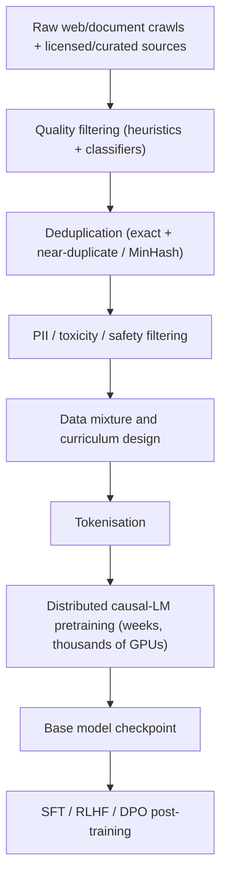

# LLM Pretraining

## TL;DR
Pretraining is the enormously expensive, one-time process of training a base LLM from random
initialisation on trillions of tokens with a next-token (causal LM) objective. It requires
web-scale data collection, aggressive deduplication and filtering, a curriculum/mixture strategy,
and compute measured in millions of GPU-hours. Almost nobody in industry pretrains from scratch —
the ROI only exists for a handful of labs and a few sovereign/strategic exceptions; everyone else
starts from an open or licensed base model and fine-tunes.

## Intuition
Pretraining is building the engine block, not the car. It's the part that requires a foundry, not a
garage: capital-intensive, slow, and only worth doing if you're going to amortise it across an
enormous number of downstream uses (a lab shipping one base model to power dozens of products, or a
handful of consumers who genuinely need a model no one else will license — sovereign/regulatory
requirements, a wholly novel modality/domain). Nearly everyone else buys the engine and builds the car.

## The maths

### Training objective
Standard causal language modelling — see [[language-modeling-objectives]] for the full derivation:

$$
\mathcal{L} = -\frac{1}{T}\sum_{t=1}^{T} \log p_\theta(x_t \mid x_{<t})
$$

### Compute cost order of magnitude
Training compute for a dense transformer is well-approximated by

$$
C \approx 6ND
$$

where $N$ is the number of (non-embedding) parameters and $D$ is the number of training tokens, in
FLOPs (see [[llm-scaling-laws]] for the derivation and where the factor of 6 comes from). For
context: a 7B-parameter model trained compute-optimally on roughly 140–200B tokens is on the order of
$10^{23}$–$10^{24}$ FLOPs — translating to weeks on hundreds to low thousands of high-end GPUs, i.e.
a training run costing anywhere from hundreds of thousands to several million dollars once you include
cluster time, failed runs, and engineering overhead — and that's for a comparatively small model;
frontier-scale runs are one to two orders of magnitude larger again.

## Diagram


## Code
```python
# Illustrative sketch of a deduplication step over a document corpus —
# real pipelines use MinHash/LSH at trillion-token scale, not this naive version.
from datasketch import MinHash, MinHashLSH

def near_duplicate_filter(documents, threshold=0.85, num_perm=128):
    lsh = MinHashLSH(threshold=threshold, num_perm=num_perm)
    kept = []
    for doc_id, text in documents:
        m = MinHash(num_perm=num_perm)
        for shingle in {text[i:i+5] for i in range(len(text) - 5)}:
            m.update(shingle.encode("utf8"))
        if not lsh.query(m):          # no near-duplicate seen yet
            lsh.insert(doc_id, m)
            kept.append((doc_id, text))
    return kept
```

## In practice
- **Data collection & dedup:** sources are web crawls (Common Crawl-derived), code repositories,
  books, papers, curated/licensed data; near-duplicate removal (MinHash/LSH, suffix-array exact-match
  removal) is essential because duplicated data both wastes compute and causes memorisation/leakage
  of benchmark-adjacent content.
- **Filtering & quality:** heuristic filters (language ID, length, boilerplate/HTML residue) plus
  learned quality classifiers (trained to mimic "would this pass an editor," often bootstrapped from
  a small set of known-high-quality documents like Wikipedia/books) upweight higher-quality sources.
- **Curriculum / mixture:** the ratio of web text, code, math, books, and multilingual data is a
  deliberately tuned mixture (not just "more data") — code and math data in particular are known to
  improve general reasoning transfer even for non-code tasks; some pipelines upweight harder/cleaner
  data later in training.
- **Compute / cost order of magnitude:** see maths above — this is the single fact that most
  explains why pretraining-from-scratch is not something most companies attempt.
- **Why almost nobody pretrains from scratch:** the fixed cost (data pipeline engineering, cluster
  procurement/reliability engineering, hyperparameter risk on a run you can't easily restart, the
  opportunity cost of the team's time) only pays off if you're going to amortise it over a very large
  number of downstream users/products, or if no adequate open/licensed base model exists for your
  requirements (data sovereignty, a domain with no public analogue, licensing/IP constraints). For
  nearly every product team, the economically dominant move is: pick a strong open or licensed base
  model and invest instead in SFT, RLHF/DPO, RAG, and PEFT (LoRA/QLoRA) — all dramatically cheaper and
  faster to iterate on.

## Interview angle

**Q. Your company wants a domain-specific LLM for financial documents. Do you pretrain from
scratch?**
Almost certainly not. Compare the order-of-magnitude cost of a from-scratch pretraining run
(potentially high six to low seven figures, plus a data/infra team and months of runway) against
continued pretraining or fine-tuning (LoRA/QLoRA or full fine-tune) of a strong open base model on
your domain corpus, which costs orders of magnitude less and de-risks the approach because the base
model's general capabilities are already validated. Reach for from-scratch pretraining only if no
available base model can legally/technically serve the use case (e.g. hard data-residency
constraints, or genuinely novel modality) and the downstream volume justifies the fixed cost.

**Follow-up.** What's a middle ground? → Continued/domain-adaptive pretraining: take an open base
checkpoint and continue causal-LM training on a large in-domain corpus before instruction tuning —
much cheaper than pretraining from scratch, and often better than fine-tuning alone when you have a
genuinely large (billions of tokens) domain corpus.

**Q. Why is deduplication so important at pretraining scale, beyond just "saving compute"?**
Duplicated documents get disproportionate gradient weight, causing the model to memorise them more
strongly — this both wastes capacity and increases the risk of verbatim regurgitation (a legal and
privacy concern) and of inflated benchmark performance if near-duplicates of eval data leak into
training data.

**Q. Why include code and math data even for a model aimed mostly at natural-language tasks?**
Empirically, training on code/math data improves general reasoning and instruction-following transfer
even for non-code downstream tasks — likely because it forces the model to represent longer, more
precise, more compositional dependency structures than typical prose.

**Q. What's the actual bottleneck in a pretraining run — compute or data?**
Both matter and trade off against each other (see [[llm-scaling-laws]] — Chinchilla showed most
early large models were undertrained relative to their parameter count). In practice, for models
much beyond a few hundred billion parameters, high-quality token availability itself becomes a
genuine constraint, which is part of why data curation, deduplication and synthetic/curated data
generation get so much engineering investment.

## Traps
- Treating "more data always helps" as unconditionally true — duplicated or low-quality data can hurt
  more than help; quality and mixture matter as much as raw token count.
- Suggesting a product team should pretrain a model "for control/customisation" without weighing the
  compute cost against fine-tuning/RAG alternatives — this is the single most common wrong answer to
  a "how would you build X" system-design question.
- Confusing pretraining cost with fine-tuning cost — LoRA fine-tuning a 7B model can run on a single
  GPU in hours; pretraining a 7B model from scratch is orders of magnitude more expensive.
- Forgetting that pretraining produces a base model with no instruction-following behaviour — it must
  go through SFT/RLHF/DPO before it's usable as an assistant.

## Flashcards
Pretraining objective::causal (next-token) language modelling over trillions of tokens
Approximate compute-cost formula for training::C ≈ 6ND (N = parameters, D = training tokens)
Why deduplication matters beyond compute savings::prevents disproportionate memorisation and benchmark leakage of duplicated documents
Why most companies don't pretrain from scratch::fixed cost only amortises at very large downstream scale; fine-tuning an open base model is far cheaper
What a data quality classifier is typically bootstrapped from::a small set of known-high-quality documents (e.g. Wikipedia, books)
Why code/math data helps general-purpose models::improves reasoning and compositional transfer even on non-code tasks
Middle ground between from-scratch pretraining and fine-tuning::continued/domain-adaptive pretraining on an open base checkpoint

## Related
[[language-modeling-objectives]]
[[llm-scaling-laws]]
[[instruction-tuning-and-sft]]
[[parameter-efficient-finetuning-lora]]
[[gpt-and-decoder-models]]
