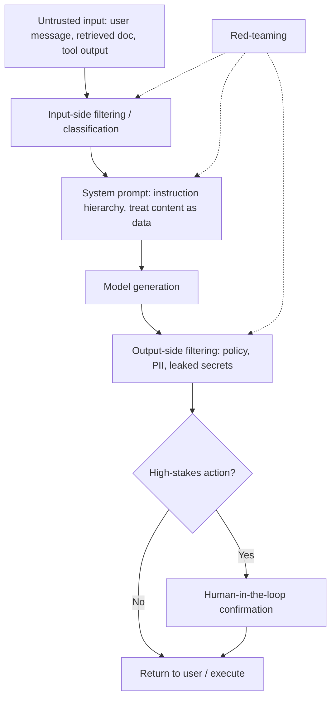

# LLM Safety and Guardrails

## TL;DR

LLM safety in production is a layered defense problem, not a single filter: prompt injection
(untrusted content hijacking the model's instructions), jailbreaks (getting the model to bypass its
own trained refusals), PII leakage (the model surfacing sensitive data from training or context),
and unsafe content generation all need different mitigations at different points in the pipeline —
input filtering, system-prompt design, output filtering, and monitoring. No single layer is
sufficient; guardrails are designed assuming any one layer can be bypassed.

## Intuition

An LLM has no hard boundary between "instructions" and "data" — everything, whether it's the
system prompt, the user's message, or a document retrieved from the web, ends up as tokens in the
same context window, and the model attends over all of it the same way. This is the root of prompt
injection: if an attacker can get their text into the context (via a webpage the model reads, a
document it summarizes, a support ticket it processes), they can write something that looks like an
instruction, and the model has no architectural reason to trust the "real" system prompt more than
that injected text. Jailbreaking exploits the same fuzziness from a different angle — instead of
smuggling in new instructions, it manipulates framing (role-play, hypothetical scenarios, encoding
tricks) to shift the model away from patterns its safety training suppressed. Because both exploit
the same fundamental property (no hard instruction/data separation, no perfectly robust refusal
boundary), defenses stack rather than relying on any one being complete.

## The maths

There's no single formula for safety; the substantive content is architectural and procedural.

### Why prompt injection is structurally hard to fully prevent

The model processes a single token sequence; the "trust level" of any span (system prompt vs user
input vs retrieved document) is not an architectural property the base transformer represents —
it's a convention enforced only by how the prompt is constructed and, in newer models, by
instruction-hierarchy training that tries to teach the model to weight system-level instructions
more heavily than content it merely reads. This helps but is a learned, probabilistic tendency, not
a hard guarantee — an adversarial input can, with enough effort, still find phrasing that shifts
the model's behavior. This is why direct injection (attacker types directly into the chat) and
indirect injection (attacker's payload sits in a document, webpage, or email the model is asked to
process, and executes when the model reads it) are both live threats, and why indirect injection is
often the more dangerous production risk — the user asking the question may have no idea the
retrieved content was adversarial.

### Layered defenses

- **Input-side filtering.** Classify or heuristically screen incoming user/tool content for known
  injection patterns, before it reaches the model — catches known attack signatures, misses novel
  ones.
- **System-prompt design and instruction hierarchy.** Explicitly tell the model to treat
  retrieved/tool content as data, not instructions, and rely on instruction-hierarchy-trained
  models that are more robust to this framing than older models — a real but partial mitigation.
- **Output-side filtering.** Run generated output through a separate classifier (or a second LLM
  call) checking for policy violations, leaked secrets, or signs the model was successfully
  manipulated, before returning it to the user or executing a tool call.
- **Least-privilege tool access.** For agentic systems, scope what tools/data the model can
  actually touch regardless of what it's told to do — the strongest defense against a successful
  injection is limiting the blast radius of any single compromised turn (an injected instruction to
  "delete all files" is only dangerous if the agent has delete permission at all).
- **Human-in-the-loop for high-stakes actions.** Irreversible or sensitive actions (payments, data
  deletion, sending external communications) get a confirmation step regardless of how confident
  the pipeline is that the request is legitimate.

### PII leakage

Two distinct failure modes: (1) the model **memorized** and can reproduce training-data PII
verbatim (a training-data hygiene problem — solved upstream by de-duplication and PII scrubbing of
training corpora, differential privacy training if the risk is severe enough, not by inference-time
guardrails alone), and (2) the model **echoes PII present in the current context** (e.g. a user
pastes a document with someone's phone number and the model repeats or summarizes it) — this is an
output-filtering and data-handling problem, typically addressed with PII detection/redaction on
both input logging and output, not a training-time fix.

### Red-teaming basics

Systematic adversarial testing before and after deployment: a dedicated team (or automated
adversarial-prompt generation) attempts known and novel jailbreak/injection techniques against the
system, results are logged and turned into regression test cases (the same discipline as
[[llm-evaluation]]'s regression suites, applied to safety specifically), and severity is triaged —
not every successful jailbreak is equally dangerous; a model that can be tricked into a mildly
off-brand joke is a different risk tier than one that can be tricked into exfiltrating another
user's data via a connected tool.

## Diagram



## Code

A minimal layered guardrail: input classification, output PII scrubbing, and a least-privilege
tool-execution gate.

```python
import re

BLOCKED_PATTERNS = [
    r"ignore (all|previous) instructions",
    r"you are now (in )?developer mode",
    r"disregard your (system|prior) prompt",
]

def screen_input(text: str) -> bool:
    """Return True if the input looks like a known injection/jailbreak pattern."""
    lowered = text.lower()
    return any(re.search(p, lowered) for p in BLOCKED_PATTERNS)

PII_PATTERNS = {
    "email": r"[\w.+-]+@[\w-]+\.[\w.-]+",
    "phone": r"\b\d{10}\b",
}

def redact_pii(text: str) -> str:
    for label, pattern in PII_PATTERNS.items():
        text = re.sub(pattern, f"[REDACTED_{label.upper()}]", text)
    return text

HIGH_RISK_TOOLS = {"delete_record", "send_payment", "send_external_email"}

def execute_tool_call(tool_name, args, require_confirmation=True):
    if tool_name in HIGH_RISK_TOOLS and require_confirmation:
        return {"status": "pending_human_approval", "tool": tool_name, "args": args}
    return run_tool(tool_name, args)  # actual execution, assumed defined elsewhere

def guarded_pipeline(user_input, llm_call):
    if screen_input(user_input):
        return "Request blocked: contains a known prompt-injection pattern."
    raw_output = llm_call(user_input)
    return redact_pii(raw_output)
```

## In practice

- **Use it when:** any system that ingests untrusted content (web pages, uploaded documents, third-
  party API responses) into the model's context, or any agent with tool-calling access to real
  systems — the risk surface scales with what the model can read and what it can do.
- **Defaults that work:** treat all retrieved/tool content as data in the prompt (explicit framing),
  scope tool permissions to least privilege by default, require confirmation for irreversible
  actions, run both input and output through a lightweight classifier, and log everything for
  post-hoc audit and red-team regression building.
- **Breaks when:** relying on a single layer (e.g. "the system prompt says not to" with no output
  check, or an output filter with no least-privilege tool scoping) — sophisticated or novel attacks
  reliably get past any single defense, which is exactly why layering exists.
- **Cost / latency:** each guardrail layer (classification calls, output filtering, confirmation
  steps) adds latency and sometimes an extra model call — a real tradeoff against user experience,
  usually justified for high-stakes or externally-exposed systems and relaxed for low-risk internal
  tools.

## Interview angle

**Q. Why can't prompt injection be fully solved at the model level today?**
Because the transformer has no architectural separation between "instruction" and "data" — every
span of text, whether system prompt or retrieved document, is just tokens in the same sequence
that attention treats uniformly. Instruction-hierarchy training teaches the model a *learned*,
probabilistic preference for trusting system-level instructions over content it merely reads, which
helps significantly but isn't a hard guarantee — sufficiently adversarial phrasing can still shift
behavior. This is why production systems layer additional defenses (input filtering, least-
privilege tool access, output checks) rather than relying on the model's training alone.

**Follow-up.** What's the difference between direct and indirect prompt injection, and which is the
bigger production risk? → Direct injection is the user typing an adversarial instruction straight
into the chat; indirect injection is an attacker's payload embedded in content the model is asked
to process (a webpage, document, email) that the actual user never sees or intends. Indirect
injection is often the bigger production risk because the legitimate user has no idea the retrieved
content was malicious, and the attack surface scales with anything the system ingests.

**Q. Walk me through the layered defenses you'd put around an agent that can call tools including a
"delete record" action.**
Input-side screening for known injection patterns on anything untrusted entering context; explicit
system-prompt framing that retrieved/tool content is data, not instructions; least-privilege scoping
so the agent's credentials can only delete records it's actually meant to touch, never a blanket
admin permission; a mandatory human-in-the-loop confirmation step specifically for the delete
action regardless of how the request arose; and output/action logging so any successful bypass is
caught in review and turned into a red-team regression test.

**Follow-up.** If every layer above is bypassed except least-privilege scoping, what's your actual
worst-case blast radius? → Bounded to whatever that specific credential/tool scope allows — this is
exactly why least-privilege is treated as the last line of defense rather than a nice-to-have: it's
the one layer that limits damage even when every upstream check fails.

**Q. What are the two distinct mechanisms behind PII leakage, and why do they need different
fixes?**
Memorized training-data PII being reproduced verbatim is a training-data hygiene problem — fixed
upstream via de-duplication/scrubbing of training corpora (or differential privacy training for
severe cases), not by inference-time filters alone. PII present in the current context being echoed
back or summarized is a data-handling and output-filtering problem — fixed by redaction/detection on
input logging and output, independent of training data quality. Conflating the two leads to
applying the wrong fix (e.g. thinking output redaction alone solves memorized-training-data
leakage, which it doesn't fully address since the model can still recombine memorized fragments in
novel ways).

**Q. What does red-teaming actually produce, concretely, and how does it plug into ongoing
operations?**
A growing, versioned set of adversarial test cases (successful and attempted jailbreaks/injections),
each triaged by severity, that gets folded into the same kind of regression suite used for quality
eval (see [[llm-evaluation]]) — run on every model, prompt, or guardrail change so a fix for one
attack doesn't silently regress against previously-caught ones, and so new red-team findings become
permanent coverage rather than one-off incidents.

## Traps

- Presenting a single mitigation (e.g. "we have a system prompt telling it not to") as sufficient —
  a strong answer names multiple layers and explicitly states why no single layer is trusted alone.
- Conflating prompt injection with jailbreaking — injection is about untrusted *content* smuggling
  in instructions; jailbreaking is about *framing/manipulation* of the legitimate user's own prompt
  to bypass trained refusals. Different attack vectors, some overlapping mitigations.
- Treating PII leakage as a single problem with a single fix — training-data memorization and
  context-echoing are mechanistically different and need different mitigations.
- Assuming output filtering alone is enough for agentic systems with real-world tool access — least-
  privilege scoping and human-in-the-loop for high-stakes actions matter more than output text
  filtering once the model can take actions, not just say things.
- Describing red-teaming as a one-time pre-launch activity — without folding findings into a
  continuously-run regression suite, safety fixes for known attacks silently regress over time just
  like quality does.

## Flashcards

Why is prompt injection structurally hard to fully prevent at the model level?::Transformers have no architectural separation between instructions and data — every span of context is just tokens attended over uniformly; instruction-hierarchy training only creates a learned, probabilistic preference, not a hard guarantee.
What's the difference between direct and indirect prompt injection?::Direct: the user types an adversarial instruction themselves. Indirect: an attacker's payload is embedded in content (a document, webpage) the model processes, without the legitimate user's knowledge.
Why is least-privilege tool scoping considered the last line of defense in agentic systems?::Because it bounds the worst-case impact even if every upstream filtering/framing layer is bypassed by a successful injection or jailbreak.
What are the two distinct mechanisms behind PII leakage, and how do their fixes differ?::Memorized training-data PII (fixed via training-data de-duplication/scrubbing) vs echoing PII present in the current context (fixed via input/output redaction) — different causes, different mitigations.
What does a mature red-teaming process produce beyond a one-time report?::A versioned set of adversarial test cases folded into a continuously-run regression suite, so fixes don't silently regress against previously-found attacks.
Why is output filtering alone insufficient for agents with real tool access?::Because the risk shifts from what the model says to what it does — filtering text doesn't stop a manipulated agent from taking a harmful action if it has the permission to do so; scoping and human confirmation are needed.

## Related

[[agent-guardrails-and-safety]]
[[hallucination-and-grounding]]
[[structured-output-and-function-calling]]
[[security-and-pii-in-ml]]
[[human-in-the-loop-patterns]]
