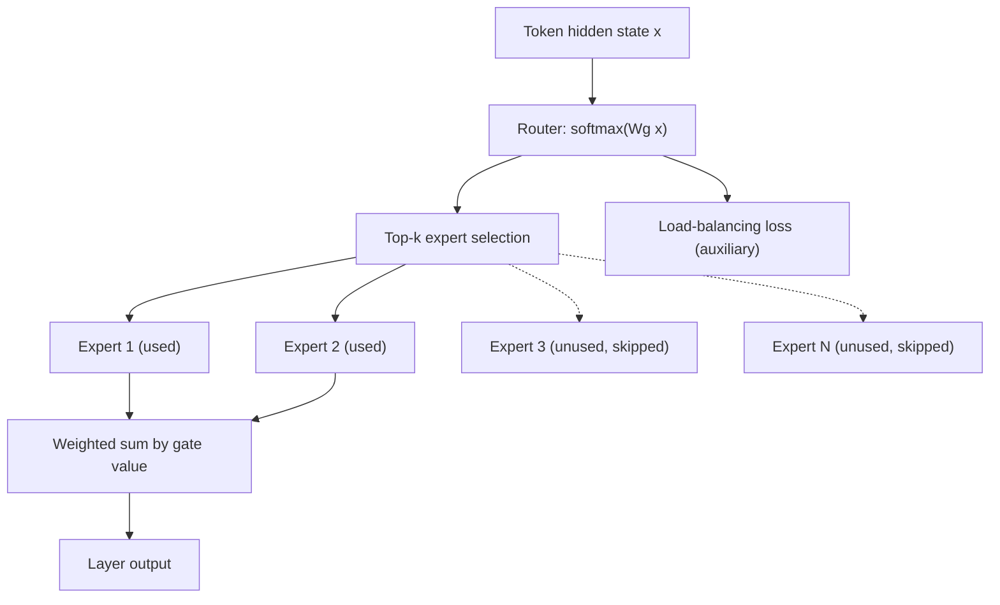

# Mixture of Experts

## TL;DR

A Mixture-of-Experts (MoE) layer replaces one dense feed-forward block with many parallel "expert"
feed-forward blocks and a learned router that sends each token to only a small subset of them
(top-k, usually $k=1$ or $2$). Total parameter count grows with the number of experts, but compute
per token only grows with $k$ — you get a much larger model's capacity at close to a small model's
inference cost. The price is paid elsewhere: training instability (load balancing), and serving
complexity (all experts must still be held in memory even though only a few run per token).

## Intuition

A dense model uses every parameter for every token — a big, generalist feed-forward network doing
the same computation regardless of what the token actually needs. MoE instead trains many smaller
specialist feed-forward networks and a lightweight router that, per token, decides which one or two
specialists are relevant. It's less "the whole brain thinks about every word" and more "a
receptionist routes each request to the right small team." The consequence is that model *capacity*
(total parameters, roughly correlated with what a model can memorize/represent) and inference
*compute* (FLOPs per token) become two separate dials instead of one — this decoupling is the
entire point of MoE.

## The maths

### Sparse routing and top-k gating

For $E$ experts $\{f_1, \dots, f_E\}$, each a feed-forward network, a router computes a
distribution over experts for each token's hidden state $x$:

$$
g(x) = \text{softmax}(W_g x) \in \mathbb{R}^E
$$

Only the top-$k$ experts by gate value are activated (typically $k=1$, as in Switch Transformer, or
$k=2$, as in the original Mixtral-style setup); the rest contribute nothing for that token. The
layer's output is the gate-weighted sum of just those activated experts:

$$
y = \sum_{i \in \text{top-}k(g(x))} g(x)_i \cdot f_i(x)
$$

### Why MoE gets more parameters without proportional compute

Total parameters scale with $E$ (number of experts), but FLOPs per token scale with $k$
(experts actually used), independent of $E$. A model with 8 experts of size $F$ each and $k=2$ has
roughly $8F$ total feed-forward parameters but only $2F$ of feed-forward compute per token — the
same per-token compute as a dense model $2F$ params wide, but with $4\times$ the representational
capacity available across the token population as a whole (different tokens can specialize into
different experts). This is the entire economic case for MoE: you buy capacity (which correlates
with quality on knowledge-heavy and broad-coverage tasks) largely with memory and serving
complexity, not with FLOPs — very different from a dense model where quality gains from more
parameters come bundled with proportionally more compute.

### Load balancing loss

Left unconstrained, the router tends to collapse: a few experts get most of the traffic early in
training (a self-reinforcing effect — an expert that receives more gradient becomes more useful,
so the router sends it even more), leaving other experts undertrained and effectively wasted
capacity. An auxiliary load-balancing loss counteracts this. A standard form (from Switch
Transformer): for a batch of $N$ tokens, let $c_i$ be the fraction of tokens routed to expert $i$
and $p_i$ be the average router probability assigned to expert $i$ across the batch:

$$
\mathcal{L}_{\text{balance}} = E \sum_{i=1}^{E} c_i \cdot p_i
$$

This is minimized when routing is uniform across experts ($c_i = p_i = 1/E$ for all $i$), and the
coefficient $E$ normalizes it to a constant regardless of expert count. It's added to the main
language-modeling loss with a small weight, trading a bit of routing "optimality" for actually using
all the trained capacity — without it, MoE training reliably degenerates into a de facto smaller
dense model with dead weight sitting in unused experts.

### Capacity factor and token dropping

In practice each expert is given a fixed capacity (max tokens it will process per batch, e.g.
$\text{capacity} = \frac{\text{tokens per batch}}{E}\times \text{capacity factor}$). If more tokens
route to an expert than its capacity allows, the overflow tokens are **dropped** for that layer
(passed through via a residual/skip rather than transformed) — a real quality cost that's a direct
consequence of load-imbalance, not merely a hyperparameter footnote.

## Diagram



## Code

Minimal top-k MoE feed-forward layer:

```python
import torch
import torch.nn as nn
import torch.nn.functional as F

class MoELayer(nn.Module):
    def __init__(self, d_model, d_ff, num_experts, top_k=2):
        super().__init__()
        self.num_experts = num_experts
        self.top_k = top_k
        self.router = nn.Linear(d_model, num_experts, bias=False)
        self.experts = nn.ModuleList([
            nn.Sequential(nn.Linear(d_model, d_ff), nn.GELU(), nn.Linear(d_ff, d_model))
            for _ in range(num_experts)
        ])

    def forward(self, x):
        # x: (batch, seq, d_model)
        logits = self.router(x)                              # (b, s, E)
        gates = F.softmax(logits, dim=-1)
        topk_gates, topk_idx = gates.topk(self.top_k, dim=-1)  # (b, s, k)
        topk_gates = topk_gates / topk_gates.sum(dim=-1, keepdim=True)  # renormalize

        out = torch.zeros_like(x)
        for k in range(self.top_k):
            expert_idx = topk_idx[..., k]                     # (b, s)
            gate_val = topk_gates[..., k].unsqueeze(-1)        # (b, s, 1)
            for e, expert in enumerate(self.experts):
                mask = (expert_idx == e).unsqueeze(-1)          # (b, s, 1)
                if mask.any():
                    out = out + mask * gate_val * expert(x)
        return out

def load_balance_loss(gates, top_k_idx, num_experts):
    # gates: (b, s, E) full softmax distribution; top_k_idx: (b, s, k)
    N = gates.shape[0] * gates.shape[1]
    one_hot = F.one_hot(top_k_idx, num_experts).float().sum(dim=2)  # (b, s, E)
    c = one_hot.reshape(-1, num_experts).mean(dim=0)   # fraction routed to each expert
    p = gates.reshape(-1, num_experts).mean(dim=0)     # average router probability
    return num_experts * torch.sum(c * p)
```

## In practice

- **Use it when:** you need to scale total model capacity/quality without proportionally scaling
  inference compute, and you have the engineering capacity to handle distributed serving of many
  experts (this is a lever primarily used by teams training frontier-scale models, not something
  fine-tuned in-house at 5-years-experience scale, but it is very likely to come up as a design
  question, especially for AI-engineer and MLOps roles working with open MoE checkpoints like
  Mixtral or DeepSeek-MoE).
- **Defaults that work:** top-2 gating with 8 experts is a common, well-validated starting
  configuration; always pair with a load-balancing auxiliary loss, never train MoE without one.
- **Breaks when:** router collapse without load balancing; fine-tuning MoE models on narrow domains
  can further imbalance routing (some experts never fire on the new distribution); naive serving
  that assumes uniform GPU memory usage per replica breaks when expert placement isn't balanced
  across devices.
- **Cost / latency:** total parameter memory footprint is much larger than an equivalent-compute
  dense model (all experts must be resident, even unused ones), so MoE models need more VRAM/more
  GPUs to *host* than their per-token FLOPs would suggest — a real mismatch between compute cost and
  memory cost that dense-model intuition doesn't prepare you for.

## Interview angle

**Q. Explain how MoE decouples parameter count from inference compute.**
Total parameters scale with the number of experts $E$, since every expert's weights exist in the
model regardless of usage. Inference FLOPs per token scale with $k$, the number of experts actually
activated per token via top-$k$ routing, which is independent of $E$. So you can add experts (more
capacity, more knowledge/representational headroom) without adding proportional compute per token —
unlike a dense model, where the only way to add capacity is to make every layer bigger, which costs
compute on every single token whether or not that capacity was needed for it.

**Follow-up.** So why not just use an enormous number of experts? → Because total parameter memory
still grows linearly with $E$ — you need enough VRAM/HBM to hold every expert even though most sit
idle per token — and router quality/load balancing gets harder to maintain as $E$ grows, so there's
a practical ceiling driven by memory and training stability, not by compute.

**Q. What is the load-balancing loss for, and what breaks without it?**
It penalizes uneven routing across experts by minimizing the product of each expert's token
fraction and its average router probability, which is minimized at uniform routing. Without it,
routing tends to collapse onto a small subset of experts early in training (a rich-get-richer
dynamic, since an expert that gets more gradient becomes more capable and thus more attractive to
the router), leaving other experts undertrained — you end up paying MoE's memory and complexity
cost while getting closer to a smaller dense model's effective capacity.

**Q. What serving complexity does MoE add over a dense model of equivalent quality?**
You must keep all experts resident in memory (or shard them across devices) even though only $k$
of $E$ run per token, so memory footprint doesn't track compute the way it does for dense models.
At scale, this typically means expert-parallelism across GPUs/nodes with token routing over the
network, which introduces communication overhead and load-imbalance-driven latency variance
(some GPUs holding "popular" experts do more work than others) — a distributed-systems problem
dense-model serving doesn't have.

**Follow-up.** How would token dropping show up as a quality issue in production? → If real traffic
routes disproportionately to a few experts (e.g. a shift in domain vs training data), tokens
exceeding an expert's fixed capacity get passed through untransformed rather than processed,
silently degrading quality for exactly the inputs that are over capacity — worth monitoring in
production, not just during training.

## Traps

- Saying MoE makes inference "as cheap as a small model" without qualification — compute per token
  is cheap, but memory footprint (holding all experts) is not, and that's usually the actual serving
  bottleneck.
- Forgetting the load-balancing loss exists at all — presenting MoE as "just routing to the best
  expert" without mentioning the auxiliary loss needed to prevent collapse is an incomplete answer.
- Confusing MoE sparsity with model pruning or quantization — MoE sparsity is *conditional
  computation* (different experts run for different tokens), not fewer total parameters or lower
  precision.
- Claiming MoE always improves quality over a dense model of equal *compute* — it's a real capacity
  gain in typical cases, but training MoE is less stable and more sensitive to hyperparameters
  (routing collapse, capacity factor tuning) than dense training, a real cost that should be named.
- Ignoring fine-tuning-time routing imbalance — a common trap when discussing how to adapt an
  MoE checkpoint (e.g. Mixtral) to a narrow domain via [[parameter-efficient-finetuning-lora]] or
  full fine-tuning without checking expert utilization on the new data distribution.

## Flashcards

What's the core mechanism that lets MoE add parameters without proportional compute?::A router selects only the top-k experts per token; total parameters scale with the number of experts E, but per-token FLOPs scale with k, independent of E.
Why is a load-balancing auxiliary loss necessary in MoE training?::Without it, routing collapses onto a few experts early in training (a self-reinforcing dynamic), leaving other experts undertrained and wasting capacity.
What does the load-balancing loss minimize routing toward?::Uniform distribution of tokens across experts — it's minimized when each expert receives an equal fraction of tokens and equal average router probability.
Why is MoE serving memory-heavy relative to its compute cost?::All experts must be held in memory/across devices even though only k of E run per token, so memory footprint doesn't shrink the way compute does.
What happens to tokens that exceed an expert's fixed capacity in a training batch?::They are dropped for that layer — passed through via a residual/skip rather than transformed by the expert.
Is MoE conditional computation the same thing as quantization or pruning?::No — MoE routes different tokens to different full-precision experts (conditional computation); quantization/pruning reduce precision or remove weights entirely, independent of the input.

## Related

[[transformer-architecture]]
[[llm-scaling-laws]]
[[llm-serving-and-throughput]]
[[distributed-training]]
