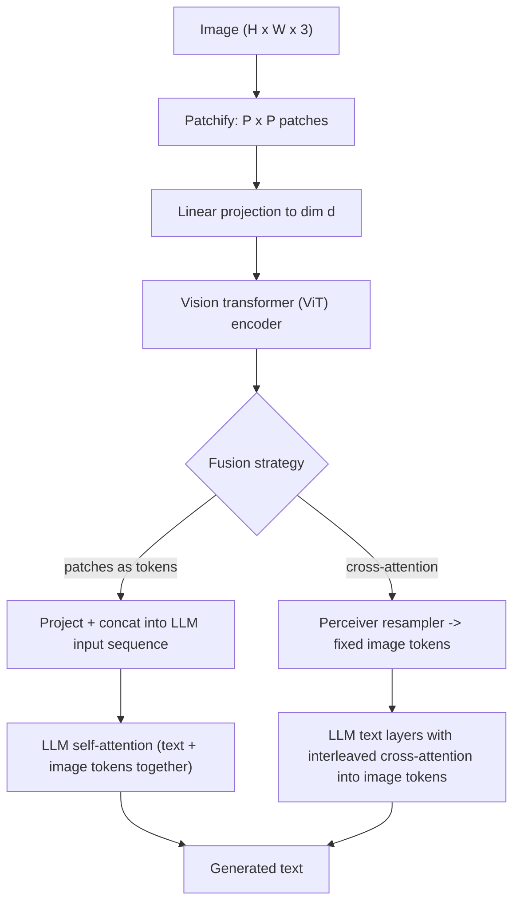

# Multimodal Models

## TL;DR
A multimodal model turns non-text inputs (mostly images today) into vectors that live in the
same space the LLM already reasons in — either by feeding image patches in as extra "tokens"
(patch-embedding-as-tokens, what GPT-4V/LLaVA-style models do) or by letting the LLM attend into
a separately-encoded image via cross-attention (Flamingo-style). CLIP is the pretraining recipe
that gets a vision encoder and a text encoder to agree on what a picture "means" before either
one ever meets a generative LLM.

## Intuition
Text is already a sequence of discrete tokens with learned embeddings. An image is a continuous
grid of pixels — there's no vocabulary. The trick every modern approach shares: chop the image
into patches (say 14×14 pixels), run each patch through a linear projection to get a vector of
the same dimensionality as a text token embedding, and now the transformer literally cannot tell
the difference between "a patch of the Eiffel Tower" and "the word Eiffel" — both are just
vectors in $\mathbb{R}^d$ competing for attention. Everything else is engineering on top of that
one idea.

## The maths

**Vision Transformer (ViT) patchification.** An image $x \in \mathbb{R}^{H \times W \times C}$
is split into $N = HW/P^2$ non-overlapping patches of size $P \times P$. Each flattened patch
$x_p \in \mathbb{R}^{P^2 C}$ is linearly projected:

$$
z_0 = [x_{\text{cls}}; \, x_p^1 E; \, x_p^2 E; \, \dots; \, x_p^N E] + E_{\text{pos}}, \quad E \in \mathbb{R}^{(P^2 C) \times d}
$$

where $E_{\text{pos}}$ is a learned or sinusoidal positional embedding and $x_{\text{cls}}$ is a
prependable class token. The result is a sequence of $N+1$ vectors fed through a standard
transformer encoder — same self-attention machinery as a text encoder, just with a different
tokenizer.

**CLIP contrastive pretraining.** Given a batch of $B$ (image, caption) pairs, encode all images
with a vision encoder $f_v$ and all texts with a text encoder $f_t$, L2-normalize, and form the
similarity matrix $S_{ij} = \tau \cdot f_v(I_i)^\top f_t(T_j)$ where $\tau$ is a learned
temperature. The loss is symmetric cross-entropy over rows and columns, treating the diagonal as
the positive pair:

$$
\mathcal{L} = \frac{1}{2}\left[ \frac{1}{B}\sum_i -\log \frac{e^{S_{ii}}}{\sum_j e^{S_{ij}}} + \frac{1}{B}\sum_j -\log \frac{e^{S_{jj}}}{\sum_i e^{S_{ij}}} \right]
$$

This is exactly in-batch negatives contrastive learning (see [[embedding-models]]) applied
across two modalities instead of within one. Every other image in the batch is a free negative
for every caption. Batch size matters a lot here — CLIP was trained with batches in the tens of
thousands specifically because that is what makes the negatives hard and plentiful.

**Fusing vision into an LLM — two families.**

1. *Patch-embedding-as-tokens* (LLaVA, Qwen-VL, GPT-4V-style): a frozen or lightly-tuned vision
   encoder (often a CLIP ViT) produces patch embeddings, a small MLP or a resampler
   ("Q-Former"/perceiver) projects them into the LLM's embedding dimension, and they are simply
   concatenated into the input sequence alongside text tokens. The LLM's existing self-attention
   handles the rest — no architecture change to the LLM itself.
2. *Cross-attention fusion* (Flamingo-style): the LLM's text-only self-attention layers stay
   untouched, but new cross-attention layers are interleaved that let text tokens attend into a
   fixed-size set of image embeddings (produced via a Perceiver Resampler). Image tokens never
   enter the LLM's own residual stream directly.

Tradeoff: token-concatenation is simpler and lets the LLM's existing attention do cross-modal
reasoning "for free," but a single high-resolution image can burn hundreds to thousands of
tokens of context (quadratic attention cost). Cross-attention keeps the image footprint fixed
and cheap regardless of resolution, at the cost of extra trained parameters and a less uniform
architecture.

## Diagram



## Code
```python
import torch
import torch.nn.functional as F

def clip_contrastive_loss(image_embeds: torch.Tensor,
                           text_embeds: torch.Tensor,
                           temperature: torch.Tensor) -> torch.Tensor:
    """image_embeds, text_embeds: (B, d), already L2-normalized. temperature: scalar tensor."""
    logits = temperature.exp() * image_embeds @ text_embeds.T  # (B, B)
    labels = torch.arange(logits.shape[0], device=logits.device)
    loss_i2t = F.cross_entropy(logits, labels)
    loss_t2i = F.cross_entropy(logits.T, labels)
    return (loss_i2t + loss_t2i) / 2


def patchify(image: torch.Tensor, patch_size: int) -> torch.Tensor:
    """image: (B, C, H, W) -> (B, N, C*P*P) flattened patches."""
    b, c, h, w = image.shape
    p = patch_size
    patches = image.unfold(2, p, p).unfold(3, p, p)          # (B, C, H/p, W/p, p, p)
    patches = patches.contiguous().view(b, c, -1, p, p)       # (B, C, N, p, p)
    patches = patches.permute(0, 2, 1, 3, 4).flatten(2)       # (B, N, C*p*p)
    return patches
```

## In practice
- **Use it when:** the document corpus or product surface genuinely has non-text signal —
  scanned invoices, charts, product photos, UI screenshots, diagrams in a PDF the text extractor
  mangles. Not "because it's the trendy model."
- **Defaults that work:** a frozen CLIP-family ViT-L/14 vision encoder + a small trainable
  projection layer into an open LLM (LLaVA-style) is the standard, cheap way to bolt vision onto
  an existing text LLM without retraining it from scratch.
- **Breaks when:** dense small text in images (OCR-heavy documents), fine-grained spatial
  reasoning ("is the third bullet indented under the second"), or counting — these need
  layout-aware parsing or dedicated OCR, not a general VLM, see [[document-ingestion-and-parsing]].
- **Cost / latency:** every image patch is a token competing for the same context window and
  attention budget as text; a single 1024×1024 image can cost more tokens than several pages of
  text. This is the single biggest reason production RAG pipelines still convert images to text
  (OCR, captioning) before indexing rather than storing raw image embeddings for retrieval.

## Interview angle

**Q. How does a vision encoder's output get into an LLM that was only ever trained on text tokens?**
Patches are linearly projected into the same embedding dimension as the LLM's text token
embeddings, then either concatenated straight into the input sequence (so the LLM's own
self-attention handles cross-modal reasoning) or injected via new cross-attention layers that
leave the LLM's text pathway architecturally untouched.

**Follow-up.** Why would you pick cross-attention over concatenation? → When you need image cost
to be resolution- and count-independent — cross-attention compresses each image to a fixed
number of latent tokens via a resampler, so 1 image or 5 images cost the same context budget,
unlike concatenation where every patch is a token.

**Q. Why does CLIP need such large batch sizes to train well?**
The loss is in-batch contrastive: every off-diagonal pair in the batch is a negative. Small
batches give few, often "easy" negatives (obviously unrelated image-text pairs), so the model
doesn't learn fine-grained distinctions. Large batches give more and harder negatives per step.

**Follow-up.** What's the practical fix if you can't afford huge batches? → Techniques like
memory banks / queues of past embeddings (MoCo-style) or gradient accumulation with cached
negatives approximate a larger effective batch without holding it all in one forward pass.

**Q. What is multimodal actually used for in production today, versus in demos?**
In production: document/receipt/invoice understanding pipelines (OCR + layout + VLM verification),
UI/screenshot-grounded agents (computer-use), product image tagging and moderation, chart/plot
question-answering, and image captioning for accessibility or search indexing. Full open-ended
"chat about any image" is common in consumer apps but rarer as the core of an enterprise
pipeline, where a narrower, evaluable task (extract these 8 fields from this invoice image) is
what gets shipped.

**Q. Why not just describe every image with an LLM caption and index the caption as text?**
That's actually the dominant production pattern for RAG over mixed corpora — it's cheaper,
reuses the existing text pipeline, and is far more debuggable than storing raw multimodal
embeddings in a vector index. The tradeoff is lossy: captioning throws away exact pixel detail
(precise numbers in a chart, exact table cell alignment) that a native multimodal embedding or a
VLM-at-query-time might have preserved.

## Traps
- Saying "multimodal models understand images like they understand text" — they don't have some
  unified abstract "meaning space" by magic; CLIP-style contrastive pretraining is what forces
  image and text encoders into a shared space, and it only aligns what was in the training
  distribution (stock-photo-style web image-caption pairs, historically).
- Treating VLMs as OCR replacements — general-purpose VLMs are worse than dedicated OCR at exact
  character-level transcription, especially for dense tables or small fonts, even though they
  "look" like they're reading.
- Assuming higher resolution is free — more patches means more tokens means quadratic attention
  cost; production systems tile or downsample images deliberately.
- Confusing CLIP (a dual-encoder contrastive model with no generation ability) with a VLM (a
  generative model that fuses vision into an LLM) — CLIP is often a *component inside* a VLM's
  vision encoder, not a VLM itself.

## Flashcards
What does a ViT do with an image before the transformer sees it?::Splits it into fixed-size patches, flattens each, and linearly projects it to the model dimension — patches become "tokens."
What loss does CLIP train with?::Symmetric contrastive cross-entropy over an image-text similarity matrix, using other pairs in the batch as negatives.
Why does CLIP need large batch sizes?::More in-batch negatives per step means harder, more informative contrastive signal.
Name the two dominant strategies for fusing vision into an LLM.::Patch-embeddings-as-tokens (concatenate into the input sequence) and cross-attention into a fixed set of image latents (Flamingo-style).
Why is cross-attention fusion more token-efficient than concatenation?::It compresses each image to a fixed number of latent tokens via a resampler, independent of image resolution or count.
What's the main production risk of using a general VLM as an OCR replacement?::Worse exact character-level transcription accuracy on dense or small text compared to dedicated OCR.
Why do many production RAG pipelines caption images to text instead of embedding them natively?::Cheaper, reuses the existing text index and evaluation pipeline, and is more debuggable — at the cost of losing exact visual detail.

## Related
[[transformer-architecture]]
[[embeddings]]
[[document-ingestion-and-parsing]]
[[attention-mechanism]]
[[decoding-strategies]]
