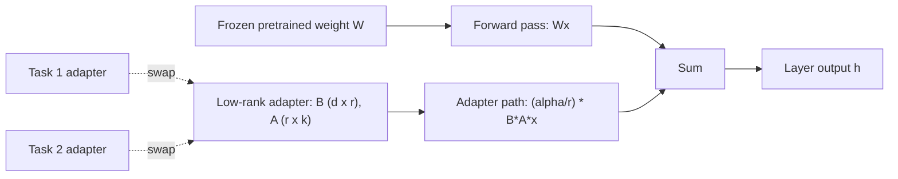

# Parameter-Efficient Fine-Tuning — LoRA & QLoRA

## TL;DR
LoRA freezes the pretrained weight matrix $W$ and learns a low-rank update $\Delta W = BA$ instead of
updating $W$ directly — cutting trainable parameters by 100–1000x for typical layers, cutting
optimizer-state memory by the same factor, and letting you swap task-specific adapters in and out of
a shared frozen base model at serving time. QLoRA extends this by quantising the frozen base weights
to 4-bit NF4 and training LoRA adapters in higher precision on top, making it possible to fine-tune a
65B-parameter model on a single 48GB GPU. Together, LoRA/QLoRA are the reason fine-tuning an LLM is no
longer a data-centre-only activity.

## Intuition
Full fine-tuning updates every one of billions of weights, and Adam needs to remember two extra
numbers (momentum, variance) per weight — so the optimiser state alone can be 2–3x the size of the
model itself. LoRA's bet, empirically well-supported, is that the *change* a downstream task needs to
make to a pretrained weight matrix has low "intrinsic rank" — you don't need to be able to move $W$
anywhere in its full-dimensional space, you only need to move it along a small number of meaningful
directions. So instead of learning a full $d \times k$ update, learn it as the product of two skinny
matrices whose rank $r$ is tiny (4–64, versus a hidden dimension of thousands) — like describing a
sophisticated colour correction not as an arbitrary transformation of every pixel, but as a small
number of tunable knobs (contrast, warmth, saturation) applied to an unchanged base photo.

## The maths

### Derivation: $W + \Delta W = W + BA$
Take a pretrained weight matrix $W \in \mathbb{R}^{d \times k}$ (e.g. one of the attention projection
matrices, $d$ = output dim, $k$ = input dim). Full fine-tuning learns an unconstrained update
$\Delta W \in \mathbb{R}^{d \times k}$, i.e. $d \times k$ trainable parameters for that one matrix. LoRA's
hypothesis: the task-specific update that matters lies in a low-rank subspace, so constrain
$\Delta W$ to rank $r \ll \min(d,k)$ by factorising it as the product of two matrices:

$$
\Delta W = B A, \qquad B \in \mathbb{R}^{d \times r}, \quad A \in \mathbb{R}^{r \times k}
$$

The forward pass becomes

$$
h = Wx + \Delta W x = Wx + BAx
$$

with $W$ **frozen** (no gradient, no optimizer state) and only $B, A$ trainable. Initialisation
matters for stability: $A$ is initialised with small random values (e.g. Gaussian), and $B$ is
initialised to **zero** — so $\Delta W = BA = 0$ at the start of training, meaning the adapted model
is numerically identical to the pretrained model at step 0, and training smoothly grows the update
from nothing rather than starting from a random perturbation of a working model.

### Rank $r$ and the $\alpha$ scaling factor
The output of the LoRA path is scaled by $\alpha / r$:

$$
h = Wx + \frac{\alpha}{r} BAx
$$

$r$ controls the **capacity** of the adaptation — how expressive a subspace of updates the model can
learn; typical values are 4, 8, 16, 32, sometimes up to 64 for harder tasks or larger domain shifts.
$\alpha$ is a fixed scale that, divided by $r$, keeps the effective magnitude of the update roughly
consistent as you change $r$ — without this scaling, doubling $r$ would roughly double the update's
typical magnitude purely as a side effect of matrix dimensions, confounding "more capacity" with
"bigger updates." A common convention is $\alpha = 2r$ (giving a scaling factor of exactly 2), or
tuning $\alpha$ and $r$ somewhat independently as two separate hyperparameters — but the important
interview point is that $r$ and $\alpha$ answer two different questions: $r$ is "how many independent
directions can this adapter move the weights in," $\alpha$ is "how strongly do those directions get
applied."

### Concrete parameter-count savings for one real layer
Take a 7B-class model's attention query projection: $d = k = 4096$ (a square projection in many
architectures). Full fine-tuning of this one matrix:

$$
\text{full}: \; d \times k = 4096 \times 4096 = 16{,}777{,}216 \text{ trainable parameters}
$$

LoRA with rank $r = 8$:

$$
\text{LoRA}: \; (d \times r) + (r \times k) = (4096 \times 8) + (8 \times 4096) = 65{,}536 \text{ trainable parameters}
$$

That's a **256x reduction** for this single matrix ($16{,}777{,}216 / 65{,}536 = 256$). Applied
across a full 7B model where LoRA typically targets only the attention projections (commonly
`q_proj`, `k_proj`, `v_proj`, `o_proj`) and/or the MLP projections, total trainable parameters across
the whole network typically land at **0.1%–1% of the base model's parameter count** — e.g. on the
order of 5–20 million trainable parameters for a 7B base model, versus 7 billion for full fine-tuning.
Because Adam-style optimisers store two extra state tensors (first and second moment) per trainable
parameter, this doesn't just shrink the parameters you update — it shrinks optimizer-state memory by
the same ~100–1000x factor, which is usually the actual binding constraint on GPU memory during
training, not the model weights themselves.

### Which modules to target, and why it matters
LoRA can be applied to any linear layer. The original paper found adapting the **attention
projection matrices** ($W_q, W_k, W_v, W_o$) gives most of the benefit at very low rank; many practical
recipes (and the QLoRA paper specifically) found that adapting **all linear layers**, including the
MLP/feed-forward projections (`gate_proj`, `up_proj`, `down_proj` in Llama-style architectures), at a
modest rank often matches full fine-tuning quality more closely than adapting attention alone at a
higher rank — spreading a fixed parameter budget across more modules tends to beat concentrating it
in fewer modules. The practical default: start with attention projections only for a quick/cheap
adaptation or a small domain shift; move to "all linear layers" when chasing full-fine-tuning-level
quality or when the task requires larger behavioural change.

### Why frozen base weights enable adapter swapping at serving time
Because $W$ never changes, $W + \frac{\alpha}{r}B_iA_i$ for different tasks $i$ are all just different
low-rank additions to the *same* frozen base. Concretely this means:
- You can **merge** $\Delta W$ into $W$ for a single deployed task (zero extra inference latency, one
  static merged weight file) — see the merge code below.
- Or, more powerfully, you can keep $W$ resident once and **hot-swap** different $(B,A)$ adapter pairs
  per request/tenant — each adapter is a few tens of megabytes rather than a full multi-gigabyte model
  checkpoint, so a single GPU serving one base model can serve dozens of fine-tuned "personalities" or
  customer-specific adapters simultaneously, batching requests for different adapters together far
  more cheaply than hosting a separately fully-fine-tuned model per task. This is the economic
  argument for LoRA in multi-tenant SaaS: one frozen base model in GPU memory, N cheap adapters, N
  effective fine-tuned models without N times the storage or serving cost.

## Diagram


## Code

### Fine-tuning with `peft` (real API)
```python
from transformers import AutoModelForCausalLM, AutoTokenizer, TrainingArguments, Trainer
from peft import LoraConfig, get_peft_model, TaskType

model_name = "meta-llama/Llama-3-8b"
model = AutoModelForCausalLM.from_pretrained(model_name, torch_dtype="bfloat16")
tokenizer = AutoTokenizer.from_pretrained(model_name)

lora_config = LoraConfig(
    r=16,                          # rank
    lora_alpha=32,                 # alpha; alpha/r = 2.0 scaling on the adapter path
    target_modules=[               # which modules to adapt
        "q_proj", "k_proj", "v_proj", "o_proj",   # attention projections
        "gate_proj", "up_proj", "down_proj",      # MLP projections (broader = closer to full FT)
    ],
    lora_dropout=0.05,
    bias="none",
    task_type=TaskType.CAUSAL_LM,
)

model = get_peft_model(model, lora_config)
model.print_trainable_parameters()
# e.g. "trainable params: 20,971,520 || all params: 8,051,232,768 || trainable%: 0.26"

trainer = Trainer(
    model=model,
    args=TrainingArguments(
        output_dir="./lora-out",
        per_device_train_batch_size=4,
        gradient_accumulation_steps=4,
        learning_rate=2e-4,        # LoRA typically wants a higher LR than full fine-tuning
        num_train_epochs=3,
        bf16=True,
    ),
    train_dataset=train_dataset,   # pre-tokenised (input_ids, labels) dataset
)
trainer.train()

# Merge the adapter into the base weights for zero-overhead single-task deployment:
merged_model = model.merge_and_unload()
merged_model.save_pretrained("./merged-model")

# Or keep the adapter separate (a few tens of MB) to hot-swap across tasks/tenants:
model.save_pretrained("./adapter-only")   # saves only B, A and config, not the base model
```

### QLoRA: 4-bit NF4 base + LoRA adapters
```python
from transformers import AutoModelForCausalLM, AutoTokenizer, BitsAndBytesConfig
from peft import LoraConfig, get_peft_model, prepare_model_for_kbit_training

bnb_config = BitsAndBytesConfig(
    load_in_4bit=True,
    bnb_4bit_quant_type="nf4",              # NormalFloat4: quantisation levels matched to
                                             # the normal distribution weights typically follow
    bnb_4bit_use_double_quant=True,         # quantise the quantisation constants themselves
    bnb_4bit_compute_dtype="bfloat16",      # de-quantise to bf16 on the fly for matmuls
)

model = AutoModelForCausalLM.from_pretrained(
    "meta-llama/Llama-3-70b",
    quantization_config=bnb_config,
    device_map="auto",
)
model = prepare_model_for_kbit_training(model)   # casts norms to fp32, enables grad checkpointing

lora_config = LoraConfig(
    r=64, lora_alpha=16, target_modules=["q_proj", "k_proj", "v_proj", "o_proj"],
    lora_dropout=0.05, bias="none", task_type="CAUSAL_LM",
)
model = get_peft_model(model, lora_config)
# Base weights stay frozen and 4-bit; only the bf16 LoRA adapters are trained.
```

### QLoRA memory arithmetic
For a 70B-parameter model:
- **fp16/bf16 full weights:** $70 \times 10^9 \times 2\ \text{bytes} \approx 140\ \text{GB}$ — before
  any optimizer state, activations, or gradients. Full fine-tuning with Adam adds roughly another
  8 bytes/parameter for optimizer state (fp32 momentum + variance) plus fp32 gradients, pushing total
  memory well past what any single consumer or even single high-end datacentre GPU holds.
- **4-bit NF4 base weights:** $70 \times 10^9 \times 0.5\ \text{byte} \approx 35\ \text{GB}$ — a 4x
  reduction from bf16 just from quantising the frozen base.
- **Double quantisation** further shaves memory by quantising the per-block quantisation constants
  themselves (the scale factors NF4 uses per block of weights), saving roughly an additional
  0.4 bit/parameter on average — a few more GB at 70B scale, small individually but meaningful stacked
  with everything else.
- **LoRA adapters in bf16:** at $r=64$ across attention projections for a 70B model, trainable
  parameters land around 1–2% of the base — on the order of a few hundred million parameters,
  needing roughly 2 bytes (weights) + ~8 bytes (Adam state, fp32) per trainable parameter, i.e. a few
  GB, not hundreds.
- **Paged optimizers:** QLoRA also introduces paged optimizers (built on NVIDIA unified memory),
  which page optimizer state between GPU and CPU memory automatically when a memory spike would
  otherwise cause an out-of-memory crash (common during gradient checkpointing's memory-usage spikes)
  — trading a small amount of speed for the ability to avoid OOM without manually shrinking batch
  size.

Net result: a 70B model that needs on the order of 150–200+ GB to full-fine-tune comfortably (weights
+ Adam state + gradients + activations) can be QLoRA-fine-tuned in roughly 35–45 GB total — fitting on
a single 48GB GPU, which is the paper's headline result (fine-tuning a 65B model on one GPU).

## In practice
- **Use it when:** you need to adapt an LLM to a domain/task and don't have (or don't want to spend)
  multi-GPU full-fine-tuning budget; when you need to serve many task/tenant-specific variants of one
  base model cheaply; when you need to iterate quickly (LoRA training runs are hours, not days).
- **Defaults that work:** $r = 8$–$16$ for a modest domain adaptation, $r = 32$–$64$ for a larger
  behavioural shift or when chasing near-full-fine-tuning quality; $\alpha = 2r$ as a starting
  convention; target attention projections at minimum, all linear layers for best quality; learning
  rate roughly 10x higher than you'd use for full fine-tuning (LoRA parameters start at zero, need a
  larger step to move meaningfully); QLoRA's NF4 + double quantisation + paged optimizers as the
  default recipe whenever GPU memory is the binding constraint.
- **Breaks when:** the required behavioural change genuinely needs to move the base model's
  representations in a way that doesn't fit a low-rank update (rare in practice, but very large domain
  shifts or teaching a fundamentally new capability can underperform full fine-tuning at low rank —
  raise $r$ first before concluding this); or when serving-time latency from the extra $BAx$
  computation matters at extreme scale and you haven't merged the adapter (merging removes this
  entirely for single-task deployment).
- **Cost / latency:** training cost and memory drop by roughly the same factor as trainable
  parameters (100–1000x) relative to full fine-tuning; inference latency is unaffected once merged,
  and only marginally higher if kept unmerged (one extra low-rank matmul per adapted layer) — a cost
  usually well worth paying for the flexibility of hot-swappable adapters.

## Interview angle

**Q. Derive why LoRA reduces trainable parameters so dramatically, with numbers.**
Walk through $\Delta W = BA$, $B \in \mathbb{R}^{d\times r}$, $A \in \mathbb{R}^{r\times k}$, giving
$d r + rk$ trainable parameters instead of $dk$. For $d=k=4096$, $r=8$: full fine-tuning of that
matrix is $16{,}777{,}216$ parameters; LoRA is $65{,}536$ — a 256x reduction. Emphasise that this
reduction compounds with Adam's optimizer-state overhead (2 extra tensors per trainable parameter),
so the effective memory saving on the binding constraint (GPU memory) is often the more decisive
number in practice than the raw parameter count.

**Q. Why is $B$ initialised to zero and $A$ initialised randomly, rather than both randomly?**
So that $\Delta W = BA = 0$ exactly at initialisation — the LoRA-adapted model is numerically
identical to the pretrained model before any training happens. This gives a stable, non-disruptive
starting point (training smoothly grows a small perturbation from a known-good model) rather than
starting from a random, potentially destructive change to a working pretrained network.

**Q. What's the difference between what $r$ and $\alpha$ each control, and how do you pick them?**
$r$ sets the rank of the update — the dimensionality of the subspace the adapter is allowed to move
weights in, i.e. capacity. $\alpha$ (via the $\alpha/r$ scaling factor) sets how strongly that update
is applied, decoupling "how expressive" from "how much effect" so you can change $r$ without
implicitly rescaling the update's typical magnitude. In practice, tune $r$ first against task
difficulty/domain shift, keep $\alpha = 2r$ as a reasonable default, then adjust $\alpha$ if the
adapted model's behaviour is under- or over-shooting relative to the base model.

**Q. Why does freezing $W$ enable adapter swapping, and why does that matter commercially?**
Because $W$ never changes, any number of independently-trained $(B_i, A_i)$ pairs are all valid
additive updates to the *same* frozen base held once in GPU memory — you don't need N separate
full-size model checkpoints for N tasks/customers, just one base model plus N adapters that are each
a few tens of MB. This is what makes serving dozens or hundreds of fine-tuned variants economically
viable on shared infrastructure, versus needing N times the storage and (without careful batching)
N times the serving footprint for N fully-fine-tuned models.

**Q. Explain QLoRA's three key ideas and why each saves memory.**
(1) **4-bit NF4 quantisation** of the frozen base weights — NormalFloat4 places quantisation levels to
match the roughly-normal distribution of pretrained weights, giving better precision-per-bit than a
naive uniform 4-bit quantisation, and cuts base-weight memory 4x versus bf16. (2) **Double
quantisation** — the per-block scale/zero-point constants that NF4 itself needs are also quantised,
saving a further fraction of a bit per parameter, meaningful at tens-of-billions-of-parameters scale.
(3) **Paged optimizers** — use NVIDIA unified memory to automatically page optimizer state to CPU RAM
during transient GPU memory spikes (e.g. from gradient checkpointing), preventing OOM crashes without
manually reducing batch size, at a small speed cost.

**Follow-up.** If QLoRA quantises the base weights, how does gradient computation still work
correctly? → The base weights are stored in 4-bit but **de-quantised on the fly to a compute dtype**
(bf16) for the actual forward/backward matmuls — gradients only ever flow into the LoRA adapter
parameters $B, A$, which are kept in full bf16 precision throughout; the frozen base never receives
gradients at all, so its 4-bit storage never needs to support gradient accumulation.

**Q. Give a concrete memory comparison: full fine-tuning vs. QLoRA for a 70B model.**
Full bf16 weights alone are about 140 GB; adding Adam's fp32 momentum+variance and fp32 gradients for
full fine-tuning pushes total memory to several hundred GB, requiring a multi-GPU cluster. QLoRA's
4-bit NF4 base is about 35 GB, plus a few GB for bf16 LoRA adapters and their (much smaller) Adam
state — landing around 35–45 GB total, fitting on a single 48GB GPU.

## Traps
- Saying LoRA "fine-tunes fewer layers" — it doesn't skip layers, it constrains the *rank* of the
  update within layers it's applied to; conflating "fewer parameters" with "fewer layers touched" is
  a common imprecision.
- Forgetting the $\alpha/r$ scaling term and treating $\alpha$ and $r$ as redundant — they answer
  different questions (magnitude vs. capacity) and are tuned somewhat independently.
- Claiming QLoRA trains the quantised weights — it does not; gradients only flow into the bf16 LoRA
  adapters, the 4-bit base is frozen and only de-quantised transiently for the forward/backward matmul.
- Assuming merging the adapter is always desirable — merging is right for single-task deployment
  (zero inference overhead) but defeats the multi-tenant hot-swapping benefit that is LoRA's other
  major commercial advantage.
- Quoting LoRA's parameter savings without mentioning the optimizer-state savings — in an interview,
  the memory story (not just the parameter-count story) is usually the more decision-relevant point.

## Flashcards
LoRA's core factorisation::W + ΔW = W + BA, with B in R^(d x r), A in R^(r x k), W frozen
Trainable parameter count for a LoRA-adapted d x k matrix::dr + rk (vs dk for full fine-tuning)
Why B is initialised to zero::so ΔW = 0 at training start, matching the pretrained model exactly before any updates
What r controls vs what alpha controls::r sets the rank/capacity of the update; alpha (via alpha/r scaling) sets its effective magnitude
Why frozen base weights enable adapter swapping::many independent (B,A) pairs can all be added to the same shared frozen base at serving time
QLoRA's three key techniques::4-bit NF4 quantisation, double quantisation of quant constants, paged optimizers
Why QLoRA still trains correctly despite 4-bit base weights::gradients only flow into the bf16 LoRA adapters; base weights are de-quantised on the fly and never receive gradients
Approximate memory for full fine-tuning vs QLoRA on a 70B model::~150-200+ GB full fine-tuning vs ~35-45 GB QLoRA

## Related
[[instruction-tuning-and-sft]]
[[quantization]]
[[mixed-precision-and-memory]]
[[transfer-learning-and-finetuning]]
[[llm-scaling-laws]]
