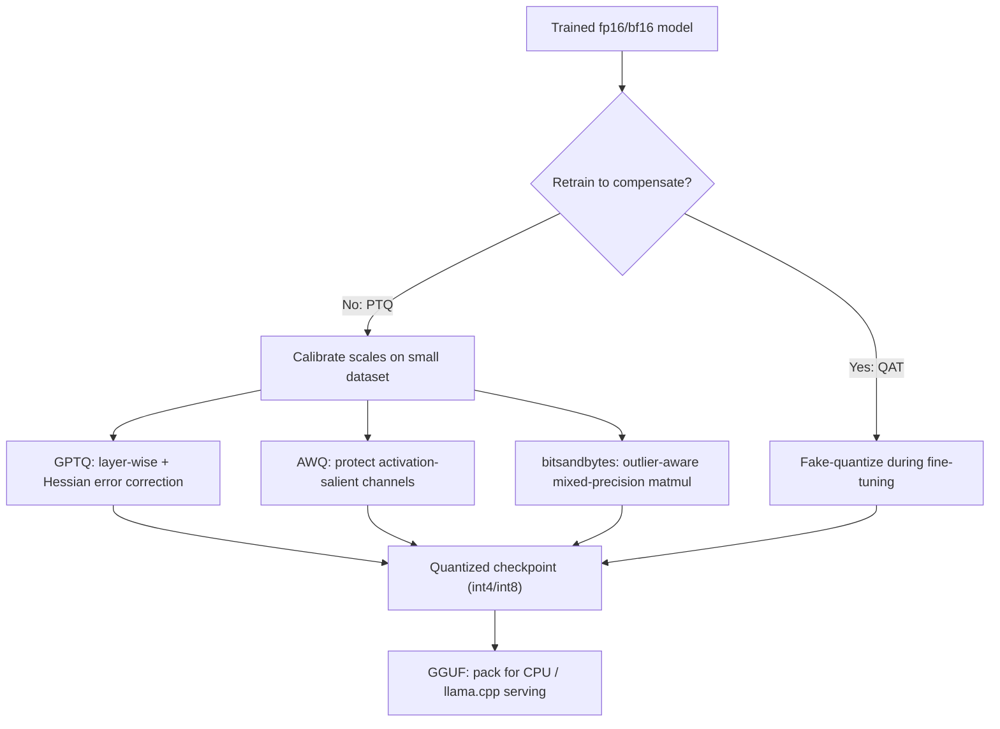

# Quantization

## TL;DR

Quantization stores and computes weights (and sometimes activations) in fewer bits than the
fp32/fp16/bf16 the model was trained in — typically int8 or int4 — to cut memory and often speed
up inference, at a cost in accuracy. Post-training quantization (PTQ) is cheap and applied after
training; quantization-aware training (QAT) bakes the precision loss into training so the model
compensates for it. GPTQ, AWQ, and GGUF/bitsandbytes are the practical toolchains you'll actually
be asked to name and differentiate.

## Intuition

A weight stored as fp16 has 16 bits of resolution to represent a value; int4 has 16 possible
levels total. Quantization is choosing a scale (and often a zero-point) so that a small set of
integer buckets covers the real range of values with the least damage to the numbers that matter
most. The core tension: most weights cluster near zero and can be crushed into few bits happily,
but a handful of **outlier channels** carry disproportionate signal — crush those and the model's
outputs degrade sharply. Every serious quantization method is really a strategy for protecting
outliers while compressing everything else hard.

## The maths

### What precision costs

A parameter stored in fp32 costs 4 bytes, fp16/bf16 costs 2 bytes, int8 costs 1 byte, int4 costs
0.5 bytes (packed two per byte). For a 7B-parameter model:

| Precision | Bytes/param | Weight memory |
|---|---|---|
| fp32 | 4 | ~28 GB |
| fp16 / bf16 | 2 | ~14 GB |
| int8 | 1 | ~7 GB |
| int4 | 0.5 | ~3.5 GB |

This is weights only — add KV cache and activation memory on top (see
[[kv-cache-and-inference-optimization]]). The reason quantization matters commercially is direct:
it decides whether a model fits on one consumer GPU (24 GB), one datacenter GPU (80 GB), or needs
multi-GPU sharding at all.

### Affine (uniform) quantization

The standard scheme maps a real-valued tensor $x$ to an integer $q$ with a scale $s$ and
zero-point $z$:

$$
q = \text{round}\!\left(\frac{x}{s}\right) + z, \qquad x \approx s\,(q - z)
$$

$s$ is chosen from the tensor's observed range, e.g. $s = \frac{\max(x) - \min(x)}{2^b - 1}$ for
$b$-bit integers. **Per-tensor** scaling uses one $(s, z)$ for an entire weight matrix — simplest,
cheapest, but a single outlier anywhere in the tensor blows up $s$ for every other value, wasting
resolution. **Per-channel** (or per-group) scaling assigns a separate $(s, z)$ per output channel,
or per small group of $g$ weights (group sizes of 32–128 are typical) — far better fidelity because
each group's scale only has to absorb that group's own range, at the cost of storing more scale
factors (a small, usually negligible, overhead).

### Outlier channels

Empirically, in trained LLMs a small number of activation channels (often <1% of dimensions) carry
values 10–100x larger than the rest, consistently across layers and inputs. Naive uniform
quantization sets the scale to cover these outliers, which means every "normal" value gets crammed
into a handful of integer buckets — most of the model's information capacity is wasted protecting
values that barely matter numerically to the output. This single fact is why naive int8/int4
quantization of activations catastrophically hurts LLMs specifically (compared to CNNs, where
this pattern is much weaker), and it's the reason every serious method treats outliers specially:
- **AWQ** (Activation-aware Weight Quantization) identifies the weight channels that correspond to
  high-magnitude activations and protects *those specific channels* with higher effective precision
  (via a per-channel scaling transform), leaving the rest at low bit-width.
- **GPTQ** quantizes weights layer-by-layer, greedily choosing each weight's quantized value and
  then updating the *remaining* unquantized weights in that layer to compensate for the error just
  introduced (a second-order, Hessian-based correction) — it doesn't special-case outlier channels
  explicitly, but the reconstruction objective naturally protects the directions that most affect
  layer output.
- **bitsandbytes** (`LLM.int8()`) decomposes matrix multiplication itself: it detects outlier
  feature dimensions at runtime and computes those in fp16, doing the bulk multiplication in int8,
  then recombines — a mixed-precision matmul rather than a uniform quantization of everything.

### PTQ vs QAT

**Post-training quantization (PTQ)**: take a fully trained fp16/bf16 model, quantize weights
(optionally calibrating scales on a small unlabeled dataset), no retraining. Cheap — minutes to
hours on a single GPU — and this is what GPTQ, AWQ, and GGUF conversions do. Quality loss is
usually small at int8 and noticeable-but-usable at int4, more so below that.

**Quantization-aware training (QAT)**: simulate quantization (fake-quantize: round-trip through
low precision but keep gradients flowing via a straight-through estimator) *during* training or
fine-tuning, so the model's weights are learned to be robust to the rounding. Strictly better final
quality at a given bit-width than PTQ, but costs a full (or partial) training run — GPU-hours and
engineering effort PTQ doesn't need. In practice: PTQ is the default for taking someone else's
pretrained checkpoint to production; QAT is worth it only when you already control training and
the bit-width target is aggressive (sub-4-bit) and quality-critical.

## Diagram



## Code

Loading a model in int4 with bitsandbytes (NF4, the standard QLoRA-style config) via Hugging Face:

```python
from transformers import AutoModelForCausalLM, BitsAndBytesConfig
import torch

bnb_config = BitsAndBytesConfig(
    load_in_4bit=True,
    bnb_4bit_quant_type="nf4",          # normal-float 4-bit, tuned for weight distributions
    bnb_4bit_compute_dtype=torch.bfloat16,
    bnb_4bit_use_double_quant=True,      # quantize the quantization constants too
)

model = AutoModelForCausalLM.from_pretrained(
    "mistralai/Mistral-7B-v0.1",
    quantization_config=bnb_config,
    device_map="auto",
)
```

Illustrating per-tensor vs per-channel scale sensitivity to an outlier:

```python
import numpy as np

def quantize_uniform(x, bits=4):
    qmax = 2 ** bits - 1
    scale = (x.max() - x.min()) / qmax
    q = np.round((x - x.min()) / scale)
    return q * scale + x.min()

x = np.random.randn(1000) * 0.1
x[0] = 8.0  # a single outlier channel

per_tensor = quantize_uniform(x, bits=4)
print("per-tensor MAE on normal values:", np.abs(x[1:] - per_tensor[1:]).mean())
# splitting the outlier into its own group and quantizing separately
normal_q = quantize_uniform(x[1:], bits=4)
print("per-group MAE on normal values:", np.abs(x[1:] - normal_q).mean())
```

## In practice

- **Use it when:** deploying on limited VRAM, serving many concurrent users where memory bandwidth
  is the bottleneck, or running on CPU/edge (GGUF via llama.cpp).
- **Defaults that work:** int8 for "almost free" quality with real memory savings; int4 (GPTQ or
  AWQ, group size 128) as the standard production compromise; go below int4 only with QAT and
  heavy evaluation.
- **Breaks when:** aggressive quantization on reasoning-heavy or long-context tasks — degradation is
  uneven across capabilities, so a model can look fine on perplexity but fail on multi-step
  arithmetic or code generation specifically. Always evaluate on the target task, not just
  perplexity.
- **Cost / latency:** memory drops roughly linearly with bits; latency gains are workload-dependent
  — quantization helps most when inference is memory-bandwidth bound (small batch, autoregressive
  decode), and less when it's compute bound (large batch prefill), since int4 weights are often
  dequantized to fp16 before the matmul unless the kernel supports native low-bit compute.

## Interview angle

**Q. Quality-vs-memory: give me an honest tradeoff table, not just "smaller is worse."**
| Bit-width | Memory vs fp16 | Typical quality impact |
|---|---|---|
| int8 | 2x smaller | Usually negligible with per-channel scaling; safe default |
| int4 (GPTQ/AWQ, group 128) | 4x smaller | Small, measurable drop; usually acceptable for most tasks |
| int4 naive (per-tensor) | 4x smaller | Can be severe due to outlier channels; avoid |
| int2–int3 | 6–8x smaller | Noticeable degradation without QAT; niche use |
The honest answer: bit-width alone doesn't tell you quality — the scaling granularity and
outlier handling matter more than the nominal bit count.

**Q. Why does naive int4 quantization hurt LLMs more than it hurts CNNs?**
LLM activations have systematic outlier channels (a small, consistent set of dimensions with much
larger magnitude), which is much less pronounced in CNN activations. A uniform quantizer's scale is
set by the range, so outliers force nearly all resolution to be spent protecting a few channels,
starving the rest. CNN weight/activation distributions are comparatively well-behaved, so naive
uniform quantization degrades them less.

**Follow-up.** How does AWQ address this without retraining? → It identifies, from a small
calibration set, which weight channels correspond to salient (large-magnitude) activations, then
applies a per-channel scaling transform that shifts quantization error away from those channels —
done analytically, no gradient updates needed.

**Q. When would you choose QAT over PTQ?**
When the target bit-width is aggressive (sub-4-bit) and you already own the training pipeline —
QAT lets the model's weights adapt to the rounding, which is strictly better quality at a given
bit-width, but it costs a training run. If you're just taking a released checkpoint and need it
smaller cheaply, PTQ (GPTQ/AWQ) is the only realistic option.

**Q. What's the difference between GPTQ and AWQ operationally?**
GPTQ quantizes weights layer-by-layer using a Hessian-based error-correction step — each weight's
rounding error is compensated for in the not-yet-quantized weights of the same layer. AWQ instead
identifies activation-salient weight channels ahead of time and protects them via scaling, then
quantizes uniformly. GPTQ is more compute-intensive to produce (needs calibration + per-layer
optimization); AWQ is faster to quantize and often matches or beats GPTQ quality at low bit-widths.

**Q. What is GGUF and how does it relate to GPTQ/AWQ/bitsandbytes?**
GGUF is a file format (successor to GGML) used by llama.cpp for CPU and mixed CPU/GPU inference —
it's an orthogonal axis from the quantization *algorithm*. A model quantized via any method can be
packed into GGUF; llama.cpp also ships its own quantization schemes (Q4_K_M etc.) that aren't GPTQ
or AWQ but follow the same per-block scaling idea.

## Traps

- Saying "int4 is 4x smaller and basically the same quality" without qualifying group size and
  method — naive per-tensor int4 is a real quality cliff, not a footnote.
- Treating quantization as purely a memory optimization — it changes latency only when the workload
  is memory-bandwidth bound; a compute-bound large-batch prefill sees little speedup and can even
  be slower if dequantization isn't fused into the kernel.
- Confusing PTQ methods (GPTQ, AWQ) with QAT — GPTQ and AWQ do **not** retrain the model; calling
  them "quantization-aware training" is a factual error interviewers will catch.
- Ignoring activation quantization — weight-only quantization (what GPTQ/AWQ mainly target) is
  much safer than also quantizing activations, which is where the outlier-channel problem bites
  hardest (bitsandbytes' int8 handles this explicitly via mixed precision).
- Quoting a single perplexity number as proof quantization is "safe" — perplexity is an average;
  degradation on specific capabilities (arithmetic, long-context retrieval, instruction-following)
  can be much worse than the aggregate number suggests.

## Flashcards

What is the core problem outlier channels cause for uniform quantization?::A per-tensor scale is set by the max range, so a few large outlier values force most of the tensor's resolution to be wasted protecting them, crushing normal values into too few buckets.
Per-channel vs per-tensor quantization — which handles outliers better and why?::Per-channel (or per-group), because each channel/group gets its own scale, so an outlier in one channel doesn't distort the resolution available to other channels.
What does GPTQ do differently from naive rounding?::It quantizes weights layer-by-layer and uses a Hessian-based correction to update not-yet-quantized weights, compensating for the error each rounding step introduces.
What does AWQ protect, and how?::Activation-salient weight channels, protected via a per-channel scaling transform derived from calibration data — not by retraining.
PTQ vs QAT — what's the fundamental tradeoff?::PTQ is cheap (no retraining) but leaves some quality on the table; QAT trains the model to be robust to quantization, better quality at a given bit-width, but costs a training run.
Does int4 quantization typically speed up a large-batch prefill step?::Not necessarily — prefill is often compute-bound, so the benefit of smaller weights (a memory-bandwidth win) is muted unless the kernel does native low-bit compute.
What is bitsandbytes' LLM.int8() actually doing?::A mixed-precision matmul: it detects outlier activation dimensions at runtime, computes those in fp16, and does the rest of the matmul in int8, then recombines.

## Related

[[kv-cache-and-inference-optimization]]
[[llm-serving-and-throughput]]
[[knowledge-distillation]]
[[small-language-models-and-cost]]
[[mixed-precision-and-memory]]
