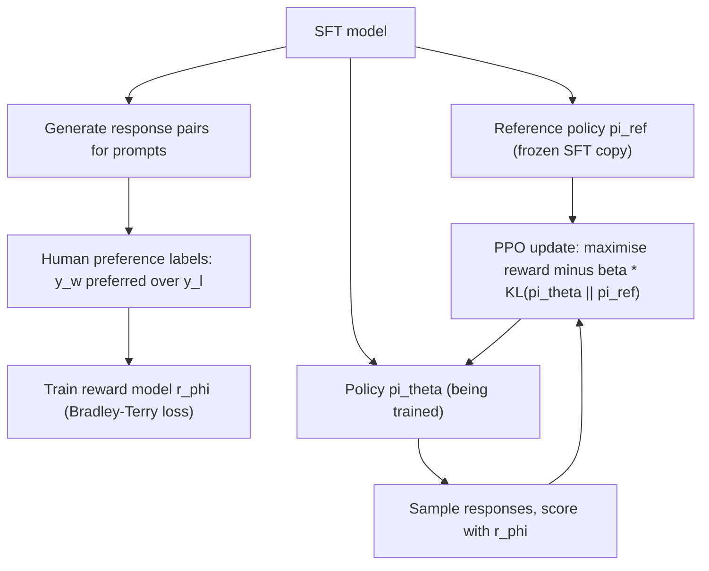

# RLHF (Reinforcement Learning from Human Feedback)

## TL;DR
RLHF trains a reward model on human preference comparisons, then uses reinforcement learning (usually
PPO) to fine-tune the LLM to maximise that reward — while a KL penalty against the original
SFT policy stops the model from drifting into degenerate, reward-hacking outputs that score high but
read badly. It's the pipeline that took SFT-only models like early InstructGPT from "follows
instructions" to "follows instructions the way humans actually prefer." It is also expensive,
unstable to tune, and largely superseded in many production pipelines by DPO — see
[[dpo-and-preference-optimization]] for that story and the practical decision rule at the end of
this page.

## Intuition
SFT teaches the model to imitate example responses. But for open-ended generation there's rarely one
"correct" response — there's a *better* and a *worse* one among several plausible completions, and
that's exactly what's easy for a human to judge (which of these two answers do you prefer?) but hard
to supply as a single target to imitate. RLHF turns that pairwise preference signal into a scalar
reward function, then uses RL to push the model's whole output distribution toward
higher-reward regions — while a leash (the KL penalty) stops it wandering too far from a policy that
still writes fluent, sensible text.

## The maths

### Step 1 — reward model training
Collect pairs of responses $(y_w, y_l)$ to the same prompt $x$, where a human labeller marked $y_w$
preferred over $y_l$. Under the Bradley-Terry preference model, the probability that $y_w$ is
preferred is

$$
p(y_w \succ y_l \mid x) = \sigma\big(r_\phi(x, y_w) - r_\phi(x, y_l)\big)
$$

Train the reward model $r_\phi$ (typically the SFT model with its LM head replaced by a scalar output)
to maximise the log-likelihood of the observed preferences:

$$
\mathcal{L}_{\text{RM}}(\phi) = -\mathbb{E}_{(x,y_w,y_l)}\Big[\log \sigma\big(r_\phi(x,y_w) - r_\phi(x,y_l)\big)\Big]
$$

### Step 2 — RL fine-tuning with a KL penalty (PPO)
Treat the LLM as a policy $\pi_\theta(y \mid x)$ generating a full response as an "action." The RL
objective maximises expected reward, **regularised toward the reference (SFT) policy** $\pi_{\text{ref}}$:

$$
\max_\theta \; \mathbb{E}_{x \sim \mathcal{D},\, y \sim \pi_\theta(\cdot|x)}
\Big[ r_\phi(x, y) - \beta \, D_{\text{KL}}\big(\pi_\theta(\cdot|x) \,\|\, \pi_{\text{ref}}(\cdot|x)\big) \Big]
$$

Equivalently, the per-token reward fed into PPO is often written as the reward model score plus a
per-token KL penalty term:

$$
\tilde r(x,y) = r_\phi(x,y) - \beta \log \frac{\pi_\theta(y \mid x)}{\pi_{\text{ref}}(y \mid x)}
$$

PPO (proximal policy optimisation) is used to actually perform the update, because it constrains
policy updates to stay close to the previous iterate (via a clipped surrogate objective), giving more
stable training than vanilla policy gradient for a policy this large and expensive to sample from.

### Why the KL penalty exists
Without it, the policy can drift to exploit weaknesses in the learned reward model — producing
outputs that score very highly under $r_\phi$ but are repetitive, incoherent, sycophantic, or
otherwise degenerate ("reward hacking"). The reward model is an imperfect proxy for true human
preference, trained on a finite sample of comparisons; the KL term keeps $\pi_\theta$ anchored close
to $\pi_{\text{ref}}$ (the well-behaved SFT model), trading off some potential reward gain for staying
in the region where the reward model's judgements are actually reliable and where fluency/coherence
from SFT is preserved. $\beta$ directly controls this tradeoff — too small and the model reward-hacks;
too large and RLHF barely moves the model from its SFT starting point.

## Diagram


## Code
```python
# Schematic PPO-style RLHF loop using a reward model and a reference policy.
# Real implementations use libraries like TRL; this shows the core mechanics.
import torch
import torch.nn.functional as F

def rlhf_step(policy, ref_policy, reward_model, prompts, tokenizer, beta=0.1):
    # 1. Sample responses from the current policy
    responses = policy.generate(prompts, do_sample=True, max_new_tokens=256)

    # 2. Score with the reward model
    with torch.no_grad():
        rewards = reward_model(prompts, responses)                     # r_phi(x, y)

    # 3. Compute per-token log-probs under policy and frozen reference
    logp_policy = policy.log_prob(responses, prompts)                  # log pi_theta(y|x)
    with torch.no_grad():
        logp_ref = ref_policy.log_prob(responses, prompts)             # log pi_ref(y|x)

    # 4. KL penalty against the reference policy
    kl = logp_policy - logp_ref
    shaped_reward = rewards - beta * kl

    # 5. PPO clipped surrogate objective (schematic — omits value function / GAE)
    advantages = shaped_reward - shaped_reward.mean()
    ratio = torch.exp(logp_policy - logp_policy.detach())
    clipped = torch.clamp(ratio, 1 - 0.2, 1 + 0.2)
    loss = -torch.min(ratio * advantages, clipped * advantages).mean()
    return loss
```

## In practice
- **Use it when:** you need to optimise a genuinely learned, potentially complex preference signal
  (helpfulness/harmlessness tradeoffs that are hard to fully specify statically), and you have the
  infrastructure (a reward model, a rollout/generation pipeline, and RL training stability expertise)
  to run it.
- **Defaults that work:** initialise the policy and reference from the same SFT checkpoint; tune
  $\beta$ empirically (start small, watch for reward-hacking symptoms — repetition, off-topic
  fluency loss, degenerate high-reward text); use a well-calibrated, sufficiently large reward
  model — a weak or narrow reward model is the most common root cause of a bad RLHF run.
- **Breaks when:** the reward model is small/undertrained relative to the policy (easy to hack); the
  KL coefficient isn't tuned (either no meaningful improvement, or severe quality collapse); or the
  team lacks RL infrastructure and tuning experience — PPO for LLMs is notoriously fiddly (multiple
  interacting networks: policy, reference, reward model, and often a value model).
- **Cost / latency:** the most expensive step of standard post-training — requires online generation
  from the policy during training (much more compute per step than a supervised loss), a separate
  reward model held in memory/compute alongside the policy, and materially more hyperparameter tuning
  and instability risk than SFT or DPO.

## Interview angle

**Q. Why is there a KL penalty in the RLHF objective — why not just maximise reward directly?**
The reward model is a learned approximation of human preference, trained on a finite, imperfect
sample of comparisons. Optimising against it with no constraint lets the policy find
"adversarial" outputs that score high under the reward model's mistakes but are actually bad
(repetitive, incoherent, sycophantic) — classic reward hacking. The KL term keeps the policy near the
reference SFT model, where both fluency is preserved and the reward model's judgements are more
trustworthy (it was mostly trained on outputs similar to the SFT distribution).

**Q. What happens if beta (the KL coefficient) is set too low? Too high?**
Too low: the policy chases reward aggressively and can degrade into reward-hacked, degenerate text
that scores well but reads poorly to actual humans. Too high: the KL penalty dominates and the policy
barely moves from the SFT starting point, so RLHF buys little improvement over SFT alone.

**Q. Do you need full RL (RLHF/PPO) or is SFT enough?**
SFT is enough when you have (or can construct) direct examples of the *single* correct/ideal output
for each input — format-following, factual QA with a known answer, structured extraction, most
narrow enterprise tasks. You need a preference-optimisation step (RLHF or, more often now, DPO) when
the desired behaviour is a *relative* judgement between multiple plausible outputs — tone,
helpfulness-vs-verbosity tradeoffs, safety refusals calibrated to nuance — that's hard to fully
specify as a single imitation target but easy for a human (or a strong judge model) to rank. In
practice: reach for SFT first; only invest in RLHF/DPO once SFT plateaus and you have a genuine
preference dataset (or the resources to build one).

**Follow-up.** Given the cost and instability of full PPO-based RLHF, when would you still choose it
over DPO? → When you need online exploration against a reward model that keeps updating (e.g.
iterated best-of-n distillation, or a reward signal that isn't well captured by a fixed offline
preference dataset), or when your organisation already has mature RL infrastructure and the
incremental control PPO gives over the KL/reward tradeoff during training is worth the added
complexity. For most teams building a single alignment pass on top of an existing SFT model with a
static preference dataset, DPO gets similar results with far less engineering risk — see
[[dpo-and-preference-optimization]].

**Q. What's the role of the reward model's own quality in how well RLHF works?**
It's the ceiling on the whole pipeline — RLHF optimises the policy to satisfy the reward model, not
directly human preference; if the reward model is miscalibrated, biased, or easy to game (small,
undertrained, narrow training distribution), the policy will learn to exploit exactly those flaws.
Reward model quality (data diversity, size, calibration) is usually a bigger lever on final model
quality than PPO hyperparameter tuning.

## Traps
- Saying RLHF "directly optimises human preference" — it optimises a *learned proxy* (the reward
  model) for human preference, and the whole KL-penalty machinery exists precisely because that
  proxy is imperfect.
- Forgetting the reference policy in the KL term is **frozen** — it's a fixed snapshot of the SFT
  model, not updated during RL training; conflating it with the current policy is a common mistake.
- Claiming RLHF is "just fine-tuning with extra steps" — the online generation + reward scoring +
  RL update loop is a fundamentally different (and more expensive, less stable) training regime than
  supervised fine-tuning.
- Recommending RLHF as a default without first asking whether a static SFT dataset or a DPO
  preference dataset would achieve the same behavioural goal more cheaply.

## Flashcards
Reward model training objective::Bradley-Terry pairwise log-likelihood over human preference comparisons
RLHF's RL objective::maximise expected reward from the reward model, minus beta times KL divergence from the reference policy
Why the KL penalty exists::prevents the policy from reward-hacking an imperfect learned reward model and drifting from fluent SFT behaviour
What algorithm is typically used to optimise the RLHF objective::PPO (proximal policy optimisation)
What the reference policy in the KL term is::a frozen copy of the SFT model, not updated during training
When SFT alone is enough vs when you need RLHF/DPO::SFT for tasks with a single correct target; RLHF/DPO for tasks defined by relative preference between outputs
Biggest practical risk factor in a bad RLHF run::a weak, undertrained, or easily-gamed reward model

## Related
[[instruction-tuning-and-sft]]
[[dpo-and-preference-optimization]]
[[llm-safety-and-guardrails]]
[[gpt-and-decoder-models]]
[[llm-evaluation]]
