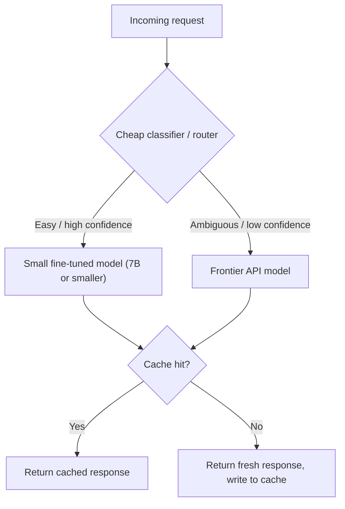

# Small Language Models and Cost

## TL;DR

At scale, LLM cost is a per-token multiplication problem, and the frontier model is rarely the
cheapest way to hit a quality bar for a narrow task. A fine-tuned small model (1B–13B class) can
match or beat a frontier API on a specific task at a fraction of the marginal cost once you've
amortised training, because you're paying for exactly the capability you need instead of renting
general-purpose capability you don't use. The practical toolkit is routing/cascading (send easy
requests to cheap models, hard ones to strong models), caching (never pay twice for the same
computation), and knowing how to do the token-cost arithmetic so the decision is a number, not a
vibe.

## Intuition

A frontier model is a Swiss Army knife you rent by the token; a fine-tuned small model is a
purpose-built tool you own. If your task really is one narrow, well-specified thing done millions
of times a day (classify this ticket, extract this field, route this query), you don't need the
Swiss Army knife's other fifty blades — you need the one blade, sharpened, running on hardware you
control. The economics flip once volume is high enough to amortise the one-time cost of sharpening
it (fine-tuning) against the per-use savings.

## The maths

**Token-cost arithmetic.** Given input price $p_{in}$ and output price $p_{out}$ (per token, or per
1K/1M tokens — keep units consistent), average input tokens $\bar{n}_{in}$, average output tokens
$\bar{n}_{out}$, and monthly request volume $V$:

$$
\text{Monthly API cost} = V \times (\bar{n}_{in}\, p_{in} + \bar{n}_{out}\, p_{out})
$$

A worked example (illustrative numbers only — always plug in your actual contracted rates, which
change):

- $V = 5{,}000{,}000$ requests/month (a mid-size support-ticket classifier)
- $\bar{n}_{in} = 400$ tokens (ticket + short prompt), $\bar{n}_{out} = 20$ tokens (label + short
  rationale)
- Frontier API: assume $p_{in} = \$0.15$/1M tokens, $p_{out} = \$0.60$/1M tokens (rates like this
  move constantly — verify current pricing before using it in a real decision)

$$
\text{Cost} = 5{,}000{,}000 \times \left(400 \times \frac{0.15}{10^6} + 20 \times \frac{0.60}{10^6}\right) \approx 5{,}000{,}000 \times (0.00006 + 0.000012) \approx \$360/\text{month}
$$

That specific number will be stale by the time you read it — API prices fall over time — which is
exactly why the *arithmetic*, not the number, is what you carry into an interview or a real
decision.

**Self-hosting cost, roughly:** GPU-hour cost $\times$ hours needed to serve $V$ requests at your
achieved throughput (tokens/sec, from [[llm-serving-and-throughput]]), plus engineering time to
build and maintain serving infra, plus fine-tuning cost (one-time or occasional retrain). Self-hosting
wins when:

$$
\underbrace{V \times (\bar{n}_{in} p_{in} + \bar{n}_{out} p_{out})}_{\text{API cost/month}} \;>\; \underbrace{\text{GPU-hours} \times \text{\$/hour} + \text{amortised fine-tune + infra cost}}_{\text{self-hosted cost/month}}
$$

Rearranged, this is a break-even **volume** — below it, API wins (no idle GPU cost, no ops burden);
above it, a self-hosted fine-tuned small model wins, because GPU cost is roughly fixed for a given
throughput ceiling while API cost scales linearly with $V$ forever.

**A 7B fine-tune beats a frontier API call when, specifically:**

- The task is narrow and well-specified (classification, extraction, a fixed output schema,
  domain-specific translation/summarization) — not open-ended reasoning or knowledge-heavy Q&A
  where the frontier model's broader pretraining is actually doing work.
- You have (or can generate) enough labeled/preference data to fine-tune well — a few thousand to
  tens of thousands of examples is often enough for narrow-task PEFT (see
  [[parameter-efficient-finetuning-lora]]).
- Volume is high enough to amortise fine-tuning and serving infra cost (the break-even inequality
  above).
- Latency matters and you can co-locate the small model close to your data, cutting network
  round-trip on top of raw inference cost.
- You need data residency/privacy guarantees an external API can't give you (relevant for
  regulated Indian sectors — BFSI, healthcare).

## Diagram



## Code

```python
import hashlib
import functools

# --- 1. Simple exact-match response cache (semantic caching would embed + nearest-neighbour lookup) ---
_cache: dict[str, str] = {}

def cache_key(prompt: str, model: str) -> str:
    return hashlib.sha256(f"{model}:{prompt}".encode()).hexdigest()

def cached_call(prompt: str, model: str, call_fn):
    key = cache_key(prompt, model)
    if key in _cache:
        return _cache[key], True  # (response, was_cache_hit)
    response = call_fn(prompt, model)
    _cache[key] = response
    return response, False


# --- 2. A confidence-based router / cascade ---
def route_and_call(prompt: str, small_model_fn, frontier_model_fn, confidence_threshold=0.85):
    """Try the cheap model first; escalate to the frontier model only when the cheap
    model itself signals low confidence (e.g. via logprobs, a self-reported score, or
    a lightweight separate classifier)."""
    small_response, confidence = small_model_fn(prompt)
    if confidence >= confidence_threshold:
        return small_response, "small_model"
    frontier_response = frontier_model_fn(prompt)
    return frontier_response, "frontier_model"


# --- 3. Monthly cost estimator ---
def monthly_api_cost(volume, avg_input_tokens, avg_output_tokens, price_in_per_1m, price_out_per_1m):
    return volume * (
        avg_input_tokens * price_in_per_1m / 1_000_000
        + avg_output_tokens * price_out_per_1m / 1_000_000
    )

def breakeven_volume(gpu_cost_per_month, avg_input_tokens, avg_output_tokens, price_in_per_1m, price_out_per_1m):
    per_request_api_cost = (
        avg_input_tokens * price_in_per_1m / 1_000_000
        + avg_output_tokens * price_out_per_1m / 1_000_000
    )
    return gpu_cost_per_month / per_request_api_cost
```

## In practice

- **Use it when:** you have a high-volume, narrow-scope LLM task (classification, extraction,
  routing, a fixed-schema generation task) with either enough training data or the ability to
  distill it from a frontier model's outputs (see [[knowledge-distillation]]).
- **Defaults that work:** start every LLM feature on a frontier API (fast to ship, no infra), log
  every request/response, then once volume and task shape are known, evaluate whether a
  fine-tuned small model or a cascade would cut cost without hurting quality — this order matters,
  premature self-hosting is a common and expensive mistake.
- **Breaks when:** the task genuinely needs broad world knowledge or multi-step reasoning the small
  model wasn't trained for; volume is too low to amortise fine-tuning/serving infra; the task
  distribution shifts often enough that you're constantly retraining, eating the savings in
  engineering time.
- **Cost / latency:** self-hosted small models generally win on both cost-at-scale and latency
  (no network hop, no shared-tenant queueing) but lose on time-to-first-version and flexibility —
  changing behaviour means retraining/re-deploying, not editing a prompt.

**Routing / cascading, one paragraph:** a router is a cheap decision function — a small classifier,
a rule set, or the small model's own confidence signal — that sends "easy" requests to a cheap
model and only escalates ambiguous or high-stakes ones to an expensive model. This is different
from *always* calling the small model first and *always* falling back on failure (a cascade) —
routing decides upfront based on predicted difficulty; cascading tries cheap-then-expensive
sequentially and pays for both on hard cases. Both reduce blended cost per request when most
traffic is genuinely easy, which is true for most production traffic distributions (a long tail
of hard cases, a large head of easy ones).

**Caching, one paragraph:** exact-match caching (same prompt → same response) is essentially free
to implement and pays for itself immediately on any workload with repeated queries (FAQ-style
support, repeated code review comments, common extraction patterns). Semantic caching (embed the
query, look up near-duplicates, reuse or lightly adapt the cached response) catches more hits but
risks returning a stale or subtly wrong answer for a "close enough" query — needs a similarity
threshold tuned against false-hit cost. Caching interacts with [[kv-cache-and-inference-optimization]]
at a different layer: KV-cache reuse (prompt caching) saves *prefill* compute for repeated prefixes
within a live serving session; response caching saves the *entire* call for repeated full queries.

## Interview angle

**Q. Walk me through when you'd fine-tune a small model instead of calling a frontier API.**
State the break-even logic: API cost scales linearly with volume, self-hosting cost is roughly
fixed for a given throughput ceiling plus a one-time fine-tuning cost — so above a volume
threshold, and for a narrow enough task with available training data, self-hosting wins. Below
that threshold, or for tasks needing broad reasoning/knowledge, the API wins because you're not
paying for capability you use only occasionally, and you avoid owning serving infra.

**Follow-up.** How would you actually estimate that threshold before committing engineering time to
fine-tuning? → Log real production volume and token counts for a few weeks on the API, compute
current monthly API spend, estimate GPU-hours needed to serve that volume at a target throughput,
and compare against realistic GPU rental cost plus estimated fine-tuning cost (data curation +
compute) — treat it as a build vs. buy decision with real numbers, not a hunch.

**Q. Your team wants to cut LLM cost 70% without hurting quality. What do you look at first?**
Log and bucket production traffic by difficulty/outcome (which requests actually needed the
frontier model's capability, judged by whether a cheap model or cache would have given the same
correct answer). Implement caching first (near-zero risk, immediate savings on repeat traffic),
then a router/cascade to the cheapest model that clears your quality bar per request type, and only
then consider fine-tuning a small model for the highest-volume request category if the break-even
math supports it.

**Q. What's the risk in over-aggressive routing to a cheap model?**
Silent quality degradation on the subset of requests the router misclassifies as "easy" — this is
invisible until you specifically eval accuracy stratified by route, not just in aggregate. You need
a held-out eval set with ground truth per route, and ideally a slow, ongoing sample of "cheap-model"
traffic re-checked by the frontier model or a human to catch router drift.

**Q. Why doesn't caching help for most agentic or conversational workloads?**
Because each conversation/context is close to unique — different prior turns, different retrieved
context — so exact-match and even semantic caching hit rates are low. Caching pays off best for
stateless, repeated, template-shaped queries; it pays off much less for open-ended or highly
personalized interactions.

## Traps

- Quoting a specific "$X per million tokens" number as if it's timeless — API prices change
  frequently; state the arithmetic and note that the number needs verifying at decision time.
- Assuming self-hosting is always cheaper "because you own the hardware" — ignoring idle-GPU cost,
  ops burden, and the amortised cost of fine-tuning and retraining.
- Recommending fine-tuning for a task that actually needs broad reasoning or up-to-date world
  knowledge — a narrow fine-tune will plateau below what a frontier model does out of the box.
- Building a router without a way to measure route-level accuracy — you can't tell you're saving
  money at the expense of quality until it shows up as user complaints.
- Ignoring engineering/ops cost entirely when comparing API vs. self-hosted — the "cost" of a
  self-hosted small model includes the team that keeps it running.

## Flashcards

What's the core monthly-cost formula for an API-based LLM feature?::Volume × (avg input tokens × input price + avg output tokens × output price).
What determines the break-even volume between API and self-hosting?::Self-hosted cost (GPU-hours + amortised fine-tune/infra) is roughly fixed; API cost scales linearly with volume — the break-even is where the two lines cross.
Name three conditions under which a 7B fine-tune beats a frontier API call.::Narrow well-specified task, sufficient training/preference data, and high enough volume to amortise fine-tuning and serving cost.
What's the difference between routing and cascading?::Routing decides upfront (via a cheap classifier/confidence signal) which model to call; cascading tries the cheap model first and escalates sequentially on failure, paying for both on hard cases.
Why is caching especially effective for support/FAQ-style workloads?::High rate of repeated or near-duplicate queries means exact or semantic cache hits are common, avoiding a full model call.
Why might over-aggressive routing to a cheap model silently hurt quality?::Because aggregate cost metrics don't reveal per-route accuracy degradation; you need a stratified, ground-truth eval by route to detect it.

## Related

[[llm-serving-and-throughput]], [[parameter-efficient-finetuning-lora]], [[knowledge-distillation]], [[quantization]], [[kv-cache-and-inference-optimization]], [[agent-cost-and-latency-optimization]], [[vs-rag-vs-finetuning]]
