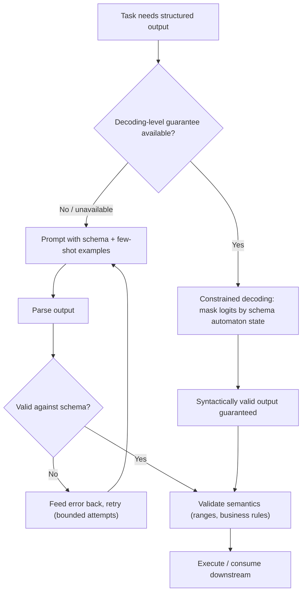

# Structured Output and Function Calling

## TL;DR

LLMs generate free-form text by default; structured output forces the generation to conform to a
schema (JSON, a tool signature, a grammar) so downstream code can parse it reliably. There are two
fundamentally different ways to get there: **constrained decoding** (mask the token distribution at
each step so only schema-valid tokens can ever be sampled — a hard guarantee) versus **prompting
plus validation-and-retry** (ask nicely, then parse and retry on failure — a soft guarantee). Tool
/ function calling is a specific application: the model outputs a structured call (name + typed
arguments) matching one of several provided schemas, which your code executes and feeds back.

## Intuition

A raw LLM predicts the next token from the full vocabulary; nothing stops it from writing invalid
JSON, hallucinating a field name, or wrapping the answer in explanatory prose you didn't ask for.
Two very different strategies fix this. One treats it as a **decoding problem**: at every step,
compute which next tokens are even grammatically legal given the schema and what's been generated
so far, and zero out the probability of everything else — the model literally cannot produce
invalid output because invalid tokens are never candidates. The other treats it as a **prompting and
recovery problem**: ask the model (with examples, a schema in the prompt, maybe a lower temperature)
to produce the right shape, validate what comes back, and if it's wrong, tell the model what broke
and ask again. The first is a guarantee; the second is a strong nudge with a safety net.

## The maths

### Constrained decoding as token masking

At generation step $t$, the model produces logits $z_t \in \mathbb{R}^{|V|}$. A grammar or JSON
schema, given the tokens generated so far, defines a set of **allowed next tokens** $A_t \subseteq V$
(computed by tracking the schema's automaton state — e.g. "we're inside a string value," "we just
opened an array," "this key requires an integer next"). Constrained decoding applies a mask before
softmax:

$$
z_{t,i}' = \begin{cases} z_{t,i} & i \in A_t \\ -\infty & i \notin A_t \end{cases}
$$

then samples/greedily picks from $\text{softmax}(z_t')$ as normal. Because $A_t$ is recomputed at
every step from the schema's current state, the output is provably schema-valid at every character
— this is why it's often implemented via a formal grammar (e.g. a context-free grammar compiled to
a pushdown automaton, or a regex/JSON-schema compiled to a finite-state machine) rather than ad hoc
string checks: the automaton's current state *is* $A_t$.

### Where the two approaches trade off

Constrained decoding guarantees **syntactic** validity (well-formed JSON matching the schema's
types and structure) but says nothing about **semantic** correctness — a constrained decoder can
still confidently emit a syntactically valid JSON object with a wrong or hallucinated value in a
field, because the mask only restricts *shape*, not *content*. Prompting-plus-validation catches
some semantic errors too (a validator can check value ranges, cross-field consistency, business
rules) but only after generation, at the cost of extra round-trips. In practice, the two are
complementary, not competing: constrained decoding for structural guarantees, validation for
semantic ones.

## Diagram



## Code

Validation-and-retry loop (the portable approach — works with any provider, even without native
constrained decoding support):

```python
import json
from pydantic import BaseModel, ValidationError

class ExtractedInvoice(BaseModel):
    vendor: str
    amount: float
    currency: str
    invoice_date: str

def extract_with_retry(llm_call, prompt, schema_model, max_retries=3):
    schema_hint = json.dumps(schema_model.model_json_schema())
    current_prompt = f"{prompt}\n\nRespond with JSON matching this schema:\n{schema_hint}"

    for attempt in range(max_retries):
        raw = llm_call(current_prompt)
        try:
            data = json.loads(raw)
            return schema_model.model_validate(data)
        except (json.JSONDecodeError, ValidationError) as e:
            current_prompt = (
                f"{prompt}\n\nYour previous response was invalid: {e}\n"
                f"Previous response: {raw}\n"
                f"Respond again with valid JSON matching this schema:\n{schema_hint}"
            )
    raise ValueError(f"Failed to get valid output after {max_retries} attempts")
```

A tool-calling schema definition (OpenAI-style function/tool spec):

```python
tools = [{
    "type": "function",
    "function": {
        "name": "get_weather",
        "description": "Get current weather for a location",
        "parameters": {
            "type": "object",
            "properties": {
                "location": {"type": "string", "description": "City name"},
                "unit": {"type": "string", "enum": ["celsius", "fahrenheit"]},
            },
            "required": ["location"],
        },
    },
}]
# The model returns a structured call: {"name": "get_weather", "arguments": {"location": "Pune"}}
# Your code executes it and appends the result as a tool-role message before the next model call.
```

## In practice

- **Use it when:** any pipeline that parses LLM output programmatically — data extraction, agent
  tool use, API responses, anything feeding a downstream system rather than a human.
- **Defaults that work:** prefer the provider's native structured-output / JSON-mode / constrained
  decoding feature when available (guarantees syntactic validity for free); fall back to
  validation-and-retry with a strict schema and 2–3 retry attempts otherwise; always validate
  semantically regardless of which method produced the syntax.
- **Breaks when:** constrained decoding is unavailable for the given model/provider (open-weight
  local serving needs a library like Outlines/guidance/llama.cpp's grammar support to get it);
  overly complex or deeply nested schemas slow down constrained decoding meaningfully (mask
  recomputation cost per token); retry loops without a cap can silently loop or blow latency/cost
  budgets on adversarial or ambiguous inputs.
- **Cost / latency:** validation-and-retry pays for failures in extra round-trips (each retry is a
  full additional generation); constrained decoding pays a small, roughly constant per-token
  overhead for mask computation but no retry cost, so it's usually cheaper and always faster in
  aggregate when available.

## Interview angle

**Q. Walk me through how constrained decoding actually enforces a JSON schema at the token level.**
The schema is compiled into an automaton that tracks generation state — what nesting level we're
at, whether we're mid-string, what type is expected next. At each decoding step, the automaton's
current state determines the set of tokens that would keep the output on a path toward a valid
schema instance; every other token gets its logit set to $-\infty$ before sampling. Because this
mask is recomputed at every single token, not just checked at the end, it's structurally impossible
for the model to ever emit a token that violates the schema — it's a decode-time constraint, not a
post-hoc filter.

**Follow-up.** Does constrained decoding guarantee the *content* is correct? → No — it only
constrains shape and type. A field typed as a string will syntactically always be a valid string,
but nothing stops the model from hallucinating a wrong value inside it; semantic correctness still
needs validation logic or grounding (see [[hallucination-and-grounding]]).

**Q. Why would you choose validation-and-retry over constrained decoding, given constrained
decoding is a stronger guarantee?**
Availability and portability — not every provider/API exposes token-level grammar constraints
(especially closed-model APIs where you don't control the decoding loop), and some schemas
(deeply recursive, or requiring cross-field semantic constraints that aren't expressible as a
grammar) aren't fully capturable by decode-time masking anyway. Validation-and-retry works
everywhere at the cost of extra latency on failure.

**Q. What are the common failure modes of function/tool calling in production agents?**
Wrong tool selected among several plausible ones; correct tool but malformed or hallucinated
argument values (e.g. inventing a parameter not in the schema, or a plausible-looking but wrong
value like an incorrect date format); calling a tool when it should have asked a clarifying
question instead; and multi-step plans where an early tool result is misinterpreted, cascading into
wrong subsequent calls. Mitigations: strict schema validation before execution, a confirmation step
for high-stakes/irreversible actions, and few-shot examples in the tool description showing correct
usage patterns.

**Follow-up.** How do you test tool-calling reliability before shipping an agent? → Build a
regression suite of representative queries with known-correct tool calls and arguments, run it on
every prompt/model change, and track exact-match and argument-level accuracy over time — treat it
like any other eval-in-CI problem (see [[llm-evaluation]]), since tool selection quality regresses
silently just like open-ended generation quality does.

## Traps

- Treating "the JSON parsed successfully" as proof the extraction is correct — parsing success only
  confirms syntax; a model can produce well-formed JSON with wrong or fabricated values.
- Building an unbounded retry loop — always cap retries and have an explicit failure path (return
  an error, escalate to a human), or a persistently ambiguous input silently burns cost and latency
  indefinitely.
- Assuming every LLM API supports true constrained decoding just because it advertises a "JSON
  mode" — some JSON modes only bias generation toward valid JSON without a hard guarantee; check
  the provider's actual documented behavior rather than assuming.
- Writing an overly permissive schema (e.g. all fields optional, loose types) to avoid validation
  failures — this defeats the purpose; a schema that accepts almost anything gives you almost no
  guarantee.
- Forgetting to validate tool call arguments before executing side effects — especially for
  irreversible actions (sending an email, making a payment, deleting data), argument validation and
  a human-in-the-loop check matter more than syntactic schema conformance alone.

## Flashcards

What's the fundamental difference between constrained decoding and validation-and-retry?::Constrained decoding masks invalid tokens before sampling, guaranteeing syntactic validity at generation time; validation-and-retry generates freely then checks and re-prompts on failure — a guarantee vs a recoverable best-effort.
Does constrained decoding guarantee semantic correctness of the output?::No — it only guarantees the output matches the schema's shape and types; content can still be wrong or hallucinated.
How is a JSON schema typically enforced at the token level during constrained decoding?::It's compiled into an automaton tracking generation state; at each step only tokens consistent with the current automaton state get nonzero probability, others are masked to -infinity.
What are two reasons you might use validation-and-retry instead of constrained decoding?::The provider/API doesn't expose token-level grammar constraints, or the schema has semantic/cross-field constraints not expressible as a pure grammar.
Name two common failure modes of function/tool calling in agents.::Selecting the wrong tool among plausible options, and hallucinating or malforming argument values for an otherwise correctly-selected tool.
Why should tool-calling reliability be tracked as a regression suite rather than checked once?::Because model/prompt changes can silently degrade tool selection or argument accuracy, the same way open-ended generation quality regresses; only continuous evaluation catches it.

## Related

[[prompt-engineering]]
[[llm-evaluation]]
[[hallucination-and-grounding]]
[[tool-calling-and-function-schemas]]
[[agent-guardrails-and-safety]]
