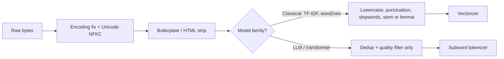

# Text Preprocessing

## TL;DR
Text preprocessing is everything you do between raw bytes and model input. In the classical
era (TF-IDF, word2vec) it was aggressive — lowercase, strip punctuation, stem, remove stopwords.
In the LLM era it is minimal — fix encoding, normalise Unicode, dedupe, strip boilerplate, and
let the tokenizer do the rest. Knowing *which regime you are in* is the actual interview answer.

## Intuition
Preprocessing is lossy compression of language. Every step throws away signal in exchange for
a smaller, denser feature space. When your model is a bag-of-words with 50k features and 10k
training rows, throwing away "the" and collapsing "running"→"run" is a good trade. When your
model is a 7B transformer that has seen a trillion tokens, casing and punctuation *are* signal —
throwing them away is pure damage.

## The maths
The only genuinely mathematical piece is the classical weighting scheme that preprocessing feeds.

For term $t$ in document $d$ within corpus $D$ of size $N = |D|$:

$$
\text{tf}(t, d) = \frac{f_{t,d}}{\sum_{t' \in d} f_{t',d}}
$$

where $f_{t,d}$ is the raw count of $t$ in $d$. The inverse document frequency is

$$
\text{idf}(t, D) = \log \frac{N}{1 + |\{d \in D : t \in d\}|}
$$

and

$$
\text{tf-idf}(t,d,D) = \text{tf}(t,d) \cdot \text{idf}(t,D).
$$

The $1+$ in the denominator is smoothing so an unseen term does not divide by zero. Note that
idf already down-weights "the" — which is *why* stopword removal is largely redundant once you
use tf-idf, a point interviewers like to probe.

Normalisation choice matters because cosine similarity between tf-idf vectors,

$$
\cos(\mathbf{u}, \mathbf{v}) = \frac{\mathbf{u}^\top \mathbf{v}}{\lVert \mathbf{u} \rVert_2 \lVert \mathbf{v} \rVert_2},
$$

is invariant to document length only after L2 normalisation. Without it, long documents dominate.

## Diagram



## Code

```python
import re
import unicodedata

def normalise(text: str) -> str:
    """Minimal, LLM-era safe normalisation. Keeps case and punctuation."""
    # 1. Unicode normalisation: collapse compatibility forms and composed chars.
    text = unicodedata.normalize("NFKC", text)
    # 2. Strip zero-width and control characters that break tokenizers.
    text = "".join(ch for ch in text if unicodedata.category(ch) != "Cf")
    # 3. Collapse runs of whitespace but preserve paragraph breaks.
    text = re.sub(r"[ \t]+", " ", text)
    text = re.sub(r"\n{3,}", "\n\n", text)
    return text.strip()


# Classical pipeline, for comparison — only correct for bag-of-words models.
from sklearn.feature_extraction.text import TfidfVectorizer

docs = [
    "The claim was settled on 12/03/2024 for Rs. 45,000.",
    "Claim settlement delayed; customer escalated to the nodal officer.",
]

vec = TfidfVectorizer(
    lowercase=True,
    stop_words="english",
    ngram_range=(1, 2),
    min_df=1,
    sublinear_tf=True,   # 1 + log(tf): damps repeated terms
    norm="l2",
)
X = vec.fit_transform(docs)
print(X.shape, vec.get_feature_names_out()[:8])
```

For a Spark-scale corpus the same normalisation belongs in the bronze→silver hop of a
[[medallion-architecture]] pipeline, as a deterministic UDF so it is reproducible.

```python
from pyspark.sql import functions as F

silver = (
    bronze
    .withColumn("text", F.regexp_replace("raw_text", r"<[^>]+>", " "))
    .withColumn("text", F.regexp_replace("text", r"\s+", " "))
    .withColumn("text", F.trim("text"))
    .filter(F.length("text") > 50)
    .dropDuplicates(["text_hash"])
)
```

## In practice
- **Use it when:** always — but calibrate aggressiveness to the model family. Classical models
  need heavy normalisation; transformer models need cleaning and deduplication, not lemmatisation.
- **Defaults that work:** NFKC normalise; strip HTML/boilerplate; fix mojibake (`ftfy`); drop
  near-duplicates with MinHash/SimHash; language-ID filter; length filter. Keep case, keep
  punctuation, keep numbers, keep emoji.
- **Breaks when:** you lowercase before an NER or a cased BERT model (destroys the strongest
  feature); you stem before an embedding model (produces out-of-vocabulary garbage); you strip
  punctuation before sentence splitting; you apply English stopword lists to Hindi or Tamil text;
  you fit the vectorizer on train+test together, which is textbook [[data-leakage]].
- **Cost / latency:** negligible per document, but at web scale dedup dominates — MinHash over
  billions of documents is a genuine distributed-systems job, not a `pandas` one.

## Interview angle

**Q. Should you remove stopwords before training a transformer?**
No. Stopwords carry syntactic and positional information that self-attention uses, and the
subword tokenizer already represents them in one or two cheap tokens. Stopword removal is an
artefact of sparse bag-of-words models where they inflated dimensionality without discriminating
between documents — and even there, idf weighting mostly handles it.

**Follow-up.** *So when does stopword removal still help?* → Keyword search and BM25 indexing,
where a stopword list shrinks the posting lists and speeds retrieval; and topic models like LDA,
where high-frequency function words otherwise dominate every topic.

**Q. Stemming vs lemmatisation — which do you pick?**
Stemming (Porter, Snowball) is a rule-based suffix chop: fast, language-specific, produces
non-words ("studies"→"studi"). Lemmatisation uses a dictionary and POS tag to return a real base
form ("better"→"good"): slower, more accurate. Pick stemming for high-recall retrieval where
speed matters, lemmatisation when the output is read by humans or fed to a lexicon. In an LLM
pipeline, pick neither.

**Q. How do you handle Indian-language or code-mixed text?**
Three specific things. First, Unicode normalisation matters more — Devanagari has multiple
encodings for the same visual glyph, so NFC/NFKC is non-optional. Second, English stopword lists
and stemmers are useless; use `indic-nlp-library` or language-specific resources. Third,
Hinglish/Romanised text will not match either language's lexicon, so lexicon-based approaches
collapse and you should go straight to subword tokenization plus a multilingual model. See
[[tokenization-bpe-and-sentencepiece]] for the token-cost consequence.

**Q. Your text classifier scores 0.97 offline and 0.61 in production. Where do you look first?**
Preprocessing skew. The offline pipeline almost certainly did something the serving path does
not — a different HTML stripper, a different Unicode form, a vectorizer fit on the full corpus.
Serialise the *entire* preprocessing chain with the model (a `sklearn` `Pipeline`, logged to
MLflow) so there is exactly one implementation. This is [[training-serving-skew]].

## Traps
- **Wrong:** "always lowercase". **Right:** lowercasing destroys casing signal for NER, cased
  encoders, and acronym disambiguation ("US" vs "us", "WHO" vs "who").
- **Wrong:** fitting `TfidfVectorizer` on the whole dataset then splitting. **Right:** fit on
  train only; `transform` on validation and test. The idf values are learned parameters.
- **Wrong:** "removing punctuation is harmless". **Right:** it destroys sentence boundaries,
  negation scope, decimal numbers, and URLs. Question marks alone are strong features for intent
  classification.
- **Wrong:** deduplicating on exact string match. **Right:** at scale, near-duplicates dominate
  — templated pages differing by one field. Use MinHash/LSH or SimHash.
- **Wrong:** treating emoji and non-Latin scripts as noise to strip. **Right:** in Indian consumer
  text they are among the most predictive features for sentiment and language ID.
- **Wrong:** applying `.strip()` and calling it normalised. **Right:** non-breaking spaces,
  zero-width joiners and soft hyphens survive `.strip()` and silently fragment tokens.

## Flashcards
Why is stopword removal unnecessary for transformers?::Self-attention uses function words for syntax and position, and subword tokenizers encode them cheaply; idf-style down-weighting is not needed because the model learns the weighting.
What does NFKC Unicode normalisation do?::Applies compatibility decomposition then canonical composition — collapses variant glyph encodings (ligatures, full-width Latin, composed Devanagari) to one canonical form.
Stemming vs lemmatisation in one line?::Stemming is a fast rule-based suffix chop producing non-words; lemmatisation is dictionary+POS based and returns a real base form.
Why does sublinear_tf help in TF-IDF?::It replaces raw tf with 1+log(tf), damping the effect of a term repeated many times in one document so length and repetition do not dominate.
Where must the vectorizer be fit to avoid leakage?::On the training split only; validation and test are transformed with the fitted idf values.
What is the single biggest preprocessing risk in production?::Train/serve skew — a different implementation of the same cleaning steps on the serving path.
Why is exact-match dedup insufficient at web scale?::Most duplication is near-duplication from templates and boilerplate; MinHash/LSH or SimHash is required.

## Related
- [[tokenization-bpe-and-sentencepiece]]
- [[word-embeddings-word2vec-glove]]
- [[data-leakage]]
- [[feature-engineering]]
- [[training-serving-skew]]
- [[document-ingestion-and-parsing]]
- [[moc-nlp-llm]]
