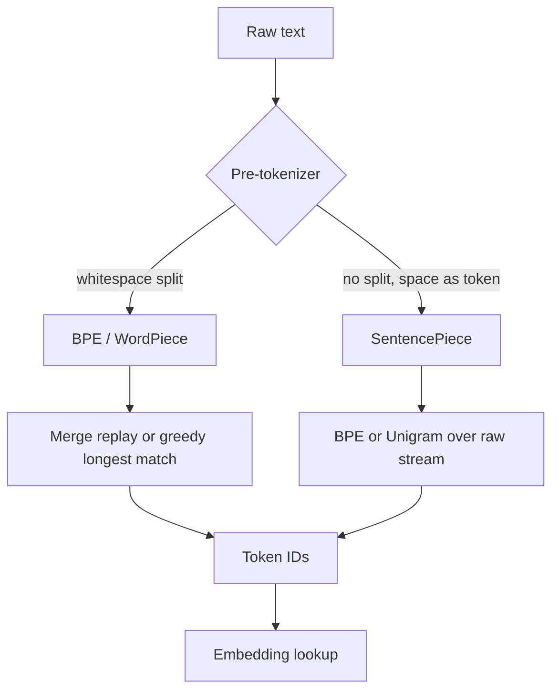

# Tokenization — BPE, WordPiece, Unigram, SentencePiece

## TL;DR
Tokenization maps text to a finite vocabulary of integer IDs. Subword algorithms (BPE,
WordPiece, Unigram) sit between characters (no OOV but long sequences) and words (short
sequences but unbounded vocabulary). BPE greedily merges the most frequent adjacent pair;
WordPiece merges the pair that most increases likelihood; Unigram prunes a large vocabulary
down by likelihood loss. Nearly every practical LLM oddity — the cost of Hindi text, failing to
count letters in "strawberry", bad arithmetic — traces back to this layer.

## Intuition
You need a dictionary small enough to fit in an embedding matrix and a softmax, but expressive
enough to spell any word that has ever been written, including tomorrow's. Subword tokenization
solves this by keeping whole tokens for frequent strings and falling back to fragments for rare
ones. Common words cost one token; a rare Sanskrit compound costs eight. The model never sees
letters — it sees these chunks, which is why letter-level reasoning is alien to it.

## The maths

**BPE** is not probabilistic. Start with a vocabulary of base symbols (characters, or bytes).
Repeatedly pick the adjacent symbol pair with maximum corpus frequency,

$$
(a^\*, b^\*) = \arg\max_{(a,b)} \; \text{count}(ab),
$$

add the merged symbol $a^\*b^\*$ to the vocabulary, and rewrite the corpus. Stop after $V - |{\rm base}|$
merges, where $V$ is the target vocabulary size. The learned artefact is an *ordered list of merges*;
encoding replays them in order.

**WordPiece** replaces frequency with a likelihood-gain criterion. Under a unigram language
model over the current vocabulary, merging $a$ and $b$ changes log-likelihood by approximately

$$
\Delta \mathcal{L} \;=\; \log \frac{p(ab)}{p(a)\,p(b)} \;\approx\; \log \frac{\text{count}(ab)\cdot N}{\text{count}(a)\cdot \text{count}(b)},
$$

i.e. pointwise mutual information. So WordPiece merges the pair that is *surprisingly* frequent,
not merely frequent — "th" is frequent but unsurprising; "tion" is both.

**Unigram** (Kudo) works top-down. Assume a unigram model where a segmentation
$\mathbf{x} = (x_1, \dots, x_M)$ of a string has probability

$$
p(\mathbf{x}) = \prod_{i=1}^{M} p(x_i), \qquad \sum_{x \in \mathcal{V}} p(x) = 1 .
$$

The best segmentation is $\mathbf{x}^\* = \arg\max_{\mathbf{x} \in S(X)} p(\mathbf{x})$, found by Viterbi
over the lattice of possible splits. Training starts from a large seed vocabulary, fits $p$ with EM,
then removes the $\eta\%$ of tokens whose removal costs least likelihood, and repeats until $|\mathcal{V}| = V$.
Because it is probabilistic, Unigram can *sample* alternative segmentations — this is subword
regularisation, a genuine data augmentation.

**Compression rate.** Define fertility $\phi$ = tokens per word (or per character). Sequence cost
scales with $\phi$, and attention cost scales with $\phi^2$ for the quadratic term. A tokenizer with
$\phi = 3$ on Hindi versus $\phi = 1.3$ on English means the same sentence costs 2.3× more to serve.

### BPE run by hand

Corpus (word → frequency), with `_` marking end-of-word:

```text
low_      : 5
lower_    : 2
newest_   : 6
widest_   : 3
```

Initial symbols: `l o w e r n s t i d _`.

Count adjacent pairs across the corpus (weighted by word frequency):

| pair | count | where |
|---|---|---|
| `e s` | 9 | newest(6) + widest(3) |
| `s t` | 9 | newest(6) + widest(3) |
| `l o` | 7 | low(5) + lower(2) |
| `o w` | 7 | low(5) + lower(2) |
| `t _` | 9 | newest(6) + widest(3) |
| `n e` | 6 | newest |
| `w e` | 8 | newest(6) + lower(2) |

**Merge 1:** tie at 9 between `e s`, `s t`, `t _`; break ties by first-seen order → merge `e s` → `es`.

```text
l o w _ (5) | l o w e r _ (2) | n e w es t _ (6) | w i d es t _ (3)
```

**Merge 2:** now `es t` has count 9 → merge → `est`.

```text
l o w _ (5) | l o w e r _ (2) | n e w est _ (6) | w i d est _ (3)
```

**Merge 3:** `est _` has count 9 → merge → `est_`.

```text
l o w _ (5) | l o w e r _ (2) | n e w est_ (6) | w i d est_ (3)
```

**Merge 4:** `l o` count 7 → `lo`. **Merge 5:** `lo w` count 7 → `low`.

```text
low _ (5) | low e r _ (2) | n e w est_ (6) | w i d est_ (3)
```

Final merge list: `(e,s), (es,t), (est,_), (l,o), (lo,w)`. Vocabulary now contains `low`, `est_`
as single tokens. Encoding `lowest_` replays merges in order and yields `low` + `est_` — two
tokens for a word never seen in training. That is the whole trick.

## Diagram



## Code

```python
from tokenizers import Tokenizer, models, trainers, pre_tokenizers, decoders

# --- Train a byte-level BPE from scratch ---
tok = Tokenizer(models.BPE(unk_token=None))
tok.pre_tokenizer = pre_tokenizers.ByteLevel(add_prefix_space=True)
tok.decoder = decoders.ByteLevel()

trainer = trainers.BpeTrainer(
    vocab_size=8000,
    special_tokens=["<pad>", "<s>", "</s>"],
    initial_alphabet=pre_tokenizers.ByteLevel.alphabet(),  # all 256 bytes -> no UNK ever
)
corpus = ["low", "lower", "newest", "widest"] * 200
tok.train_from_iterator(corpus, trainer)

print(tok.encode("lowest").tokens)

# --- Inspect fertility across scripts with a production tokenizer ---
from transformers import AutoTokenizer

hf = AutoTokenizer.from_pretrained("bert-base-multilingual-cased")
samples = {
    "english": "The insurance claim was approved yesterday.",
    "hindi":   "बीमा दावा कल स्वीकृत कर दिया गया।",
    "number":  "The total was 1234567.89 rupees.",
}
for name, s in samples.items():
    ids = hf.encode(s, add_special_tokens=False)
    print(f"{name:8s} chars={len(s):3d} tokens={len(ids):3d} "
          f"chars/token={len(s)/len(ids):.2f}")
    print("   ", hf.convert_ids_to_tokens(ids))
```

Run it and the pattern is unmistakable: English lands near 4 characters per token, Devanagari
much lower, and long numbers shatter into two- and three-digit fragments.

## In practice
- **Use it when:** always — but you rarely *train* one. You train a tokenizer only when your
  domain is far from web text (protein sequences, code with unusual syntax, a single non-Latin
  language) and you control pretraining. Fine-tuning an existing model means inheriting its
  tokenizer, full stop.
- **Defaults that work:** byte-level BPE for English/code-heavy decoder models (GPT family);
  SentencePiece Unigram for multilingual (T5, Llama-style, most Indic work); vocabulary 32k for a
  single language, 100k–256k for broad multilingual coverage.
- **Breaks when:** you extend the vocabulary without resizing and re-initialising embeddings;
  you swap tokenizers between pretraining and fine-tuning; you assume `len(text.split())`
  approximates token count for billing; you compute string offsets after tokenization without
  `return_offsets_mapping=True`.
- **Cost / latency:** tokenization itself is microseconds — the Rust `tokenizers` library does
  millions of tokens per second. The cost is *downstream*: every extra token is an extra
  forward-pass position, extra KV cache, and extra money per API call.

### The vocabulary-size tradeoff

| Larger vocabulary | Smaller vocabulary |
|---|---|
| Fewer tokens per document → shorter sequences, cheaper attention | More tokens per document → longer sequences |
| Bigger embedding matrix: $V \times d$ parameters | Smaller embedding and output layers |
| Bigger softmax → slower final projection, more memory for logits | Cheaper softmax |
| Rare tokens get few gradient updates → poorly trained embeddings | Every token is well-trained |
| Better multilingual and code coverage | Heavy fragmentation for non-dominant scripts |

Concretely, at $d = 4096$ a 32k vocabulary costs about 134M embedding parameters; a 256k
vocabulary costs about 1.05B — nearly a billion parameters spent on lookup, which for a 7B model
is a material share of the budget. That is the tradeoff stated numerically.

### Practical consequences worth memorising

**Indic and non-Latin token cost.** Tokenizers are trained on corpora dominated by English. A
Devanagari, Tamil or Bengali sentence typically fragments into far more tokens than its English
translation — commonly 2–4× more. Three business consequences: API cost per request multiplies;
effective context window shrinks by the same factor; and latency rises because generation is
per-token. For an Indian-market product serving vernacular users this is often the single largest
line item, and the fix is either a model with a tokenizer trained on Indic data or a
retrieval/summarisation layer that keeps prompts short. See [[small-language-models-and-cost]].

**Why "how many r's in strawberry" fails.** The model never sees `s,t,r,a,w,...`. It sees roughly
`str` + `aw` + `berry`. Asking it to count letters is asking it to introspect a representation it
does not have; it answers from memorised trivia rather than inspection. The reliable fix is to
make the letters explicit — spell the word out in the prompt, or give the model a tool. Same root
cause for reversing strings and counting syllables.

**Why numbers tokenise badly.** A number like `1234567` splits into arbitrary chunks whose
boundaries depend on training frequency, and those boundaries do not align with place value. So
`4999 + 1` and `5000 - 1` are represented completely differently, and carrying across a token
boundary is a learned pattern rather than an algorithm. Modern tokenizers mitigate this by forcing
digit-level or fixed three-digit grouping. Practical rule: for anything arithmetic, give the model
a calculator tool — see [[structured-output-and-function-calling]].

**Whitespace and code.** Byte-level BPE encodes a leading space as part of the token, so `" the"`
and `"the"` are different IDs. Forgetting this is the classic cause of degraded output when you
build prompts by concatenation. Python indentation also costs tokens unless the tokenizer has
learned multi-space tokens — which is why code-specialised tokenizers add them explicitly.

### The four families compared

| | BPE | WordPiece | Unigram | Byte-level BPE |
|---|---|---|---|---|
| Criterion | max pair frequency | max likelihood gain (≈ PMI) | min likelihood loss on pruning | max pair frequency over bytes |
| Direction | bottom-up merge | bottom-up merge | top-down prune | bottom-up merge |
| Segmentation | deterministic merge replay | greedy longest-match | Viterbi, can sample | deterministic |
| OOV | possible without byte fallback | `[UNK]` | byte fallback option | impossible — 256 bytes cover everything |
| Used by | GPT-2 era, many open models | BERT, DistilBERT | T5, ALBERT, many SentencePiece models | GPT-2/3/4 family, Llama-style |
| Notable | simple, fast | PMI avoids over-merging common pairs | subword regularisation | no UNK, handles emoji and any script |

**SentencePiece is not a fourth algorithm** — it is a *library* that implements BPE and Unigram
while treating input as a raw Unicode stream with no language-specific pre-tokenizer, encoding
spaces as a visible metasymbol (`▁`). That is precisely what makes it work for Chinese, Japanese
and Thai, which do not delimit words with spaces, and it makes detokenization exactly lossless.

## Interview angle

**Q. Walk me through BPE training on a small corpus.**
Give the worked example above: initialise to characters, count adjacent pairs weighted by word
frequency, merge the most frequent pair, repeat to the vocabulary budget. The output artefact is
an ordered merge list; encoding new text replays those merges in order. Emphasise that end-of-word
markers stop merges spanning word boundaries, and that frequent whole words end up as single
tokens while rare ones decompose.

**Follow-up.** *How does WordPiece differ?* → Same bottom-up structure but the merge score is
$\log \frac{p(ab)}{p(a)p(b)}$ instead of raw count — it merges the surprisingly-frequent pair. And
at encode time WordPiece does greedy longest-match against the vocabulary rather than replaying
merges, which is why its subword continuations are marked `##`.

**Q. Why is byte-level BPE popular for modern LLMs?**
The base alphabet is all 256 byte values, so every possible input is representable and `[UNK]`
cannot occur — emoji, Devanagari, Cyrillic, corrupted bytes, all encode. You pay for it in
fertility on non-Latin scripts, since an unseen Devanagari character costs three byte-tokens
rather than one.

**Q. How would you reduce the token cost of Hindi text for a product serving Indian users?**
Measure first — compute characters-per-token on a real sample against candidate tokenizers, since
the difference between an English-centric and an Indic-aware tokenizer can be 2–3×. Then choose
in this order: (1) pick a base model whose tokenizer was trained with substantial Indic data;
(2) if you control pretraining or are doing continued pretraining, extend the vocabulary with
Indic tokens and resize the embedding matrix, initialising new rows as the mean of their subword
constituents; (3) architecturally, keep prompts short with retrieval and compression rather than
stuffing context. Never "translate to English and back" silently — it loses names, code-mixing and
register, and adds a hop of latency and error.

**Follow-up.** *What breaks when you extend a vocabulary?* → New embedding rows are untrained.
You must resize both the input embedding and the tied output head, initialise new rows sensibly
(mean of the old subword pieces beats random), and then do continued pretraining on in-domain
text — otherwise the new tokens emit noise. See [[llm-pretraining]].

**Q. Why can't the model count letters or do long multiplication reliably?**
Both are tokenization artefacts. It sees subword chunks, not characters, so character-level
operations require recalling facts about words rather than inspecting them. Numbers fragment on
boundaries that ignore place value, so arithmetic must be pattern-matched rather than computed.
Fix with tools, not prompting — and note that chain-of-thought helps arithmetic somewhat because
it forces digit-by-digit intermediate steps back into the token stream.

**Q. You fine-tuned a model and quality collapsed. Tokenizer-related causes?**
Mismatched tokenizer version between the base checkpoint and your training code; added special
tokens without resizing embeddings; a chat template applied at training but not at inference (or
vice versa), so the model never sees the role markers it was trained on; and truncation silently
cutting the label off the end of long examples.

## Traps
- **Wrong:** "vocabulary size doesn't matter much." **Right:** it is a direct tradeoff between
  sequence length and embedding/softmax parameters, and it decides your multilingual token cost.
- **Wrong:** "SentencePiece is an algorithm." **Right:** it is a library implementing BPE and
  Unigram with raw-stream, language-agnostic input handling.
- **Wrong:** estimating cost with word count. **Right:** English averages roughly 3–4 characters
  per token; other scripts are far worse. Always count with the actual tokenizer.
- **Wrong:** assuming `"the"` and `" the"` are the same token. **Right:** in byte-level BPE they
  are distinct IDs, which is why sloppy prompt concatenation degrades output.
- **Wrong:** adding domain tokens to shrink sequences and expecting an immediate win. **Right:**
  new embeddings are random until you train them; without continued pretraining the model gets worse.
- **Wrong:** tokenizing before deduplication or language filtering. **Right:** clean at the text
  level; tokenization is the last step before the model.
- **Wrong:** using a tokenizer's `[UNK]` rate as a quality metric for byte-level BPE. **Right:**
  it is structurally zero there; use fertility (tokens per word) instead.

## Flashcards
What does BPE merge at each step?::The most frequent adjacent symbol pair in the corpus; the learned artefact is an ordered merge list replayed at encode time.
What criterion does WordPiece use instead of frequency?::Likelihood gain, approximately pointwise mutual information log p(ab)/(p(a)p(b)) — it merges surprisingly frequent pairs.
How is Unigram tokenization trained?::Top-down — start from a large seed vocabulary, fit unigram probabilities with EM, prune the tokens whose removal costs least likelihood, repeat to target size.
What is SentencePiece?::A library (not an algorithm) implementing BPE and Unigram over a raw Unicode stream with no pre-tokenizer, encoding spaces as ▁ so detokenization is lossless.
Why can byte-level BPE never produce UNK?::Its base alphabet is all 256 byte values, so any byte sequence is representable.
Name the vocabulary-size tradeoff.::Larger vocab → shorter sequences but a bigger embedding matrix and softmax and undertrained rare tokens; smaller vocab → cheaper parameters but longer sequences.
Why does an LLM fail to count letters in a word?::It never observes characters — only subword tokens — so character-level questions are answered from memory rather than inspection.
Why do LLMs handle long numbers badly?::Digits fragment into chunks whose boundaries ignore place value, so carrying must be pattern-matched rather than computed.
What must you do after adding tokens to a vocabulary?::Resize input embeddings and the tied output head, initialise new rows sensibly, and run continued pretraining so they are not noise.
What is fertility?::Tokens per word (or per character) for a given tokenizer and language — the number that drives sequence cost.

## Related
- [[text-preprocessing]]
- [[word-embeddings-word2vec-glove]]
- [[embeddings]]
- [[llm-pretraining]]
- [[context-window-and-positional-encoding]]
- [[small-language-models-and-cost]]
- [[structured-output-and-function-calling]]
- [[moc-nlp-llm]]
