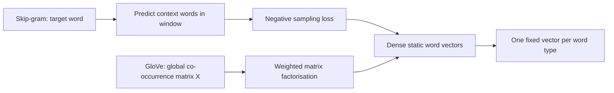

# Word Embeddings — Word2Vec & GloVe

## TL;DR
Word2Vec (skip-gram / CBOW) learns dense word vectors by predicting context words from a target word
(or vice versa), trained cheaply via negative sampling instead of a full softmax over the vocabulary.
GloVe instead factorises the global word-word co-occurrence matrix directly. Both give one fixed
vector per word type — which is exactly why contextual embeddings from BERT/GPT superseded them: a
static vector cannot represent "bank" (river) vs "bank" (finance) differently.

## Intuition
"You shall know a word by the company it keeps" (Firth, 1957). If two words tend to appear in
similar contexts across a huge corpus, they probably mean similar things — so squeeze each word into
a low-dimensional vector such that vectors of words with similar contexts end up close together.
Word2Vec learns this by playing a local prediction game millions of times; GloVe learns it by
crunching global co-occurrence counts once.

## The maths

### Skip-gram objective
Given a corpus of words $w_1, \dots, w_T$, skip-gram maximises the average log probability of
context words $w_{t+j}$ within a window of size $m$ around each target word $w_t$:

$$
J(\theta) = \frac{1}{T}\sum_{t=1}^{T} \sum_{-m \le j \le m,\, j \ne 0} \log p(w_{t+j} \mid w_t)
$$

Each word $w$ has two vectors: $v_w$ (as a target/"centre" word) and $u_w$ (as a context word). The
naive softmax is

$$
p(w_{t+j} \mid w_t) = \frac{\exp(u_{w_{t+j}}^\top v_{w_t})}{\sum_{k=1}^{|V|} \exp(u_k^\top v_{w_t})}
$$

The denominator sums over the whole vocabulary ($|V|$ can be $10^5$–$10^6$) for **every** training
pair — computationally infeasible at scale.

### Negative sampling
Replace the full softmax with a binary classification problem: for a true (target, context) pair
$(w, c)$, sample $k$ "negative" words $w_i \sim P_n(w)$ that did **not** co-occur, and train a
logistic classifier to distinguish real pairs from noise:

$$
J_{\text{neg}}(\theta) = \log \sigma(u_c^\top v_w) + \sum_{i=1}^{k} \mathbb{E}_{w_i \sim P_n(w)}\left[\log \sigma(-u_{w_i}^\top v_w)\right]
$$

This turns an $O(|V|)$ operation into $O(k)$, $k$ typically 5–20 for small corpora and 2–5 for large
ones. The noise distribution $P_n(w) \propto \text{freq}(w)^{3/4}$ — the $3/4$ power under-samples
very frequent words (like "the") relative to their raw frequency, so rare words get sampled as
negatives often enough to be useful.

### CBOW
CBOW flips the direction: predict the centre word from the (averaged) context vectors. It trains
faster and smooths over more context, but skip-gram tends to do better on rare words because every
context word gets its own training signal rather than being averaged away.

### GloVe: global co-occurrence factorisation
Build a co-occurrence matrix $X$ where $X_{ij}$ is how often word $j$ appears in the context of word
$i$ across the whole corpus. GloVe fits word vectors $w_i, \tilde w_j$ and biases $b_i, \tilde b_j$
so that their dot product approximates the **log** of the co-occurrence count:

$$
J = \sum_{i,j=1}^{|V|} f(X_{ij}) \left( w_i^\top \tilde w_j + b_i + \tilde b_j - \log X_{ij} \right)^2
$$

$f(X_{ij})$ is a weighting function that caps the influence of very frequent pairs (so "the" co-occurring
with everything doesn't dominate the loss) and gives zero weight to unobserved pairs ($\log 0$ is
undefined). GloVe is trained once over global counts (a form of weighted matrix factorisation,
related to a weighted low-rank SVD of the log co-occurrence matrix), whereas Word2Vec is trained
online over local context windows — the two turn out to be closely related in what they optimise,
which is why their vector spaces end up with similar geometric properties (e.g. the classic
`king - man + woman ≈ queen` analogy works in both).

## Diagram


## Code
```python
from gensim.models import Word2Vec

sentences = [
    ["the", "bank", "raised", "interest", "rates"],
    ["the", "boat", "docked", "at", "the", "river", "bank"],
]

model = Word2Vec(
    sentences,
    vector_size=100,   # embedding dimension
    window=5,          # context window size
    min_count=1,       # ignore rare words below this count
    sg=1,              # 1 = skip-gram, 0 = CBOW
    negative=10,       # number of negative samples per positive pair
    epochs=20,
)

# "bank" gets exactly one vector, regardless of the sentence it came from
vec = model.wv["bank"]
print(model.wv.most_similar("bank", topn=3))
```

## In practice
- **Use it when:** you need a lightweight, CPU-trainable embedding for a small/medium corpus with no
  GPU budget, or as a baseline/feature for a classical-ML model (e.g. averaged word vectors as
  features for XGBoost on a small text classification task).
- **Defaults that work:** skip-gram + negative sampling (5–10 negatives), 100–300 dimensions,
  window 5–10, subsampling frequent words.
- **Breaks when:** the word is polysemous (context-dependent meaning), out-of-vocabulary at
  inference time (no subword fallback unless you use fastText), or the task needs sentence/document-level
  semantics rather than word-level.
- **Cost / latency:** negligible — training on a few GB of text takes minutes on CPU; inference is a
  dictionary lookup.

## Interview angle

**Q. Why does Word2Vec use negative sampling instead of the full softmax?**
Because computing and normalising over the entire vocabulary for every training pair is
$O(|V|)$ per step, infeasible for vocabularies of $10^5$+ words trained on billions of tokens.
Negative sampling reframes it as $k+1$ binary classifications, making each update $O(k)$.

**Follow-up.** Why raise the unigram frequency to the $3/4$ power for the noise distribution? →
Sampling negatives proportional to raw frequency oversamples extremely common words ("the", "a") and
wastes gradient signal; the $3/4$ power flattens the distribution, giving rarer words a fairer
chance of being sampled as informative negatives, which empirically improves vector quality.

**Q. What's the practical difference between skip-gram and CBOW?**
Skip-gram predicts context from target (one example per context word, better for rare words and
small data); CBOW predicts target from averaged context (faster, smooths noise, slightly better on
frequent words with larger data).

**Q. How does GloVe differ conceptually from Word2Vec?**
Word2Vec is a local, online, predictive model over context windows; GloVe is a global, count-based
model that directly factorises the co-occurrence matrix. In practice they produce similar-quality
vectors and similar analogical structure.

**Q. Why did static embeddings get replaced by contextual embeddings (BERT/ELMo/GPT)?**
Because a single vector per word type cannot disambiguate meaning by context — "bank" (river) and
"bank" (finance) get the same vector. Contextual models produce a different vector for the same
token depending on the surrounding sentence, computed on the fly via the transformer's self-attention,
which captures polysemy, syntax and long-range dependency that static embeddings structurally cannot.

**Follow-up.** Are static embeddings dead in industry? → Not entirely — they're still used for
extremely low-latency retrieval components, as cheap features in tabular pipelines, and as the
`nn.Embedding` **initialisation** inside larger neural nets, but as a standalone semantic
representation they've been superseded almost everywhere contextual models are affordable.

**Q. Why does `king - man + woman ≈ queen` work?**
Because the training objective (predicting co-occurring words) pushes words that share
distributional roles into consistent linear relationships in the embedding space — the direction
"man → woman" ends up roughly encoding a gender relationship that transfers additively across
analogous pairs. It is an emergent property of the optimisation, not something explicitly designed in.

## Traps
- Saying Word2Vec "uses a neural network" without being able to explain that it's a shallow
  log-bilinear model (one linear projection in, one out) — not a deep network.
- Claiming GloVe uses neural networks at all — it's pure matrix factorisation with a weighted
  least-squares objective, no forward/backward pass through nonlinearities.
- Forgetting that Word2Vec produces **two** vector spaces (target and context) and that most
  implementations use only the target vectors as the final embedding.
- Confusing "contextual" with "just a bigger embedding" — the key difference is that the vector for
  a token changes based on the sentence it's in, computed at inference time, not looked up from a
  static table.

## Flashcards
Skip-gram predicts::context words from a target word
CBOW predicts::a target word from averaged context words
Negative sampling turns softmax into::binary classification against sampled negative words
Noise distribution exponent in negative sampling::unigram frequency raised to the 3/4 power
GloVe's training signal::log of global word-word co-occurrence counts
Why static embeddings can't handle polysemy::one fixed vector per word type regardless of context
What GloVe's weighting function f(X_ij) prevents::very frequent pairs dominating the loss
Core reason contextual embeddings replaced static ones::vector for a token depends on surrounding context, computed at inference time

## Related
[[embeddings]]
[[tokenization-bpe-and-sentencepiece]]
[[bert-and-encoder-models]]
[[attention-mechanism]]
[[language-modeling-objectives]]
