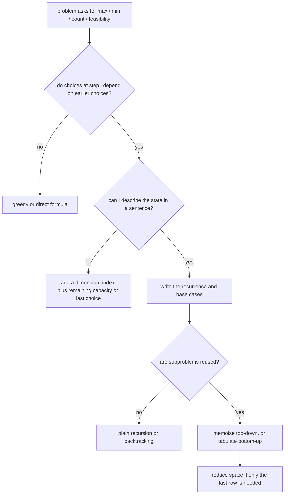

# Dynamic Programming Patterns

## TL;DR
DP applies when a problem has **optimal substructure** (the answer is built from answers to smaller
versions) and **overlapping subproblems** (the same smaller version is needed many times). The
method is always the same four steps: define the state, write the recurrence, fix the base cases,
choose an evaluation order. For DS/MLE interviews in India you need the six or seven classic
patterns below at LeetCode-medium level — not competitive-programming DP.

## Intuition
Plain recursion on Fibonacci recomputes `fib(3)` an exponential number of times. DP is recursion
with a notebook: solve each distinct subproblem once, write the answer down, look it up thereafter.
Top-down (memoisation) keeps the recursive shape and caches; bottom-up (tabulation) fills a table in
dependency order. They compute the same thing; the choice is about stack depth and how easy the
order is to see.

The hardest part is never the code — it is **naming the state**. If you can finish the sentence
"`dp[i]` is the best value considering the first `i` items, given ...", the rest follows.

## The maths
**Complexity rule.** DP cost is

$$
\text{time} = (\text{number of states}) \times (\text{work per state}), \qquad
\text{space} = (\text{states you must keep alive})
$$

So 1-D DP over $n$ with $O(1)$ transitions is $\Theta(n)$; 2-D DP over $n \times m$ with $O(1)$
transitions is $\Theta(nm)$; knapsack over $n$ items and capacity $W$ is $\Theta(nW)$.

That last one is **pseudo-polynomial**: $W$ is a value, not an input length. Writing $W$ takes
$\log_2 W$ bits, so $\Theta(nW)$ is exponential in the input *size*. Saying this out loud is a
strong signal in an interview.

**Fibonacci as the canonical example.** Naive recursion satisfies
$T(n) = T(n-1) + T(n-2) + \Theta(1)$, which grows like $\varphi^n$ with
$\varphi = \frac{1+\sqrt5}{2} \approx 1.618$ — exponential. Memoisation makes each of the $n$ states
cost $\Theta(1)$, giving $\Theta(n)$.

**Space reduction.** If `dp[i]` depends only on `dp[i-1]` (and maybe `dp[i-2]`), you keep $O(1)$
rows instead of $O(n)$; if `dp[i][j]` depends only on row `i-1`, you keep two rows, $O(m)$ instead
of $O(nm)$. The answer value is unchanged; only reconstruction of the actual solution is lost.

## Diagram



## Code

**Pattern 1 — linear DP on a sequence.** State `dp[i]` = answer for prefix ending at `i`.
Time $\Theta(n)$, space $\Theta(1)$ after reduction.

```python
def climb_stairs(n):                 # count of ways; Fibonacci in disguise
    a, b = 1, 1                      # dp[0], dp[1]
    for _ in range(n - 1):
        a, b = b, a + b
    return b

def house_robber(nums):              # max sum, no two adjacent
    take, skip = 0, 0
    for x in nums:
        take, skip = skip + x, max(skip, take)
    return max(take, skip)

def max_subarray(nums):              # Kadane: dp[i] = max(a[i], dp[i-1]+a[i])
    best = cur = nums[0]
    for x in nums[1:]:
        cur = max(x, cur + x)
        best = max(best, cur)
    return best
```

**Pattern 2 — 0/1 knapsack.** State `dp[c]` = best value with capacity `c`.
Time $\Theta(nW)$, space $\Theta(W)$.

```python
def knapsack(weights, values, W):
    dp = [0] * (W + 1)
    for w, v in zip(weights, values):
        for c in range(W, w - 1, -1):    # DESCENDING: each item used at most once
            dp[c] = max(dp[c], dp[c - w] + v)
    return dp[W]

def coin_change(coins, amount):          # unbounded: minimum coins
    INF = float("inf")
    dp = [0] + [INF] * amount
    for c in coins:
        for a in range(c, amount + 1):   # ASCENDING: item may be reused
            dp[a] = min(dp[a], dp[a - c] + 1)
    return -1 if dp[amount] == INF else dp[amount]
```

The loop direction *is* the difference between 0/1 and unbounded. Interviewers ask exactly this.

**Pattern 3 — two-sequence DP (edit distance / LCS family).**
Time $\Theta(nm)$, space $\Theta(\min(n,m))$ after reduction.

```python
def edit_distance(a, b):
    n, m = len(a), len(b)
    prev = list(range(m + 1))                 # dp[0][j] = j deletions
    for i in range(1, n + 1):
        cur = [i] + [0] * m
        for j in range(1, m + 1):
            if a[i - 1] == b[j - 1]:
                cur[j] = prev[j - 1]          # match: free
            else:
                cur[j] = 1 + min(prev[j],     # delete from a
                                 cur[j - 1],  # insert into a
                                 prev[j - 1]) # substitute
        prev = cur
    return prev[m]

def lcs_length(a, b):
    prev = [0] * (len(b) + 1)
    for x in a:
        cur = [0] * (len(b) + 1)
        for j, y in enumerate(b, 1):
            cur[j] = prev[j - 1] + 1 if x == y else max(prev[j], cur[j - 1])
        prev = cur
    return prev[-1]
```

**Pattern 4 — grid DP.** Time $\Theta(RC)$, space $\Theta(C)$.

```python
def min_path_sum(grid):
    R, C = len(grid), len(grid[0])
    dp = [float("inf")] * C
    dp[0] = 0
    for r in range(R):
        for c in range(C):
            dp[c] = grid[r][c] + (dp[c] if c == 0 else min(dp[c], dp[c - 1]))
    return dp[-1]
```

**Pattern 5 — DP with binary search (LIS).** Time $\Theta(n\log n)$, space $\Theta(n)$.

```python
from bisect import bisect_left

def length_of_lis(nums):
    tails = []                     # tails[k] = smallest tail of an increasing run of length k+1
    for x in nums:
        i = bisect_left(tails, x)  # strictly increasing; use bisect_right for non-decreasing
        if i == len(tails):
            tails.append(x)
        else:
            tails[i] = x
    return len(tails)
```

**Pattern 6 — memoised top-down, when the order is hard to see.**

```python
from functools import lru_cache

def word_break(s, words):
    vocab = set(words)
    @lru_cache(maxsize=None)
    def can(i):                            # state: can s[i:] be segmented?
        if i == len(s):
            return True
        return any(s[i:j] in vocab and can(j) for j in range(i + 1, len(s) + 1))
    return can(0)                          # O(n^2) states*work, O(n) memo entries
```

## In practice
- **Use it when:** the problem asks for a maximum, minimum, count of ways, or feasibility over a
  sequence of dependent choices, and greedy gives a counterexample. Greedy failing is the signal that
  you need DP.
- **Defaults that work:** start top-down with `lru_cache` — it is the fastest route from a correct
  recursion to a correct DP, and you can convert to bottom-up afterwards if asked. Define the state
  in one English sentence before writing code. Draw the table for a 3-element example by hand.
- **Breaks when:** the state space is too large (knapsack with $W = 10^9$ needs a different
  formulation); the problem has no optimal substructure (longest *simple* path in a general graph is
  NP-hard — a longer prefix can block a better suffix); the recursion depth exceeds Python's limit
  (convert to bottom-up).
- **Cost / latency:** DP is rarely the bottleneck in production ML, but its cousins are everywhere:
  Viterbi decoding in sequence models, dynamic time warping for time series alignment, beam search
  bookkeeping, and the sequence-alignment logic behind diff-based evaluation.

## Interview angle

**Q. How do you recognise a DP problem?**
Three signals together: the answer is an optimum or a count; the choice at each step constrains
later steps; and a naive recursion revisits the same subproblem. I test the third by sketching the
recursion tree for a small input — if I see repeated arguments, memoisation applies. If greedy seems
plausible I try to construct a counterexample first, because if greedy works it is simpler and
faster.

**Follow-up.** *Give me a case where greedy fails and DP is needed.* → Coin change with coins
`[1, 3, 4]` and amount 6: greedy takes 4 then 1 then 1 for three coins; the optimum is 3 + 3, two
coins. Greedy is correct for canonical currency systems, which is why people are surprised.

**Q. Top-down or bottom-up?**
Same complexity. Top-down only computes the states actually reachable, is easier to write from a
correct recursion, and is natural when the state space is sparse; it costs stack depth and function
call overhead. Bottom-up has no recursion limit, better constants and locality, and makes space
reduction obvious, but requires you to know the evaluation order. In an interview I usually write
top-down, get it correct, then say "the bottom-up version is this table filled in this order" — and
convert if there is time.

**Q. Walk me through 0/1 knapsack and then make it space-efficient.**
State: `dp[i][c]` = best value using the first `i` items with capacity `c`. Recurrence:
`dp[i][c] = max(dp[i-1][c], dp[i-1][c - w_i] + v_i)` when `c >= w_i`. Base: `dp[0][*] = 0`. Since row
`i` depends only on row `i-1`, I collapse to a single array and iterate capacity **descending**, so
each item is consumed at most once. Time $\Theta(nW)$, space $\Theta(W)$. I'd add that this is
pseudo-polynomial — exponential in the number of bits of $W$ — so it is not a polynomial algorithm
for the subset-sum problem.

**Q. Edit distance — write it and state the complexity.**
Three operations, each costing 1; `dp[i][j]` is the distance between the first `i` characters of `a`
and the first `j` of `b`. On a match the cost is `dp[i-1][j-1]`; otherwise `1 + min` of delete,
insert, substitute. $\Theta(nm)$ time, $\Theta(\min(n,m))$ space with the rolling-row trick. I'd
mention it is the same algorithm as Levenshtein-based fuzzy matching, which I've used for entity
resolution — that connects it to real work.

**Q. Longest increasing subsequence in better than $O(n^2)$?**
Yes — maintain `tails`, where `tails[k]` is the smallest possible tail value of an increasing
subsequence of length `k+1`. This array is sorted, so each element is placed with a binary search:
$\Theta(n \log n)$. Note the array is *not* an actual LIS; to reconstruct one you store predecessor
indices alongside.

## Traps
- **Wrong loop direction in knapsack.** Ascending capacity turns 0/1 into unbounded, silently giving
  a larger answer. Descending for 0/1, ascending for unbounded.
- **State that is not a sufficient summary.** If `dp[i]` needs to know something about earlier
  choices that it does not store, the recurrence is wrong. Add the dimension.
- **Missing base cases.** `dp[0] = 0` versus `dp[0] = 1` is the difference between "count of ways"
  and "minimum cost"; get it wrong and everything downstream is off by a constant.
- **Mutable default or shared memo across test cases.** An `lru_cache` on a closure that captures
  outer state gives stale answers on the second call.
- **Claiming knapsack is polynomial.** It is pseudo-polynomial.
- **Reducing space, then being asked to reconstruct the solution.** The rolling array discards the
  path. Say up front: "I can recover the value in $O(W)$ space; reconstructing the chosen items
  needs the full table or a divide-and-conquer trace."
- **Applying DP to longest simple path.** No optimal substructure in a general graph — it is NP-hard.
  It *is* DP-able on a DAG.
- **Using `lru_cache` on unhashable arguments.** Lists must be converted to tuples first.

## Flashcards
Two conditions for DP to apply?::Optimal substructure (answers build from smaller answers) and overlapping subproblems (the same smaller answer is needed repeatedly).
DP complexity rule?::Time = number of states x work per state; space = states that must stay alive.
Loop direction for 0/1 vs unbounded knapsack?::0/1 iterates capacity descending; unbounded iterates ascending.
Why is knapsack pseudo-polynomial?::Its $\Theta(nW)$ cost is linear in the value $W$ but exponential in the $\log_2 W$ bits used to write it.
Edit distance recurrence?::Match: `dp[i-1][j-1]`; otherwise `1 + min(dp[i-1][j], dp[i][j-1], dp[i-1][j-1])` for delete, insert, substitute.
LIS in $O(n\log n)$ — what does the `tails` array hold?::`tails[k]` is the smallest tail value among increasing subsequences of length `k+1`; it is sorted, so binary search places each element.
Coin change counterexample to greedy?::Coins `[1,3,4]`, amount 6: greedy gives 4+1+1 = 3 coins, optimum is 3+3 = 2 coins.
When does space reduction from $O(nm)$ to $O(m)$ cost you something?::You lose the ability to reconstruct the actual optimal solution, only the optimal value.

## Related
- [[big-o-and-complexity]]
- [[arrays-and-strings-patterns]]
- [[trees-and-graphs-basics]]
- [[hashing-and-dictionaries]]
- [[coding-interview-strategy]]
- [[drill-python-coding]]
- [[moc-programming]]
