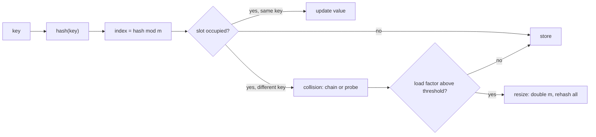

# Hashing and Dictionaries

## TL;DR
A hash table turns "search for this" into "compute an index and look". That gives $O(1)$ average
lookup, $O(n)$ worst case, at $O(n)$ memory. It is the single most useful data structure in coding
interviews — counting, deduplication, grouping, memoisation, two-sum-style pairing, and prefix-sum
tricks are all one dict. In ML it reappears as feature hashing, hash joins, sharding and dedup.

## Intuition
Imagine a shelf with $m$ slots. A hash function tells you which slot an item belongs in, computed
directly from the item — no searching. Collisions (two items, one slot) are handled by keeping a
small list per slot or by probing to the next free slot. As long as the load factor stays low and the
hash spreads keys evenly, each slot holds ~1 item, so lookup is a constant number of steps.

## The maths
**Load factor and expected probe length.** With $n$ keys in $m$ slots, define $\alpha = n/m$. Under
simple uniform hashing with chaining, the expected chain length is $\alpha$, so expected search cost
is

$$
\Theta(1 + \alpha)
$$

Keeping $\alpha$ bounded by resizing (CPython resizes when the table is about two-thirds full) makes
this $\Theta(1)$. With open addressing and linear probing the expected probes for an unsuccessful
search grow like

$$
\frac{1}{2}\left(1 + \frac{1}{(1-\alpha)^2}\right)
$$

which explodes as $\alpha \to 1$ — the reason open-addressed tables must be resized well before full.

**Amortised resize.** Doubling capacity and rehashing costs $\Theta(n)$ but happens after $\Theta(n)$
insertions, so insertion is $\Theta(1)$ amortised — the same telescoping argument as dynamic arrays.

**Birthday bound (why collisions come sooner than you think).** With a hash of $b$ bits, the
probability of at least one collision among $n$ items is approximately

$$
1 - \exp\!\left(-\frac{n^2}{2^{b+1}}\right)
$$

so a 32-bit hash collides with probability ~50% at around $2^{16} = 65{,}536$ items. This is why a
32-bit hash is fine for bucketing and wrong for deduplication identity at scale — use 64-bit or a
cryptographic digest.

**Feature hashing collision rate.** Hashing $d$ distinct features into $m$ buckets gives an expected
number of colliding pairs of $\binom{d}{2}/m$; the practical rule is choose $m \gg d$ (often
$m = 2^{18}$ or more) so that collisions are rare and their effect on a linear model averages out.

## Diagram



## Code

```python
from collections import Counter, defaultdict, OrderedDict

# --- counting and top-k
words = "the cat sat on the mat the end".split()
c = Counter(words)
print(c.most_common(2))              # [('the', 3), ...]  -> O(n + k log n)

# --- grouping without checking membership
groups = defaultdict(list)
for w in words:
    groups[len(w)].append(w)         # no `if key not in d` boilerplate

# --- set for membership: O(1) average instead of O(n) list scan
allowed = {"web", "app", "partner"}
assert "app" in allowed

# --- memoisation, i.e. a dict keyed by arguments
from functools import lru_cache
@lru_cache(maxsize=None)
def fib(n): return n if n < 2 else fib(n - 1) + fib(n - 2)
```

Custom hashable keys — the thing people get wrong:

```python
class Point:
    __slots__ = ("x", "y")
    def __init__(self, x, y): self.x, self.y = x, y
    def __eq__(self, other):
        return isinstance(other, Point) and (self.x, self.y) == (other.x, other.y)
    def __hash__(self):
        return hash((self.x, self.y))     # MUST be consistent with __eq__
```

Rule: if `a == b` then `hash(a) == hash(b)`. Break it and dict lookups silently miss. Mutating a key
after insertion breaks it too — which is why keys should be immutable.

Implementing a hash map from scratch (chaining) — a common "show me you understand it" ask:

```python
class HashMap:
    def __init__(self, capacity=8):
        self._buckets = [[] for _ in range(capacity)]
        self._size = 0

    def _idx(self, key):
        return hash(key) % len(self._buckets)

    def put(self, key, value):
        b = self._buckets[self._idx(key)]
        for i, (k, _) in enumerate(b):
            if k == key:
                b[i] = (key, value)          # update in place
                return
        b.append((key, value))
        self._size += 1
        if self._size > 0.66 * len(self._buckets):
            self._resize()

    def get(self, key, default=None):
        for k, v in self._buckets[self._idx(key)]:
            if k == key:
                return v
        return default

    def _resize(self):
        old = self._buckets
        self._buckets = [[] for _ in range(len(old) * 2)]
        self._size = 0
        for b in old:
            for k, v in b:
                self.put(k, v)
```

LRU cache in $O(1)$ — dict plus doubly linked list, or `OrderedDict`:

```python
class LRUCache:
    def __init__(self, capacity: int):
        self.cap = capacity
        self.d = OrderedDict()

    def get(self, key):
        if key not in self.d:
            return -1
        self.d.move_to_end(key)              # O(1)
        return self.d[key]

    def put(self, key, value):
        if key in self.d:
            self.d.move_to_end(key)
        self.d[key] = value
        if len(self.d) > self.cap:
            self.d.popitem(last=False)       # evict least recently used
```

## In practice
- **Use it when:** you need counting, grouping, deduplication, membership, memoisation, or a
  "have I seen this before" check inside a loop. Any time you catch yourself writing a nested loop
  where the inner loop searches, a dict is the fix.
- **Defaults that work:** `Counter` for frequencies, `defaultdict(list)` for grouping,
  `set` for membership, `dict` for everything else. Python dicts preserve insertion order (guaranteed
  since 3.7), which is handy but should not be relied on as *sorted* order. For a bounded cache use
  `lru_cache` or `OrderedDict`.
- **Breaks when:** keys are unhashable (lists, dicts, sets, or tuples containing them); keys are
  mutated after insertion; memory matters and $n$ is huge — a Python dict has substantial per-entry
  overhead, so tens of millions of keys belong in a database, a Bloom filter, or a Spark join, not a
  dict in a driver process; hash randomisation means iteration order across *sets of strings* is not
  reproducible across processes unless `PYTHONHASHSEED` is fixed.
- **Cost / latency:** lookup $O(1)$ average; insertion $O(1)$ amortised; iteration $O(n)$. In Spark,
  the distributed analogue is the hash join and `groupBy`, and the cost model shifts entirely to
  shuffle volume and skew — the same "skewed key" problem that makes a hash table degenerate makes a
  Spark stage hang.

## Interview angle

**Q. How does a hash table give $O(1)$ lookup, and when does it not?**
The hash function maps a key to a bucket index directly, so lookup does not search. It is $O(1)$ on
average given a good hash and bounded load factor; it degrades to $O(n)$ when all keys collide —
either from a bad hash function or, historically, from an adversary crafting colliding keys, which
is why Python randomises string hashing per process. Resizing keeps the load factor bounded, costing
$O(n)$ occasionally but $O(1)$ amortised.

**Follow-up.** *What does Python use — chaining or open addressing?* → CPython uses open addressing
with a compact, insertion-ordered layout. The important takeaway for the interview is the trade:
open addressing has better cache locality, chaining tolerates high load factors better.

**Q. Why must `__hash__` and `__eq__` agree?**
Lookup first finds the bucket by hash, then compares with `==` within it. If two equal objects hash
differently they land in different buckets and the dict reports the key as absent. If you define
`__eq__` without `__hash__`, Python sets `__hash__ = None` to stop you making exactly that bug — the
class becomes unhashable. The corollary is that keys must be immutable: mutating a key after
insertion moves its logical bucket without moving the entry.

**Q. Design a data structure with $O(1)$ insert, delete and get-random.**
A dict from value to index, plus a list of values. Insert appends to the list and records the index.
Delete swaps the target with the last element, updates that element's index in the dict, then pops —
$O(1)$ because we never shift. Get-random is `random.choice(list)`. The trick is the swap-with-last;
candidates who try to delete from the middle of the list end up at $O(n)$.

**Q. You need to deduplicate 5 billion records. Is a Python set the answer?**
No — it would not fit, and it would be a single-node bottleneck. Options in order: do it in the
engine (`DISTINCT` / `dropDuplicates` in Spark, which is a shuffle-based hash aggregate); use a
64-bit or 128-bit hash of the record as a surrogate key to cut memory, accepting a collision
probability governed by the birthday bound; or use a Bloom filter if approximate membership with
no false negatives is acceptable, at a fraction of the memory. I'd also ask whether "duplicate"
means byte-identical or business-key-identical, because that changes everything.

**Q. What is feature hashing and why use it?**
Map raw feature strings through a hash into a fixed number of buckets $m$, so you never build or
store a vocabulary. It handles unseen categories at serve time for free and bounds memory, which
matters for high-cardinality columns like URLs or device IDs. The cost is collisions — two features
share a weight — and loss of interpretability, since you cannot invert the hash. Choose $m$ well
above the number of distinct features; expected colliding pairs is about $\binom{d}{2}/m$.

## Traps
- **"Dict lookup is $O(1)$, full stop."** It is average; say "average $O(1)$, worst $O(n)$".
- **Using a mutable object as a key.** Lists and sets are unhashable; a tuple containing a list is
  too. And mutating a hashable key after insertion corrupts the table.
- **Defining `__eq__` without `__hash__`.** Instances become unhashable and the error appears far
  from the cause.
- **Relying on `set` iteration order.** It is not sorted and not stable across processes for strings.
  Sort explicitly if output order matters — a common cause of a flaky test.
- **`d[k] += 1` on a missing key.** `KeyError`. Use `Counter`, `defaultdict(int)`, or `d.get(k, 0)+1`.
- **Holding a giant dict in a Spark driver.** It does not distribute; broadcast it if small, join if
  not.
- **Assuming a 32-bit hash is unique enough.** The birthday bound puts a 50% collision chance at
  roughly 65k items.
- **Counting with a dict when order matters.** `Counter.most_common` breaks ties by insertion order,
  not deterministically by key; sort explicitly for reproducible output.

## Flashcards
Expected search cost with chaining at load factor α?::$\Theta(1+\alpha)$ — resizing keeps $\alpha$ bounded, giving $\Theta(1)$.
Contract between `__hash__` and `__eq__`?::If `a == b` then `hash(a) == hash(b)`; violating it makes lookups silently miss.
Why must dict keys be immutable?::Mutating a key changes its hash, so it no longer maps to the bucket where it is stored.
Roughly how many items before a 32-bit hash has a 50% collision chance?::About $2^{16}$ ≈ 65,000, by the birthday bound.
How do you get O(1) insert, delete and random access together?::Dict of value→index plus a list; delete by swapping with the last element then popping.
What does feature hashing buy and cost?::Buys fixed memory and no vocabulary (handles unseen categories); costs collisions and interpretability.
Data structure for approximate membership at very low memory?::A Bloom filter — no false negatives, tunable false-positive rate, no deletion in the basic form.
Why is dict insertion $O(1)$ amortised despite resizes?::Capacity doubles, so the $\Theta(n)$ rehash happens only after $\Theta(n)$ insertions.

## Related
- [[arrays-and-strings-patterns]]
- [[big-o-and-complexity]]
- [[dynamic-programming-patterns]]
- [[python-data-model-and-idioms]]
- [[categorical-encoding]]
- [[joins-deep-dive]]
- [[partitioning-and-shuffling]]
- [[moc-programming]]
